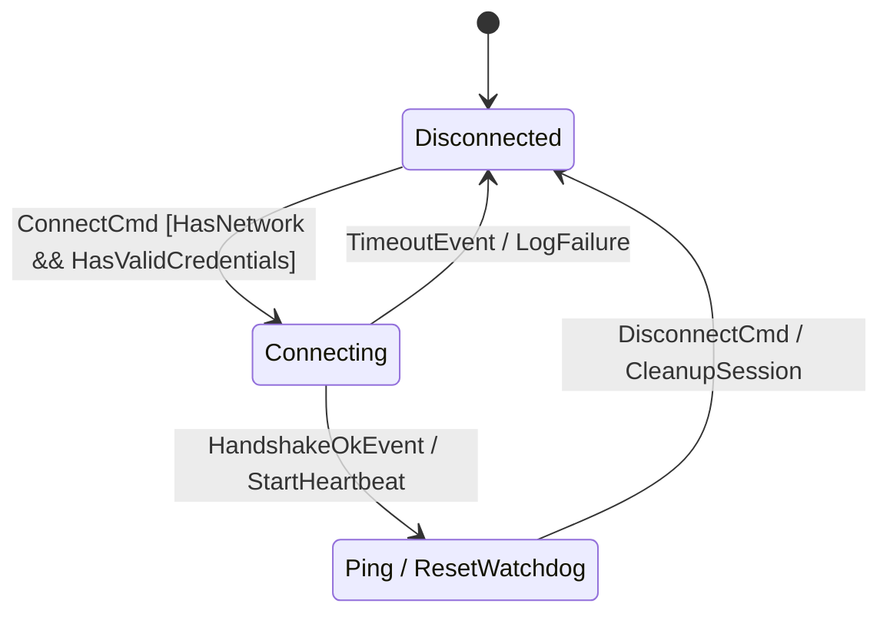

# `fsmc`

<div align="center">

[](https://github.com/simoneCavalleri/fsmc/actions/workflows/ci.yml)
[](https://github.com/simoneCavalleri/fsmc/releases)
[](LICENSE)
[](docs/UML_REFERENCE.md)
[](tests/)

**The Universal Finite State Machine Compiler, Optimization & Formal Verification Infrastructure.**  
*Transpile, optimize, formally verify, and compile statecharts across 8 industry modeling formats and target architectures.*

[What is fsmc?](#-what-is-fsmc) • [The Toolchain Tools](#-the-toolchain-tools) • [Quickstart](#-quickstart) • [Supported Formats](#-supported-modeling-formats) • [Benchmarks](#-performance--compiler-benchmarks) • [Documentation](docs/ARCHITECTURE.md)

</div>

---

## 🏛️ What is `fsmc`?

**`fsmc`** is a modern, multi-frontend, multi-backend compiler and toolchain designed for finite state machines and hierarchical statecharts. Instead of locking state definitions into proprietary modeling software or binding them to a single language runtime, `fsmc` decouples **model ingestion**, **formal Intermediate Representation (IR)**, **static optimization passes**, **formal model checking**, and **backend code generation**.

```
  ┌─────────────────────────────────────────────────────────────────────────────────┐
  │                              FRONTEND INGESTION                                 │
  │  Formal Metamodels: SysML v2  •  Cameo / MagicDraw XMI  •  W3C SCXML            │
  │  Visual Diagrams:   PlantUML  •  Mermaid  •  Graphviz DOT  •  XState JSON       │
  └──────────────────────────────────────┬──────────────────────────────────────────┘
                                         │
                                         ▼
  ┌─────────────────────────────────────────────────────────────────────────────────┐
  │                    UNIFIED INTERMEDIATE REPRESENTATION (FsmIr)                  │
  │   Canonical AST  •  Deterministic 64-bit FNV-1a Hashes  •  Lossless Serialization│
  │   Extended Variables (EFSM & Physical Units)  •  Structured Triggers & Signals   │
  │   Formal Properties (LTL/INVAR)  •  Traceability Requirements (@fsm:req)        │
  └──────────────────────────────────────┬──────────────────────────────────────────┘
                                         │
                                         ▼
  ┌─────────────────────────────────────────────────────────────────────────────────┐
  │                      MIDDLE-END PASS PIPELINE (PassManager)                     │
  │   Dead State & Transition Pruning  •  Determinism Enforcement                   │
  │   Algebraic Guard Simplification   •  Submachine Inlining                       │
  │   Orthogonal Race Analysis         •  Timed Deadlock & Racing Timeout Pass      │
  │   Temporal LTL/CTL Model Checking  •  Clang/Rust-Style Diagnostic Engine        │
  └──────────────────────────────────────┬──────────────────────────────────────────┘
                                         │
                                         ▼
  ┌─────────────────────────────────────────────────────────────────────────────────┐
  │                               TARGET BACKENDS                                   │
  │   8 Universal Diagram & SMV Emitters  •  C++17/C++20 Zero-Allocation Engine     │
  │   Bounded Choice Flattening           •  Deterministic Tick Timer Manager       │
  │   Ring Buffer Overflow Policies       •  Standalone Headers (0 Dependencies)    │
  └─────────────────────────────────────────────────────────────────────────────────┘
```

### Core Architecture Highlights

- 🌐 **Two-Category Frontend Architecture**:
  - **Formal Models (`include/fsm/frontend/formal/`)**: Deterministic ingestion from OMG SysML v2, Cameo / MagicDraw (OMG XMI 2.x), and W3C SCXML with strict symbol typing and physical quantity tracking (`[mm/s]`, `[percent]`).
  - **Visual Diagrams (`include/fsm/frontend/diagram/`)**: Visual sketch notations (PlantUML, Mermaid, Graphviz DOT, XState JSON) with lossless roundtrip comment directives (`@fsm:var`, `@fsm:signal`, `@fsm:property`) and compilation guardrails (`--allow-diagram-codegen`).
- 🌲 **Strongly-Typed Intermediate Representation (`FsmIr`)**: Canonical AST capturing Hierarchical State Machines (HFSM), Shallow `[H]` and Deep `[H*]` history pseudostates, dynamic `<<choice>>` / `<<junction>>` nodes, structured `TimeTrigger` (after/every with units), `SignalTrigger` with typed payloads, deferred event triggers, orthogonal regions, and composable boolean guard trees.
- 🔬 **Middle-End Optimization & Formal Verification (`PassManager`)**:
  - **Dead State & Transition Elimination**: Prunes unreachable states and statically dead branches before code emission.
  - **Determinism Enforcement**: Analyzes branch collisions and enforces prioritized resolution on overlapping triggers.
  - **Algebraic Guard Simplification**: Evaluates boolean constants, removes tautologies, and simplifies nested guard expressions.
  - **Timed Deadlock Verification (`TimedDeadlockPass`)**: Detects zero-duration timeouts and unprioritized races between timed and immediate transitions.
  - **Orthogonal Race Detection**: Analyzes concurrent state regions for potential read/write data races on shared context.
  - **Temporal Formal Verification**: Verifies safety invariants (`INVARSPEC`) and LTL/CTL reachability formulas against livelocks and deadlocks, with automatic SMV discrete tick timer generation.
- 🚨 **Compiler-Grade Diagnostic Engine**: Clang/Rust-style terminal diagnostics with exact source spans, line numbers, error categories, and visual carets (`^~~~`).
- ⚡ **Hard Real-Time, Zero-Heap C++20 Runtime Engine**: Embedded runtime with `spsc_ring_buffer` supporting `fsm::spsc_fsm` (Wait-Free O(1), ISR-safe, lock-free seqlock context), `fsm::thread_safe_fsm` (MPSC with background worker), and a synchronous `deterministic_timer_manager`.
- 📊 **Formal EFSM Data Path Analysis & RTM Export**: Abstract interpretation for numerical variable ranges detecting dead guards, and automated Requirement Traceability Matrix export (Markdown / JSON).

---

## 🛠️ The Toolchain Tools

The infrastructure provides two primary command-line tools:

### 1. `fsmc` — The Universal State Machine Compiler Driver

`fsmc` is the primary code generator, formal verifier, and diagram transpiler. It converts any input model into verified target code or translates across diagram ecosystems.

```bash
# Formally verify model soundness (livelock, choice completeness, reachability, EFSM data paths)
fsmc -i mission_controller.puml --verify

# Export Requirement Traceability Matrix (Markdown or JSON)
fsmc -i aerospace_mission.sysml --rtm-output rtm.md
fsmc -i aerospace_mission.sysml --rtm-output rtm.json

# Transpile between modeling formats (e.g. SysML v2 -> Mermaid, or Cameo XMI -> SMV)
fsmc -i spacecraft.sysml --export mermaid -o spacecraft.mmd
fsmc -i model.xmi --export smv -o formal_model.smv
fsmc -i protocol.scxml --export plantuml -o protocol.puml

# Compile into a standalone C++20 zero-allocation header (0 external dependencies)
fsmc -i connection.sysml -o connection_fsm.hpp --std 20 --namespace net --name ConnectionFSM

# Compile visual diagram format with explicit guardrail flag
fsmc -i connection.mmd -o connection_fsm.hpp --std 20 --allow-diagram-codegen

# Export the embedded C++ runtime library
fsmc --export-runtime ./include/fsm --std 20
```

#### CLI Reference for `fsmc`:
```text
Usage: fsmc -i <model_file> [OPTIONS]
       fsmc [OPTIONS] <model_file>
       fsmc -i <model_file> --export <format> -o <out_file>
       fsmc -i <model_file> --verify
       fsmc --export-runtime <dir> [--std 17|20]

Input & Output Options:
  -i, --input <file>          Input model file (.sysml, .puml, .mmd, .xmi, .scxml, .json, .dot)
  -o, --output <file>         Output generated code or exported diagram file (default: stdout)
  -t, --target <lang>         Target code generator backend: 'cpp' (default), 'c', 'rust', 'zig', 'ts'
  -n, --name <name>           Generated FSM class name (default: inferred from filename or 'MyFSM')
  --namespace, --package <ns> Generated namespace/package/module name (default: 'fsm_generated')
  --context <type>            Hardware/Software context type name (default: 'no_context')
  --format <fmt>              Override input format: 'sysml2', 'plantuml', 'mermaid', 'cameo', 'scxml', 'json', 'dot', 'auto'

Optimization & Code Transformation Options:
  -O0, --no-opt               Disable middle-end optimization passes
  -O1, -O2, --optimize        Enable middle-end optimization passes (default: -O1)
  --prune-dead-states         Prune unreachable states and statically dead transitions before codegen
  --no-guard-simplification   Disable algebraic boolean simplification on guard expressions
  --inline-submachines        Inline modular submachines (SubmachineRef) into a single flat/composite FSM
  --submachine-dir <dir>      Search directory for external submachine diagram files

Safety & Static Analysis Verification Options:
  -Werror                     Treat all middle-end compiler warnings as fatal errors
  --strict-determinism        Fail compilation on non-deterministic branch collisions or unprioritized transitions
  --check-races               Perform static concurrency data-race analysis across parallel orthogonal regions
  --req-audit                 Print Requirement Traceability Matrix (@fsm:req) before code generation
  --rtm-output <file>         Export Requirement Traceability Matrix to file
  --rtm-format <json|md>      Requirement Traceability Matrix format ('json' or 'markdown')

C++ Backend Options (--target cpp):
  --std <17|20>               Target C++ standard: '17' or '20' (default: 17)
  --standalone                Generate self-contained header with embedded zero-alloc runtime (default)
  --modular                   Generate FSM header only, including external <fsm/runtime/cpp/fsm.hpp>
  --no-thread-safe            Do not generate thread_safe_fsm asynchronous wrapper
  --no-stubs                  Do not emit default stub functors for actions and guards
  --allow-diagram-codegen     Allow C++ code generation from visual diagram formats (PlantUML, Mermaid, etc.)

Model Analysis & Diagram Export:
  -e, --export <fmt>          Export diagram to: 'mermaid', 'plantuml', 'sysml2', 'json', 'dot', 'scxml', 'cameo', 'smv'
  --verify, --check           Run formal model checker (livelock, choice completeness, reachability, EFSM data paths) and exit

General Options:
  -h, --help                  Show this help message and exit
  -v, --version               Show version information and exit
```


---

### 2. `fsm-opt` — The IR Optimizer, Formatter & Linter

`fsm-opt` operates directly on the canonical Intermediate Representation (`FsmIr`). It runs optimization pipelines, performs dead-code elimination, analyzes timing profiles, and emits normalized representations.

```bash
# Optimize and emit canonical JSON Intermediate Representation (IR)
fsm-opt -i model.sysml --emit-ir -o model.ir.json

# Run optimization passes with execution timing and pass breakdown
fsm-opt -i protocol.scxml --profile

# Perform formal verification with colored compiler diagnostics
fsm-opt -i aerospace.sysml --verify

# Canonicalize model into optimized PlantUML, Mermaid, SysML v2, or nuXmv SMV
fsm-opt -i dirty_model.puml --emit-puml -o clean_model.puml
fsm-opt -i legacy_diagram.xmi --emit-sysml -o clean_model.sysml
```

#### Diagnostic Output Example:
```text
error[E002]: Incomplete choice pseudostate branch coverage
  --> connection.puml:12:5
   |
12 | state ChoiceState <<choice>>
   | ^~~~~~~~~~~~~~~~~~~~~~~~~~~~
   | Missing unconditional [else] default transition branch!
```

---

## 🚀 Quickstart

### 1. Define Statechart in Any Format (`connection.mmd`)



### 2. Verify and Transpile via CLI

```bash
# Verify semantic model soundness (formal models & diagrams)
fsmc -i connection.mmd --verify

# Generate C++ from visual diagram formats (PlantUML, Mermaid, DOT, JSON)
fsmc -i connection.mmd -o connection_fsm.hpp --allow-diagram-codegen

# Compile formal models directly out-of-the-box (SysML v2, SCXML, Cameo XMI, nuXmv SMV)
fsmc -i mission.sysml -o mission_fsm.hpp

# Transpile between formal specification & diagram formats
fsmc -i connection.mmd --export sysml2 -o connection.sysml
fsmc -i connection.mmd --export smv -o connection.smv
```

### 3. Integrate with CMake (`CMakeLists.txt`)

```cmake
cmake_minimum_required(VERSION 3.20)
project(MyProject CXX)

find_package(fsmc CONFIG REQUIRED)

add_executable(my_app main.cpp)
target_link_libraries(my_app PRIVATE fsmc::fsmc_runtime)

# Automatically compiles statecharts into connection_fsm.hpp during build
# (Supports both formal specifications and visual diagram models out-of-the-box)
fsmc_target_sources(my_app
    DIAGRAMS models/connection.mmd
    NAME ConnectionFSM
    NAMESPACE net
    STANDARD 20
    STANDALONE
)
```

### 4. Dispatch Events in Application Code (`main.cpp`)

```cpp
#include "connection_fsm.hpp"
#include <iostream>

struct NetworkContext {
    bool has_network = true;
    bool has_credentials = true;
};

// Implement user guard logic
struct net::HasNetworkAndHasValidCredentialsGuard {
    bool operator()(const net::ConnectCmd&, const auto&, const NetworkContext& ctx) const noexcept {
        return ctx.has_network && ctx.has_credentials;
    }
};

int main() {
    NetworkContext ctx;
    net::ConnectionFSM fsm(ctx);

    // Initial state: Disconnected
    std::cout << "Current State: " << fsm.current_state_name() << "\n";

    // Synchronous Dispatch:
    fsm.dispatch(net::ConnectCmd{});
    std::cout << "Current State: " << fsm.current_state_name() << "\n";

    fsm.dispatch(net::HandshakeOkEvent{});
    std::cout << "Current State: " << fsm.current_state_name() << "\n";

    // In-place internal transition without state destruction/reconstruction:
    fsm.dispatch(net::Ping{});

    // Asynchronous Dispatch via ThreadSafe wrapper:
    net::ThreadSafeConnectionFSM async_fsm(ctx);
    auto fut = async_fsm.post_async(net::ConnectCmd{});
    auto res = fut.get();
    std::cout << "Async Dispatch: " << res.to_string() << "\n";

    return 0;
}
```

---

## 🌐 Supported Modeling Formats

| Format | Extension | Target Ecosystem | Specification Reference |
| :--- | :--- | :--- | :--- |
| **OMG SysML v2** | `.sysml` | Systems Engineering & MBSE Toolchains | OMG SysML 2.0 State Definition Spec |
| **Cameo / MagicDraw** | `.xmi`, `.xml` | Enterprise MBSE (No Magic / Dassault) | OMG XMI 2.x & UML 2.5 Metamodel |
| **W3C SCXML** | `.scxml`, `.xml` | VoiceXML, Telecom & Automotive HMI | W3C State Chart XML Spec |
| **XState JSON** | `.json` | Web, Node & Embedded GUI Statecharts | Modern JSON Statechart Schema |
| **PlantUML** | `.puml`, `.plantuml` | Architectural Documentation & CI/CD | PlantUML State Diagram Syntax |
| **Mermaid** | `.mmd`, `.mermaid` | Markdown, GitHub, GitLab & Notion | Mermaid `stateDiagram-v2` Grammar |
| **Graphviz DOT** | `.dot`, `.gv` | Graph Analysis & Legacy FSM Tools | Graphviz Attribute Grammar |
| **nuXmv / NuSMV** | `.smv` | Formal Model Checking & Temporal Logic | NuSMV / nuXmv Formal Verification Spec |

---

## 📊 Performance & Compiler Benchmarks

Micro-benchmarks measured with **Google Benchmark v1.8.3** (Linux x86_64, Release `-O3`):

| Component | Benchmark Case | Latency | Throughput | Allocations |
| :--- | :--- | :--- | :--- | :--- |
| **Runtime Engine** | `BM_Dispatch_ExternalTransition` | **41.7 ns** | 71.96 Million ops/sec | **0 bytes (0 heap allocs)** |
| **Runtime Engine** | `BM_Dispatch_InternalTransition` | **17.3 ns** | 57.88 Million ops/sec | **0 bytes (0 heap allocs)** |
| **Runtime Engine** | `BM_Runtime_SpscQueue_PushPop` | **0.72 ns** | 1.38 Billion ops/sec | **0 bytes (0 heap allocs)** |
| **Runtime Engine** | `BM_Runtime_StaticRingBuffer_PushPop` | **1.07 ns** | 936.15 Million ops/sec | **0 bytes (0 heap allocs)** |
| **Compiler Middle-End** | `BM_Compiler_PassManager_Pipeline` | **2.05 µs** | — | Static Pass Pipeline |
| **Compiler Frontends** | `BM_Compiler_PlantUml_Parse` | **4.77 µs** | 46.0 MiB/s | Direct AST Ingestion |
| **Compiler Frontends** | `BM_Compiler_Sysml2_Parse` | **32.8 µs** | 7.7 MiB/s | Textual Grammar Tokenizer |
| **Compiler Backend** | `BM_Compiler_CppGenerator` | **8.84 µs** | — | Zero-Alloc C++ Emitter |

To run the benchmarks locally:
```bash
cmake -B build -DFSMC_ENABLE_BENCHMARKS=ON -DCMAKE_BUILD_TYPE=Release
cmake --build build --target fsmc_bench -j
./build/bin/fsmc_bench
```

---

## 🌐 WebAssembly Interactive Playground

`fsmc` compiles natively to WebAssembly (`fsmc.wasm`), powering a client-side interactive browser engineering suite where you can write state diagrams in any format and instantly inspect the generated C++ header, JSON IR, formal diagnostics, interactive AST graph, and live HFSM simulator.

Check it out locally:
```bash
python3 -m http.server 8080 -d playground/
# Open http://localhost:8080 in your browser
```

---

## 📚 Technical Documentation

- 🏗️ [**Compiler Architecture (`docs/ARCHITECTURE.md`)**](docs/ARCHITECTURE.md): Multi-stage pipeline, PassManager, DiagnosticEngine, choice flattening, and intermediate representation.
- 📐 [**Formal IR Specification (`docs/FSM_IR_SPECIFICATION.md`)**](docs/FSM_IR_SPECIFICATION.md): AST schema, 64-bit deterministic hashing, inline directives, and JSON serialization.
- ⚙️ [**Integration & CMake Guide (`docs/INTEGRATION_GUIDE.md`)**](docs/INTEGRATION_GUIDE.md): CMake functions, FetchContent, vcpkg, Conan, and modular target embedding.
- ⏱️ [**Runtime API Reference (`docs/RUNTIME_API.md`)**](docs/RUNTIME_API.md): Transitions, guards, actions, observers, deferred events, lock-free queues, and timed timeouts.
- 🏷️ [**OMG UML 2.5 & SysML Reference (`docs/UML_REFERENCE.md`)**](docs/UML_REFERENCE.md): Pseudostate specifications, region semantics, and compliance mapping.
- 🧪 [**Test Suite Catalog (`docs/TEST_SUITE_CATALOG.md`)**](docs/TEST_SUITE_CATALOG.md): Complete catalog of the 48 test suites with technical scenarios and intents.

---

## 📄 License

`fsmc` is released under the permissive [MIT License](LICENSE).
