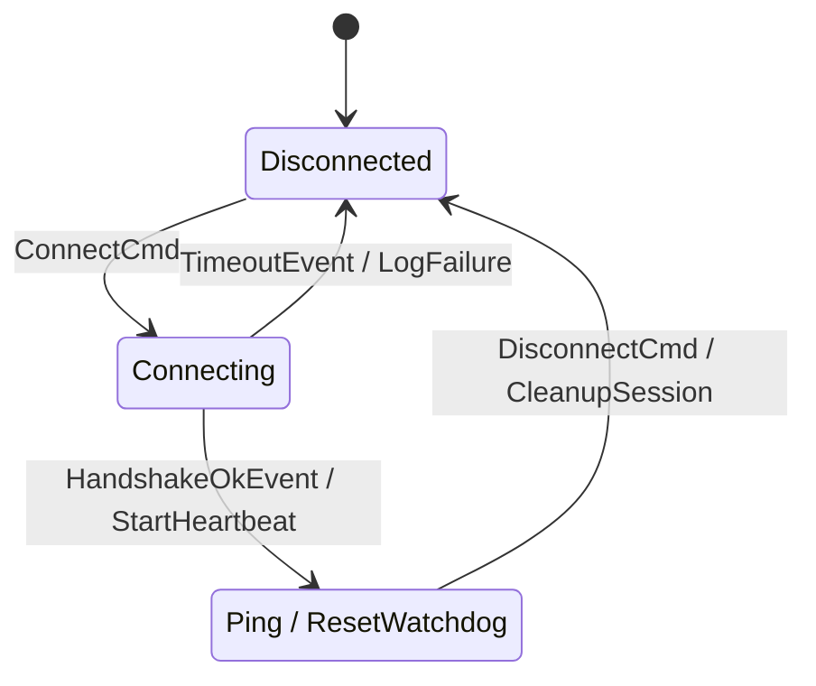

# `fsmc`

<div align="center">

[](https://github.com/simoneCavalleri/fsmc/actions/workflows/ci.yml)
[](https://github.com/simoneCavalleri/fsmc/releases)
[](LICENSE)
[](https://isocpp.org/)
[](docs/UML_REFERENCE.md)
[](docs/ARCHITECTURE.md)

**A universal zero-overhead State Machine compiler for modern C++ (C++17/20).**  
*Convert SysML v2, Cameo / MagicDraw (OMG XMI), W3C SCXML, XState JSON, PlantUML, Mermaid, and Graphviz models into standalone C++ code.*

[Quickstart](#-quickstart) • [Supported Formats](#-supported-formats) • [Why fsmc?](#-why-fsmc) • [Showcases](#-showcases) • [UML / SysML Guide](docs/UML_REFERENCE.md) • [CMake Integration](docs/INTEGRATION_GUIDE.md)

</div>

---

## 💡 Why `fsmc`?

- ⚡ **Zero-Overhead Guarantee**: `0 bytes` heap allocation on dispatch, `0 ns` virtual table overhead, `10–25 ns` transition speed.
- 🌐 **7 Modeling Formats**: Seamlessly compiles SysML v2, Cameo XMI, W3C SCXML, XState JSON, PlantUML, Mermaid, and DOT.
- 🔄 **Universal Format Exporter**: Convert any input format into clean **Mermaid**, **PlantUML**, or **OMG SysML v2** diagrams via CLI (`--export`).
- ⏳ **Timed Transitions & Deadlines**: Synchronous compile-time timeouts (`after_ms<N>`) and asynchronous priority-deadline event scheduling (`post_delayed`).
- 📥 **Universal Deferred Events**: Native deferral across all formats with automatic FIFO cascade replay upon entering destination states.
- 🔀 **Composite Boolean Guards**: Native parser for boolean logic (`[PowerOk && (!Fault || Override)]`) with short-circuit evaluation.
- 🔭 **Live Transition Observer**: Built-in telemetry and tracing hooks (`set_observer`) with zero overhead when inactive.
- 🔄 **History States & HFSM**: Dynamic restoration for Shallow `[H]` and Deep `[H*]` composite macro-states with automatic transition inheritance.
- 📦 **Standalone Single-Header**: Generates a self-contained `.hpp` with embedded runtime — **zero external dependencies, zero libraries to link**.
- 🛠️ **First-Class CMake Automation**: Built-in `fsmc_target_sources` compiles models transparently during your build.
- 🧵 **Thread-Safe Async Engine**: Optional `thread_safe_fsm` with background event queue powered by `std::jthread`.

---

## 🚀 Quickstart

### 1. Write Your Model (`connection.mmd`)



*(Also supports **SysML v2** `.sysml`, **Cameo** `.xmi`, **SCXML** `.scxml`, **JSON** `.json`, **PlantUML** `.puml`, **DOT** `.dot`)*

---

### 2. Add to CMake (`CMakeLists.txt`)

```cmake
find_package(fsmc REQUIRED)

add_executable(my_app main.cpp)

# Automatically compiles diagram into connection_fsm.hpp during build
fsmc_target_sources(my_app
    DIAGRAMS models/connection.mmd
    NAME ConnectionFSM
    STANDARD 20
    STANDALONE
)
```

---

### 3. Dispatch Events in C++ (`main.cpp`)

```cpp
#include "connection_fsm.hpp"
#include <iostream>

int main() {
    ConnectionFSM fsm;

    fsm.dispatch(ConnectCmd{});
    std::cout << "State: " << fsm.current_state_name() << "\n"; // Connecting

    fsm.dispatch(HandshakeOkEvent{});
    std::cout << "State: " << fsm.current_state_name() << "\n"; // Connected

    // Zero-overhead internal transition:
    fsm.dispatch(Ping{});

    return 0;
}
```

---

## 🌐 Supported Formats

| Format | Extension | Target Ecosystem |
| :--- | :--- | :--- |
| **Cameo / MagicDraw** | `.xmi`, `.xml`, `.mdxml`, `.uml` | Aerospace, Defense, Automotive, MBSE |
| **W3C SCXML** | `.scxml` | Qt (`QScxmlStateMachine`), Telecom, Robotics |
| **XState JSON** | `.json` | Web, TypeScript, Microservices, Cloud |
| **Graphviz DOT** | `.dot`, `.gv` | Unix Tooling, Compilers, LLVM |
| **OMG SysML v2** | `.sysml` | OMG SysML 2.0 Textual Specification |
| **PlantUML** | `.puml`, `.plantuml` | Enterprise Architecture & Software Design |
| **Mermaid** | `.mmd`, `.mermaid` | GitHub, GitLab, Markdown Docs |

---

## 🏛️ Transition Lifecycle

Every transition follows deterministic, OMG UML 2.5-compliant ordering:

```
[Source State] ──► [Guard Check] ──► [Source on_exit] ──► [Action] ──► [Target on_enter] ──► [Target State]
```
*(For **internal transitions**, `on_exit` and `on_enter` are bypassed for maximum performance)*

---

## 📂 Showcases

Runnable examples available in [`examples/`](examples/):

- 🌐 **[Connection Manager](examples/connection_manager/)**: Linear network protocol state machine with guards and actions.
- 🚀 **[Mission Controller](examples/mission_controller/)**: Hierarchical HFSM with composite states, choice pseudostates, and internal transitions.
- ⚡ **[Async Motor Controller](examples/async_motor_controller/)**: Multithreaded embedded motor controller with `thread_safe_fsm` and `std::jthread`.

---

## 💻 CLI Options

```bash
fsmc -i <model_file> -o <output.hpp> [OPTIONS]
```

| Flag | Description | Default |
| :--- | :--- | :--- |
| `-i, --input <file>` | Input model file (`.xmi`, `.scxml`, `.json`, `.dot`, `.sysml`, `.puml`, `.mmd`) | **Required** |
| `-o, --output <file>` | Output C++ header file or diagram file | `stdout` |
| `-e, --export <fmt>` | Export diagram to `'mermaid'`, `'plantuml'`, or `'sysml2'` | |
| `-n, --name <name>` | FSM class name | Inferred from file |
| `--namespace <ns>` | C++ namespace | `fsm_generated` |
| `--context <type>` | Custom Context struct/class | `no_context` |
| `--std <17\|20>` | Target C++ standard (`17` or `20`) | `17` |
| `--standalone` | Single-header output with embedded runtime (zero deps) | `true` |
| `--modular` | Header-only output including external `fsm/fsm.hpp` | |
| `--no-stubs` | Emits forward declarations for custom user guard/action structs | |

---

## 🔨 Building & Testing

```bash
cmake -B build -S .
cmake --build build
ctest --test-dir build --output-on-failure
```

## 📖 Comprehensive Modeling & Extensions Guide

For complete syntax references across all 7 formats, native vs extended capabilities, composite boolean guards, timed transitions, and deferred events, see the:
👉 **[OMG UML 2.5 & SysML v2 State Machine Reference Guide](docs/UML_REFERENCE.md)**

---

## 📄 License
MIT License. See [LICENSE](LICENSE) for details.
