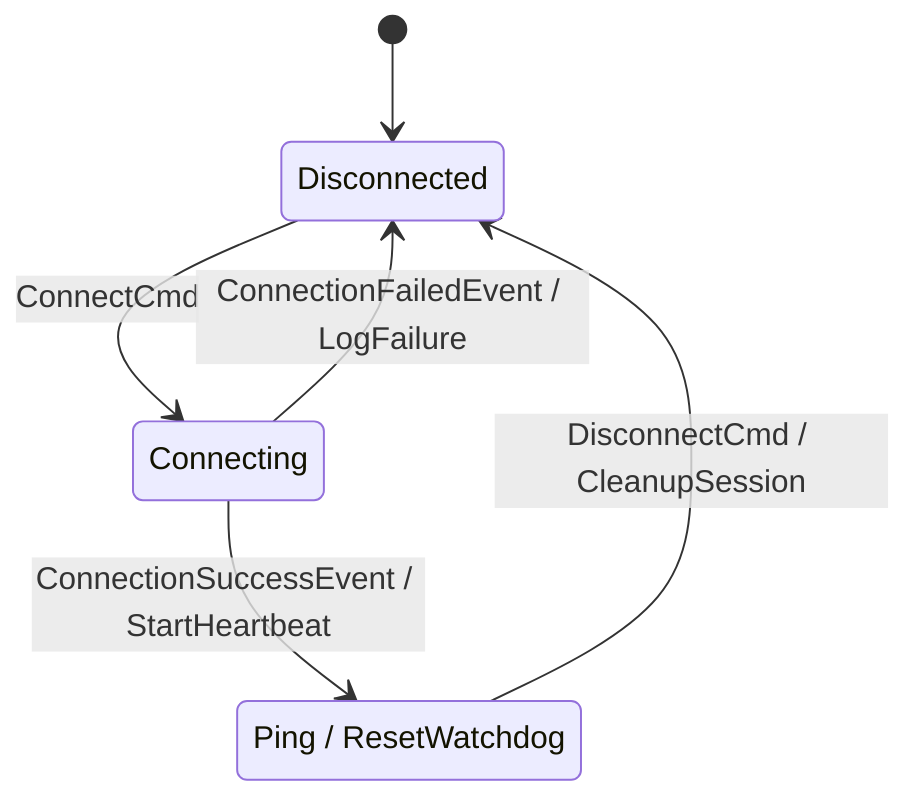

# `fsmc`

<div align="center">

[](https://github.com/simoneCavalleri/fsmc/actions/workflows/ci.yml)
[](https://github.com/simoneCavalleri/fsmc/releases)
[](LICENSE)
[](https://isocpp.org/)
[](https://www.omg.org/spec/UML/2.5/)
[](docs/ARCHITECTURE.md)

**A high-performance OMG UML 2.5 State Machine Compiler for C++17 and C++20.**  
*Convert Mermaid (`stateDiagram-v2`) and PlantUML (`@startuml`) diagrams into zero-overhead C++ code.*

[Quickstart](#-60-second-quickstart) • [Features](#-features) • [UML 2.5 Guide](docs/UML_REFERENCE.md) • [CMake Integration](docs/INTEGRATION_GUIDE.md) • [API Docs](docs/RUNTIME_API.md)

</div>

---

## 🚀 60-Second Quickstart

### 1. Draw Your Diagram (`connection.mmd`)



### 2. Add to CMake (`CMakeLists.txt`)

```cmake
find_package(fsmc REQUIRED)

add_executable(my_app main.cpp)

# Automatically compile diagram into connection_fsm.hpp
fsmc_target_sources(my_app
    DIAGRAMS models/connection.mmd
    NAME ConnectionFSM
    STANDARD 20
    STANDALONE
)
```

### 3. Dispatch Events in C++ (`main.cpp`)

```cpp
#include "connection_fsm.hpp"
#include <iostream>

int main() {
    ConnectionFSM fsm;

    std::cout << "State: " << fsm.current_state_name() << "\n"; // Disconnected

    fsm.dispatch(ConnectCmd{});
    std::cout << "State: " << fsm.current_state_name() << "\n"; // Connecting

    fsm.dispatch(ConnectionSuccessEvent{});
    std::cout << "State: " << fsm.current_state_name() << "\n"; // Connected

    // Zero-overhead internal transition:
    fsm.dispatch(Ping{});

    return 0;
}
```

---

## ✨ Features

- **Full OMG UML 2.5 State Machine Compliance**:
  - **Hierarchical / Composite States (HFSM)**: Nested sub-state blocks with parent-child discovery.
  - **Internal Transitions**: `State : Event [Guard] / Action` — zero `on_exit`/`on_enter` overhead.
  - **Choice & Junction Pseudostates**: Dynamic `<<choice>>` / `<<junction>>` runtime branching.
  - **History States**: Shallow (`[H]`) and Deep (`[H*]`) state resumption upon recovery.
  - **Deferred Events**: `State : defer Event` declarations for buffering unhandled signals.
  - **State Lifecycle Hooks**: `on_enter` and `on_exit` member function reflection.
- **Multi-Format Diagram Support**:
  - **Mermaid** (`stateDiagram-v2`): Standard in GitHub, GitLab, and Markdown documentation.
  - **PlantUML** (`@startuml`): Standard in enterprise model-driven engineering.
- **Pure Decoupled Compiler Architecture**:
  - The CLI executable (`fsmc`) is built with C++20 and generates code for target applications targeting **C++17** or **C++20**.
- **Standalone Self-Contained Output (`--standalone`, default)**:
  - Generates a single `.hpp` header containing both the state machine definition and the embedded engine. **Zero external dependencies, zero libraries to link.**
- **First-Class CMake Integration (`fsmc_target_sources`)**:
  - Automatically compiles diagram files during build and binds generated headers to your targets.
- **Thread-Safe Asynchronous Worker**:
  - Optional `thread_safe_fsm` wrapper for lockless background queue dispatching.

---

## 📊 Comparison with Other Libraries

| Feature | `fsmc` | Boost.SML | Boost.MSM |
| :--- | :---: | :---: | :---: |
| **Diagram-Driven Compilation** | **Yes (PlantUML & Mermaid)** | No (C++ DSL only) | No (C++ DSL only) |
| **OMG UML 2.5 Compliance** | **Full (Choice, History, Internal, Deferred, HFSM)** | Partial | Partial |
| **Single-Header Output (Zero Dependencies)** | **Yes** | Header-only (Boost) | Heavy Boost Dependency |
| **Native C++20 Concepts Support** | **Yes (`concept Guard`, `concept Action`)** | Experimental | No |
| **CMake Build Integration** | **Native (`fsmc_target_sources`)** | Manual | Manual |
| **Zero Heap Allocations on Dispatch** | **Yes** | Yes | No (variant/any) |
| **Thread-Safe Queue & Background Worker** | **Built-in (`thread_safe_fsm`)** | Manual | Manual |

---

## 📚 Documentation Index

- 📖 **[OMG UML 2.5 Reference Guide](docs/UML_REFERENCE.md)**: Syntax reference for PlantUML and Mermaid.
- 🛠️ **[Integration & Build Guide](docs/INTEGRATION_GUIDE.md)**: CMake, vcpkg, Conan, and standalone usage.
- ⚡ **[Runtime C++ API Reference](docs/RUNTIME_API.md)**: Classes, methods, lifecycle hooks, and asynchronous workers.
- 🏛️ **[Compiler Architecture](docs/ARCHITECTURE.md)**: Pipeline design, choice branch flattening, and template metaprogramming.

---

## 🔨 Building & Testing

### Prerequisites
- CMake 3.14+
- Modern C++20 compiler (GCC 10+, Clang 11+, MSVC 2019+)

```bash
cmake -B build -S .
cmake --build build
ctest --test-dir build --output-on-failure
```

---

## 💻 CLI Usage

```bash
fsmc -i <diagram_file> [OPTIONS]
```

| Option | Description | Default |
| :--- | :--- | :--- |
| `-i, --input <file>` | Input diagram file (`.mmd`, `.mermaid`, `.puml`, `.plantuml`) | **Required** |
| `-o, --output <file>` | Output C++ header file | `stdout` |
| `-n, --name <name>` | FSM class name | Inferred from filename |
| `--namespace <ns>` | C++ namespace | `fsm_generated` |
| `--context <type>` | Custom Context struct/class name | `no_context` |
| `--std <17\|20>` | Target C++ standard (`17` or `20`) | `17` |
| `--c++17` / `--c++20` | Shortcut for `--std 17` or `--std 20` | |
| `--standalone` | Generate a self-contained header with embedded runtime | `true` |
| `--modular` | Generate FSM header only, including external `fsm/fsm.hpp` | |
| `--no-stubs` | Emits forward declarations for custom user guard/action structs | |
| `-h, --help` | Display help menu and exit | |

---

## 📄 License
MIT License. See [LICENSE](LICENSE) for details.
