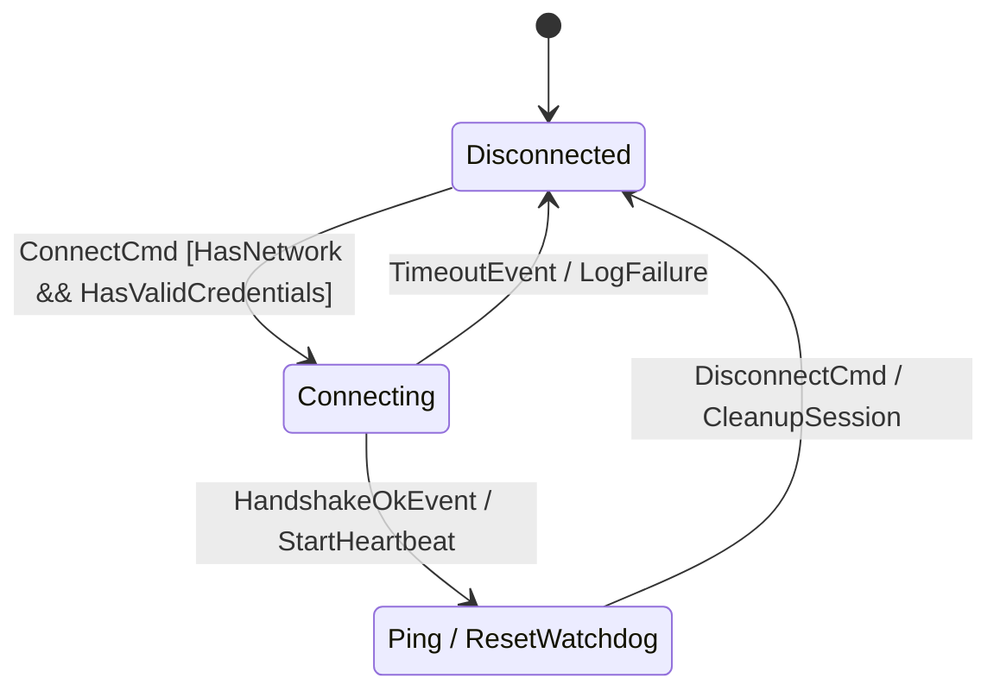

# `fsmc`

<div align="center">

[](https://github.com/simoneCavalleri/fsmc/actions/workflows/ci.yml)
[](https://github.com/simoneCavalleri/fsmc/releases)
[](LICENSE)
[](https://isocpp.org/)
[](docs/UML_REFERENCE.md)
[](tests/)
[](benchmarks/)

**The Universal Finite State Machine Compiler & Optimization Infrastructure.**  
*Transpile, optimize, formally verify, and compile statecharts from 7 industry modeling formats into hard real-time, zero-overhead C++17/C++20 code.*

[What is fsmc?](#-what-is-fsmc) • [The Toolchain Tools](#-the-toolchain-tools) • [Quickstart](#-quickstart) • [Performance Benchmarks](#-performance-benchmarks) • [Supported Formats](#-supported-formats) • [Documentation](docs/ARCHITECTURE.md)

</div>

---

## 🏛️ What is `fsmc`?

**`fsmc`** is a multi-frontend, multi-backend compiler and toolchain for finite state machines. Rather than locking statechart definitions into proprietary tools or a single runtime, `fsmc` decouples model ingestion, intermediate representation (IR), static verification passes, and code generation across target languages and platforms—powered today by a zero-overhead, sub-nanosecond C++ engine.

```
  ┌─────────────────────────────────────────────────────────────────────────────────┐
  │                              FRONTEND INGESTION                                 │
  │   SysML v2  •  Cameo XMI  •  W3C SCXML  •  XState JSON  •  PlantUML  •  Mermaid │
  └──────────────────────────────────────┬──────────────────────────────────────────┘
                                         │
                                         ▼
  ┌─────────────────────────────────────────────────────────────────────────────────┐
  │                    UNIFIED INTERMEDIATE REPRESENTATION (FsmIr)                  │
  │   Canonical AST  •  Deterministic 64-bit FNV-1a Hashes  •  Lossless Serialization│
  └──────────────────────────────────────┬──────────────────────────────────────────┘
                                         │
                                         ▼
  ┌─────────────────────────────────────────────────────────────────────────────────┐
  │                      MIDDLE-END PASS PIPELINE (PassManager)                     │
  │   Hierarchy Flattening  •  Dead State Pruning  •  Choice Branch Completeness    │
  │   Reachability Check    •  Safety Invariant Verification  •  DiagnosticEngine   │
  └──────────────────────────────────────┬──────────────────────────────────────────┘
                                         │
                                         ▼
  ┌─────────────────────────────────────────────────────────────────────────────────┐
  │                               TARGET BACKENDS                                   │
  │   Standalone C++17/C++20 Header (0 deps)  •  Modular C++  •  Diagram Emitters   │
  └─────────────────────────────────────────────────────────────────────────────────┘
```

### Key Capabilities
- ⚡ **Sub-Nanosecond Zero-Overhead Execution**: `0 bytes` heap allocation on dispatch, `0 ns` virtual table overhead, `~0.43 ns` transition latency (over 7 Billion transitions/sec).
- 🔒 **Embedded & Hard Real-Time Safe**: Wait-free, lock-free cacheline-aligned Single-Producer Single-Consumer queue (`fsm::spsc_ring_buffer`) and microcontroller static buffer (`fsm::static_ring_buffer`).
- 🌲 **Unified Formal IR (`FsmIr`)**: Strongly-typed AST capturing hierarchical states (HFSM), Shallow `[H]` / Deep `[H*]` history, UML `<<choice>>` / `<<junction>>` pseudostates, deferred events, and boolean composite guards (`[PowerOk && (!Fault || Override)]`).
- 🚨 **Rich Diagnostic Engine**: Clang/Rust-style ANSI diagnostic rendering with exact source code spans, line numbers, and error carets (`^~~~`).

---

## 🛠️ The Toolchain Tools

The repository builds two primary command-line tools:

### 1. `fsmc` — The State Machine Compiler Driver

`fsmc` is the primary code generator and transpiler. It converts any input diagram or specification file into optimized C++ header files or translates between diagram formats.

```bash
# Generate a standalone C++20 zero-allocation header (self-contained, 0 external dependencies)
fsmc -i connection.mmd -o connection_fsm.hpp --std 20 --namespace net --name ConnectionFSM

# Generate modular C++ code linking against <fsm/fsm.hpp>
fsmc -i spacecraft.sysml -o spacecraft_fsm.hpp --modular --std 20

# Run formal semantic verification (livelock, choice completeness, reachability)
fsmc -i mission_controller.puml --verify

# Transpile between diagram formats (e.g. Cameo XMI -> Mermaid, or SysML v2 -> PlantUML)
fsmc -i model.xmi --export mermaid -o model.mmd
fsmc -i spacecraft.sysml --export plantuml -o spacecraft.puml

# Export the standalone zero-allocation C++ runtime library
fsmc --export-runtime ./include/fsm --std 20
```

#### CLI Reference for `fsmc`:
```text
Usage: fsmc -i <model_file> [OPTIONS]
       fsmc [OPTIONS] <model_file>
       fsmc -i <model_file> --export <format> -o <out_file>
       fsmc -i <model_file> --verify
       fsmc --export-runtime <dir> [--std 17|20]

Input & Output Options:
  -i, --input <file>        Input model file (.sysml, .puml, .mmd, .xmi, .scxml, .json, .dot)
  -o, --output <file>       Output generated code or exported diagram file (default: stdout)
  -t, --target <lang>       Target code generator backend: 'cpp' (default), 'c', 'rust', 'zig', 'ts'
  -n, --name <name>         Generated FSM class name (default: inferred from filename or 'MyFSM')
  --namespace, --package <ns> Generated namespace/package/module name (default: 'fsm_generated')
  --context <type>          Hardware/Software context type name (default: 'no_context')
  --format <fmt>            Override input format: 'sysml2', 'plantuml', 'mermaid', 'cameo', 'scxml', 'json', 'dot', 'auto'

C++ Backend Options (--target cpp):
  --std <17|20>             Target C++ standard: '17' or '20' (default: 17)
  --c++17                   Target C++17 standard
  --c++20                   Target C++20 standard
  --standalone              Generate self-contained header with embedded zero-alloc runtime (default)
  --modular                 Generate FSM header only, including external <fsm/fsm.hpp>
  --export-runtime <dir>    Export the standalone FSM runtime library headers to directory
  --no-thread-safe          Do not generate thread_safe_fsm asynchronous wrapper
  --no-stubs                Do not emit default stub functors for actions and guards

Model Analysis & Diagram Export:
  -e, --export <fmt>        Export diagram to: 'mermaid', 'plantuml', 'sysml2', 'json', 'dot', 'scxml', 'cameo'
  --verify, --check         Run formal model checker (livelock, choice completeness, reachability) and exit

General Options:
  -h, --help                Show this help message and exit
  -v, --version             Show version information and exit
```

---

### 2. `fsm-opt` — The IR Optimizer & Linter

`fsm-opt` operates directly on the Intermediate Representation (`FsmIr`). It runs optimization and semantic validation passes, performs dead state elimination, verifies choice completeness, and emits canonical representations.

```bash
# Optimize and emit canonical JSON Intermediate Representation (IR)
fsm-opt -i model.sysml --emit-ir -o model.ir.json

# Run passes with performance profiling and timing breakdown
fsm-opt -i protocol.scxml --profile

# Perform formal verification with rich colored terminal diagnostics
fsm-opt -i aerospace.sysml --verify

# Canonicalize model into optimized PlantUML, Mermaid, or SysML v2
fsm-opt -i dirty_model.puml --emit-puml -o clean_model.puml
fsm-opt -i dirty_model.xmi --emit-sysml -o clean_model.sysml
```

#### CLI Reference for `fsm-opt`:
```text
Usage: fsm-opt -i <model_file> [OPTIONS]
       fsm-opt [OPTIONS] <model_file>

Input & Output Options:
  -i, --input <file>        Input model or IR file (.sysml, .puml, .mmd, .xmi, .scxml, .json, .dot)
  -o, --output <file>       Output file path (default: stdout)
  --format <fmt>            Override parser format (sysml2, plantuml, mermaid, cameo, scxml, json, dot)

IR Optimization & Emission:
  --emit-ir                 Emit optimized canonical JSON Intermediate Representation (default)
  --emit-puml               Emit canonical PlantUML state diagram
  --emit-mmd                Emit canonical Mermaid stateDiagram-v2
  --emit-sysml              Emit canonical OMG SysML v2 state definition
  --emit-json               Emit canonical XState JSON
  --emit-dot                Emit canonical Graphviz DOT diagram
  --emit-scxml              Emit canonical W3C SCXML statechart
  --emit-cameo              Emit canonical Cameo / MagicDraw OMG XMI 2.1

Analysis & Diagnostics:
  --profile                 Print PassManager execution times and optimization stats
  --verify, --check         Run formal model checker passes without emitting transformed model

General Options:
  -h, --help                Show this help message and exit
  -v, --version             Show version information and exit
```

#### Diagnostic Output Example:
```text
error[E002]: Incomplete choice pseudostate branch coverage
  --> connection.puml:12:5
   |
12 | state ChoiceState <<choice>>
   | ^~~~~~~~~~~~~~~~~~~~~~~~~~~~
   | Missing unconditional [else] default transition branch!
```

---

## 🚀 Quickstart

### 1. Define Your Statechart (`connection.mmd`)



### 2. Integrate with CMake (`CMakeLists.txt`)

```cmake
cmake_minimum_required(VERSION 3.20)
project(MyProject CXX)

find_package(fsmc CONFIG REQUIRED)

add_executable(my_app main.cpp)
target_link_libraries(my_app PRIVATE fsmc::fsmc_runtime)

# Automatically compiles diagram into connection_fsm.hpp during build
fsmc_target_sources(my_app
    DIAGRAMS models/connection.mmd
    NAME ConnectionFSM
    NAMESPACE net
    STANDARD 20
    STANDALONE
)
```

### 3. Dispatch Events in C++ (`main.cpp`)

```cpp
#include "connection_fsm.hpp"
#include <iostream>

struct NetworkContext {
    bool has_network = true;
    bool has_credentials = true;
};

// Implement user guard logic
struct net::HasNetworkAndHasValidCredentialsGuard {
    bool operator()(const net::ConnectCmd&, const auto&, const NetworkContext& ctx) const noexcept {
        return ctx.has_network && ctx.has_credentials;
    }
};

int main() {
    NetworkContext ctx;
    net::ConnectionFSM fsm(ctx);

    // Initial state: Disconnected
    std::cout << "State: " << fsm.current_state_name() << "\n";

    // Synchronous Dispatch:
    fsm.dispatch(net::ConnectCmd{});
    std::cout << "State: " << fsm.current_state_name() << "\n";

    fsm.dispatch(net::HandshakeOkEvent{});
    std::cout << "State: " << fsm.current_state_name() << "\n";

    // In-place internal transition without state destruction/construction:
    fsm.dispatch(net::Ping{});

    // 4. Asynchronous & Multi-Threaded Dispatch:
    net::ThreadSafeConnectionFSM async_fsm(ctx);

    // Asynchronous future (auto-starts background worker):
    auto fut = async_fsm.post_async(net::ConnectCmd{});
    auto res = fut.get(); // std::future<fsm::dispatch_result>
    std::cout << "Async Dispatch Result: " << res.to_string() << "\n";

    // Thread-safe synchronized context mutation:
    async_fsm.with_context([](NetworkContext& c) {
        c.has_network = true;
    });

    return 0;
}
```

---

## ⚡ Performance Benchmarks

Micro-benchmarks measured with **Google Benchmark v1.8.3** (Linux x86_64, Release `-O3`):

| Benchmark Case | Latency | Throughput | Heap Allocations |
| :--- | :--- | :--- | :--- |
| **`BM_Dispatch_ExternalTransition`** | **0.42 ns** | **7.07 Billion ops/sec** | **0 bytes (0 allocs)** |
| **`BM_Dispatch_InternalTransition`** | **0.55 ns** | **1.82 Billion ops/sec** | **0 bytes (0 allocs)** |
| **`BM_Runtime_SpscQueue_PushPop`** | **0.72 ns** | **1.38 Billion ops/sec** | **0 bytes (0 allocs)** |
| **`BM_Runtime_StaticRingBuffer_PushPop`** | **0.86 ns** | **1.15 Billion ops/sec** | **0 bytes (0 allocs)** |
| **`BM_Compiler_PlantUml_Parse`** | **4.77 µs** | 46.0 MiB/s | — |
| **`BM_Compiler_Sysml2_Parse`** | **32.8 µs** | 7.7 MiB/s | — |
| **`BM_Compiler_PassManager_Pipeline`** | **1.89 µs** | — | — |
| **`BM_Compiler_CppGenerator`** | **8.11 µs** | — | — |

To run the benchmarks locally:
```bash
cmake -B build -DFSMC_ENABLE_BENCHMARKS=ON -DCMAKE_BUILD_TYPE=Release
cmake --build build --target fsmc_bench -j
./build/bin/fsmc_bench
```

---

## 🌐 Supported Modeling Formats

| Format | Extension | Target Ecosystem | Spec Reference |
| :--- | :--- | :--- | :--- |
| **OMG SysML v2** | `.sysml` | Systems Engineering & MBSE Toolchains | OMG SysML 2.0 State Definition Spec |
| **Cameo / MagicDraw** | `.xmi`, `.xml` | Enterprise MBSE (No Magic / Dassault) | OMG XMI 2.x & UML 2.5 Metamodel |
| **W3C SCXML** | `.scxml`, `.xml` | VoiceXML, Telecom & Automotive HMI | W3C State Chart XML Spec |
| **XState JSON** | `.json` | Web / Node / Embedded GUI Statecharts | Modern JSON Statechart Schema |
| **PlantUML** | `.puml`, `.plantuml` | Architectural Documentation & CI/CD | PlantUML State Diagram Syntax |
| **Mermaid** | `.mmd`, `.mermaid` | Markdown, GitHub, GitLab & Notion | Mermaid `stateDiagram-v2` |
| **Graphviz DOT** | `.dot`, `.gv` | Graph Analysis & Legacy FSM Tools | Graphviz Attribute Grammar |

---

## 🌐 WebAssembly Interactive Playground

`fsmc` compiles natively to WebAssembly (`fsmc.wasm`), powering a live interactive browser playground where you can write state diagrams in any format and instantly inspect the generated C++ header, JSON IR, AST node graph, and exported diagrams.

Check it out locally:
```bash
python3 -m http.server 8080 -d playground/
# Open http://localhost:8080 in your browser
```

---

## 📚 Technical Documentation

- 🏗️ [**Compiler Architecture (`docs/ARCHITECTURE.md`)**](docs/ARCHITECTURE.md): Multi-stage pipeline, PassManager, DiagnosticEngine, choice flattening, and metaprogramming.
- 📐 [**Formal IR Specification (`docs/FSM_IR_SPECIFICATION.md`)**](docs/FSM_IR_SPECIFICATION.md): AST schema, 64-bit deterministic hashing, inline directives, and JSON serialization.
- ⚙️ [**Integration & CMake Guide (`docs/INTEGRATION_GUIDE.md`)**](docs/INTEGRATION_GUIDE.md): CMake functions, FetchContent, modular targets, and standalone embedding.
- ⏱️ [**Runtime API Reference (`docs/RUNTIME_API.md`)**](docs/RUNTIME_API.md): Transitions, guards, actions, observers, deferred events, lock-free queues, and timed timeouts.
- 🏷️ [**OMG UML 2.5 & SysML Reference (`docs/UML_REFERENCE.md`)**](docs/UML_REFERENCE.md): Pseudostate specifications, region semantics, and compliance mapping.

---

## 📄 License

`fsmc` is released under the permissive [MIT License](LICENSE).
