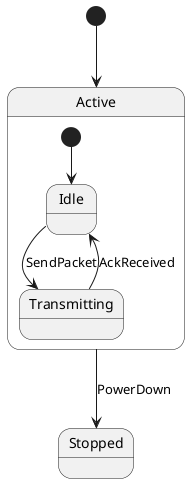
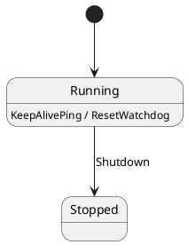
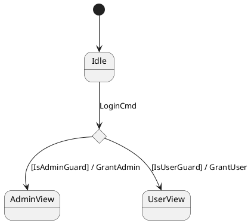
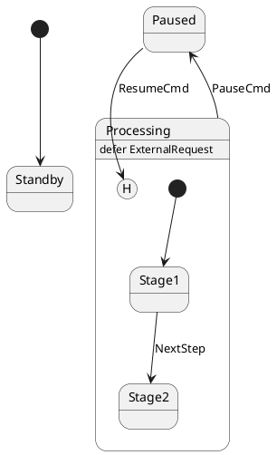

# `fsmc`

> **Finite State Machine Compiler**: Convert Mermaid (`stateDiagram-v2`) and PlantUML (`@startuml`) diagrams into high-performance, zero-overhead C++17 / C++20 finite state machines with **full OMG UML 2.5 compliance**.

---

## Features

- **Full OMG UML 2.5 State Machine Support**:
  - **Hierarchical / Composite States (HFSM)**: Nested sub-state machine blocks with parent-child relationship tracking.
  - **Internal Transitions**: `State : Event [Guard] / Action` — executes transition actions without `on_exit` / `on_enter` overhead.
  - **Choice & Junction Pseudostates**: Dynamic `<<choice>>` / `<<junction>>` conditional branching evaluated at runtime.
  - **History States**: Shallow (`[H]`) and Deep (`[H*]`) history targets to resume the last active sub-state.
  - **Deferred Events**: `State : defer Event` declarations for stashing unhandled events until a receiving state is reached.
  - **Initial & Final States**: `[*]` entry and termination points.
- **Multi-Format Diagram Parsing**:
  - **Mermaid** (`stateDiagram-v2`): Standard in GitHub, GitLab, and modern Markdown documentation.
  - **PlantUML** (`@startuml`): Standard in enterprise UML and model-driven engineering.
- **Pure Decoupled Compiler Architecture**:
  - The CLI executable (`fsmc`) is built with modern C++20 and is completely decoupled from the target application's standard.
- **Full C++17 and C++20 Target Standards**:
  - **C++20**: Generates native **Concepts** (`concept Guard`, `concept Action`), `requires` clauses, abbreviated function templates, `[[nodiscard]]`, and `std::jthread` with cooperative `std::stop_token` cancellation.
  - **C++17**: Generates zero-overhead SFINAE hooks with `std::enable_if_t`, `std::is_invocable_v`, and `std::thread`.
- **Standalone Self-Contained Output (`--standalone`, default)**:
  - Emits a single `.hpp` header containing both the state machine definition and the embedded zero-overhead FSM engine. **Zero external dependencies, zero libraries to link or copy.**
- **First-Class CMake Integration (`fsmc_target_sources`)**:
  - Automatically compiles diagram files during your project's build step and attaches generated headers to your targets.

---

## OMG UML 2.5 Syntax Examples

### 1. Hierarchical / Composite States (HFSM)


### 2. Internal Transitions (Zero Exit/Entry Overhead)


### 3. Choice Pseudostates


### 4. History States (`[H]` / `[H*]`) & Deferred Events


---

## Building & Installation

### Prerequisites
- CMake 3.14+
- C++20 compatible host compiler (GCC 10+, Clang 11+, MSVC 2019+)

### Build Commands
```bash
cmake -B build -S .
cmake --build build
```
The executable binary will be generated at **`build/bin/fsmc`** (and alias **`build/bin/fsm-gen`**).

### Running the Test Suite (13 Targets)
```bash
ctest --test-dir build --output-on-failure
```

### Installation
```bash
sudo cmake --install build
```

---

## CMake Integration (`fsmc_target_sources`)

Integrate state machine compilation directly into your `CMakeLists.txt`:

```cmake
find_package(fsmc REQUIRED) # or include(cmake/FsmGenTools.cmake)

add_executable(my_app main.cpp)

# Automatically compile diagrams and attach generated headers to my_app
fsmc_target_sources(my_app
    DIAGRAMS
        models/connection.mmd
        models/protocol.puml
    NAME ConnectionFSM
    STANDARD 20
    STANDALONE
    NAMESPACE net
)
```

---

## CLI Usage

```bash
fsmc -i <diagram_file> [OPTIONS]
fsmc --export-runtime <dir> [--std 17|20]
```

### Options
| Option | Description | Default |
| :--- | :--- | :--- |
| `-i, --input <file>` | Input diagram file (`.mmd`, `.mermaid`, `.puml`, `.plantuml`) | **Required** |
| `-o, --output <file>` | Output C++ header file | `stdout` |
| `-n, --name <name>` | FSM class name | Inferred from filename |
| `--namespace <ns>` | C++ namespace | `fsm_generated` |
| `--context <type>` | Custom Context struct/class name | `no_context` |
| `--std <17\|20>` | Target C++ standard (`17` or `20`) | `17` |
| `--c++17` | Shortcut for `--std 17` | |
| `--c++20` | Shortcut for `--std 20` | |
| `--standalone` | Generate a self-contained header with embedded runtime | `true` |
| `--modular` | Generate FSM header only, including external `fsm/fsm.hpp` | |
| `--export-runtime <dir>` | Export the FSM runtime library to the specified directory | |
| `--format <fmt>` | Diagram format: `mermaid`, `plantuml`, `auto` | `auto` |
| `--no-thread-safe` | Do not generate `thread_safe_fsm` wrapper alias | |
| `--no-stubs` | Do not include default stub functors for guards/actions | |
| `-h, --help` | Display help menu and exit | |
| `-v, --version` | Display version information and exit | |

---

## License
MIT License.
