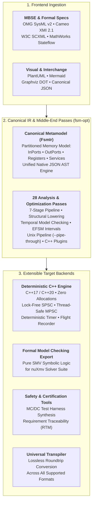

<div align="center">


# `fsmc`

[](https://github.com/simoneCavalleri/fsmc/actions/workflows/ci.yml)
[](https://simoneCavalleri.github.io/fsmc/)
[](https://github.com/simoneCavalleri/fsmc/releases)
[](LICENSE)
[](https://simoneCavalleri.github.io/fsmc/formal_languages/uml_reference/)
[](https://simoneCavalleri.github.io/fsmc/reference/test_suite_catalog/)

**The Universal Finite State Machine Compiler, Optimization & Formal Verification Infrastructure.**  
*Ingest, verify, optimize, transpile, and compile statecharts across 9 industry modeling formats with extensible target backends.*

[Documentation](https://simoneCavalleri.github.io/fsmc/) • [Quickstart](https://simoneCavalleri.github.io/fsmc/getting_started/quickstart/) • [CLI Reference](https://simoneCavalleri.github.io/fsmc/getting_started/cli_usage/) • [Runtime API](https://simoneCavalleri.github.io/fsmc/runtime_api/synchronous_fsm/) • [Changelog](CHANGELOG.md)

</div>

---

## Welcome to `fsmc`

**`fsmc`** (Finite State Machine Compiler) is a modular, format-agnostic compiler infrastructure and verification toolchain for Finite State Machines and Hierarchical Statecharts.

Built with a decoupled, three-stage compiler architecture (**Frontends $\to$ Canonical IR & Middle-End $\to$ Pluggable Backends**), `fsmc` bridges high-level Model-Based Systems Engineering (MBSE) specifications (OMG SysML v2, Cameo XMI, W3C SCXML, MathWorks Stateflow, PlantUML, Mermaid, Graphviz DOT, JSON) with formal model checkers, middle-end pass optimizers (`fsm-opt`), and deterministic target runtimes:



---

## Key Capabilities

| Capability | Technical Details | Documentation |
| :--- | :--- | :--- |
| **Universal Ingestion** | Ingest and parse statecharts from 9 formats: OMG SysML v2, Cameo / MagicDraw (OMG XMI), W3C SCXML, MathWorks Stateflow XML, nuXmv / SMV, PlantUML, Mermaid, Graphviz DOT, and Canonical JSON. | [Modeling Languages](https://simoneCavalleri.github.io/fsmc/formal_languages/sysml_v2/) |
| **Pluggable Backends** | Decoupled architecture supporting code generation for modern C++ (C++17/20), formal SMV logic for external provers, visual diagram transpilation, and future target languages. | [Architecture](https://simoneCavalleri.github.io/fsmc/internals/architecture/) |
| **Canonical IR & Optimizer (`fsm-opt`)** | Strongly typed `FsmIr` with 28 optimization, lowering, and analysis passes across a verified 7-stage pipeline, standalone optimizer driver (`fsm-opt`), Unix filter pipeline (`--pipe-through`), and dynamic C++ pass plugins. | [Middle-End Passes](https://simoneCavalleri.github.io/fsmc/internals/middleend_passes/) |
| **Partitioned Domains** | Clean separation of `InPorts` (read-only), `OutPorts` (write-only), `Registers` ($z^{-1}$ internal state), and `Services` (injected dependencies/side-effects). | [Architecture](https://simoneCavalleri.github.io/fsmc/concepts/guards_and_actions/) |
| **Dual-Paradigm Execution** | Synchronous continuous sampled loop (`step(in, out)`) and asynchronous event-driven dispatch (`dispatch(ev, in, out)`). | [Runtime C++ API](https://simoneCavalleri.github.io/fsmc/runtime_api/synchronous_fsm/) |
| **Formal Model Checking** | Integrated LTL/CTL temporal model checker verifying safety invariants, livelocks, deadlock freedom, and choice completeness before emission. | [Model Checking](https://simoneCavalleri.github.io/fsmc/verification_and_safety/model_checking/) |
| **EFSM Interval Analysis** | Abstract interpretation of numerical guard bounds (`<`, `>`, `<=`, `>=`) detecting dead transitions and contract violations. | [Interval Analysis](https://simoneCavalleri.github.io/fsmc/verification_and_safety/interval_analysis/) |
| **MC/DC Test Harness Synthesis** | Automated synthesis of GoogleTest C++ test harnesses verifying Modified Condition / Decision Coverage (MC/DC) for safety standards (DO-178C / ISO 26262). | [MC/DC Synthesis](https://simoneCavalleri.github.io/fsmc/verification_and_safety/mcdc_synthesis/) |
| **Requirement Traceability (RTM)** | Automated Requirement Traceability Matrix export in Markdown, CSV, and JSON linking `@fsm:req` annotations to model elements. | [RTM Specification](https://simoneCavalleri.github.io/fsmc/verification_and_safety/rtm_matrix/) |
| **Zero-Overhead C++ Backend** | Reference implementation with zero heap allocation, zero virtual tables, $O(1)$ dispatching, deterministic real-time timer (`tick(dt)`), state residence permanence invariants, and thread-safe lock-free SPSC / MPSC wrappers. | [Runtime C++ API](https://simoneCavalleri.github.io/fsmc/runtime_api/synchronous_fsm/) |

---

## Quickstart

### 1. Installation

`fsmc` can be installed directly via CMake, integrated with CMake `FetchContent`, or packaged locally with Conan 2.0:

```bash
# Build and install locally using CMake
cmake -B build -DCMAKE_BUILD_TYPE=Release
cmake --build build -j$(nproc)
sudo cmake --install build
```

*For complete instructions (including Conan and CMake FetchContent), see the [Installation Guide](https://simoneCavalleri.github.io/fsmc/getting_started/installation/).*

### 2. Compile a Model

Given a formal SysML v2 state machine specification (`satellite.sysml`):

```sysml
state def SatelliteControl {
    in port sensor_temp : Real { assert constraint { self >= -50.0 and self <= 150.0; } }
    out port heater_power : Real { assert constraint { self >= 0.0 and self <= 100.0; } }
    attribute cycle_count : Integer = 0;

    entry; then Booting;

    state Booting;
    state Operational;
    state SafeMode;

    transition boot_ok
        first Booting
        accept EvSysInit
        do action { log("Satellite online"); }
        then Operational;

    transition overheat_fault
        first Operational
        if in.sensor_temp > 90.0
        then SafeMode;
}
```

Run **`fsmc`** to formally verify and compile into a standalone C++20 header:

```bash
fsmc -i satellite.sysml -o satellite_fsm.hpp --std 20 --standalone
```

Or optimize and analyze the model using **`fsm-opt`**:

```bash
fsm-opt -i satellite.sysml --passes=dead-state-pruning,guard-simplification --emit-ir
```

---

## Documentation Site Map

The complete, official documentation is hosted at **[simoneCavalleri.github.io/fsmc](https://simoneCavalleri.github.io/fsmc/)**:

- **[Getting Started](https://simoneCavalleri.github.io/fsmc/getting_started/installation/)**: Installation, Quickstart Tutorial, CLI Options (`fsmc` & `fsm-opt`), CMake Integration.
- **[Architecture & Concepts](https://simoneCavalleri.github.io/fsmc/concepts/states_and_hierarchy/)**: HFSM Hierarchy, Transitions, Partitioned Memory Domains, Real-Time Guarantees.
- **[Formal Languages & Modeling](https://simoneCavalleri.github.io/fsmc/formal_languages/sysml_v2/)**: SysML v2, Cameo XMI, SCXML, MathWorks Stateflow, nuXmv / SMV, PlantUML, Mermaid, UML 2.5 Mapping.
- **[Verification & Safety](https://simoneCavalleri.github.io/fsmc/verification_and_safety/model_checking/)**: LTL/CTL Model Checking, Interval Analysis, MC/DC Test Harness Synthesis, Requirement Traceability (RTM).
- **[Runtime C++ API](https://simoneCavalleri.github.io/fsmc/runtime_api/synchronous_fsm/)**: Synchronous Dual-Paradigm Core, Lock-Free SPSC, Thread-Safe MPSC, Deterministic Real-Time Timer, Flight Recorder.
- **[Compiler Internals](https://simoneCavalleri.github.io/fsmc/internals/architecture/)**: Compiler Architecture, Middle-End Passes Catalog, Canonical AST Specification, Test Suite Catalog.

---

## License & Trademarks

- **License**: `fsmc` is released under the permissive [MIT License](LICENSE).
- **Trademarks**: All product names, logos, brands, and registered trademarks (such as SysML®, Cameo®, MagicDraw®, MATLAB®, Simulink®, Stateflow®, ARM®, FreeRTOS™, STM32®) mentioned in this repository and documentation are property of their respective owners. Their mention is strictly for technical interoperability, compatibility identification, and reference purposes, and does not imply any affiliation, sponsorship, or endorsement.
