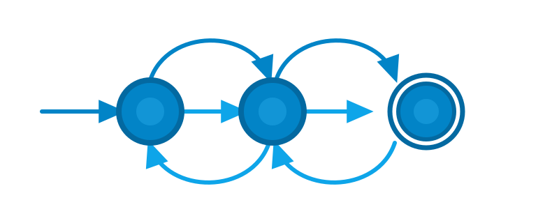
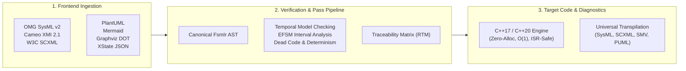

<div align="center">



# `fsmc`

[](https://github.com/simoneCavalleri/fsmc/actions/workflows/ci.yml)
[](https://simoneCavalleri.github.io/fsmc/)
[](https://simoneCavalleri.github.io/fsmc/playground/)
[](https://github.com/simoneCavalleri/fsmc/releases)
[](LICENSE)
[](https://simoneCavalleri.github.io/fsmc/formal_languages/uml_reference/)
[](https://simoneCavalleri.github.io/fsmc/reference/test_suite_catalog/)

**The Universal Finite State Machine Compiler, Optimization & Formal Verification Infrastructure.**  
*Transpile, optimize, formally verify, and compile statecharts across 8 industry modeling formats and hard real-time C++ target architectures.*

[📖 Documentation](https://simoneCavalleri.github.io/fsmc/) • [🚀 Quickstart](https://simoneCavalleri.github.io/fsmc/getting_started/quickstart/) • [💻 Interactive Playground](https://simoneCavalleri.github.io/fsmc/playground/) • [⚙️ CLI Reference](https://simoneCavalleri.github.io/fsmc/getting_started/cli_usage/) • [📚 Runtime API](https://simoneCavalleri.github.io/fsmc/runtime_api/synchronous_fsm/)

</div>

---

## 🏛️ Welcome to `fsmc`

**`fsmc`** (Finite State Machine Compiler) is a modern, modular compiler infrastructure and formal verification engine designed for deterministic, safety-critical embedded systems.

It bridges the gap between high-level **Model-Based Systems Engineering (MBSE)** specifications—such as OMG SysML v2, Cameo Systems Modeler (XMI), and W3C SCXML—and **hard real-time C++ implementations** (C++17 and C++20), guaranteeing that behavioral models are formally verified before execution and deployed with **zero dynamic heap allocations**.



---

## 🌟 Key Capabilities

| Capability | Technical Details | Documentation |
| :--- | :--- | :--- |
| **Universal Modeling** | Ingest and transpile across 8 formats: OMG SysML v2, Cameo / MagicDraw (OMG XMI), W3C SCXML, nuXmv / SMV, PlantUML, Mermaid, Graphviz DOT, and XState JSON. | [Modeling Languages](https://simoneCavalleri.github.io/fsmc/formal_languages/sysml_v2/) |
| **Formal Model Checking** | Integrated LTL/CTL temporal model checker verifying safety invariants, livelocks, deadlock freedom, and choice completeness before code emission. | [Model Checking](https://simoneCavalleri.github.io/fsmc/verification_and_safety/model_checking/) |
| **EFSM Interval Analysis** | Abstract interpretation of numerical guard bounds (`<`, `>`, `<=`, `>=`) detecting dead transitions and runtime unreachable branches. | [Interval Analysis](https://simoneCavalleri.github.io/fsmc/verification_and_safety/interval_analysis/) |
| **Safety Traceability (RTM)** | Automated Requirement Traceability Matrix export in Markdown and JSON linking `@fsm:req` tags to transitions and states. | [RTM Specification](https://simoneCavalleri.github.io/fsmc/verification_and_safety/rtm_matrix/) |
| **Hard Real-Time C++ Runtime** | Zero-heap, $O(1)$ dispatching, ISR-safe lock-free SPSC queue (`fsm::spsc_fsm`), MPSC worker (`fsm::thread_safe_fsm`), and deterministic hardware tick timers. | [Runtime C++ API](https://simoneCavalleri.github.io/fsmc/runtime_api/synchronous_fsm/) |
| **Live Web Playground** | Client-side WebAssembly compiler with live C++ generation, diagram visualization, and Monaco code editing directly in the browser. | [Try Playground](https://simoneCavalleri.github.io/fsmc/playground/) |

---

## ⚡ Quickstart

### 1. Installation

`fsmc` is available via Conan, CMake `FetchContent`, or manual source compilation:

```bash
# Build and install locally using CMake
cmake -B build -DCMAKE_BUILD_TYPE=Release
cmake --build build -j$(nproc)
sudo cmake --install build
```

*For complete instructions (including Conan and vcpkg), see the [Installation Guide](https://simoneCavalleri.github.io/fsmc/getting_started/installation/).*

### 2. Compile a Model

Given a formal SysML v2 state machine specification (`satellite.sysml`):

```sysml
state def SatelliteControl {
    entry; then Booting;

    state Booting;
    state Operational;
    state SafeMode;

    transition boot_ok
        first Booting
        accept EvSysInit
        do action { log("Satellite online"); }
        then Operational;

    transition fault_detected
        first Operational
        accept EvAnomaly
        then SafeMode;
}
```

Run **`fsmc`** to formally verify and compile into a standalone C++20 header:

```bash
fsmc -i satellite.sysml -o satellite_fsm.hpp --standard 20 --standalone
```

---

## 📚 Documentation Site Map

The complete, official documentation is hosted at **[simoneCavalleri.github.io/fsmc](https://simoneCavalleri.github.io/fsmc/)**:

- **[Getting Started](https://simoneCavalleri.github.io/fsmc/getting_started/installation/)**: Installation, Quickstart Tutorial, CLI Options, CMake Integration.
- **[Architecture & Concepts](https://simoneCavalleri.github.io/fsmc/concepts/states_and_hierarchy/)**: HFSM Hierarchy, Transitions, Guards, Actions, Memory Real-Time Guarantees.
- **[Formal Languages & Modeling](https://simoneCavalleri.github.io/fsmc/formal_languages/sysml_v2/)**: SysML v2, Cameo XMI, SCXML, nuXmv / SMV, PlantUML, Mermaid, UML 2.5 Mapping.
- **[Verification & Safety](https://simoneCavalleri.github.io/fsmc/verification_and_safety/model_checking/)**: LTL/CTL Model Checking, Interval Analysis, Requirement Traceability (RTM).
- **[Runtime C++ API](https://simoneCavalleri.github.io/fsmc/runtime_api/synchronous_fsm/)**: Synchronous Core, Lock-Free SPSC, Thread-Safe MPSC, Transition Trace Telemetry.
- **[Compiler Internals](https://simoneCavalleri.github.io/fsmc/internals/architecture/)**: Compiler Architecture, Canonical AST Specification, Test Suite Catalog.
- **[Interactive Playground](https://simoneCavalleri.github.io/fsmc/playground/)**: Live WebAssembly transpile & compilation playground.

---

## 📄 License & Trademarks

- **License**: `fsmc` is released under the permissive [MIT License](LICENSE).
- **Trademarks**: All product names, logos, brands, and registered trademarks (such as SysML®, Cameo®, MagicDraw®, ARM®, FreeRTOS™, STM32®) mentioned in this repository and documentation are property of their respective owners. Their mention is strictly for technical interoperability, compatibility identification, and reference purposes, and does not imply any affiliation, sponsorship, or endorsement.

