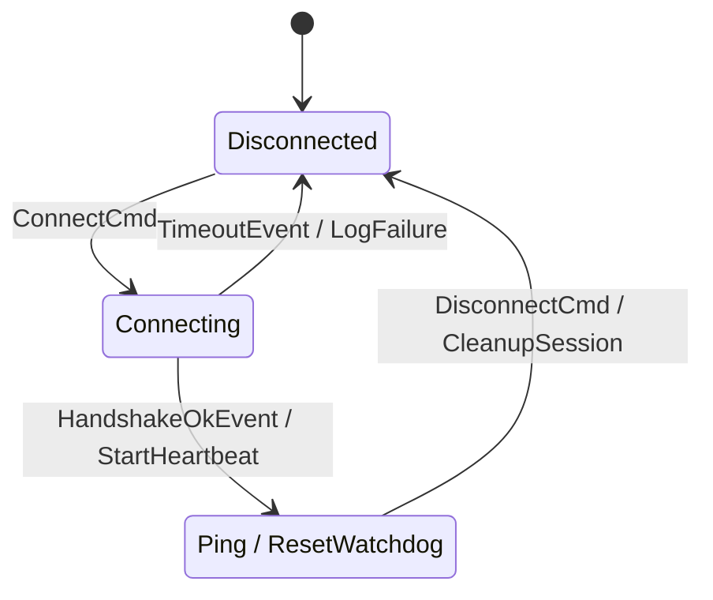

# `fsmc`

<div align="center">

[](https://github.com/simoneCavalleri/fsmc/actions/workflows/ci.yml)
[](https://github.com/simoneCavalleri/fsmc/releases)
[](LICENSE)
[](https://isocpp.org/)
[](docs/UML_REFERENCE.md)
[](docs/ARCHITECTURE.md)

**A universal zero-overhead State Machine compiler for modern C++ (C++17/20).**  
*Convert SysML v2, Cameo / MagicDraw (OMG XMI), W3C SCXML, XState JSON, PlantUML, Mermaid, and Graphviz models into zero-overhead, standalone C++ code.*

[Quickstart](#-60-second-quickstart) • [Supported Formats](#-supported-formats) • [Features](#-features) • [UML / SysML Guide](docs/UML_REFERENCE.md) • [CMake Integration](docs/INTEGRATION_GUIDE.md) • [API Docs](docs/RUNTIME_API.md)

</div>

---

## 🚀 60-Second Quickstart

### 1. Define Your Model

Write your state machine in your preferred format:

<table>
<tr>
<th>Mermaid (<code>.mmd</code>)</th>
<th>OMG SysML v2 (<code>.sysml</code>)</th>
</tr>
<tr>
<td>



</td>
<td>

```sysml
state def ConnectionFSM {
    entry; then Disconnected;
    state Disconnected;
    state Connecting;
    state Connected;

    transition from Disconnected accept ConnectCmd then Connecting;
    transition from Connecting accept HandshakeOkEvent do StartHeartbeat then Connected;
    transition from Connecting accept TimeoutEvent do LogFailure then Disconnected;
    transition from Connected accept Ping do ResetWatchdog;
    transition from Connected accept DisconnectCmd do CleanupSession then Disconnected;
}
```

</td>
</tr>
<tr>
<th>W3C SCXML (<code>.scxml</code>)</th>
<th>XState JSON (<code>.json</code>)</th>
</tr>
<tr>
<td>

```xml
<scxml version="1.0" initial="Disconnected" name="ConnectionFSM">
  <state id="Disconnected">
    <transition event="ConnectCmd" target="Connecting"/>
  </state>
  <state id="Connecting">
    <transition event="HandshakeOkEvent" target="Connected">
      <send event="StartHeartbeat"/>
    </transition>
  </state>
  <state id="Connected">
    <transition event="DisconnectCmd" target="Disconnected"/>
  </state>
</scxml>
```

</td>
<td>

```json
{
  "id": "ConnectionFSM",
  "initial": "Disconnected",
  "states": {
    "Disconnected": {
      "on": { "ConnectCmd": "Connecting" }
    },
    "Connecting": {
      "on": {
        "HandshakeOkEvent": { "target": "Connected", "actions": ["StartHeartbeat"] }
      }
    },
    "Connected": {
      "on": { "DisconnectCmd": "Disconnected" }
    }
  }
}
```

</td>
</tr>
</table>

---

### 2. Add to CMake (`CMakeLists.txt`)

```cmake
find_package(fsmc REQUIRED)

add_executable(my_app main.cpp)

# Automatically compile your model into a standalone C++ header during build
fsmc_target_sources(my_app
    DIAGRAMS
        models/connection.mmd
        models/mission.sysml
        models/protocol.scxml
    NAME ConnectionFSM
    STANDARD 20
    STANDALONE
)
```

---

### 3. Dispatch Events in C++ (`main.cpp`)

```cpp
#include "connection_fsm.hpp"
#include <iostream>

int main() {
    ConnectionFSM fsm;

    std::cout << "State: " << fsm.current_state_name() << "\n"; // Disconnected

    fsm.dispatch(ConnectCmd{});
    std::cout << "State: " << fsm.current_state_name() << "\n"; // Connecting

    fsm.dispatch(HandshakeOkEvent{});
    std::cout << "State: " << fsm.current_state_name() << "\n"; // Connected

    // Zero-overhead internal transition:
    fsm.dispatch(Ping{});

    return 0;
}
```

---

## 🌐 Supported Formats

| Format | Extensions | Primary Ecosystem | Specification / Standard |
| :--- | :--- | :--- | :--- |
| **Cameo Systems Modeler / MagicDraw** | `.xmi`, `.xml`, `.mdxml`, `.uml` | Aerospace, Defense, Automotive | OMG XMI 2.x / UML 2.5 |
| **W3C SCXML** | `.scxml` | Qt (`QScxmlStateMachine`), Telecom, Robotics | W3C State Chart XML Recommendation |
| **XState JSON Statechart** | `.json` | Web, TypeScript, Microservices, Cloud | XState / Stately.ai Schema |
| **Graphviz DOT** | `.dot`, `.gv` | Unix Tooling, Compilers, LLVM | Graphviz DOT Grammar |
| **OMG SysML v2** | `.sysml` | Model-Based Systems Engineering (MBSE) | OMG SysML 2.0 Textual Specification |
| **PlantUML** | `.puml`, `.plantuml` | Enterprise Documentation & Software Design | `@startuml` Grammar |
| **Mermaid** | `.mmd`, `.mermaid` | GitHub, GitLab, Markdown Docs | `stateDiagram-v2` |

---

## ✨ Features

- **Full OMG UML 2.5 & SysML v2 State Machine Compliance**:
  - **Hierarchical / Composite States (HFSM)**: Nested sub-state blocks with parent-child discovery.
  - **Internal Transitions**: `State : Event [Guard] / Action` — zero `on_exit`/`on_enter` overhead.
  - **Choice & Junction Pseudostates**: Dynamic `<<choice>>` / `<<junction>>` runtime branching flattened at compile-time.
  - **History States**: Shallow (`[H]`) and Deep (`[H*]`) state resumption upon recovery.
  - **Deferred Events**: `State : defer Event` declarations for buffering unhandled signals.
  - **State Lifecycle Hooks**: `on_enter` and `on_exit` member function reflection.
- **Universal Multi-Format Ingestion**:
  - Auto-detection or explicit selection across 7 industry formats with **zero external dependencies**.
- **Pure Decoupled Compiler Architecture**:
  - The CLI tool (`fsmc`) is built with C++20 and generates code for target applications in **C++17** or **C++20**.
- **Standalone Self-Contained Output (`--standalone`, default)**:
  - Generates a single `.hpp` header containing both the state machine definition and the embedded engine. **Zero external dependencies, zero libraries to link.**
- **First-Class CMake Integration (`fsmc_target_sources`)**:
  - Seamless build automation with automatic dependency tracking.
- **Thread-Safe Asynchronous Worker**:
  - Optional `thread_safe_fsm` wrapper (`std::jthread` in C++20, `std::thread` in C++17) for background queue event processing.

---

## 📚 Documentation Index

- 📖 **[OMG UML 2.5, SysML v2 & SCXML Reference Guide](docs/UML_REFERENCE.md)**: Syntax reference for all 7 supported formats.
- 🛠️ **[Integration & Build Guide](docs/INTEGRATION_GUIDE.md)**: CMake, vcpkg, Conan, and standalone usage.
- ⚡ **[Runtime C++ API Reference](docs/RUNTIME_API.md)**: Classes, methods, lifecycle hooks, and asynchronous workers.
- 🏛️ **[Compiler Architecture](docs/ARCHITECTURE.md)**: Pipeline design, choice branch flattening, and template metaprogramming.

---

## 🔨 Building & Testing

### Prerequisites
- CMake 3.14+
- Modern C++20 compiler (GCC 10+, Clang 11+, MSVC 2019+)

```bash
cmake -B build -S .
cmake --build build
ctest --test-dir build --output-on-failure
```

---

## 💻 CLI Usage

```bash
fsmc -i <model_file> [OPTIONS]
```

| Option | Description | Default |
| :--- | :--- | :--- |
| `-i, --input <file>` | Input model file (`.xmi`, `.scxml`, `.json`, `.dot`, `.sysml`, `.puml`, `.mmd`) | **Required** |
| `-o, --output <file>` | Output C++ header file | `stdout` |
| `-n, --name <name>` | FSM class name | Inferred from filename |
| `--namespace <ns>` | C++ namespace | `fsm_generated` |
| `--context <type>` | Custom Context struct/class name | `no_context` |
| `--std <17\|20>` | Target C++ standard (`17` or `20`) | `17` |
| `--c++17` / `--c++20` | Shortcut for `--std 17` or `--std 20` | |
| `--standalone` | Generate a self-contained header with embedded runtime | `true` |
| `--modular` | Generate FSM header only, including external `fsm/fsm.hpp` | |
| `--format <fmt>` | Explicit format: `cameo`, `scxml`, `json`, `dot`, `sysml2`, `plantuml`, `mermaid`, `auto` | `auto` |
| `--no-stubs` | Emits forward declarations for custom user guard/action structs | |
| `-h, --help` | Display help menu and exit | |

---

## 📄 License
MIT License. See [LICENSE](LICENSE) for details.
