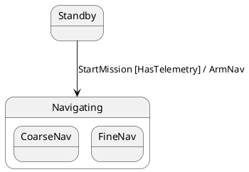

# Formal Intermediate Representation (`FsmIr`) Specification

This document provides the formal specification of the **`FsmIr` (Finite State Machine Intermediate Representation)** in `fsmc`. `FsmIr` is the unified, strongly-typed directed graph and semantic model that sits at the center of the compiler pipeline:

```
[ Frontend Parsers ] ──▶  FsmIr  ──▶ [ PassManager ] ──▶ [ Codegen Backends & Serializers ]
(PlantUML, Mermaid,       (AST)      (Optimization &      (C++17, C++20, JSON, SysML v2,
SysML v2, Cameo, SCXML,              Verification)         Mermaid, PlantUML)
JSON, Graphviz DOT)
```

---

## 1. Core Schema & AST Data Structures

`FsmIr` represents hierarchical statecharts according to the **OMG UML 2.5**, **OMG SysML v2**, and **W3C SCXML** statechart specifications.

### 1.1 `FsmIr` Root Container
Defined in [`include/fsm/ir/fsm_ir.hpp`](file:///home/simone/dev/github/fsmc/include/fsm/ir/fsm_ir.hpp):

| Field | Type | Description |
| :--- | :--- | :--- |
| `name` | `std::string` | Canonical name of the state machine class. |
| `initial_state_id` / `initial_state` | `std::string` | Identifier or name of the root initial state. |
| `states` | `std::vector<StateNode>` | Ordered collection of all state nodes in the graph. |
| `transitions` | `std::vector<TransitionEdge>` | Ordered collection of all directed transition edges. |
| `signals` | `std::vector<SignalDefinition>` | Strongly-typed signal events with optional payload parameters and validators. |
| `events` | `std::vector<EventModel>` | Event identifiers recognized by the machine. |
| `guards` | `std::vector<GuardModel>` | Guard predicate identifiers evaluated by transition conditions. |
| `actions` | `std::vector<ActionModel>` | Action routine identifiers invoked on transitions or state lifecycle. |
| `choice_nodes` | `std::vector<ChoiceNodeModel>` | Dynamic choice pseudostate descriptors. |

---

### 1.2 `StateNode`
Represents atomic states, composite hierarchical states, orthogonal regions, and pseudostates:

| Field | Type | Description |
| :--- | :--- | :--- |
| `id` | `std::string` | Deterministic FNV-1a 64-bit unique hash. |
| `name` | `std::string` | Local state identifier (e.g., `"Manual"`). |
| `fqn` | `std::string` | Fully qualified hierarchical path (e.g., `"Operating.Running.Manual"`). |
| `kind` | `StateKind` | Structural classification: `Atomic`, `Composite`, `Parallel`, `Initial`, `Final`, `ShallowHistory`, `DeepHistory`, `Choice`, `Junction`, `Fork`, `Join`. |
| `parent_state` | `std::string` | Immediate parent state name (or empty if top-level). |
| `parent_id` | `std::optional<std::string>` | Deterministic ID of the parent state node. |
| `children_ids` | `std::vector<std::string>` | List of child state deterministic IDs for composite states. |
| `orthogonal_regions` | `std::vector<OrthogonalRegion>` | Parallel sub-regions for `Parallel` orthogonal states. |
| `is_composite` | `bool` | Flag indicating whether this state contains nested sub-states. |
| `initial_sub_state` | `std::string` | Default sub-state entered when this composite state is entered. |
| `has_history` | `bool` | Shallow history restoration enabled (`[H]`). |
| `has_deep_history` | `bool` | Deep history restoration enabled (`[H*]`). |
| `entry_actions` / `exit_actions` | `std::vector<ActionSignature>` | Ordered sequence of entry and exit action invocations. |
| `do_activity` | `std::optional<std::string>` | Asynchronous background worker or coroutine. |
| `deferred_events` | `std::vector<std::string>` | List of event types deferred while active in this state. |
| `traceability_reqs` | `std::vector<std::string>` | Requirements satisfied by this state (e.g. `["REQ-SAFETY-01"]`). |
| `description` | `std::string` | Documentation comments or human-readable description. |

---

### 1.3 `TransitionEdge`
Represents a directed transition between two states or pseudostates:

| Field | Type | Description |
| :--- | :--- | :--- |
| `id` | `std::string` | Deterministic FNV-1a unique hash computed over source, target, trigger, and guard. |
| `source` / `source_id` | `std::string` | Source state name / deterministic identifier. |
| `target` / `target_id` | `std::string` | Target state name / deterministic identifier. |
| `event` | `std::string` | Triggering event name (or empty for anonymous transitions). |
| `guard` | `std::optional<std::string>` | Textual representation of the guard predicate. |
| `action` | `std::optional<std::string>` | Textual representation of the transition action. |
| `trigger` | `TriggerVariant` | Type-safe variant: `SignalTrigger`, `TimeTrigger`, `AnonymousTrigger`. |
| `guard_ast` | `std::optional<GuardAstNode>` | Structured AST representation for boolean guard logic (`AND`, `OR`, `NOT`). |
| `action_sig` | `std::optional<ActionSignature>` | Action invocation signature and parameters. |
| `kind` | `TransitionEdgeKind` | `External` (default lifecycle), `Internal` (in-place execution), `Local`. |
| `target_is_history` | `bool` | Target is shallow history `[H]`. |
| `target_is_deep_history` | `bool` | Target is deep history `[H*]`. |
| `parent_scope` | `std::string` | Enclosing composite state scope for hierarchical transitions. |

---

### 1.4 `GuardAstNode` & Boolean Guard Logic
Represents composable, nested boolean expressions:
```cpp
enum class GuardOp : std::uint8_t { None, Not, And, Or };

struct GuardAstNode {
    GuardOp op{GuardOp::None};
    std::string expression;             // Atomic predicate (e.g. "PowerOk")
    std::vector<GuardAstNode> children; // Operands for AND, OR, NOT
};
```
For example, the guard `[PowerOk && (!Fault || Override)]` is parsed into:
```
And
├── Atomic("PowerOk")
└── Or
    ├── Not(Atomic("Fault"))
    └── Atomic("Override")
```

---

## 2. Deterministic Identifier Generation (64-Bit FNV-1a)

To guarantee order-invariant, reproducible builds and lossless round-tripping across diagram formats, `fsmc` computes deterministic 64-bit FNV-1a hashes:

### State Node Identifier
$$\text{StateId} = \text{FNV-1a}(\text{FQN})$$
*Example*: For `Operating.Running.Manual`, `StateId` is `"id_4b8f1a23c09e88d1"`.

### Transition Edge Identifier
$$\text{TransitionId} = \text{FNV-1a}(\text{SourceFQN} \to \text{TargetFQN} : \text{Trigger} [\text{GuardAST}])$$
*Example*: For `Standby->Navigating:StartMission[HasTelemetry]`, `TransitionId` is `"id_a912cf304b7891e2"`.

---

## 3. Diagram Inline Directives (`@fsm:`)

Inline directives allow modelers to annotate diagrams with formal metadata without altering the visual syntax:



### Supported Directives
1. **`@fsm:state`**: Declares state attributes (`kind`, `initial`, `do`, `req`, `desc`).
2. **`@fsm:defer`**: Declares deferred signals on specific states (`event`, `state`).
3. **`@fsm:signal`**: Declares typed signal definitions and validation expressions (`name`, `type`, `validator`).
4. **`@fsm:trans`**: Configures transition metadata (`kind=Internal`, `priority`).

---

## 4. JSON Serialization Schema

`FsmIr` serializes directly to a canonical JSON schema via [`FsmIrSerializer`](file:///home/simone/dev/github/fsmc/include/fsm/ir/fsm_ir_serializer.hpp):

```json
{
  "name": "IndustrialController",
  "initial_state_id": "Standby",
  "states": [
    {
      "id": "id_10a8f9c01",
      "name": "Standby",
      "fqn": "Standby",
      "kind": "Atomic",
      "parent_state": "",
      "entry_actions": ["ctx.log_idle()"],
      "exit_actions": [],
      "deferred_events": [],
      "traceability_reqs": ["REQ-SYS-01"]
    },
    {
      "id": "id_88e401b2a",
      "name": "Operating",
      "fqn": "Operating",
      "kind": "Composite",
      "is_composite": true,
      "initial_sub_state": "Running",
      "do_activity": "async_sensor_poll",
      "traceability_reqs": ["REQ-SAFETY-01"]
    }
  ],
  "transitions": [
    {
      "id": "id_f9104ac9",
      "source": "Standby",
      "target": "Operating",
      "event": "StartCmd",
      "guard": "SafetyOk && !EStop",
      "action": "ctx.on_start(payload)",
      "kind": "External",
      "guard_ast": "SafetyOk && !EStop"
    }
  ],
  "signals": [
    {
      "name": "EvPacketRecv",
      "attributes": [{"name": "ptr", "type": "const uint8_t*"}],
      "validators": ["len > 0", "ptr != nullptr"]
    }
  ]
}
```

---

## 5. Lossless Round-Trip Guarantee

Because all 7 frontend parsers populate `FsmIr` directly and all diagram serializers emit from `FsmIr`, lossless roundtripping is guaranteed:

$$\text{SysML v2} \xrightarrow{\text{parse}} \text{FsmIr} \xrightarrow{\text{serialize}} \text{PlantUML} \xrightarrow{\text{parse}} \text{FsmIr} \xrightarrow{\text{serialize}} \text{Mermaid}$$

All structural hierarchies, orthogonal regions, guard boolean trees, and traceability requirements are preserved without loss of semantic precision.
