# OMG UML 2.5 & SysML v2 State Machine Reference Guide

This guide provides a comprehensive mapping between the **OMG UML 2.5 / SysML v2 State Machine Specifications** and their syntax representations in **OMG SysML v2** (`.sysml`), **PlantUML** (`@startuml`), and **Mermaid** (`stateDiagram-v2`), along with the corresponding C++ code generated by **`fsmc`**.

---

## Table of Contents
1. [Simple States & Transitions](#1-simple-states--transitions)
2. [Hierarchical / Composite States (HFSM)](#2-hierarchical--composite-states-hfsm)
3. [Internal Transitions](#3-internal-transitions)
4. [Choice & Junction Pseudostates](#4-choice--junction-pseudostates)
5. [History States (Shallow & Deep)](#5-history-states-shallow--deep)
6. [Deferred Events](#6-deferred-events)
7. [Guards and Actions](#7-guards-and-actions)

---

## 1. Simple States & Transitions

### OMG SysML v2 (`.sysml`)
```sysml
state def PowerSystem {
    entry; then Idle;

    state Idle;
    state Running;

    transition start_trans
        first Idle
        accept StartEvent
        if HasPowerGuard
        do TurnOnAction
        then Running;

    transition stop_trans
        first Running
        accept StopEvent
        do TurnOffAction
        then Idle;
}
```

### PlantUML (`.puml`)
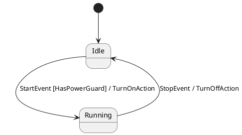

### Mermaid (`.mmd`)
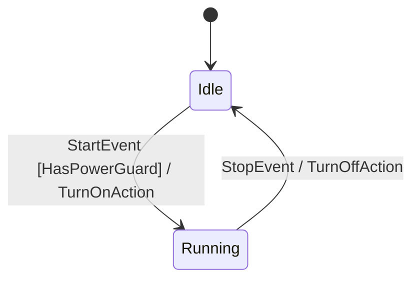

### Generated C++ Row
```cpp
fsm::row<Idle, StartEvent, Running, HasPowerGuard, TurnOnAction>
```

---

## 2. Hierarchical / Composite States (HFSM)

### OMG SysML v2 (`.sysml`)
```sysml
state def FlightSystem {
    entry; then InFlight;

    state InFlight {
        entry; then Ascending;
        state Ascending;
        state Cruising;
        state Orbiting;
    }

    state Landing;

    transition from Ascending accept AltitudeReachedEvent do DeployPanelsAction then Cruising;
    transition from Cruising accept InsertionEvent then Orbiting;
    transition from InFlight accept DeorbitCmd then Landing;
}
```

### PlantUML (`.puml`)
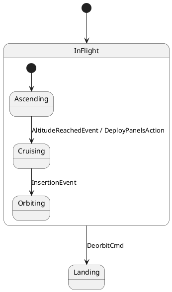

### Mermaid (`.mmd`)
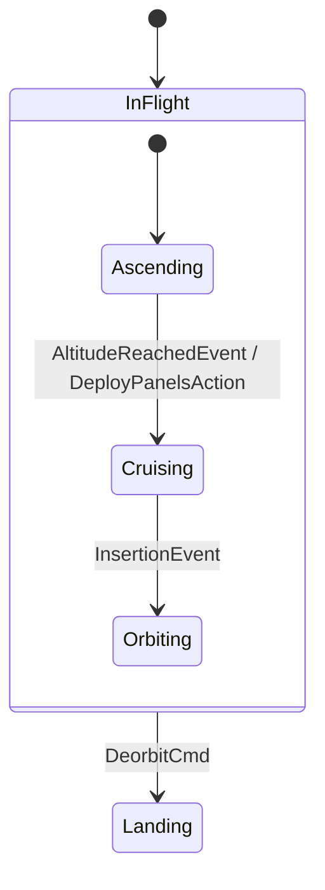

---

## 3. Internal Transitions

Internal transitions execute actions without triggering `on_exit` or `on_enter` on the current state.

### OMG SysML v2 (`.sysml`)
```sysml
state def Satellite {
    entry; then Orbiting;
    state Orbiting;

    // Internal transition: no 'then/to' target
    transition from Orbiting accept PingTelemetry do LogTelemetryAction;
}
```

### PlantUML (`.puml`)
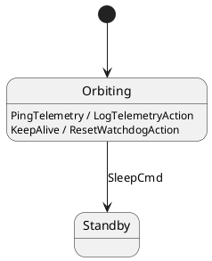

### Mermaid (`.mmd`)
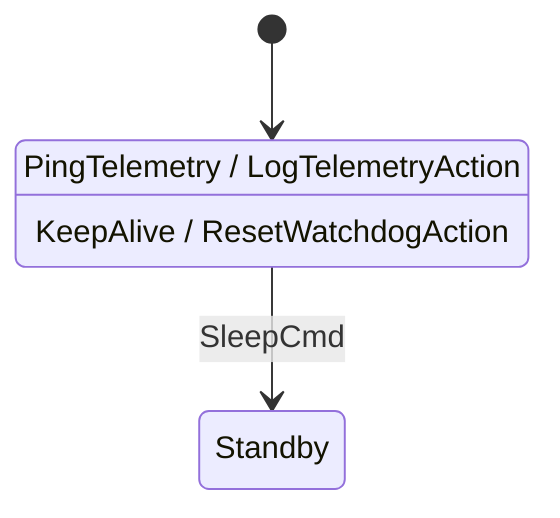

### Generated C++ Row
```cpp
fsm::internal_row<Orbiting, PingTelemetry, fsm::no_guard, LogTelemetryAction>
```

---

## 4. Choice & Junction Pseudostates

### OMG SysML v2 (`.sysml`)
```sysml
state def Authentication {
    entry; then Standby;

    state Standby;
    state AuthChoice :> Choice;
    state AdminView;
    state UserView;
    state Locked;

    transition from Standby accept LoginCmd then AuthChoice;
    transition from AuthChoice if IsAdminGuard do GrantAdminAction then AdminView;
    transition from AuthChoice if IsUserGuard do GrantUserAction then UserView;
    transition from AuthChoice if NoClearanceGuard do LockoutAction then Locked;
}
```

### PlantUML (`.puml`)
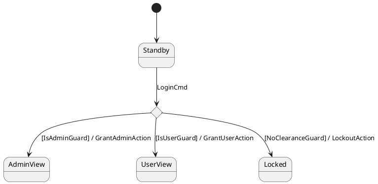

### Mermaid (`.mmd`)
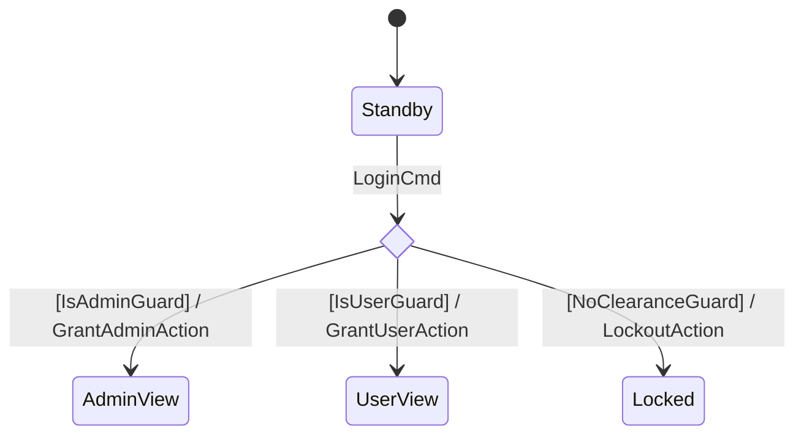

---

## 5. History States (Shallow & Deep)

| Symbol | Name | Description |
| :---: | :--- | :--- |
| `State[H]` | **Shallow History** | Restores the most recent direct active sub-state of `State`. |
| `State[H*]` | **Deep History** | Recursively restores the most recent active sub-state across all nested levels. |

### OMG SysML v2 (`.sysml`)
```sysml
state def TaskManager {
    entry; then Processing;

    state Processing {
        entry; then Step1;
        state Step1;
        state Step2;
    }

    state Suspended;

    transition from Step1 accept NextStep then Step2;
    transition from Processing accept PauseCmd then Suspended;
    transition from Suspended accept ResumeCmd then Processing[H];
}
```

### PlantUML (`.puml`)
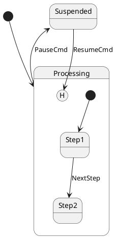

---

## 6. Deferred Events

### OMG SysML v2 (`.sysml`)
```sysml
state def BootSequence {
    entry; then Initializing;

    state Initializing;
    defer StartMissionCmd;
    defer DataPacketEvent;

    state Ready;
    state InFlight;

    transition from Initializing accept BootComplete then Ready;
    transition from Ready accept StartMissionCmd then InFlight;
}
```

### PlantUML (`.puml`)
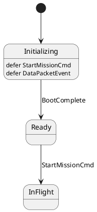

---

---

## 7. Guards, Composite Logic & Actions

### Composite Boolean Guards (`!`, `&&`, `||`)
`fsmc` features a built-in recursive expression parser for composite guards across all supported model formats. You can write arbitrary boolean logic directly in transitions:

| Expression in Diagram | Generated C++ Guard Type | Semantics |
| :--- | :--- | :--- |
| `[!EmergencyStop]` | `fsm::not_<EmergencyStop>` | Logical NOT |
| `[PowerOk && DoorClosed]` | `fsm::and_<PowerOk, DoorClosed>` | Logical AND (Short-circuit) |
| `[HasKey || IsAdmin]` | `fsm::or_<HasKey, IsAdmin>` | Logical OR (Short-circuit) |
| `[PowerOk && (!Fault || Override)]` | `fsm::and_<PowerOk, fsm::or_<fsm::not_<Fault>, Override>>` | Nested grouping |

#### Multi-Format Syntax:
- **PlantUML / Mermaid / DOT**: `StateA --> StateB : Event [PowerOk && !EmergencyStop]`
- **SysML v2**: `transition from StateA accept Event if PowerOk && !EmergencyStop then StateB;`
- **SCXML**: `<transition event="Event" cond="PowerOk &amp;&amp; !EmergencyStop" target="StateB"/>`
- **XState JSON**: `"guard": "PowerOk && !EmergencyStop"`

When generating C++ code, `fsmc` generates stub definitions only for atomic predicates (`PowerOk`, `EmergencyStop`), combining them seamlessly through `fsm::and_`, `fsm::or_`, `fsm::not_`.

### C++ Guard Signature (Predicates)
```cpp
struct ValidClearanceGuard {
    [[nodiscard]] constexpr bool operator()(const AuthorizeCmd& evt,
                                            const auto& src_state,
                                            const MissionContext& ctx) const noexcept {
        return ctx.flight_clearance_granted;
    }
};
```

### C++ Action Signature
```cpp
struct DeploySolarPanelsAction {
    constexpr void operator()(const AltitudeReachedEvent& evt,
                              auto& src_state,
                              auto& dst_state,
                              MissionContext& ctx) const {
        ctx.solar_panels_deployed = true;
    }
};
```

## 8. Multi-Format Modeling Reference

In addition to SysML v2, PlantUML, and Mermaid, `fsmc` supports:

### A. Cameo Systems Modeler / MagicDraw (`.xmi`, `.xml`, `.uml`)
```xml
<packagedElement xmi:type="uml:StateMachine" xmi:id="_sm1" name="MissionFSM">
  <region xmi:id="_r1">
    <subvertex xmi:type="uml:Pseudostate" xmi:id="_init" kind="initial"/>
    <subvertex xmi:type="uml:State" xmi:id="_s1" name="Standby"/>
    <subvertex xmi:type="uml:State" xmi:id="_s2" name="InFlight"/>
    <transition source="_init" target="_s1"/>
    <transition source="_s1" target="_s2">
      <trigger name="AuthorizeCmd"/>
      <guard name="ValidClearanceGuard"/>
      <effect name="ArmEnginesAction"/>
    </transition>
  </region>
</packagedElement>
```

### B. W3C SCXML (`.scxml`)
```xml
<scxml xmlns="http://www.w3.org/2005/07/scxml" version="1.0" initial="Standby" name="MissionFSM">
  <state id="Standby">
    <transition event="AuthorizeCmd" cond="ValidClearanceGuard" target="InFlight">
      <send event="ArmEnginesAction"/>
    </transition>
  </state>
  <state id="InFlight"/>
</scxml>
```

### C. XState JSON Statechart (`.json`)
```json
{
  "id": "MissionFSM",
  "initial": "Standby",
  "states": {
    "Standby": {
      "on": {
        "AuthorizeCmd": {
          "target": "InFlight",
          "cond": "ValidClearanceGuard",
          "actions": ["ArmEnginesAction"]
        }
      }
    },
    "InFlight": {}
  }
}
```

### D. Graphviz DOT (`.dot`, `.gv`)
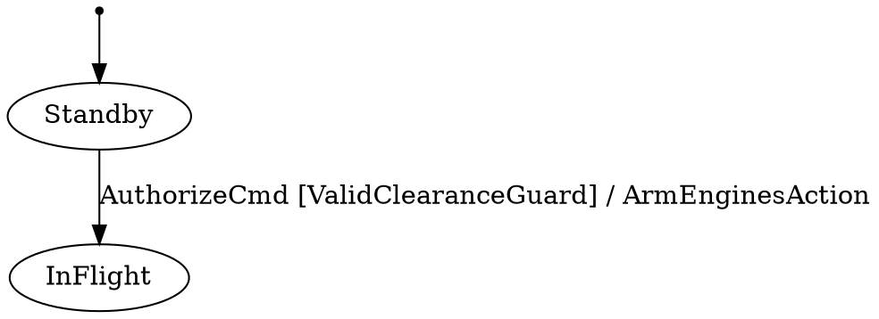

