# OMG UML 2.5 State Machine Reference Guide

This guide provides a comprehensive mapping between the **OMG UML 2.5 State Machine Specification** and its syntax representations in **PlantUML** (`@startuml`) and **Mermaid** (`stateDiagram-v2`), along with the corresponding C++ code generated by **`fsmc`**.

---

## Table of Contents
1. [Simple States & Transitions](#1-simple-states--transitions)
2. [Hierarchical / Composite States (HFSM)](#2-hierarchical--composite-states-hfsm)
3. [Internal Transitions](#3-internal-transitions)
4. [Choice & Junction Pseudostates](#4-choice--junction-pseudostates)
5. [History States (Shallow & Deep)](#5-history-states-shallow--deep)
6. [Deferred Events](#6-deferred-events)
7. [State Entry & Exit Actions](#7-state-entry--exit-actions)
8. [Guards and Actions](#8-guards-and-actions)

---

## 1. Simple States & Transitions

### PlantUML
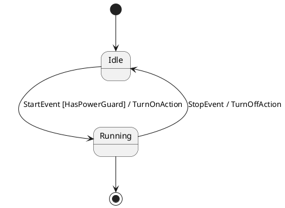

### Mermaid
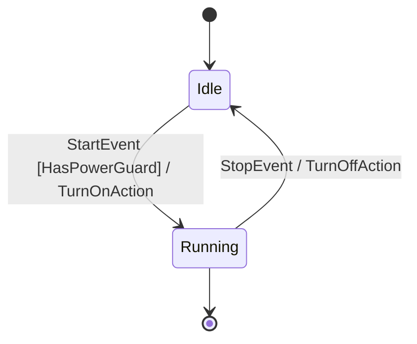

### Generated C++ Row
```cpp
fsm::row<Idle, StartEvent, Running, HasPowerGuard, TurnOnAction>
```

---

## 2. Hierarchical / Composite States (HFSM)

Composite states contain nested sub-state machine regions. Entering a composite state enters its defined initial sub-state.

### PlantUML
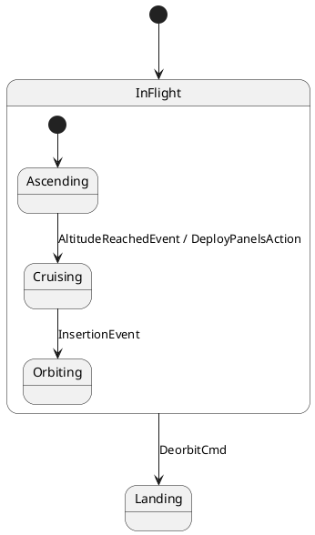

### Mermaid
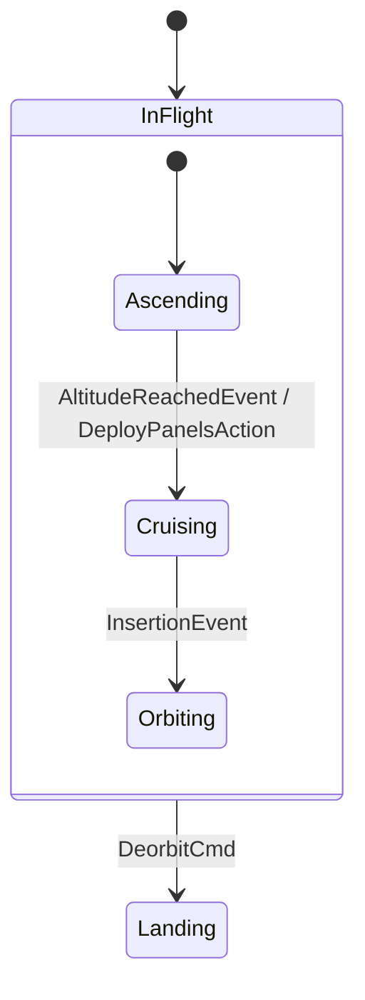

---

## 3. Internal Transitions

Internal transitions execute an action in response to an event **without exiting or re-entering the state**, guaranteeing zero lifecycle hook overhead.

### PlantUML
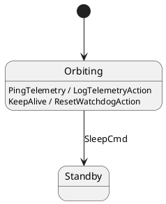

### Mermaid
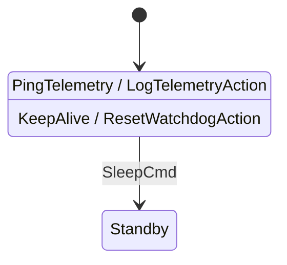

### Generated C++ Row
```cpp
fsm::internal_row<Orbiting, PingTelemetry, fsm::no_guard, LogTelemetryAction>
```

---

## 4. Choice & Junction Pseudostates

Choice pseudostates (`<<choice>>`) evaluate boolean guard conditions dynamically at runtime to select an outgoing branch.

### PlantUML
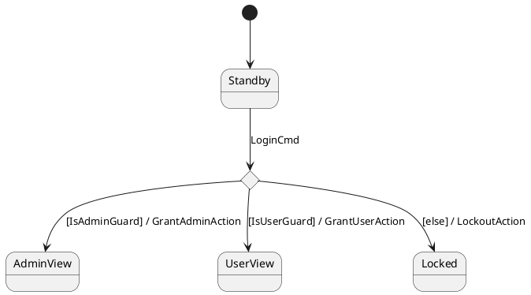

### Mermaid
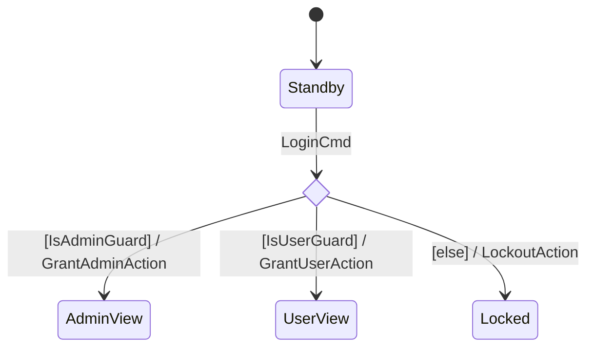

---

## 5. History States (Shallow & Deep)

History states remember the last active sub-state of a composite state before it was exited, allowing seamless resumption.

| Symbol | Name | Description |
| :---: | :--- | :--- |
| `State[H]` | **Shallow History** | Restores the most recent direct active sub-state of `State`. |
| `State[H*]` | **Deep History** | Recursively restores the most recent active sub-state across all nested levels. |

### PlantUML
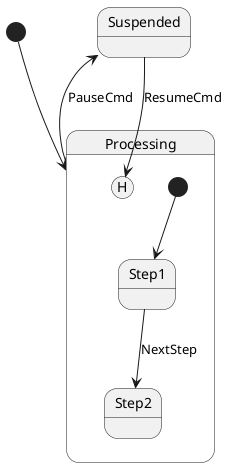

### Mermaid
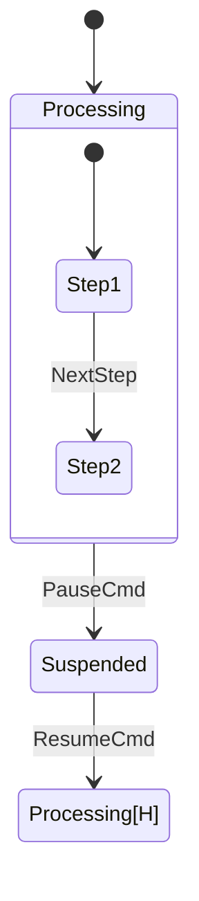

---

## 6. Deferred Events

Deferred events are events that cannot be handled in the current state but are buffered in a queue and processed as soon as the state machine transitions into a receiving state.

### PlantUML
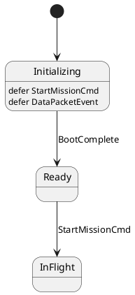

### Mermaid
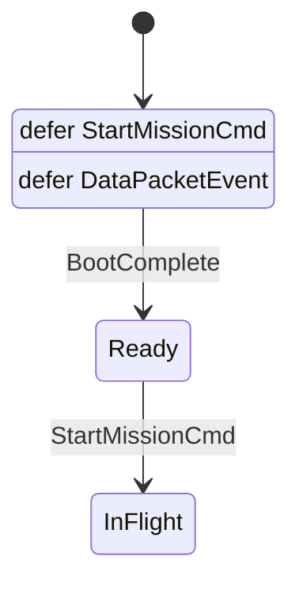

---

## 7. State Entry & Exit Actions

States can define entry and exit behaviors in diagram format:

### PlantUML
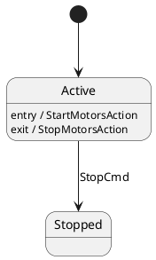

### Mermaid
```mermaid
stateDiagram-v2
    [*] --> Active

    state Active {
        Active : entry / StartMotorsAction
        Active : exit / StopMotorsAction
    }

    Active --> Stopped : StopCmd
```

---

## 8. Guards and Actions

### C++ Guard Signature (Predicates)
```cpp
struct ValidClearanceGuard {
    [[nodiscard]] constexpr bool operator()(const AuthorizeCmd& evt,
                                            const auto& src_state,
                                            const MissionContext& ctx) const noexcept {
        return ctx.flight_clearance_granted;
    }
};
```

### C++ Action Signature
```cpp
struct DeploySolarPanelsAction {
    constexpr void operator()(const AltitudeReachedEvent& evt,
                              auto& src_state,
                              auto& dst_state,
                              MissionContext& ctx) const {
        ctx.solar_panels_deployed = true;
    }
};
```
