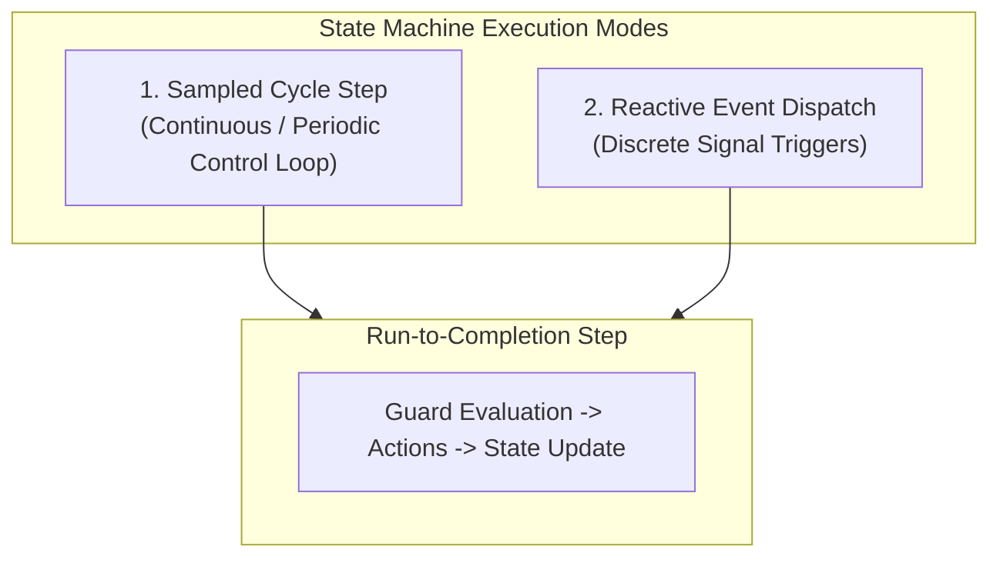
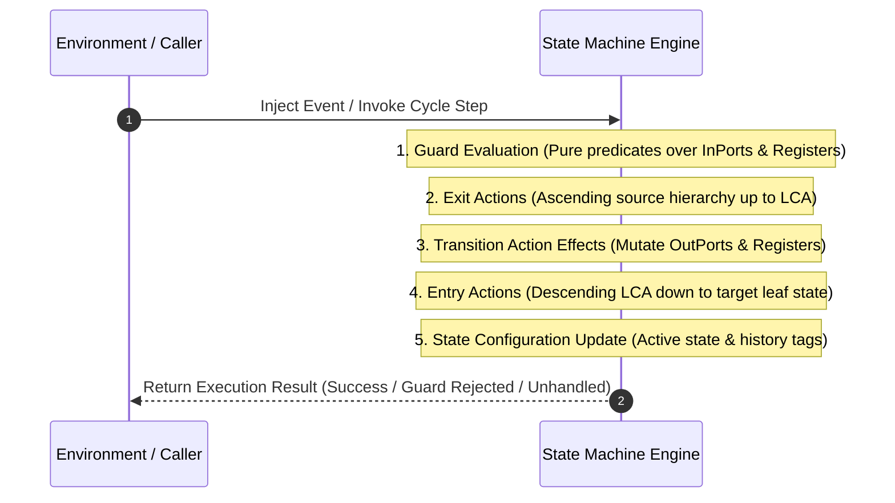
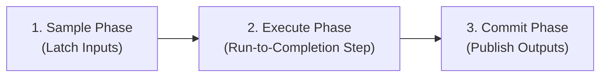

# Execution Semantics and Computational Model

This document specifies the formal execution model implemented by **`fsmc`**, independent of any specific target programming language or execution environment.

---

## 1. Dual-Paradigm Execution

`fsmc` state machines support two complementary execution paradigms within a single unified model:

### Continuous Sampled Step (`step`)
In periodic control loops (e.g. digital signal processing, flight guidance, robotics control loops at 1 kHz):

- The machine executes periodic evaluation ticks over current inputs.
- Transitions with no event trigger (continuous condition transitions) evaluate their boolean guards against the current inputs and `Registers` ($z^{-1}$).
- Returns an evaluation status indicating either nominal state residence (**`steady`**) or execution of a continuous transition (**`transitioned`**).

### Reactive Event Dispatch (`dispatch`)
In event-driven architectures (e.g. protocol parsers, command interfaces, UI events):

- The machine remains quiescent until a discrete event signal is injected.
- The machine matches the active state and incoming event trigger against transition candidates.
- Returns a dispatch status (**`success`**, **`deferred`**, **`guard_rejected`**, or **`unhandled`**).

> [!NOTE]
> For a full formal specification of discrete sampled time vs continuous physical timers, state residence in registers, and timeout invalidation mechanics, see **[Dual-Paradigm Temporal Models](temporal_models.md)**.

---

## 2. Run-to-Completion (RTC) Semantics

State transitions execute in atomic **Run-to-Completion (RTC)** steps according to OMG UML / SysML formal statechart semantics:

### Execution Step Sequence

1. **Candidate Selection & Guard Evaluation**: Candidate transitions matching the active state and trigger are identified. Associated guard predicates are evaluated.
2. **Exit Action Cascade**: The active state's `on_exit` action executes. If exiting a nested substate, exit actions execute upwards from the leaf substate to the Least Common Ancestor (LCA).
3. **Transition Effect**: The transition's action effect executes, updating internal datapath variables and writing output ports.
4. **Entry Action Cascade**: Entry actions execute downwards from the LCA to the target leaf state.
5. **History & State Commit**: The active state configuration and history records are updated atomically.

---

## 3. The Synchronous Latching Principle

To ensure mathematical determinism and prevent race conditions or feedback cycles within a single execution cycle, `fsmc` enforces the **Read-Execute-Write (Latching)** principle:

- **Inputs (`InPorts`)**: Sampled once at the beginning of the cycle and held constant throughout execution.
- **Outputs (`OutPorts`)**: Written during transition execution and committed only upon cycle completion, preventing intermediate states from being observed externally.
- **Internal Datapath (`Registers`)**: Updated with discrete unit delay ($z^{-1}$) semantics, ensuring that values written during cycle $k$ become available as inputs only in cycle $k+1$.

---

## 4. Determinism & Priority Resolution

A well-formed `fsmc` model is deterministic: for any state and event combination, at most one outgoing transition can fire.

When multiple candidate transitions originate from the same source state:

- **Guard Disjointness**: The compiler verifies that overlapping transition guards are mutually exclusive.
- **Hierarchical Priority**: In hierarchical statecharts, inner substate transitions take precedence over outer parent transitions unless explicitly overridden.
- **Choice Pseudostate Evaluation**: Choice branches are evaluated deterministically in specification order.
