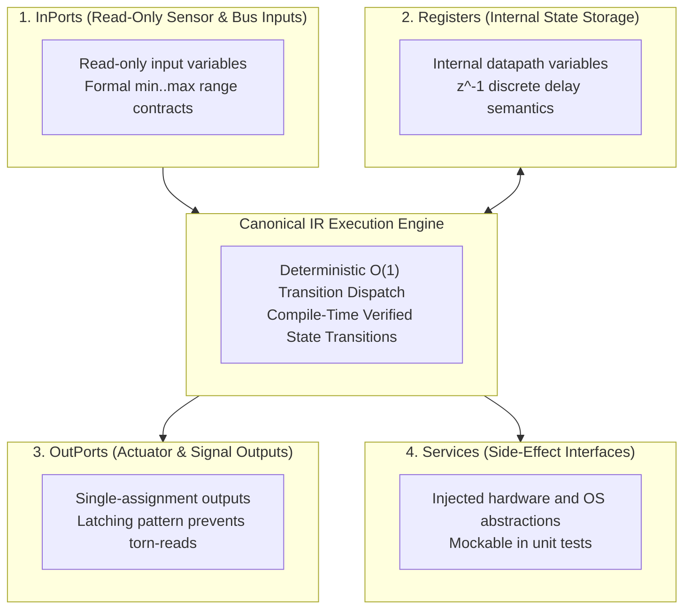

# Architecture & Core Concepts

This section documents the theoretical foundations, execution semantics, and metamodel architecture of **`fsmc`**.

---

## Core Topics

| Topic | Description | Reference |
| :--- | :--- | :--- |
| **Dual-Paradigm Temporal Models** | Formal specification of discrete sampled time (Registers $z^{-1}$) vs continuous asynchronous reactive time. | [Temporal Models](temporal_models.md) |
| **States & HFSM Hierarchy** | Atomic states, composite submachines, orthogonal regions, and shallow `[H]` / deep `[H*]` history pseudostates. | [States & Hierarchy](states_and_hierarchy.md) |
| **Transitions & Events** | Signal triggers with typed payloads, continuous sampled transitions, timed triggers (`after`/`every`), and internal transitions. | [Transitions & Events](transitions_and_events.md) |
| **Guards & Actions** | Deterministic boolean condition trees (`and`, `or`, `not`), choice pseudostates, and action lifecycle effects. | [Guards & Actions](guards_and_actions.md) |
| **Execution Semantics & Metamodel** | Dual-paradigm execution (`step` & `dispatch`), Run-to-Completion (RTC) lifecycle, and synchronous latching. | [Execution Semantics](execution_semantics.md) |

---

## MBSE 4-Domain Partitioned Memory Architecture

State machine datapath and environmental interactions in `fsmc` are structured across four segregated memory domains:

### Domain Definitions

1. **`InPorts`**: Read-only input variables sampled at the start of a machine cycle. Ports can specify compile-time contracts (`assert constraint { self >= min and self <= max; }`) evaluated before transition dispatch.
2. **`OutPorts`**: Single-assignment output fields written by action effects. Enforces the Read-Execute-Write latching pattern to prevent torn-reads across concurrent tasks.
3. **`Registers`**: Internal persistent datapath variables with $z^{-1}$ delay semantics. Registers retain state across consecutive cycles without leaking into external interfaces.
4. **`Services`**: External side-effect interfaces (hardware drivers, network sockets, OS primitives) injected into the state machine via pure abstract interfaces.
