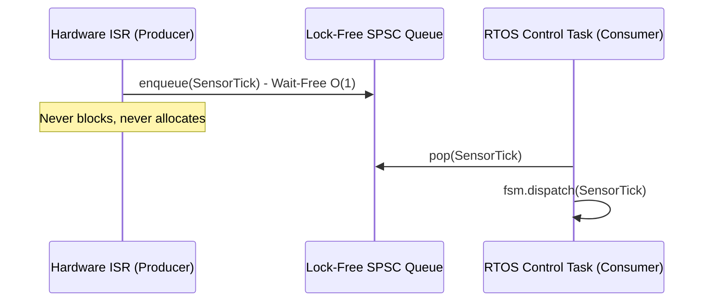

# Memory Architecture and Hard Real-Time Guarantees

In mission-critical, automotive (ISO 26262 ASIL D), and aerospace (DO-178C DAL A) software, dynamic memory allocation (`malloc`, `new`, `std::vector`, `std::function`) is prohibited or heavily restricted due to the risk of heap fragmentation, non-deterministic latency, and memory exhaustion.

`fsmc` is designed around strict deterministic memory and execution guarantees.

---

## 1. Zero-Heap Allocation Model

| Metric | Traditional FSM Libraries | `fsmc` Runtime |
| :--- | :--- | :--- |
| **Heap Allocations** | `std::shared_ptr`, `std::function` closures | **0 Bytes (No heap usage)** |
| **State Storage** | Heap-allocated polymorphic pointers | `std::variant<States...>` on stack |
| **Transition Dispatch** | Dynamic virtual table lookups (O(N) runtime) | Compile-time unrolled template folds (O(1)) |
| **Queue Allocations** | Dynamic `std::deque` or `std::queue` | Statically-sized ring buffer |

---

## 2. Lock-Free SPSC Ring Buffer (`fsm::spsc_ring_buffer`)

For embedded systems where events are produced inside high-frequency Interrupt Service Routines (ISRs) and consumed by an RTOS control task, mutex locking causes priority inversion and deadlocks.

`fsmc` provides `fsm::spsc_ring_buffer<T, Capacity>`:

- **Power-of-Two Ring Buffer**: Array index wrapping is evaluated via bitwise masking (`index & (Capacity - 1)`), avoiding expensive division instructions.
- **Acquire-Release Memory Ordering**: Uses `std::atomic<std::size_t>` with `memory_order_acquire` and `memory_order_release` to enforce synchronization without bus-locking instructions on ARM/x86 architectures.
- **Wait-Free O(1) Enqueue**: The producer thread executes in a bounded number of CPU cycles without retries or spinning.

---

## 3. Seqlock Context Snapshots

In multi-threaded embedded architectures, reader threads (such as telemetry loggers or GUI monitors) need to read the state machine's context without blocking the consumer task.

`fsm::spsc_fsm` integrates a hardware-friendly **Sequential Lock (Seqlock)**:

- **Writer (Consumer)**: Increments a sequence counter before and after updating context.
- **Reader Threads**: Read the sequence counter before and after copying context. If the counter changed or was odd, the read is retried.
- **Guarantee**: Writers never wait for readers; readers obtain consistent atomic snapshots of multi-field structs without mutex locks.
