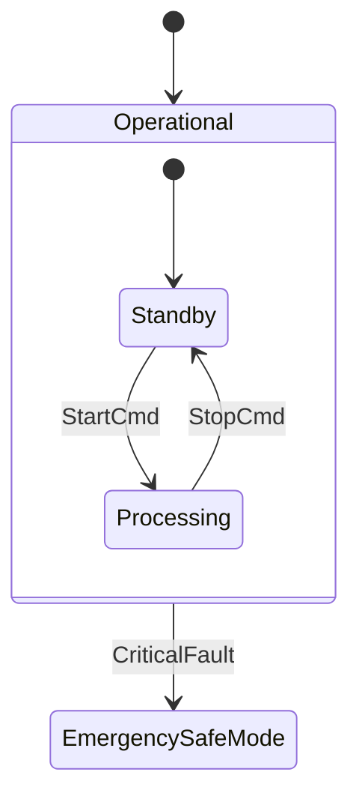

# States and Hierarchical Statecharts (HFSM)

Hierarchical Finite State Machines (HFSM), also known as UML statecharts or Harel statecharts, extend classical flat automata by introducing nested state hierarchies, composite states, history recovery mechanisms, and orthogonal regions.

---

## State Hierarchy Architecture

In classical flat automata, state complexity grows exponentially when handling modal behavior or global interrupts. HFSM solves this problem through behavioral inheritance: substates inherit all outgoing transitions from their parent composite states.



When the state machine is in `Operational::Processing` and receives `CriticalFault`, it automatically traverses up the hierarchy to find the enclosing transition on `Operational`, exits `Processing`, exits `Operational`, and enters `EmergencySafeMode`.

---

## State Taxonomy in `fsmc`

Every node in the `FsmIr` intermediate representation belongs to one of the following categories:

| State Kind | Semantic Meaning | Lifecycle Hooks |
| :--- | :--- | :--- |
| **Atomic State** | A leaf state with no child substates. | `on_entry`, `on_exit` |
| **Composite State** | A container enclosing nested child substates. Defines an initial entry path. | `on_entry`, `on_exit` |
| **Initial Pseudostate** | Designated entry point of a composite state. | Immediate transition to target |
| **Final State** | Designates completion of the enclosing composite state's lifecycle. | Fires parent completion transitions |
| **Shallow History `[H]`**| Restores the immediate most recently active direct substate. | Restores single level |
| **Deep History `[H*]`** | Recursively restores the exact nested leaf substate across arbitrary hierarchy depths. | Restores recursive path |
| **Choice Pseudostate** | Dynamic decision node where outgoing branch guards are evaluated at runtime. | Evaluates guards sequentially |
| **Junction Pseudostate**| Static decision node resolved at compile time or inlined by `ChoiceInliningPass`. | Guard chaining |

---

## History Pseudostates: Shallow vs Deep

History states allow a composite state to resume execution where it was previously interrupted instead of re-entering its default initial substate.

### Shallow History (`[H]`)
Restores only the immediate top-level child substate of the composite state. Any nested substates within that child will be initialized to their default initial state.

### Deep History (`[H*]`)
Recursively restores the full hierarchy chain down to the deepest active leaf state.

#### Implementation in Modern C++
In `fsmc`, history is tracked without heap allocations by storing an enum tag representing the active substate path in the state machine's internal state storage variant:

```cpp
// Transition into composite state with history
fsm::row<Suspended, ResumeCmd, fsm::history<Operational, Standby>>
```
If `Operational` was previously active in substate `Processing`, `ResumeCmd` restores `Processing`. If `Operational` was never entered before, it enters the fallback substate `Standby`.

---

## Orthogonal (Parallel) Regions

Orthogonal regions allow a composite state to execute multiple concurrent statecharts simultaneously. In `fsmc`:
- Regions are defined as independent sub-statecharts executing synchronously within the parent state.
- Middle-end passes (`OrthogonalInterferencePass`) statically analyze transitions across orthogonal regions to verify that concurrent actions do not perform unsynchronized read/write conflicts on the same shared context variables.
