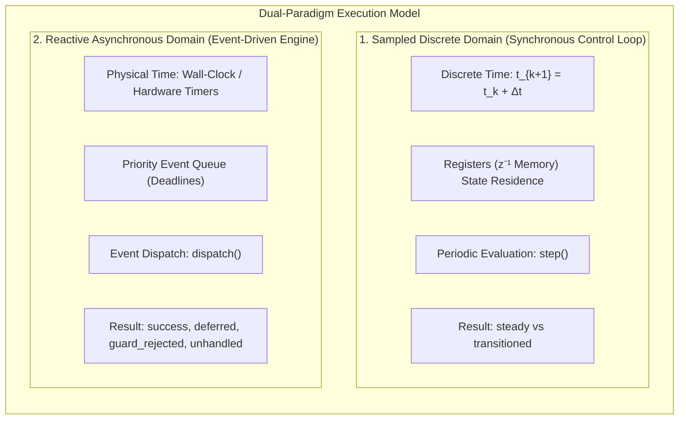
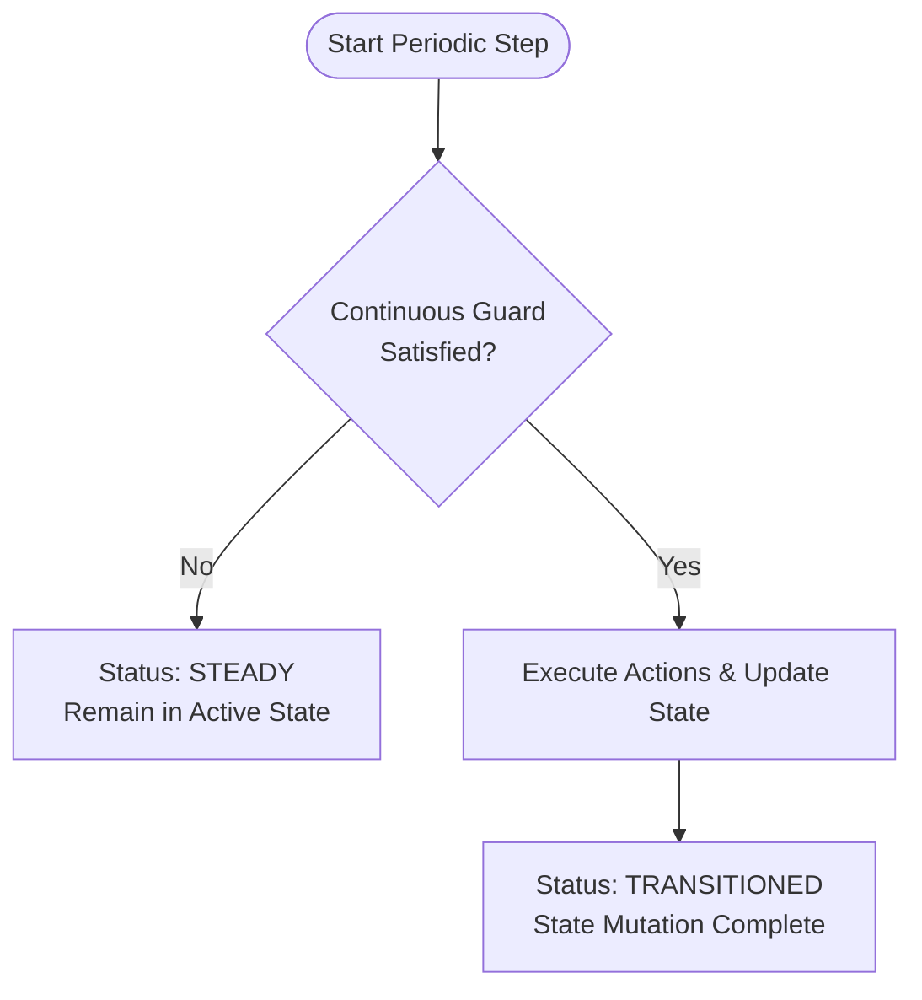
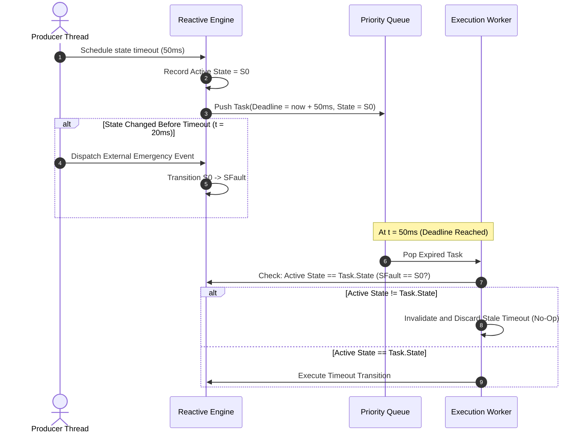

# Dual-Paradigm Temporal Models & Execution Semantics

State machine architectures for mission-critical systems operate across two fundamentally different domains:

1. **Sampled Synchronous Control Loops** (IEC 61131-3, SCADE/Lustre, Simulink Stateflow) governed by deterministic, discrete sample periods.
2. **Reactive Event-Driven Engines** (UML Statecharts, Active Objects, Actor systems) governed by physical wall-clock asynchronous timeouts and external events.

`fsmc` formalizes this execution duality into a **Dual-Paradigm Execution Model**, providing rigorous mathematical semantics, zero-overhead execution, and formal verifiability.

---

## 1. Dual-Paradigm Overview



---

## 2. Formal Temporal Models

```
               Logical Discrete Time (step)
               t_{k+1} = t_k + Δt (Fixed Period)
      ┌───────────┬───────────┬───────────┬───────────┐
      │  Tick 0   │  Tick 1   │  Tick 2   │  Tick 3   │
      └─────┬─────┴─────┬─────┴─────┬─────┴─────┬─────┘
            ▼           ▼           ▼           ▼
        Registers   Registers   Registers   Registers
          (z⁻¹)       (z⁻¹)       (z⁻¹)       (z⁻¹)
        [Timer++]   [Timer++]   [Timer++]   [Timer++]
  ──────────┼───────────┼───────────┼───────────┼────────► Time (t)
            │           │                       │
            │           └───────► EvEmergency   │
            │                     (Async Event) │
            ▼                                   ▼
    post_state_timeout(50ms)             Deadline Expired
    [Registered at State S0]             [Discarded if State != S0]
               Physical Continuous Time (dispatch)
```

### 2.1 Sampled Discrete Time (Synchronous Control Loop)

In periodic execution loops (e.g. flight control, automotive powertrain, industrial robotics at 100 Hz – 10 kHz):

* **Time Advancement:** Time advances strictly in discrete quantums $t_{k+1} = t_k + \Delta t$, completely decoupled from non-deterministic operating system wall-clocks.
* **State Residence & Dwell Timers:** Dwell counters, cycle accumulators, and timer variables are stored deterministically within **Registers** ($z^{-1}$ memory block).
* **Reset Semantics:** When entering a state, entry actions reset the state's dwell counter in Registers to zero.
* **Continuous Guards:** Continuous transition guards evaluate predicates over sensor inputs and register dwell time (e.g., *dwell $\ge \text{Threshold}$*).
* **Real-Time Properties:** Hard real-time execution, $O(1)$ time complexity, zero heap allocations, zero jitter, and deterministic run-to-completion (RTC).

### 2.2 Asynchronous Continuous Time (Reactive Event Engine)

In event-driven and multi-threaded architectures:

* **Time Advancement:** Time is measured using high-resolution hardware timers or physical wall-clock timepoints.
* **Scheduling:** Timed events and state timeouts are scheduled with explicit deadline timestamps in a priority event queue.
* **State-Bound Timeout Invalidation:** When a timeout is scheduled for a specific state, the runtime records the state active at registration. If an external event causes a transition to another state before the deadline expires, the obsolete timeout is **automatically invalidated and discarded** when popped, preventing spurious transitions in subsequent states.

---

## 3. Comparative Matrix

| Property | Sampled Discrete Time (`step`) | Asynchronous Continuous Time (`dispatch`) |
| :--- | :--- | :--- |
| **Execution Trigger** | Periodic sampled tick (fixed $\Delta t$) | External event / Expired deadline |
| **Time Source** | Discrete cycle accumulation ($t_{k+1} = t_k + \Delta t$) | Physical wall-clock / Hardware timer |
| **Dwell Storage** | `Registers` ($z^{-1}$ memory block) | Priority Queue deadline timepoints |
| **Transition Type** | Continuous anonymous transition | Explicit typed event / timeout trigger |
| **Evaluation Result** | `steady` or `transitioned` | `success`, `deferred`, `guard_rejected`, `unhandled` |
| **Real-Time Guarantee** | **Hard Real-Time** ($O(1)$ stack, 0 heap, 0 locks) | **Soft Real-Time** (Queue scheduling, Active Object) |
| **EFSM Interval Analysis** | Interval Arithmetic & Bound Propagation | Bounded non-deterministic event arrivals |
| **Model Checking (nuXmv)** | Discrete transition relations (`next(timer) := ...`) | Timed automata / Continuous clocks |

---

## 4. Execution Semantics & Return Statuses

### 4.1 Sampled Step Evaluation (`step_result`)

During a periodic cycle, the engine checks whether any continuous guard is satisfied.

* **`steady` (Nominal Residence):** No continuous guard evaluated to true. The state machine remains nominally in its current active state. Remaining in the active state is expected nominal behavior in a synchronous cycle.
* **`transitioned` (Continuous Transition):** A continuous transition condition fired. Exit actions, transition actions, state update, and entry actions were executed.



### 4.2 Reactive Event Dispatching (`dispatch_result`)

When an explicit event is dispatched to the state machine:

* **`success`:** A transition matching the active state and event was found, guard passed, and the transition completed.
* **`deferred`:** The active state defers the event. The event is preserved in the deferral queue to be replayed upon entering a new state.
* **`guard_rejected`:** A transition matched the active state and event, but its guard predicate evaluated to `false`.
* **`unhandled`:** No transition row in the transition table matches the current active state and the incoming event.

---

## 5. Timeout Lifecycle & Invalidation Mechanics

In asynchronous engines, delayed events can be scheduled with state-dependent invalidation:



---

## 6. Formal Verification (SMT & Model Checking)

The clean separation of sampled discrete time into **Registers ($z^{-1}$)** guarantees exact formal correspondence between the specification model, the verification engine, and the generated target code:

1. **EFSM Interval Analysis / Static Invariant Proving:** Dwell time conditions become standard integer arithmetic constraints:
   $$\text{Inv}_k \implies \left(\text{dwell\_ticks} \ge N \implies \text{NextState} = S_{\text{target}}\right)$$
2. **Symbolic Model Checking (nuXmv / SMV):** Sampled timers are compiled into exact deterministic transition relations:
   ```smv
   MODULE main
   VAR
     state : {Standby, Active};
     dwell_ticks : 0..100;
   ASSIGN
     init(dwell_ticks) := 0;
     next(dwell_ticks) := case
       state = Standby & dwell_ticks < 100 : dwell_ticks + 1;
       state != next(state)                : 0;
       TRUE                                : dwell_ticks;
     esac;
   ```
   Because time advances discretely through the control loop without asynchronous preemption, model checkers can verify temporal properties (LTL/CTL) exhaustively with zero abstraction error.
