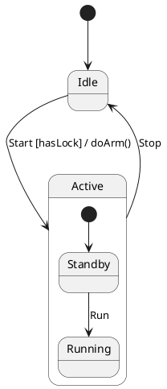
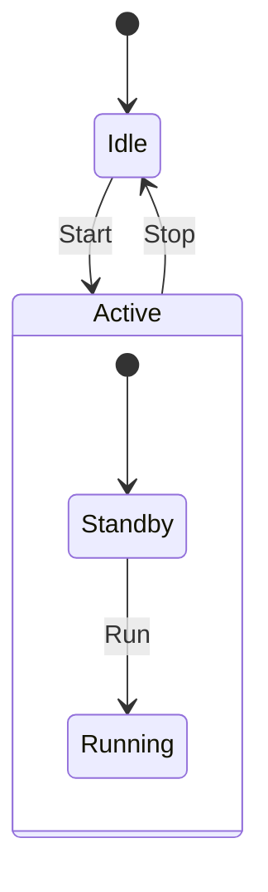

# Visual Diagrams: PlantUML, Mermaid, DOT & JSON

`fsmc` supports lossless bidirectional transpilation across popular visual diagram notations, allowing development teams to design in Markdown diagrams and compile directly into verified C++ headers.

---

## 1. Supported Diagram Notations

### PlantUML (`.puml`)
Standard UML 2.5 state diagram notation with nested states, entry/exit actions, choices (`<<choice>>`), history (`[H]`), and guard expressions.



### Mermaid (`.mmd`)
Mermaid `stateDiagram-v2` notation widely used in GitHub Markdown documents and wikis.



### Graphviz DOT (`.dot`)
Graphviz directed graphs for topological visualization and graph metrics computation.

### XState JSON (`.json`)
W3C SCXML-compatible JSON statechart schemas commonly used in web and JavaScript applications.

---

## 2. Compilation Guardrails (`--allow-diagram-codegen`)

Because informal diagram sketches may omit strict type definitions for events and variables, `fsmc` includes a safety guardrail when compiling directly from diagram files into C++ headers:

```bash
# Attempting direct compilation without guardrail flag
fsmc -i architecture.mmd -o architecture_fsm.hpp
# Output:
# [ERROR] Direct code generation blocked: 'architecture.mmd' is a visual diagram format (Mermaid).
# Pass '--allow-diagram-codegen' to allow heuristic code generation, or use '--verify' / '--export <fmt>'.

# Compiling with explicit guardrail flag
fsmc -i architecture.mmd -o architecture_fsm.hpp --std 20 --allow-diagram-codegen
```

---

## 3. Lossless Transpilation Across Formats

Transpile seamlessly across any supported modeling format:

```bash
# PlantUML to Mermaid
fsmc -i model.puml --export mermaid -o model.mmd

# Mermaid to SysML v2
fsmc -i model.mmd --export sysml2 -o model.sysml

# SysML v2 to Graphviz DOT
fsmc -i model.sysml --export dot -o model.dot
```
