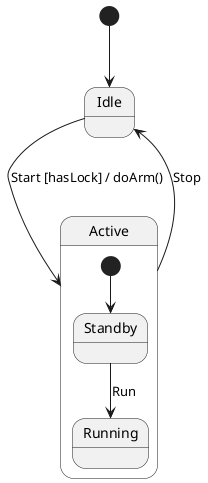
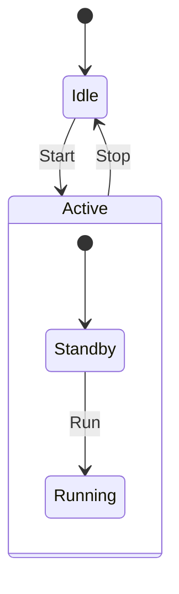

# Visual Diagrams & Lossless Directives

`fsmc` provides bidirectional parsing and emission across visual diagram notations (**PlantUML**, **Mermaid**, **Graphviz DOT**, and **XState JSON**).

Visual diagrams are often treated as informal sketches lacking type systems and memory partitioning. `fsmc` bridges this gap with **Lossless Diagram Directives (`@fsm:*`)**, allowing engineering teams to design full-featured, formally verified statecharts directly inside documentation and diagram files.

---

## 1. Supported Diagram Notations

### PlantUML (`.puml`)
Standard UML 2.5 state diagram syntax with nested states, entry/exit actions, choice pseudostates (`<<choice>>`), history states (`[H]`, `[H*]`), and guard expressions.



### Mermaid (`.mmd`)
Mermaid `stateDiagram-v2` syntax widely used in GitHub Markdown wikis, Pull Request descriptions, and documentation sites.



### Graphviz DOT (`.dot`)
Directed graphs formatted for automated topological layout generation and graph metrics calculation.

### XState JSON (`.json`)
W3C SCXML-compatible JSON schema commonly used in web applications and JavaScript/TypeScript UI workflows.

---

## 2. Lossless Diagram Directives (`@fsm:*`)

Standard diagram notations cannot natively declare hardware I/O ports, typed registers, or formal temporal logic formulas. 

`fsmc` defines the `@fsm:*` directive standard, embedded inside native diagram comment syntax:

| Notation | Comment Prefix | Example |
| :--- | :--- | :--- |
| **PlantUML** | `' @fsm:...` | `' @fsm:port name=voltage type=float dir=in min=0.0 max=24.0` |
| **Mermaid** | `%% @fsm:...` | `%% @fsm:var name=retry_count type=uint32_t init=0 min=0 max=5` |
| **Graphviz DOT** | `// @fsm:...` | `// @fsm:signal EvPacketRecv{uint32_t len} validator="len > 0"` |
| **W3C SCXML** | `<!-- @fsm:... -->` | `<!-- @fsm:property name=SafeLand formula="G (LowBat -> F Landed)" -->` |
| **SysML v2** | `// @fsm:...` | `// @fsm:property name=SafeLand formula="G (LowBat -> F Landed)"` |

---

## 3. Directives Syntax Reference

### 1. Port Declarations (`@fsm:port`)
Declares strongly typed, domain-segregated `InPorts` (read-only) or `OutPorts` (write-only) with numeric range constraints and physical units:

```text
@fsm:port name=<ident> type=<cpp_type> dir=in|out [min=<val>] [max=<val>] [constraint="<expr>"] [unit="<unit>"] [desc="<description>"]
```

*Example:*
```plantuml
' @fsm:port name=battery_voltage type=float dir=in min=0.0 max=28.0 unit="[V]" desc="Main bus voltage"
' @fsm:port name=motor_thrust type=float dir=out min=0.0 max=100.0 unit="[%]" desc="Output thrust command"
```

---

### 2. Internal Registers (`@fsm:var` / `@fsm:reg`)
Declares persistent internal memory state ($z^{-1}$ variables) preserved across transition invocations:

```text
@fsm:var name=<ident> type=<cpp_type> init=<value> [min=<val>] [max=<val>] [unit="<unit>"] [desc="<description>"]
```

*Example:*
```plantuml
' @fsm:var name=error_count type=uint32_t init=0 min=0 max=10 desc="Consecutive transmission errors"
```

---

### 3. Typed Signals & Payload Validators (`@fsm:signal`)
Defines structured event payloads with runtime contract validation expressions:

```text
@fsm:signal <EventName>{<type1> <attr1>, <type2> <attr2>, ...} [validator="<bool_expr>"]
```

*Example:*
```plantuml
' @fsm:signal EvTelemetryData{const uint8_t* buffer, uint32_t size} validator="buffer != nullptr && size > 0"
' @fsm:signal EvSensorReady
```

---

### 4. Formal Temporal Properties (`@fsm:property`)
Embeds Linear Temporal Logic (LTL) and Computation Tree Logic (CTL) properties for automated formal verification:

```text
@fsm:property name=<ident> kind=Safety|Liveness formula="<LTL/CTL_formula>" [req="<REQ_ID>"] [desc="<description>"]
```

*Example:*
```plantuml
' @fsm:property name=MutualExclusion kind=Safety formula="G !(Operational & EmergencyStop)" req="SAF-01"
' @fsm:property name=GuaranteedRecovery kind=Liveness formula="G (LowBattery -> F SafeLanded)" req="LIV-02"
```

---

### 5. Deferred Events (`@fsm:defer`)
Specifies events that must be queued and automatically re-evaluated upon entering subsequent states:

```text
@fsm:defer [<Event1>, <Event2>, ...]
```

*Example:*
```plantuml
' Inside state Initializing:
' @fsm:defer [EvTelemetryData, EvCommand]
```

---

### 6. State Metadata & Traceability (`@fsm:state`)
Attaches requirement traceability tags, history semantics, or continuous activity functions to states:

```text
@fsm:state name=<ident> [history=shallow|deep] [satisfies=["<REQ1>", "<REQ2>"]] [do_activity="<func>"]
```

*Example:*
```plantuml
' @fsm:state name=HoldingPattern history=deep satisfies=["NAV-101", "SAF-04"] do_activity="maintain_orbit"
```

---

## 4. End-to-End Example: Roundtrip & C++ Code Generation

The following example demonstrates how directives enable a PlantUML diagram to generate strongly typed C++20 code and transpile losslessly into Mermaid:

=== "PlantUML with Directives (`uav_control.puml`)"
    ```plantuml
    @startuml
    ' @fsm:name UavController
    ' @fsm:port name=battery_level type=float dir=in min=0.0 max=100.0 unit="[%]"
    ' @fsm:port name=thrust_cmd type=float dir=out min=0.0 max=100.0 unit="[%]"
    ' @fsm:var name=reconnect_attempts type=uint32_t init=0 min=0 max=5
    ' @fsm:signal EvTelemetry{uint32_t packet_id} validator="packet_id > 0"
    ' @fsm:property name=SafeLanded kind=Liveness formula="G (LowBattery -> F Landed)" req="SAF-UAV-01"

    [*] --> Preflight

    Preflight --> InFlight : EvTakeoff [in.battery_level > 20.0] / out.thrust_cmd = 50.0
    
    state InFlight {
        [*] --> Navigating
        Navigating --> ReturnHome : LowBattery [in.battery_level <= 20.0]
    }

    InFlight --> Landed : EvTouchdown / out.thrust_cmd = 0.0
    @enduml
    ```

=== "Transpiled Mermaid (`uav_control.mmd`)"
    ```mermaid
    %% @fsm:name UavController
    %% @fsm:port name=battery_level type=float dir=in min=0.0 max=100.0 unit="[%]"
    %% @fsm:port name=thrust_cmd type=float dir=out min=0.0 max=100.0 unit="[%]"
    %% @fsm:var name=reconnect_attempts type=uint32_t init=0 min=0 max=5
    %% @fsm:signal EvTelemetry{uint32_t packet_id} validator="packet_id > 0"
    %% @fsm:property name=SafeLanded kind=Liveness formula="G (LowBattery -> F Landed)" req="SAF-UAV-01"

    stateDiagram-v2
        [*] --> Preflight
        Preflight --> InFlight: EvTakeoff [in.battery_level > 20.0] / out.thrust_cmd = 50.0
        state InFlight {
            [*] --> Navigating
            Navigating --> ReturnHome: LowBattery [in.battery_level <= 20.0]
        }
        InFlight --> Landed: EvTouchdown / out.thrust_cmd = 0.0
    ```

=== "Generated C++20 Header (`uav_fsm.hpp`)"
    ```cpp
    #pragma once
    #include <cstdint>
    #include <fsm/backend/cpp/runtime/fsm.hpp>

    namespace uav {

    // Generated InPorts Domain
    struct InPorts {
        float battery_level{0.0f}; // min: 0.0, max: 100.0 [%]
    };

    // Generated OutPorts Domain
    struct OutPorts {
        float thrust_cmd{0.0f};    // min: 0.0, max: 100.0 [%]
    };

    // Generated Internal Registers Domain
    struct Registers {
        uint32_t reconnect_attempts{0};
    };

    // States & Events
    struct Preflight {};
    struct Navigating {};
    struct ReturnHome {};
    struct Landed {};

    struct EvTakeoff {};
    struct LowBattery {};
    struct EvTouchdown {};
    struct EvTelemetry { uint32_t packet_id{0}; };

    } // namespace uav
    ```

---

## 5. Compilation Guardrails (`--allow-diagram-codegen`)

When compiling visual diagrams directly into C++ header files, `fsmc` applies a safety guardrail by default to avoid unintended code generation from rough whiteboard sketches:

```bash
# Direct compilation without guardrail flag is rejected:
fsmc -i architecture.mmd -o architecture_fsm.hpp
# Output:
# [ERROR] Direct code generation blocked: 'architecture.mmd' is a visual diagram format (Mermaid).
# Pass '--allow-diagram-codegen' to allow heuristic code generation, or use '--verify' / '--export <fmt>'.

# Compiling with explicit guardrail flag:
fsmc -i uav_control.puml -o uav_fsm.hpp --std 20 --allow-diagram-codegen
```

Transpilation between diagram formats (e.g. `--export mermaid`, `--export scxml`, `--export smv`) does not require the flag and operates directly on any diagram input.
