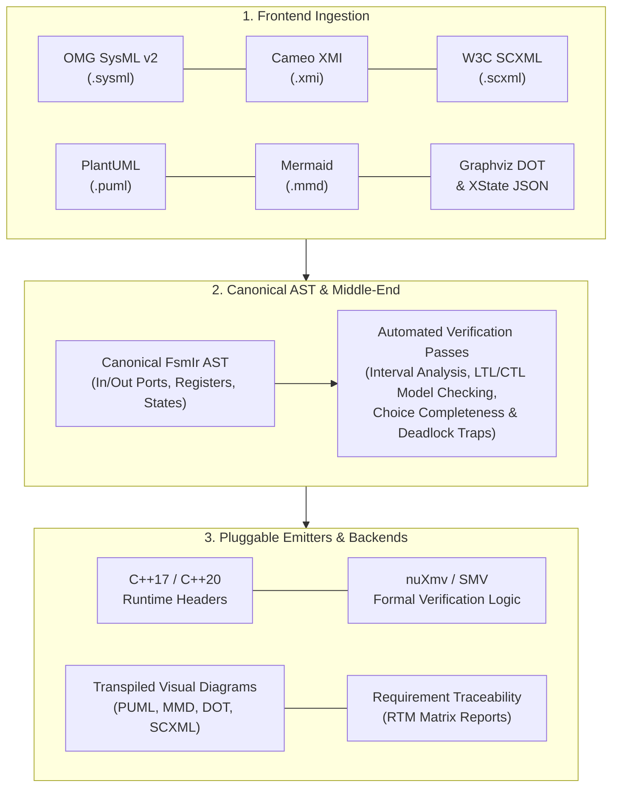

# Modeling Languages & Formats

`fsmc` features a multi-format frontend and backend ingestion pipeline supporting **8 industry standard formats** across Model-Based Systems Engineering (MBSE), formal verification, and visual diagramming.

---

## 1. Supported Modeling Standards

| Format | Standard / Domain | Ingestion & Export Capabilities | Reference Guide |
| :--- | :--- | :--- | :--- |
| **OMG SysML v2** | Textual MBSE | First-class textual SysML v2 syntax (`state def`, `transition on`, actions, ports, constraints, enums, structs). | [SysML v2 Guide](sysml_v2.md) |
| **MathWorks Stateflow** | Industrial Control | Simulink Stateflow XML chart models with temporal triggers (`after(N, sec)`), hierarchy, and transitions. | [Stateflow Guide](stateflow.md) |
| **Cameo / MagicDraw** | Industrial CASE MBSE | OMG XMI 2.1 / 2.4 interchange standard exported by Dassault Systèmes Cameo / MagicDraw. | [Cameo XMI Guide](cameo_magicdraw.md) |
| **W3C SCXML** | Formal Web / Telecom | XML-based State Chart XML standard with datamodels, event parameters, and parallel regions. | [W3C SCXML Guide](scxml.md) |
| **nuXmv / SMV** | Formal Verification | Symbolic transition system specifications with temporal LTL (`LTLSPEC`) and CTL (`CTLSPEC`) formulas. | [nuXmv / SMV Guide](smv_nuxmv.md) |
| **Visual Diagrams** | Documentation & Design | PlantUML (`@startuml`), Mermaid (`stateDiagram-v2`), Graphviz DOT, and XState JSON. | [Diagrams Guide](diagrams.md) |
| **UML 2.5 Mapping** | Semantic Compliance | Complete cross-format mapping matrix and UML 2.5 state machine feature alignment. | [UML Reference](uml_reference.md) |

---

## 2. Ingestion & Transpilation Architecture

`fsmc` decouples the ingestion of human-readable modeling languages from analysis passes and target code emission through its strongly typed Intermediate Representation (**`FsmIr`**):



---

## 3. Lossless Diagram Directives (`@fsm:*`)

Visual diagram languages (like PlantUML and Mermaid) are traditionally purely graphical and lack native syntax for hardware port definitions, variable memory bounds, or formal LTL invariants.

`fsmc` solves this through **Lossless Diagram Directives** (`@fsm:*`):
- Semantic annotations embedded inside standard diagram comments (`' @fsm:...` in PlantUML, `%% @fsm:...` in Mermaid, `// @fsm:...` in DOT, `<!-- @fsm:... -->` in SCXML).
- When transpiling between visual diagrams and formal MBSE models, all typed ports, memory registers, deferred events, and formal safety properties are **preserved without semantic loss**.
- Detailed syntax and examples are available in the [Visual Diagrams & Directives Guide](diagrams.md).

---

## 4. Cross-Format Feature Matrix

| Feature | SysML v2 | Cameo XMI | W3C SCXML | PlantUML | Mermaid | nuXmv / SMV |
| :--- | :--- | :--- | :--- | :--- | :--- | :--- |
| **Hierarchical States (HFSM)** | `state def { ... }` | `uml:Region` | `<state><state/></state>` | `state P { ... }` | `state P { ... }` | Flattened states |
| **Choice Junctions** | `choice Branch;` | `uml:Pseudostate` | `<transition cond="...">` | `state C <<choice>>` | `state C <<choice>>` | `case ... esac` |
| **Shallow & Deep History** | `history` | `uml:Pseudostate` | `<history type="deep"/>` | `[H]`, `[H*]` | `[H]` | $z^{-1}$ memory var |
| **Hardware Ports (`In`/`Out`)** | `in/out port` + `assert` | `uml:Port` | `<!-- @fsm:port -->` | `' @fsm:port` | `%% @fsm:port` | Bounded `VAR`/`IVAR` |
| **Internal Memory (`Registers`)** | `attribute` | `uml:Property` | `<datamodel>` | `' @fsm:var` | `%% @fsm:var` | `VAR` + `next()` |
| **Timed Dwell Transitions** | `after 500 ms` | `TimeTrigger` | `<transition delay="...">` | `[after 500 ms]` | `[after 500 ms]` | `timer : 0..500` |
| **Deferred Events** | `// @fsm:defer` | `<<deferred>>` | `<!-- @fsm:defer -->` | `' @fsm:defer` | `%% @fsm:defer` | Discrete Event Queue |
| **Safety Invariants (LTL)** | `@fsm:property` | Stereotype | `<!-- @fsm:property -->` | `' @fsm:property` | `%% @fsm:property` | `INVARSPEC` |
| **Liveness & Response (LTL)** | `@fsm:property` | Stereotype | `<!-- @fsm:property -->` | `' @fsm:property` | `%% @fsm:property` | `LTLSPEC G (P -> F Q)` |
| **Requirement Traceability** | `@fsm:req` | `<<Satisfy>>` | `<!-- @fsm:req -->` | `' @fsm:state satisfies` | `%% @fsm:state satisfies` | Traceability Matrix |

---

## 5. Universal CLI Transpilation

Transpile losslessly between any supported formats using `--export <format>`:

```bash
# Transpile SysML v2 to Mermaid for documentation and web wikis
fsmc -i flight_control.sysml --export mermaid -o flight_control.mmd

# Transpile PlantUML into W3C SCXML interchange model
fsmc -i model.puml --export scxml -o model.scxml

# Transpile Cameo XMI into canonical nuXmv formal SMV logic
fsmc -i mission.xmi --export smv -o formal_verification.smv

# Export visual Graphviz DOT graph with computed layout attributes
fsmc -i flight_control.sysml --export dot -o architecture.dot
```
