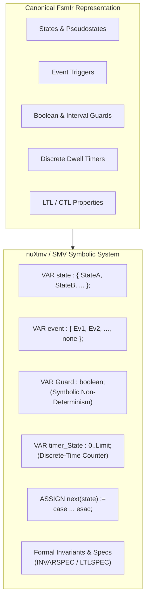

# nuXmv / SMV Formal Verification Language

`fsmc` compiles statechart models into canonical symbolic transition systems strictly compliant with the **nuXmv 2.0+** and **NuSMV 2.6+** model checking engines.

> [!NOTE]
> **Role in the Toolchain**:
> In standard workflows, SMV is **used primarily as an Export Target**. Engineers author models in expressive modeling languages (SysML v2, Cameo XMI, SCXML, PlantUML) and invoke `fsmc --export smv` to generate `.smv` logic files for automated mathematical verification and counterexample extraction in the external **nuXmv** solver suite.

---

## 1. SMV Translation Architecture

During SMV export (`--export smv`), `fsmc` translates the canonical `FsmIr` AST into a formal finite state transition system (`MODULE main`):



---

## 2. Symbolic Translation Rules

### A. State Enumeration & Event Alphabet
All states (including composite substates and choice pseudostates) are declared in a finite scalar enumeration:
```smv
MODULE main
VAR
    state : {SensorCalib, SystemReady, WaypointNav, ReturnToHome, Landed};
    event : {CalibrationOk, TakeoffCmd, LowBatteryEvent, TouchdownEvent, none};
```

---

### B. Free Boolean Guards & Bounded Variables
- **Free Boolean Guards**: Guard identifiers (e.g. `[HasGpsLock]`, `[ValidClearance]`) that are not explicit ports are declared as `VAR <ident> : boolean;`, allowing nuXmv to explore all non-deterministic truth combinations symbolically.
- **Composite C++ Template Guards**: Recursive C++ template guards (`fsm::and_<A, B>`, `fsm::or_<A, B>`, `fsm::not_<A>`) are automatically decompiled into standard SMV propositional logic (`(A & B)`, `(A | B)`, `!(A)`).
- **Data Path Variables**: Numeric integer/real ports with range contracts are declared as bounded sub-ranges (e.g. `batteryLevel : 0..100;`).

---

### C. Discrete Timer Dwell Counters
Timed transitions (`after 500 ms`) are synthesized into discrete-time integer tick counters:
```smv
VAR
    timer_SensorCalib : 0..500;

ASSIGN
    init(timer_SensorCalib) := 0;
    next(timer_SensorCalib) := case
        state = SensorCalib & timer_SensorCalib < 500 : timer_SensorCalib + 1;
        state != SensorCalib : 0;
        TRUE : timer_SensorCalib;
    esac;
```

---

### D. Safety Invariants & Temporal LTL Properties
- **State Invariants** (`@fsm:property InvarName = "G !(...)";`): Stripped of the redundant outer temporal operator and formatted as native `INVARSPEC`:
  ```smv
  INVARSPEC !(state = SensorCalib & state = WaypointNav);
  ```
- **LTL Temporal Properties** (`@fsm:property ResponseLanding = "G (LowBat -> F Landed)";`): Formatted as native `LTLSPEC`:
  ```smv
  LTLSPEC G (event = LowBatteryEvent & batteryLevel < 20 -> F (state = Landed));
  ```

---

## 3. Example Generated SMV Model

```smv
MODULE main
VAR
    state : {Preflight, InFlight, Holding, Landed};
    event : {EvTakeoff, EvLowBattery, EvTouchdown, none};
    HasClearanceGuard : boolean;
    battery_level : 0..100;

ASSIGN
    init(state) := Preflight;
    init(battery_level) := 100;

    next(state) := case
        state = Preflight & event = EvTakeoff & HasClearanceGuard & (battery_level > 20) : InFlight;
        state = InFlight & event = EvLowBattery & (battery_level <= 20) : Holding;
        state = Holding & event = EvTouchdown : Landed;
        TRUE : state;
    esac;

-- Formal Verification Specifications
INVARSPEC !(state = Preflight & state = InFlight);
LTLSPEC G ((state = InFlight & event = EvLowBattery) -> F (state = Landed));
```

---

## 4. Executing nuXmv Externally

Export the model with `fsmc` and run `nuXmv`:

```bash
# 1. Export SMV model from SysML v2 or PlantUML
fsmc -i uav_mission.sysml --export smv -o uav_mission.smv

# 2. Execute nuXmv in batch mode
nuXmv uav_mission.smv
```

### Advanced nuXmv Verification Modes
For large hierarchical statecharts, you can invoke nuXmv's specialized verification algorithms:

```bash
# BDD-Based Model Checking (Complete proof)
nuXmv -int uav_mission.smv
nuXmv > go
nuXmv > check_invar
nuXmv > check_ltlspec
nuXmv > quit

# SAT-Based Bounded Model Checking (BMC) for deep counterexamples
nuXmv -int uav_mission.smv
nuXmv > go_bmc
nuXmv > check_ltlspec_bmc -k 25
nuXmv > quit
```
