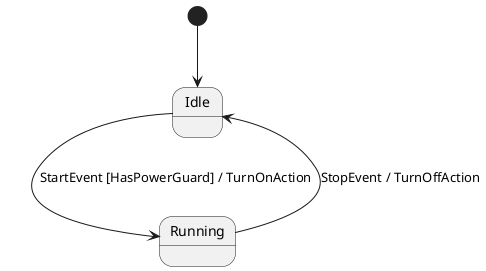
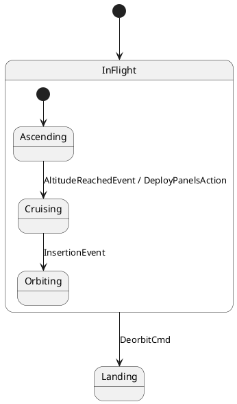
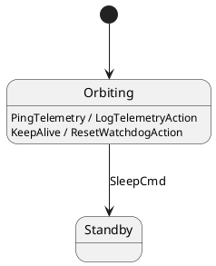
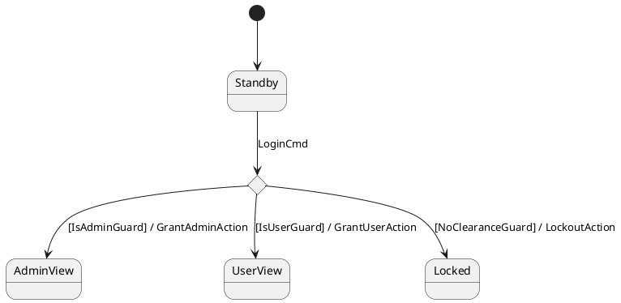
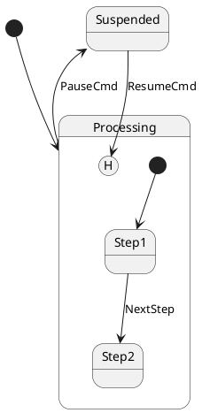
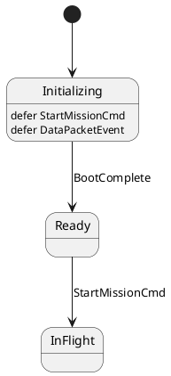
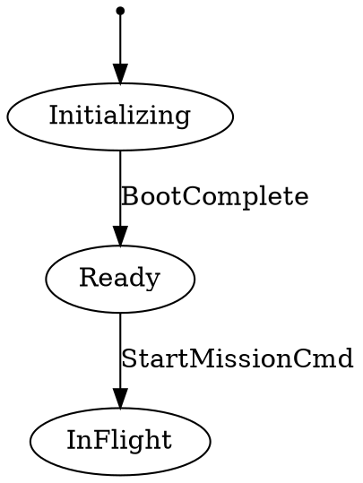
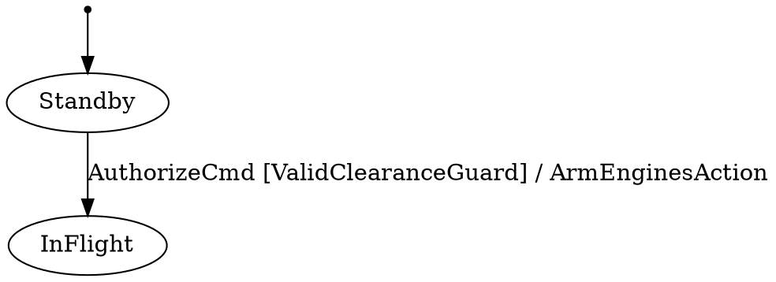

# OMG UML 2.5 & SysML v2 State Machine Reference Guide

This guide provides a comprehensive mapping between the **OMG UML 2.5 / SysML v2 State Machine Specifications** and their syntax representations in **OMG SysML v2** (`.sysml`), **PlantUML** (`@startuml`), and **Mermaid** (`stateDiagram-v2`), along with the corresponding C++ code generated by **`fsmc`**.

---

## Table of Contents
1. [Simple States & Transitions](#1-simple-states-transitions)
2. [Hierarchical / Composite States (HFSM)](#2-hierarchical-composite-states-hfsm)
3. [Internal Transitions](#3-internal-transitions)
4. [Choice & Junction Pseudostates](#4-choice-junction-pseudostates)
5. [History States (Shallow & Deep)](#5-history-states-shallow-deep)
6. [Deferred Events](#6-deferred-events)
7. [Timed Transitions](#7-timed-transitions)
8. [Universal Diagram Export & Translation](#8-universal-diagram-export-translation)
9. [Guards, Composite Logic & Actions](#9-guards-composite-logic-actions)
10. [Multi-Format Modeling Reference](#10-multi-format-modeling-reference)
11. [Format Feature Matrix & Extensions Specification](#11-format-feature-matrix-extensions-specification)


---

## 1. Simple States & Transitions

### OMG SysML v2 (`.sysml`)
```sysml
state def PowerSystem {
    entry; then Idle;

    state Idle;
    state Running;

    transition start_trans
        first Idle
        accept StartEvent
        if HasPowerGuard
        do TurnOnAction
        then Running;

    transition stop_trans
        first Running
        accept StopEvent
        do TurnOffAction
        then Idle;
}
```

### PlantUML (`.puml`)


### Mermaid (`.mmd`)
```mmd
stateDiagram-v2
    [*] --> Idle
    Idle --> Running : StartEvent [HasPowerGuard] / TurnOnAction
    Running --> Idle : StopEvent / TurnOffAction
```


### Generated C++ Row
```cpp
fsm::row<Idle, StartEvent, Running, HasPowerGuard, TurnOnAction>
```

---

## 2. Hierarchical / Composite States (HFSM)

### OMG SysML v2 (`.sysml`)
```sysml
state def FlightSystem {
    entry; then InFlight;

    state InFlight {
        entry; then Ascending;
        state Ascending;
        state Cruising;
        state Orbiting;
    }

    state Landing;

    transition from Ascending accept AltitudeReachedEvent do DeployPanelsAction then Cruising;
    transition from Cruising accept InsertionEvent then Orbiting;
    transition from InFlight accept DeorbitCmd then Landing;
}
```

### PlantUML (`.puml`)


### Mermaid (`.mmd`)
```mmd
stateDiagram-v2
    [*] --> InFlight

    state InFlight {
        [*] --> Ascending
        Ascending --> Cruising : AltitudeReachedEvent / DeployPanelsAction
        Cruising --> Orbiting : InsertionEvent
    }

    InFlight --> Landing : DeorbitCmd
```


---

## 3. Internal Transitions

Internal transitions execute actions without triggering `on_exit` or `on_enter` on the current state.

### OMG SysML v2 (`.sysml`)
```sysml
state def Satellite {
    entry; then Orbiting;
    state Orbiting;

    // Internal transition: no 'then/to' target
    transition from Orbiting accept PingTelemetry do LogTelemetryAction;
}
```

### PlantUML (`.puml`)


### Mermaid (`.mmd`)
```mmd
stateDiagram-v2
    [*] --> Orbiting

    Orbiting : PingTelemetry / LogTelemetryAction
    Orbiting : KeepAlive / ResetWatchdogAction
    Orbiting --> Standby : SleepCmd
```


### Generated C++ Row
```cpp
fsm::internal_row<Orbiting, PingTelemetry, fsm::no_guard, LogTelemetryAction>
```

---

## 4. Choice & Junction Pseudostates

### OMG SysML v2 (`.sysml`)
```sysml
state def Authentication {
    entry; then Standby;

    state Standby;
    state AuthChoice :> Choice;
    state AdminView;
    state UserView;
    state Locked;

    transition from Standby accept LoginCmd then AuthChoice;
    transition from AuthChoice if IsAdminGuard do GrantAdminAction then AdminView;
    transition from AuthChoice if IsUserGuard do GrantUserAction then UserView;
    transition from AuthChoice if NoClearanceGuard do LockoutAction then Locked;
}
```

### PlantUML (`.puml`)


### Mermaid (`.mmd`)
```mmd
stateDiagram-v2
    [*] --> Standby

    state AuthChoice <<choice>>

    Standby --> AuthChoice : LoginCmd
    AuthChoice --> AdminView : [IsAdminGuard] / GrantAdminAction
    AuthChoice --> UserView : [IsUserGuard] / GrantUserAction
    AuthChoice --> Locked : [NoClearanceGuard] / LockoutAction
```

---

## 5. History States (Shallow & Deep)

| Symbol | Name | Description |
| :---: | :--- | :--- |
| `State[H]` | **Shallow History** | Restores the most recent direct active sub-state of `State`. |
| `State[H*]` | **Deep History** | Recursively restores the most recent active sub-state across all nested levels. |

### OMG SysML v2 (`.sysml`)
```sysml
state def TaskManager {
    entry; then Processing;

    state Processing {
        entry; then Step1;
        state Step1;
        state Step2;
    }

    state Suspended;

    transition from Step1 accept NextStep then Step2;
    transition from Processing accept PauseCmd then Suspended;
    transition from Suspended accept ResumeCmd then Processing[H];
}
```

### PlantUML (`.puml`)


---

## 6. Deferred Events

### OMG SysML v2 (`.sysml`)
```sysml
state def BootSequence {
    entry; then Initializing;

    state Initializing;
    defer StartMissionCmd;
    defer DataPacketEvent;

    state Ready;
    state InFlight;

    transition from Initializing accept BootComplete then Ready;
    transition from Ready accept StartMissionCmd then InFlight;
}
```

### PlantUML (`.puml`)


### Mermaid (`.mmd`)
```mmd
stateDiagram-v2
    [*] --> Initializing

    Initializing : [defer] StartMissionCmd
    Initializing : [defer] DataPacketEvent

    Initializing --> Ready : BootComplete
    Ready --> InFlight : StartMissionCmd
```


### Graphviz DOT (`.dot`, `.gv`)


### Cameo / MagicDraw (`.xmi`)
```xml
<subvertex xmi:type="uml:State" xmi:id="_init" name="Initializing">
  <deferrableTrigger xmi:type="uml:Trigger" xmi:id="_dt1" name="StartMissionCmd"/>
</subvertex>
```

### W3C SCXML (`.scxml`)
```xml
<state id="Initializing">
  <defer event="StartMissionCmd"/>
  <transition event="BootComplete" target="Ready"/>
</state>
```

### XState JSON (`.json`)
```json
{
  "Initializing": {
    "defer": ["StartMissionCmd", "DataPacketEvent"],
    "on": { "BootComplete": "Ready" }
  }
}
```

### Generated C++ State
```cpp
struct Initializing {
    static constexpr std::string_view name = "Initializing";
    using deferred_events = fsm::type_list<StartMissionCmd, DataPacketEvent>;
};
```
*When `Initializing` transitions to `Ready`, queued events are automatically replayed in FIFO order.*

---

## 7. Timed Transitions

`fsmc` provides first-class support for deterministic timer-based transitions and deadline scheduling:

### Type-Safe Timed Events
```cpp
// Explicit compile-time duration events:
using Timeout500ms = fsm::after_ms<500>;
using Timeout10s   = fsm::after_s<10>;
using Timeout50us  = fsm::after_us<50>;

// Transition definition in table:
fsm::transition<Connecting, Timeout500ms, Disconnected, OnTimeoutAction>
```

### Asynchronous Deadline Scheduling (`thread_safe_fsm`)
```cpp
fsm::thread_safe_fsm<MyTable, MyContext> sm(ctx);
sm.start_worker();

// Schedule delayed events executed by worker in strict chronological priority:
sm.post_delayed(TimeoutEvent{}, std::chrono::milliseconds(500));
```

---

## 8. Universal Diagram Export & Translation

Translate any model format to **Mermaid**, **PlantUML**, or **OMG SysML v2**:

```bash
# Convert Cameo XMI to GitHub-renderable Mermaid
fsmc -i model.xmi --export mermaid -o diagram.mmd

# Convert W3C SCXML to PlantUML
fsmc -i protocol.scxml --export plantuml -o protocol.puml

# Convert PlantUML to OMG SysML v2 textual specification
fsmc -i mission.puml --export sysml2 -o mission.sysml
```

---

## 9. Guards, Composite Logic & Actions

### Composite Boolean Guards (`!`, `&&`, `||`)
`fsmc` features a built-in recursive expression parser for composite guards across all supported model formats. You can write arbitrary boolean logic directly in transitions:

| Expression in Diagram | Generated C++ Guard Type | Semantics |
| :--- | :--- | :--- |
| `[!EmergencyStop]` | `fsm::not_<EmergencyStop>` | Logical NOT |
| `[PowerOk && DoorClosed]` | `fsm::and_<PowerOk, DoorClosed>` | Logical AND (Short-circuit) |
| `[HasKey || IsAdmin]` | `fsm::or_<HasKey, IsAdmin>` | Logical OR (Short-circuit) |
| `[PowerOk && (!Fault || Override)]` | `fsm::and_<PowerOk, fsm::or_<fsm::not_<Fault>, Override>>` | Nested grouping |

#### Multi-Format Syntax:
- **PlantUML / Mermaid / DOT**: `StateA --> StateB : Event [PowerOk && !EmergencyStop]`
- **SysML v2**: `transition from StateA accept Event if PowerOk && !EmergencyStop then StateB;`
- **SCXML**: `<transition event="Event" cond="PowerOk &amp;&amp; !EmergencyStop" target="StateB"/>`
- **XState JSON**: `"guard": "PowerOk && !EmergencyStop"`

When generating C++ code, `fsmc` generates stub definitions only for atomic predicates (`PowerOk`, `EmergencyStop`), combining them seamlessly through `fsm::and_`, `fsm::or_`, `fsm::not_`.

### C++ Guard Signature (Predicates)
```cpp
struct ValidClearanceGuard {
    [[nodiscard]] constexpr bool operator()(const AuthorizeCmd& evt,
                                            const auto& src_state,
                                            const MissionContext& ctx) const noexcept {
        return ctx.flight_clearance_granted;
    }
};
```

### C++ Action Signature
```cpp
struct DeploySolarPanelsAction {
    constexpr void operator()(const AltitudeReachedEvent& evt,
                              auto& src_state,
                              auto& dst_state,
                              MissionContext& ctx) const {
        ctx.solar_panels_deployed = true;
    }
};
```

## 10. Multi-Format Modeling Reference

In addition to SysML v2, PlantUML, and Mermaid, `fsmc` supports:

### A. Cameo Systems Modeler / MagicDraw (`.xmi`, `.xml`, `.uml`)
```xml
<packagedElement xmi:type="uml:StateMachine" xmi:id="_sm1" name="MissionFSM">
  <region xmi:id="_r1">
    <subvertex xmi:type="uml:Pseudostate" xmi:id="_init" kind="initial"/>
    <subvertex xmi:type="uml:State" xmi:id="_s1" name="Standby"/>
    <subvertex xmi:type="uml:State" xmi:id="_s2" name="InFlight"/>
    <transition source="_init" target="_s1"/>
    <transition source="_s1" target="_s2">
      <trigger name="AuthorizeCmd"/>
      <guard name="ValidClearanceGuard"/>
      <effect name="ArmEnginesAction"/>
    </transition>
  </region>
</packagedElement>
```

### B. W3C SCXML (`.scxml`)
```xml
<scxml xmlns="http://www.w3.org/2005/07/scxml" version="1.0" initial="Standby" name="MissionFSM">
  <state id="Standby">
    <transition event="AuthorizeCmd" cond="ValidClearanceGuard" target="InFlight">
      <send event="ArmEnginesAction"/>
    </transition>
  </state>
  <state id="InFlight"/>
</scxml>
```

### C. XState JSON Statechart (`.json`)
```json
{
  "id": "MissionFSM",
  "initial": "Standby",
  "states": {
    "Standby": {
      "on": {
        "AuthorizeCmd": {
          "target": "InFlight",
          "cond": "ValidClearanceGuard",
          "actions": ["ArmEnginesAction"]
        }
      }
    },
    "InFlight": {}
  }
}
```

### D. Graphviz DOT (`.dot`, `.gv`)


---

## 11. Format Feature Matrix & Extensions Specification

### A. Frontend Classification (Formal Models vs Visual Diagrams)

`fsmc` categorizes statechart formats into two distinct frontend classes:

1. **Formal Metamodels (`include/fsm/frontend/formal/`)**:
    - **Cameo / MagicDraw (OMG XMI 2.x)**, **OMG SysML v2**, and **W3C SCXML**.
    - Strict symbol and type declarations, mathematical semantics, physical units. Direct compilation to C++ without warnings.
2. **Visual Diagrams (`include/fsm/frontend/diagram/`)**:
    - **PlantUML**, **Mermaid `stateDiagram-v2`**, **Graphviz DOT**, and **XState JSON**.
    - Descriptive sketch notations. Code generation requires `--allow-diagram-codegen` and emits `warning[W0301]`.


### B. Feature Matrix (Native vs Extended Syntax)

The table below details which UML 2.5 / Statechart features are supported **natively** by each official format specification versus features for which `fsmc` defines a **clean, renderer-safe extension**:

| Feature / Concept | Cameo OMG XMI | OMG SysML v2 | W3C SCXML | XState JSON | PlantUML | Mermaid | Graphviz DOT |
| :--- | :---: | :---: | :---: | :---: | :---: | :---: | :---: |
| **Frontend Category** | **Formal** | **Formal** | **Formal** | **Diagram** | **Diagram** | **Diagram** | **Diagram** |
| **Simple States & Transitions** | **Native** | **Native** | **Native** | **Native** | **Native** | **Native** | **Native** |
| **Initial / Final States** | **Native** | **Native** | **Native** | **Native** | **Native** (`[*]`) | **Native** (`[*]`) | **Extended** (`shape=point`) |
| **Composite States (HFSM)** | **Native** | **Native** | **Native** | **Native** | **Native** | **Native** | **Extended** (`subgraph`) |
| **Internal Transitions** | **Native** | **Native** | **Native** | **Native** | **Native** (`State : E / A`) | **Native** (`State : E / A`) | **Extended** (`internal=true`) |
| **Choice / Junction** | **Native** | **Native** | **Extended** (`cond` list) | **Extended** (`cond` list) | **Native** (`<<choice>>`) | **Native** (`<<choice>>`) | **Extended** (`shape=diamond`) |
| **History States (`[H]`, `[H*]`)** | **Native** | **Native** | **Native** | **Native** | **Native** (`State[H]`) | **Extended** (`[H]`) | *N/A* |
| **Deferred Events (Deferrable)** | **Native** | **Native** (`defer Evt;`) | **Extended** (`<defer>`) | **Extended** (`"defer": []`) | **Extended** (`: defer Evt`) | **Extended** (`: [defer] Evt`) | **Extended** (`defer="..."`) |
| **Composite Guards (`!`, `&&`, `\|\|`)** | **Extended** (AST) | **Native** | **Native** | **Native** | **Extended** (AST) | **Extended** (AST) | **Extended** (AST) |
| **Timed Transitions (`after_ms<N>`)** | **Extended** (AST) | **Native** (`after 500ms`) | **Native** (`delay=...`) | **Native** (`after: {}`) | **Extended** (AST) | **Extended** (AST) | **Extended** (AST) |
| **Lossless Comment Directives** | *N/A* | *N/A* | *N/A* | *N/A* | **`@fsm:` comments** | **`%% @fsm:` comments** | **`// @fsm:` comments** |

---

### C. Extension Design Principles

When a diagram format lacks a native keyword for advanced UML 2.5 constructs (such as *deferred events* or *choice pseudostates* in visual diagram languages), `fsmc` extensions adhere to three non-negotiable design principles:

1. **100% Renderer-Safe (Non-Intrusive)**:  
   Extensions never break official diagram renderers (e.g. PlantUML Java JAR, Mermaid.js CLI, Graphviz `dot`). The extension syntax renders cleanly as regular state text, attributes, or stereotypes without visual or grammatical errors.

2. **Deterministic Parsing (Zero Heuristics / Guessing)**:  
   The parser evaluates input strictly through formal grammar and token matching. It never "guesses" or makes assumptions about unspecified behaviors.

3. **Graceful Zero-Overhead Degradation**:  
   If a feature is omitted in a diagram, the compiled C++ model completely excludes data structures and branching logic for that feature (0 bytes memory footprint, 0 CPU overhead).

---

### D. Lossless Diagram Directives (`@fsm:`)

For visual diagram formats (PlantUML, Mermaid, Graphviz DOT), `fsmc` supports lossless metadata directives placed inside comments:

- **State Metadata**:
  ```plantuml
  ' @fsm:state kind=Composite initial=Idle do=poll_sensor req="REQ-01"
  ```

- **Extended Variables with Physical Units**:
  ```plantuml
  ' @fsm:var battery_level : float = 100.0 [percent]
  ' @fsm:var velocity : float = 0.0 [m/s]
  ```

- **Typed Signals & Payloads**:
  ```plantuml
  ' @fsm:signal name=ConnectCmd type="const ConnectionRequest&" validator="req.port > 0"
  ```

- **Formal Verification Properties**:
  ```plantuml
  ' @fsm:property name=SafeLanding kind=Safety formula="G (LowBattery -> F SafeLand)" req="REQ-SAFE-09"
  ```

---

### E. Timed Transitions (`after(...)`, `every(...)`) & SMV Discrete Timers

- **OMG SysML v2**: `transition accept after 500ms then NextState;`
- **W3C SCXML**: `<transition delay="500ms" target="NextState"/>`
- **XState JSON**: `"after": { "500": "NextState" }`
- **PlantUML / Mermaid / DOT**: `after_500ms`, `after_10s`, `after_50us`, `after(500ms)`, `every(100ms)`
- **SMV Formal Synthesis**: The SMV serializer automatically allocates discrete tick counter variables (`timer_<State> : 0..<duration>;`) and emits state-bounded counting rules and reset conditions on transition entry.

---

### D. Semantic Validation Pipeline (`fsm_validator`)

After parsing any input format, `fsmc` runs an exhaustive static analysis pass verifying:

- **Reachability Analysis**: Identifies states that cannot be transitioned to from the initial state (`[WARNING] State unreachable from initial state: 'StateName'`).
- **Target Integrity**: Verifies that all transition destinations exist in the model.
- **Initial State Determinism**: Ensures every composite region has a well-defined initial state (inferred from first state if omitted).
- **Choice Branch Completeness**: Ensures choice pseudostates possess at least one valid outgoing branch.
- **Identifier Sanitization**: Automatically normalizes names to valid C++ identifiers while preserving semantic traceability.


