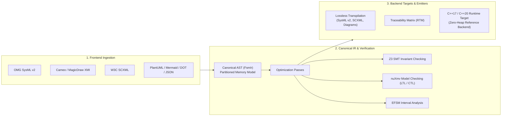

# fsmc — Universal State Machine Compiler

**`fsmc`** (Finite State Machine Compiler) is an open-source, format-agnostic compiler and formal verification toolchain for Model-Based statecharts. It bridges high-level modeling specifications—such as OMG SysML v2, W3C SCXML, and Cameo / MagicDraw (XMI)—with verification engines, format transpilers, and deterministic execution runtimes.

The architecture is centered around a strongly typed canonical Intermediate Representation (**`FsmIr`**), decoupling frontend model ingestion from middle-end verification passes and backend target emission.

---

## Architecture Overview



### Compiler Subsystems

1. **Frontend Ingestion**: Parses statechart models from OMG SysML v2, W3C SCXML, Cameo (XMI 2.1), PlantUML, Mermaid, Graphviz DOT, and XState JSON into the unified `FsmIr` AST.
2. **Middle-End Analysis & Formal Verification**:
    - **Structural Passes**: Detects unreachable states, conflicting transitions, deadlocks, and incomplete choice paths.
    - **SMT Invariant Proving**: Evaluates datapath invariant assertions via Z3.
    - **Symbolic Model Checking**: Proves temporal safety and liveness formulas specified in Linear Temporal Logic (LTL) and Computation Tree Logic (CTL) via nuXmv.
    - **EFSM Interval Analysis**: Propagates value bounds over numeric variables and validates input port range contracts.
3. **Backend Target Emission**:
    - **Model Transpilation**: Converts models losslessly between supported representation formats.
    - **Traceability Matrices**: Generates formal Requirement Traceability Matrices (RTM) in CSV and Markdown formats for DO-178C and ISO 26262 audits.
    - **Target Code Generation**: Emits standalone, zero-heap C++17 or C++20 header files with strict 4-domain memory partitioning (`InPorts`, `OutPorts`, `Registers`, `Services`).

---

## Core Capabilities

| Capability | Description | Reference Documentation |
| :--- | :--- | :--- |
| **Universal Transpilation** | Ingest any supported format and export to any target format (e.g. SysML v2 to SCXML, Cameo to PlantUML). | [Modeling Languages](formal_languages/index.md) |
| **Formal Verification** | Prove temporal safety properties (LTL/CTL) and datapath invariants at compile time before deployment. | [Verification & Safety](verification_and_safety/index.md) |
| **Partitioned Memory Model** | Replaces unstructured context objects with 4 segregated domains: `InPorts`, `OutPorts`, `Registers`, and `Services`. | [Core Concepts](concepts/index.md) |
| **Deterministic Execution** | C++ reference backend operates with 0 bytes heap allocation, 0 virtual tables, and $O(1)$ dispatch time. | [Memory & Real-Time](runtime_api/memory_and_realtime.md) |
| **Interactive Web Playground** | Ingest, verify, transpile, and simulate statecharts directly in the browser via WebAssembly. | [Web Playground](playground/index.md) |

---

## Quick Example: Ingestion to Code Execution

### 1. Statechart Definition

Define a state machine using your preferred input format:

=== "OMG SysML v2 (`mission.sysml`)"
    ```sysml
    package MissionSystem {
        state def UavMission {
            in port has_gps_lock : Boolean;
            in port battery_percent : Integer { assert constraint { self >= 0 and self <= 100; } }
            out port motor_active : Boolean;
            attribute waypoints_completed : Integer = 0;

            entry; then SensorCalib;

            state SensorCalib {
                transition on CalibrationOk do out.motor_active = true; then SystemReady;
            }
            state SystemReady {
                transition on TakeoffCmd if in.has_gps_lock then Navigating;
            }
            state Navigating {
                transition if in.battery_percent < 20 then ReturnToHome;
                transition on AreaReached do reg.waypoints_completed += 1; then Navigating;
            }
            state ReturnToHome;
        }
    }
    ```

=== "PlantUML (`mission.puml`)"
    ```plantuml
    @startuml
    [*] --> SensorCalib

    SensorCalib --> SystemReady : CalibrationOk / out.motor_active = true
    SystemReady --> Navigating : TakeoffCmd [in.has_gps_lock]
    
    Navigating --> ReturnToHome : [in.battery_percent < 20]
    Navigating --> Navigating : AreaReached / reg.waypoints_completed += 1
    @enduml
    ```

=== "W3C SCXML (`mission.scxml`)"
    ```xml
    <scxml xmlns="http://www.w3.org/2005/07/scxml" version="1.0" initial="SensorCalib">
      <state id="SensorCalib">
        <transition event="CalibrationOk" target="SystemReady"/>
      </state>
      <state id="SystemReady">
        <transition event="TakeoffCmd" cond="in.has_gps_lock" target="Navigating"/>
      </state>
      <state id="Navigating">
        <transition cond="in.battery_percent &lt; 20" target="ReturnToHome"/>
      </state>
      <state id="ReturnToHome"/>
    </scxml>
    ```

=== "Mermaid (`mission.mmd`)"
    ```mermaid
    stateDiagram-v2
        [*] --> SensorCalib
        SensorCalib --> SystemReady : CalibrationOk
        SystemReady --> Navigating : TakeoffCmd
        Navigating --> ReturnToHome : [battery_percent < 20]
    ```

---

### 2. Compilation and Verification via CLI

The `fsmc` command-line interface provides unified access to all compiler pipeline stages:

=== "Formal Verification"
    ```bash
    # Run middle-end verification passes (deadlock, completeness, LTL/CTL model checking)
    fsmc -i mission.sysml --verify
    ```

=== "Format Transpilation"
    ```bash
    # Transpile SysML v2 to W3C SCXML
    fsmc -i mission.sysml --format scxml -o mission.scxml

    # Transpile Cameo XMI to PlantUML
    fsmc -i cameo_model.xml --format puml -o model.puml
    ```

=== "Requirement Traceability (RTM)"
    ```bash
    # Export Requirement Traceability Matrix for DO-178C / ISO 26262 audit packages
    fsmc -i mission.sysml --rtm-output rtm_matrix.md
    ```

=== "C++ Code Generation"
    ```bash
    # Generate standalone C++20 single-header state machine
    fsmc -i mission.sysml -o uav_fsm.hpp --std 20 --standalone
    ```

---

### 3. Application Integration (C++ Target)

Include the generated header and execute transitions with typed memory domains:

```cpp
#include "uav_fsm.hpp"
#include <iostream>
#include <cassert>

int main() {
    using namespace MissionSystem;

    // 1. Initialize State Machine with Partitioned Memory
    UavMissionRegisters reg{};
    UavMissionServices srv{};
    UavMissionFSM fsm(reg, srv);

    UavMissionInPorts in{.has_gps_lock = true, .battery_percent = 100};
    UavMissionOutPorts out{};

    // 2. Reactive Event Dispatching
    fsm.dispatch(CalibrationOk{}, in, out);
    assert(fsm.is_in<SystemReady>());
    assert(out.motor_active == true);

    fsm.dispatch(TakeoffCmd{}, in, out);
    assert(fsm.is_in<Navigating>());

    // 3. Continuous Control Loop Step (Sampled Inputs)
    in.battery_percent = 15; // Low battery condition
    fsm.step(in, out);       // Evaluates continuous transitions
    assert(fsm.is_in<ReturnToHome>());

    return 0;
}
```

---

## Documentation Directory

- **[Getting Started](getting_started/index.md)**: System requirements, installation methods (CMake FetchContent, Conan, source builds), CLI reference, and build integration.
- **[Step-by-Step Tutorials](tutorials/index.md)**: Progressive tutorials covering model design, datapath variables, hierarchical states (HFSM), formal verification, and code generation.
- **[Architecture & Concepts](concepts/index.md)**: Semantics of the canonical IR, MBSE 4-domain memory architecture, and real-time execution guarantees.
- **[Modeling Languages](formal_languages/index.md)**: Specifications and examples for SysML v2, Cameo XMI, SCXML, PlantUML, Mermaid, DOT, and JSON.
- **[Verification & Safety](verification_and_safety/index.md)**: Formal verification using Z3 SMT solver, nuXmv model checker, EFSM interval analysis, and RTM generation.
- **[Runtime C++ API](runtime_api/index.md)**: Synchronous Dual-Paradigm Core, Lock-Free SPSC, Thread-Safe MPSC, and Tracing API reference.
- **[Compiler Internals](internals/architecture.md)**: Compiler pipeline internals, IR AST specification, pass manager, and contributor guide.
- **[Interactive Playground](playground/index.md)**: In-browser compiler and simulation environment running via WebAssembly.

---

## License & Disclaimer

`fsmc` is an open-source software engineering tool provided **"AS IS" WITHOUT WARRANTY OF ANY KIND**, as specified in the [MIT License](file:///home/simone/dev/github/fsmc/LICENSE) and [`DISCLAIMER.md`](file:///home/simone/dev/github/fsmc/DISCLAIMER.md).
