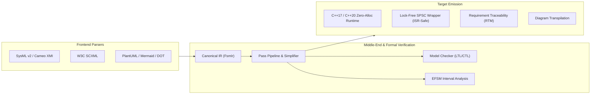

# Overview of fsmc

**`fsmc`** (Finite State Machine Compiler) is a model compiler, formal verification engine, and zero-overhead C++ code generator designed for deterministic, safety-critical systems.

It bridges the gap between high-level **Model-Based Systems Engineering (MBSE)** specifications—such as OMG SysML v2, Cameo Systems Modeler (XMI), and W3C SCXML—and **hard real-time C++ implementations** (C++17 and C++20), guaranteeing that behavioral models are formally verified before execution and deployed with zero heap allocations.

---

## Why fsmc?

State machine implementations in embedded and safety-critical software often suffer from two divergent approaches:

1. **Manual Implementation**: Developers translate UML or state diagrams into handwritten switch-case statements or object-oriented state patterns. This manual translation is error-prone, untraceable to system requirements, difficult to formally verify, and tedious to maintain when specifications change.
2. **Heavyweight Frameworks**: Traditional state machine libraries frequently rely on dynamic heap allocation (`malloc`/`new`), virtual dispatch tables, and runtime string comparisons, which introduce non-deterministic execution times, heap fragmentation, and priority inversion risks incompatible with hard real-time and certification standards such as DO-178C and ISO 26262.

`fsmc` resolves this dichotomy by treating statecharts as formal programs that are parsed, validated, optimized, model-checked, and compiled directly into compile-time unrolled C++ templates.

---

## Key Capabilities

### Multi-Format Model Ingestion
`fsmc` parses statechart definitions from both formal systems engineering formats and lightweight diagram notations:
- **Formal Specifications**: OMG SysML v2 textual state definitions, Dassault / No Magic Cameo (OMG XMI 2.1), and W3C SCXML.
- **Visual Diagram Notations**: PlantUML, Mermaid state diagrams, Graphviz DOT, and XState JSON.
- **Bidirectional Transpilation**: Convert losslessly between any supported modeling formats.

### Middle-End Verification & Analysis
Before emitting any target code, the compiler passes the model through an intermediate optimization and verification pipeline:
- **Temporal Logic Model Checking**: Verifies safety invariants (`G P`) and liveness response properties (`G (P -> F Q)`) using symbolic model checking.
- **EFSM Data Path Interval Analysis**: Abstract interpretation over numeric variables to statically detect unreachable branches and dead guards.
- **Deterministic Disambiguation**: Enforces priority ordering and detects conflicting transitions across overlapping event triggers.
- **Requirement Traceability (RTM)**: Correlates `@fsm:req` annotations with states, transitions, and model checker results into structured Markdown and JSON audit matrices.

### Zero-Overhead C++ Runtime Engine
The generated C++ headers provide predictable, high-performance execution:
- **Zero Dynamic Allocations**: State representations and event queues are bounded and stack-allocated or statically sized.
- **Lock-Free Concurrency (`spsc_fsm`)**: Wait-Free $O(1)$ single-producer single-consumer engine suitable for Interrupt Service Routines (ISRs) and real-time sensor streams.
- **Compile-Time Dispatch**: Transition tables are resolved via template metaprogramming, eliminating virtual function overhead.
- **Rich Telemetry**: Non-intrusive transition tracing and observer hooks without memory overhead.

---

## Documentation Structure

- **[Getting Started](getting_started/installation.md)**: Installation guides via CMake FetchContent, Conan 2.0, and pre-built binaries, followed by a 5-minute quickstart tutorial.
- **[Architecture & Concepts](concepts/states_and_hierarchy.md)**: Conceptual foundations of Hierarchical State Machines (HFSM), history recovery, event dispatch, and real-time execution guarantees.
- **[Modeling Languages](formal_languages/sysml_v2.md)**: Grammar specifications, examples, and import/export guides for each supported format.
- **[Verification & Safety](verification_and_safety/model_checking.md)**: Formal verification guide, LTL/CTL specification syntax, EFSM abstract interpretation, and RTM generation.
- **[Runtime C++ API](runtime_api/synchronous_fsm.md)**: In-depth technical reference for `fsm::fsm`, `fsm::spsc_fsm`, and `fsm::thread_safe_fsm`.
- **[Interactive Playground](playground/index.md)**: WebAssembly-powered browser workspace to edit, verify, and compile statecharts in real time.
