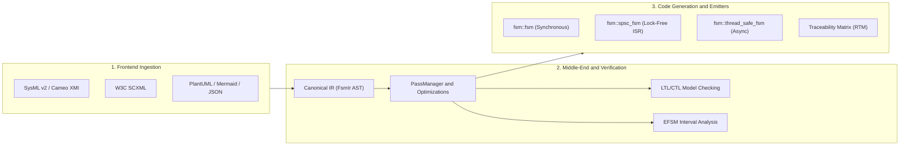

# fsmc — Universal State Machine Compiler

**`fsmc`** (Finite State Machine Compiler) is an open-source compiler toolchain that parses statechart models, performs formal verification analysis, and generates deterministic state machine code. 

Currently, `fsmc` provides a zero-allocation **C++ (C++17 / C++20)** code generator as its primary reference backend. The compiler is built around a decoupled, modular architecture with an Intermediate Representation (`FsmIr`), designed to be easily extended with additional backend targets (such as C, Rust, or hardware description languages) in the future.

It bridges **Model-Based Systems Engineering (MBSE)** specifications—such as OMG SysML v2, W3C SCXML, and Cameo / MagicDraw (XMI)—with **embedded and real-time execution engines**.


---

## Architectural Pipeline

`fsmc` is organized as a modular compiler pipeline consisting of three stages:



1. **Frontend Ingestion**: Parses statechart models from OMG SysML v2, W3C SCXML, Cameo (XMI 2.1), PlantUML, Mermaid, Graphviz DOT, and XState JSON into a unified canonical intermediate representation (`FsmIr`).
2. **Middle-End Analysis & Verification**:
    - Validates model well-formedness (detects unreachable states, conflicting transitions, and non-deterministic choice points).
    - Formally verifies safety invariants and temporal properties specified in Linear Temporal Logic (LTL) and Computation Tree Logic (CTL).
    - Performs interval analysis on numeric variables for Extended Finite State Machines (EFSM).
3. **Target Code Generation**: Emits header-only C++17 or C++20 state machine code, standalone single-header files with zero external dependencies, or requirement traceability matrices (RTM).


---

## Quickstart Tutorial

### 1. Define a State Machine (`mission.sysml`)

Here is an example state machine defined in OMG SysML v2 textual notation:

```sysml
state def AutonomousUavMission {
    attribute battery_percent : Integer = 100;
    attribute altitude_m : Integer = 0;

    entry; then Preflight;

    state Preflight {
        state SensorCalib;
        state SystemReady;

        transition calib_done
            first SensorCalib
            accept CalibrationOk
            do ArmMotors
            then SystemReady;
    }

    state InFlight {
        transition low_battery
            accept LowBatteryEvent
            do TriggerFailSafe
            then ReturnToHome;
    }

    state ReturnToHome;

    transition takeoff
        first Preflight
        accept TakeoffCmd
        if HasGpsLockGuard
        do LaunchUav
        then InFlight;
}
```

### 2. Generate the C++ Header

Run `fsmc` to verify the model and generate a standalone C++20 header:

```bash
# Verify invariants and generate standalone single-header C++ code
fsmc -i mission.sysml -o uav_fsm.hpp --standard 20 --standalone --verify
```

### 3. Integrate into C++ Application

Instantiate the generated state machine with your application context:

```cpp
#include "uav_fsm.hpp"
#include <iostream>

struct UavContext {
    int battery_percent = 100;
    int altitude_m = 0;
    bool has_gps_lock = true;
};

// Define clean type alias for the generated state machine
using UavFsm = fsm::fsm<AutonomousUavMissionTable, UavContext, Preflight>;

int main() {
    UavContext ctx;
    UavFsm uav(ctx);

    std::cout << "Initial state: " << uav.current_state_name() << "\n";

    // Dispatch events
    uav.dispatch(CalibrationOk{});
    std::cout << "State after calibration: " << uav.current_state_name() << "\n";

    uav.dispatch(TakeoffCmd{});
    std::cout << "State after takeoff: " << uav.current_state_name() << "\n";

    return 0;
}
```

---

## Documentation Structure

- **[Getting Started](getting_started/index.md)**: Installation instructions via CMake, Conan, vcpkg, or binary builds, followed by CLI options and build system integration guides.
- **[Step-by-Step Tutorials](tutorials/index.md)**: Progressive 5-step hands-on guides from writing your first model to formal verification and build integration.
- **[Architecture & Concepts](concepts/index.md)**: Hierarchical state machines (HFSM), orthogonal regions, history states, event dispatch mechanics, and memory models.
- **[Architectural Design Patterns](concepts/design_patterns.md)**: Practical engineering recipes for embedded ISR sensor pipelines, aerospace mission controllers, network protocol parsers, and multi-FSM coordination.
- **[Modeling Languages](formal_languages/index.md)**: Syntax reference, examples, and import/export guides for SysML v2, SCXML, Cameo XMI, PlantUML, and Mermaid.
- **[Verification & Safety](verification_and_safety/index.md)**: Guide to formal model checking (LTL/CTL), EFSM interval analysis, and requirement traceability matrices.
- **[Runtime C++ API](runtime_api/index.md)**: Complete technical reference for `fsm::fsm`, `fsm::spsc_fsm`, `fsm::thread_safe_fsm`, and transition telemetry.
- **[Interactive Playground](playground/index.md)**: WebAssembly-powered browser workspace to edit, visualize, simulate, and compile state machines interactively.


---

## Trademarks & Disclaimers

All product names, logos, brands, and registered trademarks (such as SysML®, Cameo®, MagicDraw®, ARM®, FreeRTOS™, STM32®) mentioned in this documentation are property of their respective owners. Their mention is strictly for technical interoperability, compatibility identification, and reference purposes, and does not imply any affiliation, sponsorship, or endorsement.

