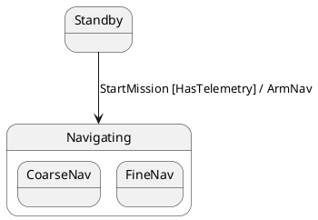

# Formal Intermediate Representation (`FsmIr`) Specification

This document provides the formal specification of the **`FsmIr` (Finite State Machine Intermediate Representation)** in `fsmc`. `FsmIr` is the unified, strongly-typed directed graph and semantic model that sits at the center of the compiler pipeline:

```
[ Frontend Parsers ] ──▶  FsmIr  ──▶ [ PassManager ] ──▶ [ Codegen Backends & Serializers ]
(PlantUML, Mermaid,       (AST)      (Optimization &      (C++17, C++20, JSON, SysML v2,
SysML v2, Cameo, SCXML,              Verification)         Mermaid, PlantUML)
JSON, Graphviz DOT)
```

---

## 1. Core Schema & AST Data Structures

`FsmIr` represents hierarchical statecharts according to the **OMG UML 2.5**, **OMG SysML v2**, and **W3C SCXML** statechart specifications, extended with support for **Extended Finite State Machines (EFSM)** and **Formal Verification Properties (LTL/CTL)**.

### 1.1 Modular Architecture & `FsmIr` Root Container

The IR subsystem is organized in modular, single-responsibility header files under `include/fsm/ir/`:

| Module Header | Description |
| :--- | :--- |
| [`deterministic_id.hpp`](file:///home/simone/dev/github/fsmc/include/fsm/ir/deterministic_id.hpp) | Deterministic 64-bit FNV-1a canonical ID generator (`compute_deterministic_id`). |
| [`state_kind.hpp`](file:///home/simone/dev/github/fsmc/include/fsm/ir/state_kind.hpp) | `StateKind` structural classification enum and string serializers. |
| [`transition_edge_kind.hpp`](file:///home/simone/dev/github/fsmc/include/fsm/ir/transition_edge_kind.hpp) | `TransitionEdgeKind` edge semantics (`External`, `Internal`, `Local`). |
| [`signal_definition.hpp`](file:///home/simone/dev/github/fsmc/include/fsm/ir/signal_definition.hpp) | Typed signals, payload attributes (`SignalAttribute`), and predicate validators. |
| [`variable_definition.hpp`](file:///home/simone/dev/github/fsmc/include/fsm/ir/variable_definition.hpp) | State variables (`VariableDefinition`) with `physical_unit`, `VariableTypeKind`, and SMT domains. |
| [`action.hpp`](file:///home/simone/dev/github/fsmc/include/fsm/ir/action.hpp) | Action invocation signatures (`ActionSignature`) and structured assignments. |
| [`guard.hpp`](file:///home/simone/dev/github/fsmc/include/fsm/ir/guard.hpp) | Composable boolean guard AST trees (`GuardAstNode`, `GuardOp`). |
| [`formal_property.hpp`](file:///home/simone/dev/github/fsmc/include/fsm/ir/formal_property.hpp) | Temporal logic AST (`PropertyAstNode`, `TemporalOp`, `FormalProperty`). |
| [`trigger.hpp`](file:///home/simone/dev/github/fsmc/include/fsm/ir/trigger.hpp) | Strongly-typed `SignalTrigger`, `TimeTrigger` (after/every with units), `AnonymousTrigger`. |
| [`region.hpp`](file:///home/simone/dev/github/fsmc/include/fsm/ir/region.hpp) | Orthogonal regions (`OrthogonalRegion`) and submachine references (`SubmachineRef`). |
| [`state_node.hpp`](file:///home/simone/dev/github/fsmc/include/fsm/ir/state_node.hpp) | Hierarchical state graph node (`StateNode`). |
| [`transition_edge.hpp`](file:///home/simone/dev/github/fsmc/include/fsm/ir/transition_edge.hpp) | Directed transition edge representation (`TransitionEdge`). |
| [`event_model.hpp`](file:///home/simone/dev/github/fsmc/include/fsm/ir/event_model.hpp) | Event models and choice pseudostates (`ChoiceNodeModel`). |
| [`fsm_ir.hpp`](file:///home/simone/dev/github/fsmc/include/fsm/ir/fsm_ir.hpp) | Root `FsmIr` container, lookup API, canonicalizer, and `fsm::` namespace aliases. |
| [`fsm_ir_serializer.hpp`](file:///home/simone/dev/github/fsmc/include/fsm/ir/fsm_ir_serializer.hpp) | Canonical JSON schema exporter and roundtrip serializer. |

#### `FsmIr` Root Schema:

| Field | Type | Description |
| :--- | :--- | :--- |
| `name` | `std::string` | Canonical name of the state machine class. |
| `initial_state_id` / `initial_state` | `std::string` | Identifier or name of the root initial state. |
| `states` | `std::vector<StateNode>` | Ordered collection of all state nodes in the graph. |
| `transitions` | `std::vector<TransitionEdge>` | Ordered collection of all directed transition edges. |
| `signals` | `std::vector<SignalDefinition>` | Strongly-typed signal events with optional payload parameters and validators. |
| `variables` | `std::vector<VariableDefinition>` | State variables with types, units, initial values, and bounded range domains (EFSM). |
| `properties` | `std::vector<FormalProperty>` | Formal temporal logic properties (LTL/CTL, Invariants, Safety/Liveness). |
| `events` | `std::vector<EventModel>` | Event identifiers recognized by the machine. |
| `guards` | `std::vector<GuardModel>` | Guard predicate identifiers evaluated by transition conditions. |
| `actions` | `std::vector<ActionModel>` | Action routine identifiers invoked on transitions or state lifecycle. |
| `choice_nodes` | `std::vector<ChoiceNodeModel>` | Dynamic choice pseudostate descriptors. |

---

### 1.2 `StateNode`
Represents atomic states, composite hierarchical states, orthogonal regions, pseudostates, and sub-machine statecharts:

| Field | Type | Description |
| :--- | :--- | :--- |
| `id` | `std::string` | Deterministic FNV-1a 64-bit unique hash. |
| `name` | `std::string` | Local state identifier (e.g., `"Manual"`). |
| `fqn` | `std::string` | Fully qualified hierarchical path (e.g., `"Operating.Running.Manual"`). |
| `kind` | `StateKind` | Structural classification: `Atomic`, `Composite`, `Parallel`, `Initial`, `Final`, `ShallowHistory`, `DeepHistory`, `Choice`, `Junction`, `Fork`, `Join`. |
| `parent_state` | `std::string` | Immediate parent state name (or empty if top-level). |
| `parent_id` | `std::optional<std::string>` | Deterministic ID of the parent state node. |
| `children_ids` | `std::vector<std::string>` | List of child state deterministic IDs for composite states. |
| `orthogonal_regions` | `std::vector<OrthogonalRegion>` | Parallel sub-regions for `Parallel` orthogonal states. |
| `submachine` | `std::optional<SubmachineRef>` | Reusable external sub-machine statechart invocation and port mappings. |
| `is_composite` | `bool` | Flag indicating whether this state contains nested sub-states. |
| `initial_sub_state` | `std::string` | Default sub-state entered when this composite state is entered. |
| `has_history` | `bool` | Shallow history restoration enabled (`[H]`). |
| `has_deep_history` | `bool` | Deep history restoration enabled (`[H*]`). |
| `entry_actions` / `exit_actions` | `std::vector<ActionSignature>` | Ordered sequence of entry and exit action invocations. |
| `do_activity` | `std::optional<std::string>` | Asynchronous background worker or coroutine. |
| `deferred_events` | `std::vector<std::string>` | List of event types deferred while active in this state. |
| `traceability_reqs` | `std::vector<std::string>` | Requirements satisfied by this state (e.g. `["REQ-SAFETY-01"]`). |
| `description` | `std::string` | Documentation comments or human-readable description. |

---

### 1.3 `TransitionEdge` & Structured Triggers
Represents a directed transition between states or pseudostates, with full support for Fork/Join synchronization:

| Field | Type | Description |
| :--- | :--- | :--- |
| `id` | `std::string` | Deterministic FNV-1a unique hash computed over source, target, trigger, and guard. |
| `source` / `source_id` | `std::string` | Source state name / deterministic identifier. |
| `target` / `target_id` | `std::string` | Target state name / deterministic identifier. |
| `source_ids` | `std::vector<std::string>` | Multi-source endpoints for **Join** rendezvous synchronization. |
| `target_ids` | `std::vector<std::string>` | Multi-target endpoints for **Fork** parallel branch splits. |
| `event` | `std::string` | Triggering event name (or empty for anonymous transitions). |
| `trigger` | `TriggerVariant` | Type-safe variant: `SignalTrigger`, `TimeTrigger`, `AnonymousTrigger`. |
| `guard_ast` | `std::optional<GuardAstNode>` | Structured AST representation for boolean guard logic (`AND`, `OR`, `NOT`). |
| `action_sig` | `std::optional<ActionSignature>` | Action invocation signature, arguments, and variable assignments (`assignments`). |
| `kind` | `TransitionEdgeKind` | `External` (default lifecycle), `Internal` (in-place execution), `Local`. |
| `target_is_history` | `bool` | Target is shallow history `[H]`. |
| `target_is_deep_history` | `bool` | Target is deep history `[H*]`. |

#### Structured Trigger Types (`trigger.hpp`):
1. **`SignalTrigger`**:
   - `name`: Signal event identifier (e.g. `"ConnectCmd"`).
   - `parameters`: `std::vector<SignalParameter>` with typed arguments.
   - `payload_binding`: Context argument variable binding.
2. **`TimeTrigger`**:
   - `kind`: `TimeTriggerKind::After` (single-shot timeout) or `TimeTriggerKind::Every` (periodic timer).
   - `duration_value`: Numeric value (e.g. `500.0`).
   - `unit`: `TimeUnit::Milliseconds`, `Seconds`, `Minutes`, `Hours`, `Microseconds`.
   - `duration_ms()`: Helper returning duration converted to milliseconds.
   - `dynamic_expression`: Optional dynamic timeout formula (e.g. `"timeout_val + 10"`).
3. **`AnonymousTrigger`**:
   - `is_completion`: `true` for standard completion transitions evaluated upon state entry completion.

---

### 1.4 `FormalProperty` & Temporal Logic AST (LTL / CTL)
Enables formal verification via Model Checkers (nuXmv, Spin, Z3):

```cpp
enum class TemporalOp : std::uint8_t {
    Atom, Globally, Finally, Next, Until, Release, Implies, Equivalent, And, Or, Not
};

struct PropertyAstNode {
    TemporalOp op{TemporalOp::Atom};
    std::string atom;
    std::vector<PropertyAstNode> children;
};

struct FormalProperty {
    std::string id;
    std::string name;
    PropertyKind kind{PropertyKind::Safety}; // Safety, Liveness, Invariant, Reachability, DeadlockFreedom
    std::string raw_formula;                 // e.g. "G (LowBattery -> F (SafeLand))"
    std::optional<PropertyAstNode> ast;
    std::string traceability_req;
};
```

---

### 1.5 State Variables & Physical Units (`variable_definition.hpp`)
```cpp
enum class VariableTypeKind : std::uint8_t {
    Integer, Float, Boolean, String, Custom
};

struct physical_unit {
    std::string name;       // e.g. "percent", "meters_per_second"
    std::string symbol;     // e.g. "%", "m/s"
    std::string dimension;  // e.g. "velocity"
};

struct VariableDefinition {
    std::string name;
    std::string type{"uint32_t"};
    VariableTypeKind type_kind{VariableTypeKind::Integer};
    std::string initial_value{"0"};
    std::optional<int64_t> min_value; // Bounded domain for SMT verification
    std::optional<int64_t> max_value;
    std::optional<physical_unit> unit; // Physical measurement unit
    std::string description;
};

struct ActionAssignment {
    std::string target_variable; // e.g. "retry_count"
    std::string expression;      // e.g. "retry_count + 1"
};
```

---

## 2. Deterministic Identifier Generation (64-Bit FNV-1a)

To guarantee order-invariant, reproducible builds and lossless round-tripping across diagram formats, `fsmc` computes deterministic 64-bit FNV-1a hashes:

### State Node Identifier
```
StateId = FNV-1a(FQN)
```
*Example*: For `Operating.Running.Manual`, `StateId` is `"id_4b8f1a23c09e88d1"`.

### Transition Edge Identifier
```
TransitionId = FNV-1a(SourceFQN -> TargetFQN : Trigger [GuardAST])
```
*Example*: For `Standby->Navigating:StartMission[HasTelemetry]`, `TransitionId` is `"id_a912cf304b7891e2"`.


---

## 3. Diagram Inline Directives (`@fsm:`)

Inline directives allow modelers to annotate diagrams with formal metadata without altering the visual syntax:



### Supported Directives
1. **`@fsm:state`**: Declares state attributes (`kind`, `initial`, `do`, `req`, `desc`).
2. **`@fsm:defer`**: Declares deferred signals on specific states (`event`, `state`).
3. **`@fsm:signal`**: Declares typed signal definitions and validation expressions (`name`, `type`, `validator`).
4. **`@fsm:trans`**: Configures transition metadata (`kind=Internal`, `priority`).

---

## 4. Canonical JSON Serialization Schema

`FsmIr` serializes directly to a canonical JSON schema via [`FsmIrSerializer`](file:///home/simone/dev/github/fsmc/include/fsm/ir/fsm_ir_serializer.hpp):

```json
{
  "id": "id_3a91b2c4e",
  "name": "IndustrialController",
  "ns": "industrial",
  "context_type": "MachineContext",
  "initial_state_id": "Standby",
  "thread_safe": true,
  "satisfies_reqs": ["REQ-SAFETY-01", "REQ-REALTIME-02"],
  "variables": [
    {
      "name": "retry_count",
      "type": "uint32_t",
      "initial_value": "0",
      "min_value": 0,
      "max_value": 5,
      "description": "Connection retry attempts"
    }
  ],
  "properties": [
    {
      "id": "id_7f10b2c1",
      "name": "SafeLandingOnBatteryLow",
      "kind": "Safety",
      "raw_formula": "G (LowBattery -> F (SafeLand))",
      "ast": "G (LowBattery -> F (SafeLand))",
      "traceability_req": "REQ-SAFE-09",
      "description": "Guarantees safe landing within finite steps upon low battery"
    }
  ],
  "signals": [
    {
      "name": "EvPacketRecv",
      "attributes": [{"name": "ptr", "type": "const uint8_t*", "default": ""}],
      "validators": ["len > 0", "ptr != nullptr"]
    }
  ],
  "states": [
    {
      "id": "id_10a8f9c01",
      "name": "Standby",
      "fqn": "Standby",
      "kind": "Atomic",
      "parent_id": null,
      "children_ids": [],
      "orthogonal_regions": [],
      "submachine": null,
      "deferred_events": [],
      "traceability_reqs": ["REQ-SYS-01"],
      "do_activity": null
    },
    {
      "id": "id_88e401b2a",
      "name": "Operating",
      "fqn": "Operating",
      "kind": "Parallel",
      "parent_id": null,
      "children_ids": ["id_motion", "id_diag"],
      "orthogonal_regions": [
        {
          "id": "reg_motion",
          "name": "MotionRegion",
          "initial_state_id": "Manual",
          "state_ids": ["Manual", "Auto"]
        }
      ],
      "submachine": null,
      "deferred_events": [],
      "traceability_reqs": ["REQ-SAFETY-01"],
      "do_activity": "async_sensor_poll"
    }
  ],
  "transitions": [
    {
      "id": "id_f9104ac9",
      "source_id": "Standby",
      "target_id": "Operating",
      "source_ids": ["Standby"],
      "target_ids": ["Operating"],
      "kind": "External",
      "trigger": "StartCmd",
      "guard_ast": "SafetyOk && !EStop",
      "action_sig": "ctx.on_start(payload)",
      "assignments": [
        {"variable": "retry_count", "expression": "retry_count + 1"}
      ]
    }
  ]
}
```

---

## 5. Lossless Round-Trip Guarantee

```
SysML v2 --(parse)--> FsmIr --(serialize)--> PlantUML --(parse)--> FsmIr --(serialize)--> Mermaid
```

All structural hierarchies, orthogonal regions, guard boolean trees, formal verification properties, EFSM variables, and traceability requirements are preserved without loss of semantic precision.

