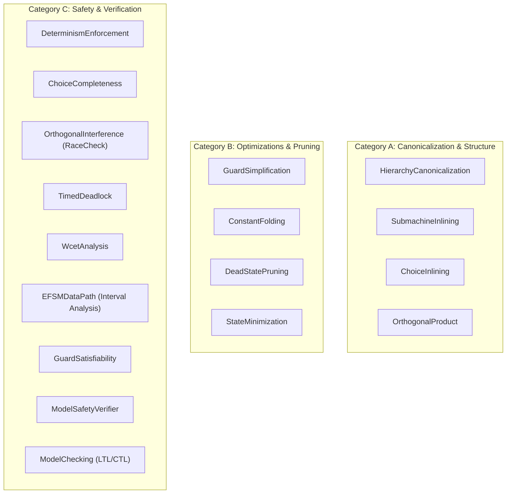

# Middle-End Optimization & Transformation Passes

The `fsmc` middle-end operates directly on the canonical Intermediate Representation (**`FsmIr`**). It decouples language frontends and code generation backends by providing a modular, extensible pipeline for AST optimization, reachability pruning, formal analysis, and custom toolchain integration.

---

## 1. Architecture: The `PassManager`

Every compiler execution or linter invocation passes through the **`PassManager`** (`include/fsm/middleend/pass_manager.hpp`). Passes implement the `IPass` interface:

```cpp
class IPass {
public:
    virtual ~IPass() = default;
    [[nodiscard]] virtual std::string name() const = 0;
    [[nodiscard]] virtual std::string description() const = 0;
    virtual bool run(FsmIr& ir, DiagnosticEngine& diag) = 0;
};
```

### Compiler Optimization Levels
`fsmc` automatically configures the middle-end pass pipeline based on optimization flags:

| Optimization Level | Configured Passes | Primary Purpose |
| :--- | :--- | :--- |
| **`-O0, --no-opt`** | Only `HierarchyCanonicalization` | Raw translation directly preserving input AST structure for debugging. |
| **`-O1` (Default)** | Canonicalization, Guard Simplification, Determinism, Race Checks, Choice Completeness, Model Checking | Standard safety checks, invariant validation, and algebraic boolean simplification. |
| **`-O2, --optimize`** | All `-O1` passes + `ConstantFolding`, `DeadStatePruning`, `WcetAnalysis`, and optionally `StateMinimization` | Aggressive code size reduction, removal of dead states, and worst-case execution time bounds. |

You can also run custom pass sequences using `fsm-opt`:
```bash
fsm-opt -i model.sysml --passes=canonicalize,constant-folding,dead-state-pruning -o optimized.json
```

---

## 2. Comprehensive Pass Reference

`fsmc` provides 17 built-in middle-end passes organized into three primary categories:



---

### Category A: Structural Canonicalization & Normalization

#### 1. `canonicalize` (`HierarchyCanonicalizationPass`)
* **What it does**: Computes deterministic 64-bit FNV-1a identifiers, normalizes Fully Qualified Names (`FQN`, e.g. `"Operating.Running.Active"`), reconciles parent-child relationships, and sorts all states and transitions into deterministic order.
* **Why it matters**: Guarantees bit-for-bit reproducible code generation across different operating systems, file systems, and compiler toolchains.

#### 2. `submachine-inlining` (`SubmachineInliningPass`)
* **What it does**: Inlines external reusable statecharts referenced via `SubmachineRef` directly into the parent statechart hierarchy.
* **Transformation**: Clones submachine state nodes with scoped FQN prefixes (`"ParentState::SubState"`), rewires entry and exit connection points, and maps parameter ports.

#### 3. `choice-inlining` (`ChoiceInliningPass`)
* **What it does**: Collapses dynamic choice (`Choice`) and junction (`Junction`) pseudostates into direct composite transitions.
* **Transformation**: Replaces incoming edge $S \xrightarrow{E} C$ and outgoing branch $C \xrightarrow{[G] / A} T$ with a single fused transition $S \xrightarrow{E [G] / A} T$.

#### 4. `orthogonal-product` (`OrthogonalProductPass`)
* **What it does**: Expands parallel orthogonal regions within a composite state into their flattened **Cartesian product state graph**.
* **Transformation**: Given orthogonal regions with states $\{A_1, A_2\}$ and $\{B_1, B_2\}$, synthesizes equivalent product states $\{A_1\_B_1, A_1\_B_2, A_2\_B_1, A_2\_B_2\}$ while synchronizing shared triggers and interleaving asynchronous event transitions.

---

### Category B: Optimizations & Dead Code Pruning

#### 5. `guard-simplification` (`GuardSimplificationPass`)
* **What it does**: Performs bottom-up algebraic boolean rewriting on transition guard ASTs.
* **Rules Applied**:
  * Double negation elimination: `not(not(A)) ==> A`
  * Tautology absorption: `A and true ==> A`, `A or false ==> A`
  * Annihilation: `A and false ==> false`, `A or true ==> true`
  * De Morgan's laws: `not(A and B) ==> not(A) or not(B)`

#### 6. `constant-folding` (`ConstantFoldingPass`)
* **What it does**: Statically evaluates compile-time constant expressions in guards and propagates register values.
* **Transformation**:
  * Trivial tautologies like `[1 == 1]` or `[true]` are removed, turning guarded transitions into unconditional transitions.
  * Static contradictions like `[0 == 1]` or `[false]` are flagged and the transition is eliminated from the graph.
  * Integer constant arithmetic expressions (`[5 > 3]`) are folded at compile time.

#### 7. `dead-state-pruning` (`DeadStatePruningPass`)
* **What it does**: Performs a forward Breadth-First Search (BFS) reachability traversal starting from the root initial state.
* **Transformation**: Any state node or transition edge that cannot be reached through any sequence of valid transitions is removed from `FsmIr`, eliminating unused dead code in generated C++ binaries.

#### 8. `state-minimization` (`StateMinimizationPass`)
* **What it does**: Applies Hopcroft/Moore equivalence partitioning to minimize the total number of states in deterministic subgraphs.
* **Transformation**: Identifies **bisimilar states**—states that have identical outgoing transition structures, identical guard predicates, and identical action side-effects—and merges them into a single canonical state, reducing runtime code and memory footprints.

---

### Category C: Safety, Concurrency & Verification

#### 9. `determinism` (`DeterminismEnforcementPass`)
* **What it does**: Validates transition determinism across competing outgoing branches.
* **Diagnostics**: Emits diagnostic errors if two transitions from the same source state share identical event triggers and overlapping guard conditions without an explicit priority hierarchy.

#### 10. `choice-completeness` (`ChoiceCompletenessPass`)
* **What it does**: Inspects every choice pseudostate to verify that all outgoing branch conditions are mutually exclusive and that an unconditional fallback branch (`else`, `otherwise`, or `default`) is present.
* **Diagnostics**: Emits warning `W0103: Choice pseudostate lacks fallback branch (potential stall)`.

#### 11. `race-check` (`OrthogonalInterferencePass`)
* **What it does**: Performs static data-race analysis across concurrent orthogonal regions.
* **Diagnostics**: Detects when two parallel regions contain transition actions that write to the same register or output port without synchronization.

#### 12. `timed-deadlock` (`TimedDeadlockPass`)
* **What it does**: Analyzes timed dwell transitions (`after(duration)`).
* **Diagnostics**: Detects zero-duration timers, instantaneous self-loops leading to infinite CPU starvation, and racing timer invariants where timeout deadlines expire simultaneously.

#### 13. `wcet-analysis` (`WcetAnalysisPass`)
* **What it does**: Calculates the **Worst-Case Execution Time (WCET)** bound for transition cascades.
* **Analysis**:
  * Analyzes zero-time micro-step cascades (immediate transitions executed within a single cycle).
  * Detects **Zeno-cycles** (infinite loops that consume zero model time, stalling the real-time scheduler).
  * Annotates each state with its maximum micro-step depth bound (`wcet_microstep_bound`).

#### 14. `efsm-data-path` (`EFSMDataPathPass`)
* **What it does**: Uses abstract interpretation over interval domains $[\text{min}, \text{max}]$ to evaluate data dependencies between typed input ports, memory registers, and transition guards.
* **Diagnostics**: Detects dead transitions whose guard intervals fall completely outside the port's constrained hardware domain.

#### 15. `guard-satisfiability` (`GuardSatisfiabilityPass`)
* **What it does**: Formulates boolean guard constraints into an SMT satisfiability problem.
* **Diagnostics**: Flags logically unsatisfiable compound conditions (e.g. `[x > 10 and x < 5]`).

#### 16. `safety-verifier` (`ModelSafetyVerifierPass`)
* **What it does**: Validates basic topological graph invariants (root reachability, absence of trap states, and termination state consistency).

#### 17. `model-checking` (`ModelCheckingPass`)
* **What it does**: Evaluates formal temporal logic formulas (LTL and CTL properties declared via `@fsm:property`) against the finite Kripke transition graph.

---

## 3. Extensibility: Custom Toolchain Pipelines

`fsmc` provides two distinct extension mechanisms for injecting custom analysis tools, enterprise linters, and proprietary transformations into the compiler pipeline without modifying the core codebase:

### Mechanism A: The Unix Filter Pipeline (`--pipe-through`)

The `--pipe-through <command>` flag serializes `FsmIr` into standard JSON, pipes it via standard input (`stdin`) to an external script or executable, captures the modified JSON from standard output (`stdout`), and deserializes it back into the pipeline:

```
[ Frontend Parser ] ──▶ FsmIr ──▶ JsonSerializer ──(stdin)──▶ [ Your External Script ]
                                                                        │
[ C++ Codegen ]     ◀── FsmIr ◀── JsonParser     ◀──(stdout)────────────┘
```

#### Example: Python Safety Linter (`custom_audit.py`)
```python
#!/usr/bin/env python3
import sys
import json

# 1. Read canonical FsmIr JSON from stdin
model = json.load(sys.stdin)

# 2. Inspect or mutate AST (e.g. inject an audit tag into every state)
for state in model.get("states", []):
    if state["name"] == "Emergency":
        state["description"] = "AUDITED_SAFETY_CRITICAL"

# 3. Write modified JSON back to stdout
json.dump(model, sys.stdout)
```

#### Running the Pipeline:
```bash
fsmc -i model.sysml --pipe-through "python3 custom_audit.py" -o model.hpp
```

---

### Mechanism B: Dynamic C++ Pass Plugins (`--load-pass-plugin`)

For high-performance transformations, custom AST analyses, or proprietary optimizations, `fsmc` can load compiled C++ shared libraries (`.so` / `.dylib`) dynamically at runtime via `dlopen`/`dlsym`:

#### 1. Implement Custom Pass (`CustomLoggingPass.cpp`):
```cpp
#include <iostream>
#include "fsm/middleend/pass_manager.hpp"

class CustomLoggingPass : public fsm::middleend::IPass {
public:
    [[nodiscard]] std::string name() const override { return "CustomLoggingPass"; }
    [[nodiscard]] std::string description() const override {
        return "Prints a summary of all high-priority states to standard output";
    }

    bool run(fsm::ir::FsmIr& ir, fsm::diagnostic::DiagnosticEngine& diag) override {
        std::cout << "[PLUGIN] Auditing FSM: " << ir.name << " with " 
                  << ir.states.size() << " states.\n";
        return true;
    }
};

// Required plugin registration symbol
extern "C" void fsmc_register_passes(fsm::middleend::PassManager& pm) {
    pm.add_pass(std::make_unique<CustomLoggingPass>());
}
```

#### 2. Compile into Shared Library:
```bash
g++ -std=c++17 -shared -fPIC -I/usr/local/include CustomLoggingPass.cpp -o libcustom_pass.so
```

#### 3. Execute with `fsmc` or `fsm-opt`:
```bash
fsmc -i model.sysml --load-pass-plugin ./libcustom_pass.so -o output.hpp
```

The plugin pass executes seamlessly within the compiler pipeline, participating in diagnostics and stats reporting.
