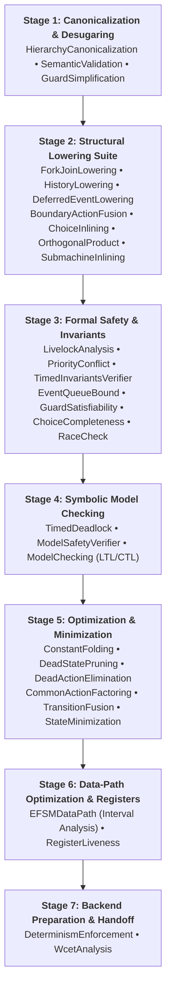

# Middle-End Optimization & Transformation Passes

The `fsmc` middle-end operates directly on the canonical Intermediate Representation (**`FsmIr`**). It decouples language frontends and code generation backends by providing a modular, extensible pipeline for AST optimization, reachability pruning, formal analysis, and custom toolchain integration.

---

## 1. Architecture: The `PassManager`

Every compiler execution or linter invocation passes through the **`PassManager`** (`include/fsm/middleend/pass_manager.hpp`). Passes implement the `IPass` interface:

```cpp
class IPass {
public:
    virtual ~IPass() = default;
    [[nodiscard]] virtual std::string name() const = 0;
    [[nodiscard]] virtual std::string description() const = 0;
    virtual bool run(FsmIr& ir, DiagnosticEngine& diag) = 0;
};
```

### Compiler Optimization Levels
`fsmc` automatically configures the middle-end pass pipeline based on optimization flags:

| Optimization Level | Configured Passes | Primary Purpose |
| :--- | :--- | :--- |
| **`-O0, --no-opt`** | Only `HierarchyCanonicalization` | Raw translation directly preserving input AST structure for debugging. |
| **`-O1` (Default)** | Canonicalization, Guard Simplification, Determinism, Race Checks, Choice Completeness, Model Checking | Standard safety checks, invariant validation, and algebraic boolean simplification. |
| **`-O2, --optimize`** | All `-O1` passes + `ConstantFolding`, `DeadStatePruning`, `WcetAnalysis`, and optionally `StateMinimization` | Aggressive code size reduction, removal of dead states, and worst-case execution time bounds. |

You can also run custom pass sequences using `fsm-opt`:
```bash
fsm-opt -i model.sysml --passes=canonicalize,constant-folding,dead-state-pruning -o optimized.json
```

---

### 2. Comprehensive Pass Reference: The 7-Stage Pipeline

`fsmc` provides 28 built-in middle-end passes organized across a verified 7-stage compilation pipeline (`PassManager::create_verified_7stage_pipeline`):



---

### Stage 1: Structural Canonicalization & Desugaring

#### 1. `canonicalize` (`HierarchyCanonicalizationPass`)
* **What it does**: Computes deterministic 64-bit FNV-1a identifiers, normalizes Fully Qualified Names (`FQN`, e.g. `"Operating.Running.Active"`), reconciles parent-child relationships, and sorts all states and transitions into deterministic order.
* **Why it matters**: Guarantees bit-for-bit reproducible code generation across different operating systems, file systems, and compiler toolchains.

#### 2. `semantic-validation` (`SemanticValidationPass`)
* **What it does**: Validates variable and port targets, algebraic assignment semantics, and type resolution across the datapath.

#### 3. `guard-simplification` (`GuardSimplificationPass`)
* **What it does**: Performs bottom-up algebraic boolean rewriting on transition guard ASTs (double negation elimination, tautology absorption, De Morgan's laws).

---

### Stage 2: Structural Lowering Suite

#### 4. `fork-join-lowering` (`ForkJoinLoweringPass`)
* **What it does**: Lowers fork splits and join rendezvous barriers into product-state transitions or validates rendezvous preconditions.

#### 5. `history-lowering` (`HistoryLoweringPass`)
* **What it does**: Lowers shallow history `[H]` and deep history `[H*]` pseudostates into shadow state register memory.

#### 6. `deferred-event-lowering` (`DeferredEventLoweringPass`)
* **What it does**: Lowers deferred event declarations into static bounded FIFO queues with automated cascade replay upon state exit.

#### 7. `boundary-action-fusion` (`BoundaryActionFusionPass`)
* **What it does**: Flattens hierarchical transition boundaries into Lowest Common Ancestor (LCA) sequences: source exit path $\to$ transition action $\to$ target entry path. Clears lowered state hooks to eliminate duplicate action executions.

#### 8. `choice-inlining` (`ChoiceInliningPass`)
* **What it does**: Collapses dynamic choice (`Choice`) and junction (`Junction`) pseudostates into direct composite guarded transitions.

#### 9. `inline-submachines` (`SubmachineInliningPass`)
* **What it does**: Inlines external reusable statecharts referenced via `SubmachineRef` directly into the parent statechart hierarchy.

#### 10. `orthogonal-product` (`OrthogonalProductPass`)
* **What it does**: Expands parallel orthogonal regions into their flattened **Cartesian product state graph** ($S_A \times S_B$) with intra-region transition isolation, action deduplication, and protection against combinatorial explosion (`EORTHO003`, default bound: 1024 states).

---

### Stage 3: Formal Safety & Invariant Verification

#### 11. `livelock-analysis` (`LivelockAnalysisPass`)
* **What it does**: Detects non-progressive internal transition cycles that starve external event ingestion.

#### 12. `priority-conflict-check` (`PriorityConflictPass`)
* **What it does**: Verifies hierarchical preemption determinism and unambiguous priority resolution across nested states.

#### 13. `timed-invariants-verifier` (`TimedInvariantsVerifierPass`)
* **What it does**: Statically verifies clock invariants and maximum state residence times against outgoing deadlines.

#### 14. `event-queue-bound` (`EventQueueBoundPass`)
* **What it does**: Computes static upper bounds on required asynchronous event queue depths to prevent runtime buffer overflow.

#### 15. `guard-satisfiability` (`GuardSatisfiabilityPass`)
* **What it does**: Analyzes guard predicates for logical contradictions (e.g. `[x > 10 and x < 5]`) using SMT and domain solvers.

#### 16. `choice-completeness` (`ChoiceCompletenessPass`)
* **What it does**: Verifies that outgoing choice branches form an exhaustive cover (e.g. via an `[else]` branch), preventing unhandled execution stalls.

#### 17. `race-check` (`OrthogonalInterferencePass`)
* **What it does**: Performs static data-race analysis across concurrent orthogonal regions, detecting conflicting variable assignments and uncoordinated port writes.

---

### Stage 4: Symbolic Model Checking

#### 18. `timed-deadlock` (`TimedDeadlockPass`)
* **What it does**: Detects temporal deadlock traps, 0ms timeout cycles, and racing timer deadlines.

#### 19. `safety-verifier` (`ModelSafetyVerifierPass`)
* **What it does**: Validates basic topological graph invariants (root reachability, absence of trap states, and termination consistency).

#### 20. `model-checking` (`ModelCheckingPass`)
* **What it does**: Evaluates formal temporal logic formulas (LTL and CTL properties declared via `@fsm:property` or CLI) against the finite Kripke transition graph.

---

### Stage 5: Optimization & Dead Code Pruning

#### 21. `constant-folding` (`ConstantFoldingPass`)
* **What it does**: Folds constant boolean/arithmetic expressions, propagates register values, and prunes dead transitions.

#### 22. `dead-state-pruning` (`DeadStatePruningPass`)
* **What it does**: Eliminates unreachable states and statically dead transitions from the model graph.

#### 23. `dead-action-elimination` (`DeadActionEliminationPass`)
* **What it does**: Performs dead store elimination (DSE) across datapath registers and local variables.

#### 24. `common-action-factoring` (`CommonActionFactoringPass`)
* **What it does**: Factors identical action sequences across convergent or divergent transition edges to minimize generated code footprint.

#### 25. `transition-fusion` (`TransitionFusionPass`)
* **What it does**: Fuses deterministic zero-time micro-steps into atomic macro-transitions.

#### 26. `state-minimization` (`StateMinimizationPass`)
* **What it does**: Partitions bisimilar states via Hopcroft/Moore equivalence partitioning to minimize ROM/Flash footprint.

---

### Stage 6: Data-Path Optimization & Register Allocation

#### 27. `efsm-data-path` (`EFSMDataPathPass`)
* **What it does**: Evaluates extended finite state variables using abstract interpretation over numerical intervals to prove guard reachability and contract satisfaction.

#### 28. `register-liveness` (`RegisterLivenessPass`)
* **What it does**: Analyzes variable liveness intervals and builds interference graphs for optimal register reuse.

---

### Stage 7: Backend Preparation & Code Emitter Handoff

* **`determinism` (`DeterminismEnforcementPass`)**: Enforces deterministic event dispatch and total preemption ordering.
* **`wcet-analysis` (`WcetAnalysisPass`)**: Evaluates micro-step cascade bounds and proves absence of zero-time Zeno cycles.

---

## 3. Extensibility: Custom Toolchain Pipelines

`fsmc` provides two distinct extension mechanisms for injecting custom analysis tools, enterprise linters, and proprietary transformations into the compiler pipeline without modifying the core codebase:

### Mechanism A: The Unix Filter Pipeline (`--pipe-through`)

The `--pipe-through <command>` flag serializes `FsmIr` into standard JSON, pipes it via standard input (`stdin`) to an external script or executable, captures the modified JSON from standard output (`stdout`), and deserializes it back into the pipeline:

```
[ Frontend Parser ] ──▶ FsmIr ──▶ FsmIrSerializer::serialize_json ──(stdin)──▶ [ Your External Script ]
                                                                                         │
[ C++ Codegen ]     ◀── FsmIr ◀── FsmIrDeserializer::deserialize_json ◀──(stdout)──────────┘
```

#### Example: Python Safety Linter (`custom_audit.py`)
```python
#!/usr/bin/env python3
import sys
import json

# 1. Read canonical FsmIr JSON from stdin
model = json.load(sys.stdin)

# 2. Inspect or mutate AST (e.g. inject an audit tag into every state)
for state in model.get("states", []):
    if state["name"] == "Emergency":
        state["description"] = "AUDITED_SAFETY_CRITICAL"

# 3. Write modified JSON back to stdout
json.dump(model, sys.stdout)
```

#### Running the Pipeline:
```bash
fsmc -i model.sysml --pipe-through "python3 custom_audit.py" -o model.hpp
```

---

### Mechanism B: Dynamic C++ Pass Plugins (`--load-pass-plugin`)

For high-performance transformations, custom AST analyses, or proprietary optimizations, `fsmc` can load compiled C++ shared libraries (`.so` / `.dylib`) dynamically at runtime via `dlopen`/`dlsym`:

#### 1. Implement Custom Pass (`CustomLoggingPass.cpp`):
```cpp
#include <iostream>
#include "fsm/middleend/pass_manager.hpp"

class CustomLoggingPass : public fsm::middleend::IPass {
public:
    [[nodiscard]] std::string name() const override { return "CustomLoggingPass"; }
    [[nodiscard]] std::string description() const override {
        return "Prints a summary of all high-priority states to standard output";
    }

    bool run(fsm::ir::FsmIr& ir, fsm::diagnostic::DiagnosticEngine& diag) override {
        std::cout << "[PLUGIN] Auditing FSM: " << ir.name << " with " 
                  << ir.states.size() << " states.\n";
        return true;
    }
};

// Required plugin registration symbol
extern "C" void fsmc_register_passes(fsm::middleend::PassManager& pm) {
    pm.add_pass(std::make_unique<CustomLoggingPass>());
}
```

#### 2. Compile into Shared Library:
```bash
g++ -std=c++17 -shared -fPIC -I/usr/local/include CustomLoggingPass.cpp -o libcustom_pass.so
```

#### 3. Execute with `fsmc` or `fsm-opt`:
```bash
fsmc -i model.sysml --load-pass-plugin ./libcustom_pass.so -o output.hpp
```

The plugin pass executes seamlessly within the compiler pipeline, participating in diagnostics and stats reporting.
