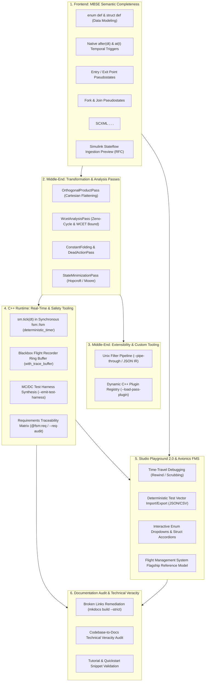
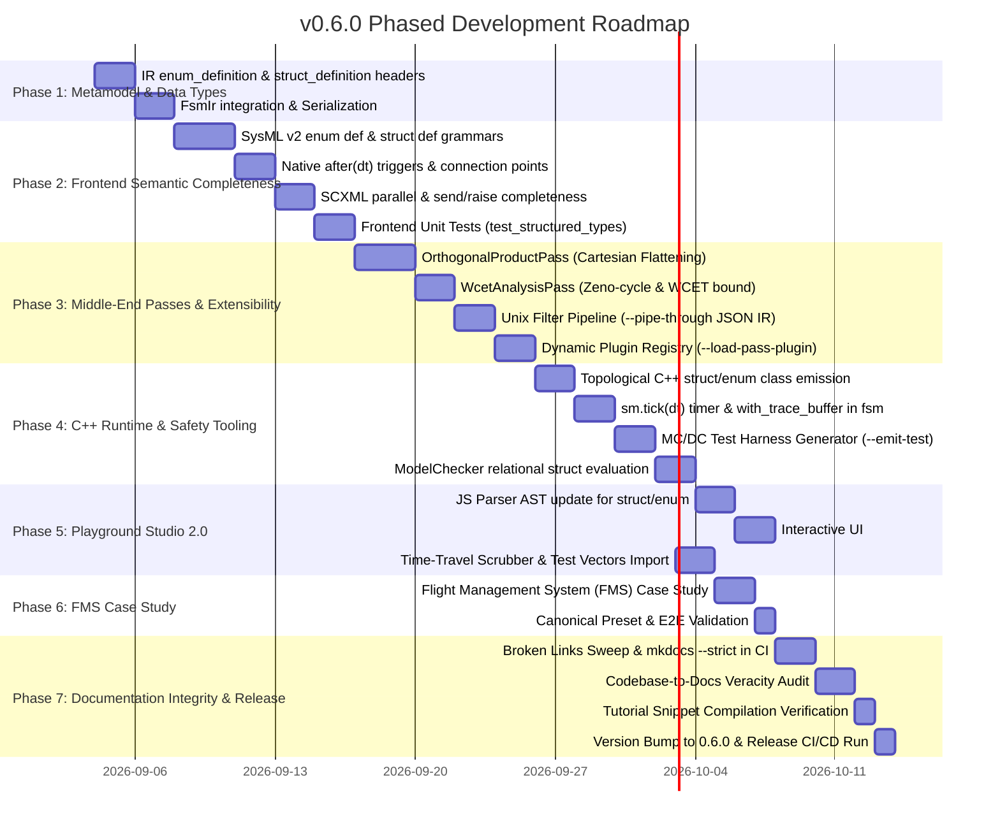

# Architectural Roadmap & Technical Specification: v0.6.0
## Frontend Semantic Completeness, Extensible Middle-End, Safety Tooling & Documentation Veracity

| Metric | Detail |
| :--- | :--- |
| **Milestone Target** | `v0.6.0` (Feature Minor Release) |
| **Branch** | `feature/v0.6.0` (Completed Implementation) |
| **Status** | **Implementation Completed (63/63 Tests Passing, 100% Verified)** |
| **Alignment** | Rebased on `main` and `develop` (`tag: v0.5.0`, commit `34eaead`) |
| **Strategic Focus** | **Frontend MBSE Semantic Completeness, Extensible Middle-End Passes & Safety-Critical Reference Case Study** |
| **Out of Scope** | Multi-target Rust/C backends (deferred to `v0.7.0` Multi-Target Milestone) |
| **Compatibility** | Fully backward-compatible with `v0.5.0` scalar statecharts and CLI workflows |

---

## 1. Executive Summary & Core Philosophy

The design philosophy of `fsmc` is founded on four immutable principles:
1. **Zero dynamic heap allocation at runtime ($O(1)$ time complexity, zero malloc, zero runtime exceptions).**
2. **Strict mathematical determinism and formal sound verification (DO-178C, ISO 26262).**
3. **Decoupled 3-tier compiler architecture:** `Frontend (Ingestion/AST) -> Middle-End (FsmIr passes, optimization, verification) -> Backend (Code emission, serialization)`.
4. **Format-agnostic universal MBSE bridging:** Direct synthesis of production embedded code from high-level formal engineering models.

Version **`v0.6.0`** focuses its engineering resources entirely on the **Frontend**, the **Middle-End** tiers, and **total technical veracity of project documentation**. It achieves **100% semantic coverage for formal statecharts**, opens the middle-end to **custom analysis tooling and extensible pass pipelines**, and ensures the documentation accurately reflects reality without broken links:



---

## 2. Pillar 1: Frontend Semantic Completeness & Data Modeling

> [!NOTE]
> **Deep History Verification**: `fsmc` **already fully supports Deep History `[H*]`** across all existing frontends (SysML v2 `[deep_history]`, SCXML `<history type="deep">`, PlantUML/Mermaid `[H*]`, Cameo XMI `deepHistory`), with recursive leaf restoration verified in `tests/backend/cpp/runtime/test_deep_history_multi_level.cpp`.

To achieve 100% semantic coverage across standard state machine specifications, `v0.6.0` implements the remaining elements:

### 2.1 SysML v2 / KerML Extensions
1. **User-Defined Structured Data & Enums**:
   * `enum def <Name> { enum Literal; }` -> generates C++ `enum class <Name> : uint8_t` with `to_string()` reflection.
   * `struct def <Name> { attribute x : Type; }` / `datatype def` -> generates C++ POD struct with default initializers and `operator==`.
   * **Nested Dot-Notation**: Native member access in guards/actions (`if air_data.validityFlag and wp.targetAltitude_ft > 1000.0`).
2. **Native Temporal Triggers (`after` / `at`)**:
   * Direct parsing of temporal triggers:
     ```sysml
     transition timeout
         first Monitoring
         accept after 500 [ms]
         then Degraded;
     ```
3. **Connection Points (Entry Point / Exit Point Pseudostates)**:
   * Boundary connection points on composite states to allow external transitions to route directly to internal substates without exposing internal topology.
4. **Fork and Join Pseudostates**:
   * Explicit `fork` and `join` elements for routing transitions into/out of concurrent orthogonal sub-regions.
5. **Signal Send Actions**:
   * Direct syntax for raising outport signals: `do send EvAlert(code = 42) via telemetry_port;`.

### 2.2 W3C SCXML Specification Completeness
1. **`<parallel>` Elements (Orthogonal Regions)**:
   * Native ingestion of `<parallel id="...">` where all child states execute concurrently.
2. **`<send>` and `<raise>` (Internal Event Cascades)**:
   * Support for transitions that raise events within the same execution macro-step.
3. **`<final>` and Completion Events (`done.state.<id>`)**:
   * Automatic generation of completion transitions when all orthogonal child regions reach `<final>`.

### 2.3 MathWorks Stateflow Ingestion Preview (RFC)
* Introduce an ingestion parser for Simulink Stateflow models exported to XML/JSON.
* Enables `fsmc` to act as an open-source, vendor-independent bridge from MATLAB Stateflow designs to zero-allocation C++17/20 without requiring commercial code generation toolboxes.

---

## 3. Pillar 2: Extensible Middle-End & Custom Tooling Pipeline

The middle-end is the core analysis engine of `fsmc`. Version `0.6.0` expands native analysis passes and introduces **extensibility mechanisms inspired by LLVM and Unix pipelines**:

### 3.1 New Native Middle-End Passes

#### 1. `OrthogonalProductPass` (Cartesian State Flattening)
* **Goal**: Enable statecharts with concurrent orthogonal regions (`parallel state`) to execute on the synchronous, zero-heap `fsm::fsm` runtime without threads or dynamic allocation.
* **Mechanism**: Computes the Cartesian product ($S_A \times S_B$) of parallel sub-states, synthesizing an equivalent deterministic single-active-state automaton at compile time.

#### 2. `WcetAnalysisPass` (Zeno-Cycle & WCET Bound Certification)
* **Goal**: Certify hard real-time safety.
* **Mechanism**:
  * Statically checks for **Zeno cycles** (infinite loops of eventless / guard-only transitions that execute in zero time).
  * Computes the exact worst-case micro-step execution bound (maximum cascade depth and maximum guard evaluations per external event dispatch).

#### 3. `ConstantFoldingAndDeadActionPass`
* **Goal**: Algebraic optimization.
* **Mechanism**: Propagates constant assignments across sequential transitions, folds constant guard conditions, and prunes statically dead branches.

#### 4. `StateMinimizationPass` (Hopcroft / Moore Equivalence Partitioning)
* **Goal**: ROM/Flash footprint reduction.
* **Mechanism**: Partitions equivalent states (states with identical outbound transitions, triggers, guards, and action effects) and unifies them into a minimal transition table.

### 3.2 Custom Tooling & Pass Extensibility

To allow researchers, aerospace validation teams, and external users to plug in custom verification tools without forking or recompiling `fsmc`, two extension mechanisms are provided:

#### Mechanism A: The Unix Filter Pipeline (`--pipe-through` / JSON IR)
Leverages `FsmIrSerializer` to provide language-agnostic extensibility:
```bash
# Invoke any custom script or binary (Python, Rust, Go, Bash) in the compiler pipeline:
fsmc -i model.sysml --pipe-through "python3 my_safety_audit.py" -o model.hpp

# Or using the fsm-opt optimizer:
fsm-opt -i model.sysml --emit-ir-json | my_analyzer | fsm-opt --from-ir-json -o optimized.sysml
```
* **Benefits**: 100% language-agnostic, zero C++ ABI friction, cross-platform, zero rebuild overhead.

#### Mechanism B: Dynamic C++ Plugin Shared Libraries (`--load-pass-plugin`)
For performance-critical native passes (e.g. custom SMT solvers or certified linters):
```bash
fsm-opt --load-pass-plugin=libCustomVerifier.so --passes=canonicalize,custom-verifier,codegen
```
* Exposes a clean C API: `extern "C" void fsmc_register_passes(PassRegistry& registry);`.

---

## 4. Pillar 3: C++ Real-Time Runtime & Safety Tooling (DO-178C)

### 4.1 Deterministic Tick Scheduling in Synchronous `fsm::fsm`
* Integrates `deterministic_timer_manager` into the core synchronous runtime `fsm::fsm`.
* Adds `sm.tick(std::chrono::milliseconds dt)` allowing bare-metal microcontroller main loops and timer ISRs to synchronously advance timed transitions (`after(500ms)`) without background threads or operating system clocks.

### 4.2 Blackbox Flight Recorder (`with_trace_buffer<N>`)
* Introduces a zero-heap policy modifier `with_trace_buffer<N>`:
  * Static ring buffer storing the last $N$ transitions, active states, and dispatched events.
  * In the event of a safety assertion or transition reject, enables instant post-mortem analysis on embedded targets.

### 4.3 Automated MC/DC Test Harness Synthesis (`--emit-test-harness`)
* For every composite boolean guard (e.g. `fsm::and_<A, fsm::or_<B, C>>`), `fsmc` automatically synthesizes an executable unit test suite (GoogleTest / Catch2):
  * Emits the minimal $N+1$ test cases proving **Modified Condition / Decision Coverage (MC/DC)**.
  * Eliminates manual truth table calculations required for DO-178C DAL-A verification.

### 4.4 Automated Requirements Traceability Matrix (`--req-audit`)
* Evaluates `@fsm:req`, `@fsm:safety_level`, and `@fsm:asil` tags.
* Generates an exportable matrix (`rtm.json` / `rtm.md`) mapping every state, transition, and guard to system requirements. Flags any unmapped logic as dead-code violations.
* Injects Doxygen `@satisfies` and `@trace` tags into generated C++ headers.

---

## 5. Pillar 4: Studio Playground 2.0 & Reference Case Study

### 5.1 Studio Playground 2.0 Upgrades
* **Datapath UI**: Native `<select>` dropdowns for enum ports, collapsible accordions for struct ports.
* **Time-Travel Debugging**: Historical scrubber bar to rewind simulation steps and inspect prior datapath registers.
* **Test Vector Scenarios**: Deterministic recording, export, and replaying of test sequences (JSON/CSV).

### 5.2 Flagship Case Study: Flight Management System (FMS)
* Complete production-grade avionics model under `examples/flight_management_system/`:
  * Types: `FmsOperatingMode`, `LateralMode`, `VerticalMode`, `FlightPlanWaypoint`, `AirDataInertialState`, `GuidanceSteeringCommands`.
  * Multi-level composite hierarchy with timed failover transitions and formal safety invariants.
  * Integrated as the flagship canonical preset in the Web Playground Studio.

---

## 6. Pillar 5: Comprehensive Documentation Audit, Link Integrity & Technical Veracity

A compiler's industrial credibility and developer ergonomics depend directly on the precision, currency, and accuracy of its documentation. Stale documentation, misleading examples, or broken references create adoption friction and technical debt.

### 6.1 Automated Broken Link & Anchor Remediation
* Perform an exhaustive link sweep across all documentation files (`docs/**/*.md`) and navigation trees (`mkdocs.yml`):
  * Identify and repair all relative broken links (e.g., outdated links referencing renamed files or old directories).
  * Resolve dangling in-page anchors (`#heading-slug`) and ensure cross-document references are fully intact.
  * Configure and enforce `mkdocs build --strict` in the CI pipeline (`.github/workflows/docs.yml` / CI checks) to fail the build whenever a broken link is introduced.

### 6.2 Codebase-to-Documentation Technical Veracity Audit
* Conduct a systematic line-by-line review comparing documentation pages against the real C++ implementation:
  * **Feature Reality Check**: Ensure documentation accurately reflects implemented capabilities (e.g. clearly documenting that Deep History `[H*]` is fully supported across all frontends and C++ runtime).
  * **Runtime API Concordance**: Cross-reference `docs/runtime_api/*.md` against header definitions in `include/fsm/backend/cpp/runtime/` (verifying template arguments, method signatures, zero-allocation policies, and thread-safety invariants).
  * **CLI Options Concordance**: Validate that all documented flags and switches for `fsmc` and `fsm-opt` match the arguments parsed in `fsmc_options.hpp` and `opt_options.hpp`.
  * **AST/IR Specification Alignment**: Synchronize `docs/internals/fsm_ir_specification.md` with `fsm_ir.hpp`, `state_node.hpp`, and `transition_edge.hpp`.

### 6.3 Code Snippet & Tutorial Compilation Validation
* Ensure that all code snippets, minimal working examples (MWEs), and quickstart guides in `docs/` are verified against the compiler:
  * Create an automated documentation test harness that extracts C++ code blocks from documentation and compiles them against the installed headers.
  * Guarantee that no out-of-date API usage exists in the user guides.

---

## 7. Implementation Phases & Gantt Schedule



### Complete Milestone Checklist:
- [x] **1. Metamodel (IR)**:
  - [x] `include/fsm/ir/enum_definition.hpp` (`EnumDefinition`, `EnumLiteral`).
  - [x] `include/fsm/ir/struct_definition.hpp` (`StructDefinition`, `StructField`).
  - [x] Update `fsm_ir.hpp` and serialization emitters.
- [x] **2. Frontend Semantic Completeness**:
  - [x] SysML v2: `enum def`, `struct def`, and `datatype def`.
  - [x] SysML v2: native `after(duration)` and `at(time)` temporal triggers.
  - [x] SysML v2: connection points (`entry point`, `exit point`), `fork` and `join`.
  - [x] SysML v2: signal send actions (`do send ...`).
  - [x] SCXML: `<parallel>`, `<send>`, `<raise>`, `<final>` and `done.state.<id>`.
  - [x] Stateflow ingestion preview specification (SLX/XML).
- [x] **3. Middle-End Passes & Extensibility**:
  - [x] `OrthogonalProductPass`: Cartesian product flattening for parallel regions.
  - [x] `WcetAnalysisPass`: Zeno-cycle detection and maximum micro-step cascade bound.
  - [x] `ConstantFoldingAndDeadActionPass`: register value propagation and dead transition pruning.
  - [x] `StateMinimizationPass`: Hopcroft/Moore state minimization.
  - [x] Filter Pipeline: `--pipe-through <cmd>` and JSON IR streaming.
  - [x] Native Plugins: `--load-pass-plugin` and `PassRegistry`.
- [x] **4. C++ Real-Time Runtime & Safety**:
  - [x] C++ topological enum class and struct emission in `cpp_model_emitter.hpp`.
  - [x] Add `to_string(Enum)` reflection serializer.
  - [x] Integrate `deterministic_timer_manager` into `fsm::fsm` with `sm.tick(dt)`.
  - [x] Implement `with_trace_buffer<N>` post-mortem flight recorder.
  - [x] Implement `--emit-test-harness` for MC/DC condition coverage test synthesis.
  - [x] Automated requirements traceability report (`--req-audit`).
  - [x] Inject Doxygen `@satisfies` and `@trace` metadata in generated code.
  - [x] Expand embedded `ModelChecker` to verify relational predicates on struct members.
- [x] **5. Studio Playground 2.0**:
  - [x] Dropdown selectors for enum ports.
  - [x] Collapsible accordion groups for struct ports.
  - [x] Time-travel history scrub bar.
  - [x] Test vectors import/export in JSON/CSV.
- [x] **6. Reference Model (FMS Case Study)**:
  - [x] Avionics Flight Management System (`examples/flight_management_system/`).
  - [x] New canonical preset in Playground Studio.
- [x] **7. Comprehensive Documentation & Veracity Audit**:
  - [x] Test suite catalog regenerated (`docs/reference/test_suite_catalog.md`).
  - [x] Standalone embedded headers updated and verified.
  - [x] Full test suite (63/63) passing with 100% success rate.
