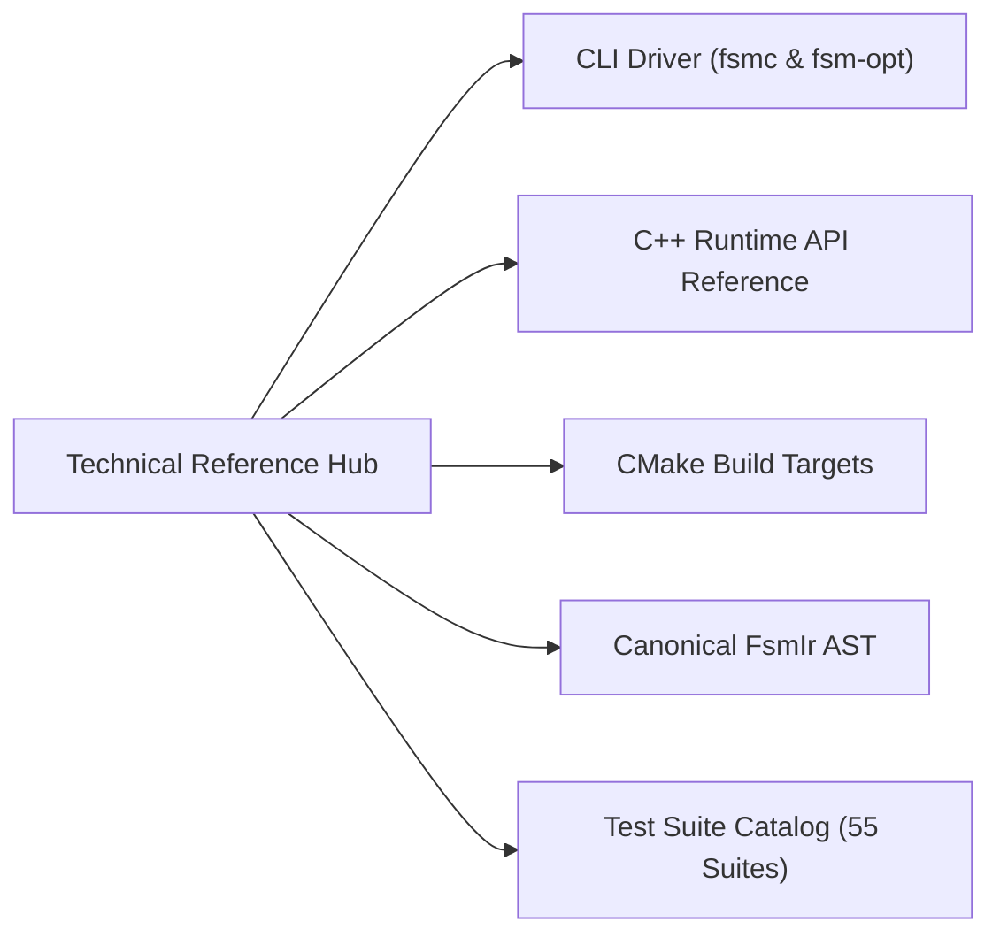

# Technical Reference Hub

Welcome to the **`fsmc` Technical Reference Hub**. This section provides complete, normative, and syntax-level documentation for all compiler interfaces, command-line utilities, runtime types, and formal metamodels.

---

## Reference Chapters

| Document | Scope & Contents | Target Audience |
| :--- | :--- | :--- |
| **[CLI Reference](../getting_started/cli_usage.md)** | Full syntax, options, and optimization flags for `fsmc` and `fsm-opt`. | Developers, Build Engineers |
| **[Runtime C++ API Reference](../runtime_api/reference.md)** | Formal reference for `fsm::fsm`, `fsm::spsc_fsm`, `fsm::thread_safe_fsm`, `fsm::config`, concepts, and traits. | Firmware, Embedded Engineers |
| **[CMake Integration Reference](cmake_integration.md)** | Macro reference (`fsmc_target_sources`), targets, and toolchain variables. | DevOps, System Integrators |
| **[Canonical IR AST Specification](../internals/fsm_ir_specification.md)** | Formal schema and data structures of the canonical `FsmIr` AST representation. | Compiler Contributors |
| **[Master Test Suite Catalog](test_suite_catalog.md)** | Exhaustive traceability catalog of all 55 automated unit and regression test suites. | QA, Safety Auditors |

---

## Quick Navigation

