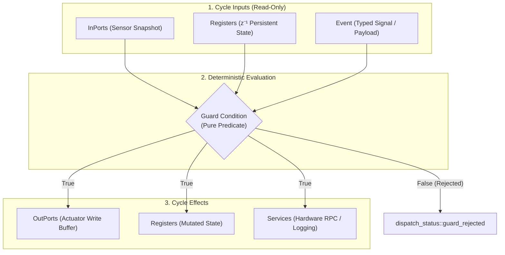
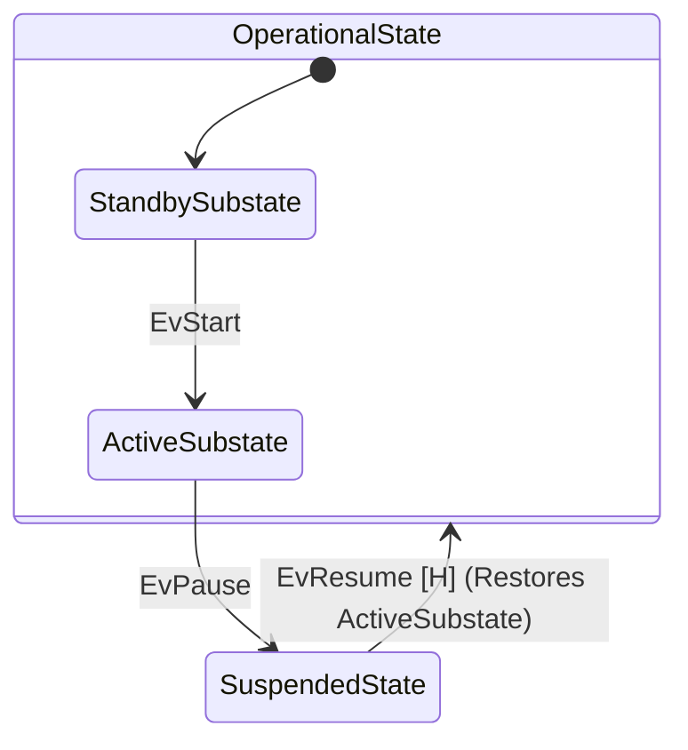

# Universal Runtime Fundamentals

In `fsmc`, all three runtime execution engines ([`fsm::fsm`](synchronous_fsm.md), [`fsm::spsc_fsm`](spsc_fsm.md), and [`fsm::thread_safe_fsm`](thread_safe_fsm.md)) share the exact same foundational building blocks: **States**, **Events**, **Transition Tables**, **Guards**, **Actions**, and the **4-Domain Memory Model**.

Once you define your statechart structure and datapath types, you can deploy them across any of the execution engines with zero changes to your domain logic.

---

## 1. States & Lifecycle Hooks

States in `fsmc` are lightweight C++ struct types. Every state must define a `static constexpr std::string_view name`:

```cpp
struct Idle       { static constexpr std::string_view name = "Idle";       };
struct Running    { static constexpr std::string_view name = "Running";    };
struct FaultState { static constexpr std::string_view name = "FaultState"; };
```

### State Lifecycle Hooks (`on_enter` & `on_exit`)
States can define optional `on_enter` and `on_exit` methods. The runtime automatically invokes them upon state entry and exit.

Like transition actions, lifecycle hooks only need to declare the parameters they actually access:

```cpp
struct Running {
    static constexpr std::string_view name = "Running";

    // Form 1: Zero-argument entry notification
    void on_enter() {
        std::cout << "Entered Running state\n";
    }

    // Form 2: Direct output port actuation on exit
    void on_exit(MotorOutPorts& out) {
        out.motor_enable = false;
        out.target_velocity = 0.0f;
    }

    // Form 3: Full 4-domain entry hook
    template <typename Event, typename InPorts, typename OutPorts, typename Registers, typename Services>
    void on_enter(const Event&, const InPorts& in, OutPorts& out, Registers& reg, Services& srv) {
        out.motor_enable = true;
        reg.cycle_counter++;
        srv.log_info("Running state entered with battery at " + std::to_string(in.battery_percent) + "%");
    }
};
```

---

## 2. Events & Event Payloads

Events are strongly-typed signals passed to the state machine:

- **Signal Triggers (Zero-Payload)**: Empty structs representing pure commands or interrupts.
- **Payload Events**: Structs carrying runtime data (sensor values, network packets, configuration parameters).

```cpp
// 1. Pure signal trigger
struct EvStart {};
struct EvStop  {};

// 2. Event carrying typed payload data
struct EvConfigure {
    std::uint32_t profile_id{0};
    float target_speed{0.0f};
    bool enable_telemetry{false};
};
```

---

## 3. The 4-Domain Segregated Datapath Model

To eliminate monolithic context objects and prevent hidden coupling, `fsmc` strictly partitions state machine interactions into **4 segregated domains**:



| Domain | Lifetime & Mutability | Typical Use Cases | Construction vs Call-Site |
| :--- | :--- | :--- | :--- |
| **`InPorts`** | Read-only input snapshot ($t$) | Sensor readings, ADC values, digital switches | Passed at call site: `dispatch(ev, in, out)` |
| **`OutPorts`** | Single-assignment write buffer | Motor PWM, relay triggers, actuator commands | Passed at call site: `dispatch(ev, in, out)` |
| **`Registers`** | Persistent internal state ($z^{-1}$) | Cycle counters, accumulators, calibrated offsets | Passed at construction: `fsm(reg)` |
| **`Services`** | External environment interface | Hardware drivers, logging, RTOS timer RPCs | Bound at construction `fsm(reg, srv)` or call site |

```cpp
struct MotorInPorts   { float battery_percent{100.0f}; float temperature{25.0f}; };
struct MotorOutPorts  { bool motor_enable{false}; float target_velocity{0.0f};   };
struct MotorRegisters { std::uint32_t cycle_counter{0}; std::uint32_t error_count{0}; };
struct MotorServices  { virtual void log_info(std::string_view msg) = 0; };
```

---

## 4. Flexible Guard Functors & Combinators

Guards are side-effect-free boolean functions evaluated before transitions fire. The runtime uses compile-time introspection (SFINAE / C++20 concepts) so you **only declare the arguments you actually inspect**:

| Guard Signature Form | Target Use Case | Example Functor Signature |
| :--- | :--- | :--- |
| **`()`** | Constant or global flag check | `bool operator()() const noexcept` |
| **`(const Event&)`** | Validates incoming event payload | `bool operator()(const EvConfigure& ev) const` |
| **`(const InPorts&)`** | Sensor threshold evaluation | `bool operator()(const MotorInPorts& in) const` |
| **`(const Registers&)`** | Internal state/counter limit check | `bool operator()(const MotorRegisters& reg) const` |
| **`(const InPorts&, const Registers&)`** | Combined sensor + memory check | `bool operator()(const MotorInPorts& in, const MotorRegisters& reg) const` |
| **Full Tuple** | State-aware and service-aware guard | `bool operator()(const Ev&, const State&, const In&, const Reg&, Srv&) const` |

```cpp
// 1. InPorts Guard
struct BatteryOkGuard {
    constexpr bool operator()(const MotorInPorts& in) const noexcept {
        return in.battery_percent >= 20.0f;
    }
};

// 2. Registers Guard
struct MaxErrorsNotReachedGuard {
    constexpr bool operator()(const MotorRegisters& reg) const noexcept {
        return reg.error_count < 3;
    }
};

// 3. Composable Boolean Algebra Combinators
using SafeToStart = fsm::and_<BatteryOkGuard, MaxErrorsNotReachedGuard>;
using EmergencyCondition = fsm::or_<fsm::not_<BatteryOkGuard>, CriticalFaultGuard>;
```

---

## 5. Flexible Action Effects

Actions execute state machine side-effects when transitions fire. Like guards, action functors only declare the arguments they actually read or mutate:

| Action Signature Form | Target Use Case | Example Functor Signature |
| :--- | :--- | :--- |
| **`()`** | Pure notification or static log | `void operator()() const` |
| **`(Registers&)`** | Mutates internal memory/counters | `void operator()(MotorRegisters& reg) const` |
| **`(OutPorts&)`** | Writes actuator command buffer | `void operator()(MotorOutPorts& out) const` |
| **`(OutPorts&, Services&)`** | Actuator command + driver RPC | `void operator()(MotorOutPorts& out, MotorServices& srv) const` |
| **`(const Event&, Registers&)`** | Stores event payload into registers | `void operator()(const EvConfigure& ev, MotorRegisters& reg) const` |
| **Standard 4-Domain Tuple** | Full reactive execution | `void operator()(const Ev&, const In&, Out&, Reg&, Srv&) const` |

```cpp
// 1. Registers-Only Action (Increment cycle counter)
struct IncrementCycleAction {
    void operator()(MotorRegisters& reg) const noexcept {
        reg.cycle_counter += 1;
    }
};

// 2. OutPorts-Only Action (Disarm hardware)
struct DisarmMotorsAction {
    void operator()(MotorOutPorts& out) const noexcept {
        out.motor_enable = false;
        out.target_velocity = 0.0f;
    }
};

// 3. Full 4-Domain Action
struct ArmAndLogAction {
    void operator()(const EvStart&, const MotorInPorts& in, MotorOutPorts& out, MotorRegisters& reg, MotorServices& srv) const {
        out.motor_enable = true;
        out.target_velocity = 1500.0f;
        reg.cycle_counter += 1;
        srv.log_info("Motors armed with battery at " + std::to_string(in.battery_percent) + "%");
    }
};
```

---

## 6. Transition Tables & Builders

Transition tables define the complete topology of your automaton using compile-time type lists.

### Option A: Standard `fsm::row`
```cpp
using MotorTable = fsm::transition_table<
    // Format: fsm::row<Source, Event, Target>::when<Guard>::then<Action>
    fsm::row<Idle,    EvStart, Running>::when<SafeToStart>::then<ArmAndLogAction>,
    fsm::row<Running, EvStop,  Idle>::then<DisarmMotorsAction>,
    fsm::row<Running, EvTick,  Running>::then<IncrementCycleAction>
>;
```

### Option B: Fluent Builder (`fsm::on`)
```cpp
using MotorTable = fsm::transition_table<
    decltype(fsm::on<EvStart>().from<Idle>().to<Running>().guard<SafeToStart>().action<ArmAndLogAction>()),
    decltype(fsm::on<EvStop>().from<Running>().to<Idle>().action<DisarmMotorsAction>())
>;
```

---

## 7. Hierarchical States & History (`fsm::history`)

To model composite nested states, a substate declares its enclosing parent by defining `static constexpr std::string_view parent`:

```cpp
struct OperationalState {
    static constexpr std::string_view name = "Operational";
};

struct StandbySubstate {
    static constexpr std::string_view name = "Standby";
    static constexpr std::string_view parent = "Operational";
};

struct ActiveSubstate {
    static constexpr std::string_view name = "Active";
    static constexpr std::string_view parent = "Operational";
};
```

### UML Shallow History Restoration (`[H]`)

When resuming an interrupted composite state, use `fsm::history<ParentState, DefaultSubstate>` as the target. The runtime will restore the most recently active direct substate (or fallback to `DefaultSubstate` if never entered before):



```cpp
using HfsmTable = fsm::transition_table<
    fsm::row<StandbySubstate, EvStart, ActiveSubstate>,
    fsm::row<ActiveSubstate,  EvPause, SuspendedState>,
    // Resume restores ActiveSubstate if it was previously running:
    fsm::row<SuspendedState,  EvResume, fsm::history<OperationalState, StandbySubstate>>
>;
```

> [!TIP]
> **Zero-Heap Bounded History Allocation**: The history storage buffer capacity is strictly bounded at compile-time by `count_parent_states_v<Table::states>`, eliminating heap usage and allocating stack storage strictly for composite parents.

---

## 8. Execution Status: `fsm::dispatch_result`

Every `dispatch()` and `step()` call returns a lightweight `dispatch_result` struct detailing the outcome:

```cpp
enum class dispatch_status : std::uint8_t {
    success,        // Transition fired and state changed
    deferred,       // Event deferred by active state
    guard_rejected, // Matching transition found, but guard returned false
    unhandled       // No transition defined for event in active state
};

struct dispatch_result {
    dispatch_status status;
    std::string_view source_state;
    std::string_view target_state;
    bool is_internal;

    [[nodiscard]] constexpr bool is_success() const noexcept;
    [[nodiscard]] constexpr bool is_guard_rejected() const noexcept;
    [[nodiscard]] constexpr bool is_deferred() const noexcept;
    [[nodiscard]] constexpr bool is_unhandled() const noexcept;
    [[nodiscard]] constexpr bool is_ok() const noexcept; // is_success() || is_deferred()
};
```

---

## 9. Next Steps: Selecting an Execution Engine

Now that you understand the shared fundamentals, choose the execution engine that matches your threading model:

1. **[1. Synchronous Core Engine (`fsm::fsm`)](synchronous_fsm.md)**: Direct stack execution on caller's thread for deterministic bare-metal control loops.
2. **[2. Lock-Free SPSC Engine (`fsm::spsc_fsm`)](spsc_fsm.md)**: Wait-free ring buffer for hardware ISRs and single-producer RTOS tasks.
3. **[3. Thread-Safe MPSC Engine (`fsm::thread_safe_fsm`)](thread_safe_fsm.md)**: Multi-producer thread-safe queue with background worker thread, async futures, and delayed timers.
