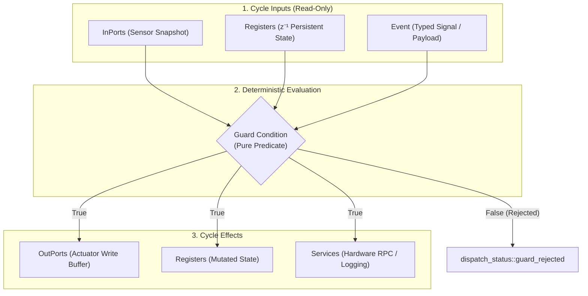
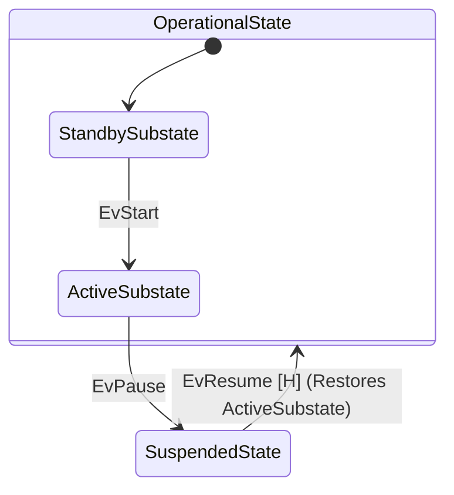
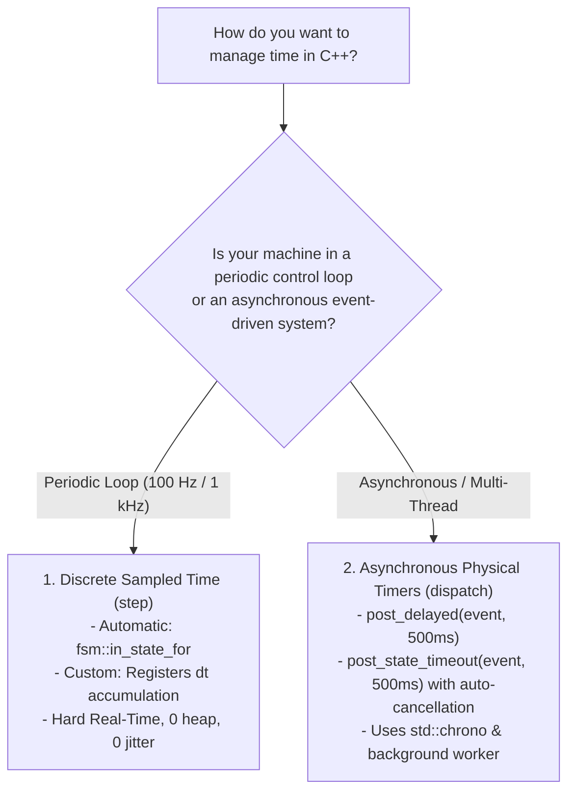

# Universal Runtime Fundamentals

In `fsmc`, all three runtime execution engines ([`fsm::fsm`](synchronous_fsm.md), [`fsm::spsc_fsm`](spsc_fsm.md), and [`fsm::thread_safe_fsm`](thread_safe_fsm.md)) share the exact same foundational building blocks: **States**, **Events**, **Transition Tables**, **Guards**, **Actions**, and the **4-Domain Memory Model**.

Once you define your statechart structure and datapath types, you can deploy them across any of the execution engines with zero changes to your domain logic.

---

## 1. States & Lifecycle Hooks

States in `fsmc` are lightweight C++ struct types. Every state must define a `static constexpr std::string_view name`:

```cpp
struct Idle       { static constexpr std::string_view name = "Idle";       };
struct Running    { static constexpr std::string_view name = "Running";    };
struct FaultState { static constexpr std::string_view name = "FaultState"; };
```

### State Lifecycle Hooks (`on_enter` & `on_exit`)
States can define optional `on_enter` and `on_exit` methods. The runtime automatically invokes them upon state entry and exit:

```cpp
struct Running {
    static constexpr std::string_view name = "Running";

    // 1. Simple notification hook
    void on_enter() {
        std::cout << "Entered Running state\n";
    }

    void on_exit() {
        std::cout << "Exited Running state\n";
    }
};
```

> [!NOTE]
> Like transition actions, lifecycle hooks can also directly accept `OutPorts&`, `Registers&`, or `Services&` once your datapath domains are defined (see **[Section 3: The 4-Domain Datapath Model](#3-the-4-domain-segregated-datapath-model)**).

---

## 2. Events & Event Payloads

Events are strongly-typed signals passed to the state machine:

- **Signal Triggers (Zero-Payload)**: Empty structs representing pure commands or interrupts.
- **Payload Events**: Structs carrying runtime data (sensor values, network packets, configuration parameters).

```cpp
// 1. Pure signal trigger
struct EvStart {};
struct EvStop  {};

// 2. Event carrying typed payload data
struct EvConfigure {
    std::uint32_t profile_id{0};
    float target_speed{0.0f};
    bool enable_telemetry{false};
};
```

---

## 3. The 4-Domain Segregated Datapath Model

To eliminate monolithic context objects and prevent hidden coupling, `fsmc` strictly partitions state machine interactions into **4 segregated domains**:



| Domain | Lifetime & Mutability | Typical Use Cases | Construction vs Call-Site |
| :--- | :--- | :--- | :--- |
| **`InPorts`** | Read-only input snapshot ($t$) | Sensor readings, ADC values, digital switches | Passed at call site: `dispatch(ev, in, out)` |
| **`OutPorts`** | Single-assignment write buffer | Motor PWM, relay triggers, actuator commands | Passed at call site: `dispatch(ev, in, out)` |
| **`Registers`** | Persistent internal state ($z^{-1}$) | Cycle counters, accumulators, calibrated offsets | Passed at construction: `fsm(reg)` |
| **`Services`** | External environment interface | Hardware drivers, logging, RTOS timer RPCs | Bound at construction `fsm(reg, srv)` (omitted at call site), or injected per call: `dispatch(ev, in, out, srv)` |

```cpp
struct MotorInPorts   { float battery_percent{100.0f}; float temperature{25.0f}; };
struct MotorOutPorts  { bool motor_enable{false}; float target_velocity{0.0f};   };
struct MotorRegisters { std::uint32_t cycle_counter{0}; std::uint32_t error_count{0}; };
struct MotorServices  { virtual void log_info(std::string_view msg) = 0; };
```

> [!TIP]
> **Which Call Style Should I Use?**
> - **Standard Style (Recommended for 90% of apps)**: Bind services at construction (`MyFSM fsm(reg, srv);`), then simply call `fsm.dispatch(ev, in, out);` and `fsm.step(in, out);`.
> - **Minimal / Pure Logic (Events Only)**: If you don't use I/O ports or services, construct `MyFSM fsm;` and simply call `fsm.dispatch(ev);` (`step()` is not needed).
> - **Pure I/O (No Services)**: If you only use ports and registers, construct `MyFSM fsm(reg);` and call `fsm.dispatch(ev, in, out);` and `fsm.step(in, out);`.
> - **Dynamic / Multi-Channel (Production & Testing)**: If services vary at runtime (e.g. multi-channel dispatch, redundant failover drivers, or unit testing with mocks), construct `MyFSM fsm(reg);` and inject `srv` per call: `fsm.dispatch(ev, in, out, srv);`.

---

## 4. Flexible Guard Functors & Combinators

Guards are side-effect-free boolean functions evaluated before transitions fire. The runtime uses compile-time introspection (SFINAE / C++20 concepts) so you **only declare the arguments you actually inspect**:

| Guard Signature Form | Target Use Case | Example Functor Signature |
| :--- | :--- | :--- |
| **`()`** | Constant or global flag check | `bool operator()() const noexcept` |
| **`(const Event&)`** | Validates incoming event payload | `bool operator()(const EvConfigure& ev) const` |
| **`(const InPorts&)`** | Sensor threshold evaluation | `bool operator()(const MotorInPorts& in) const` |
| **`(const Registers&)`** | Internal state/counter limit check | `bool operator()(const MotorRegisters& reg) const` |
| **`(const InPorts&, const Registers&)`** | Combined sensor + memory check | `bool operator()(const MotorInPorts& in, const MotorRegisters& reg) const` |
| **Full Tuple** | State-aware and service-aware guard | `bool operator()(const Ev&, const State&, const In&, const Reg&, Srv&) const` |

```cpp
// 1. InPorts Guard
struct BatteryOkGuard {
    constexpr bool operator()(const MotorInPorts& in) const noexcept {
        return in.battery_percent >= 20.0f;
    }
};

// 2. Registers Guard
struct MaxErrorsNotReachedGuard {
    constexpr bool operator()(const MotorRegisters& reg) const noexcept {
        return reg.error_count < 3;
    }
};

// 3. Composable Boolean Algebra Combinators
using SafeToStart = fsm::and_<BatteryOkGuard, MaxErrorsNotReachedGuard>;
using EmergencyCondition = fsm::or_<fsm::not_<BatteryOkGuard>, CriticalFaultGuard>;
```

---

## 5. Flexible Action Effects

Actions execute state machine side-effects when transitions fire. Like guards, action functors only declare the arguments they actually read or mutate:

| Action Signature Form | Target Use Case | Example Functor Signature |
| :--- | :--- | :--- |
| **`()`** | Pure notification or static log | `void operator()() const` |
| **`(Registers&)`** | Mutates internal memory/counters | `void operator()(MotorRegisters& reg) const` |
| **`(OutPorts&)`** | Writes actuator command buffer | `void operator()(MotorOutPorts& out) const` |
| **`(OutPorts&, Services&)`** | Actuator command + driver RPC | `void operator()(MotorOutPorts& out, MotorServices& srv) const` |
| **`(const Event&, Registers&)`** | Stores event payload into registers | `void operator()(const EvConfigure& ev, MotorRegisters& reg) const` |
| **Standard 4-Domain Tuple** | Full reactive execution | `void operator()(const Ev&, const In&, Out&, Reg&, Srv&) const` |

```cpp
// 1. Registers-Only Action (Increment cycle counter)
struct IncrementCycleAction {
    void operator()(MotorRegisters& reg) const noexcept {
        reg.cycle_counter += 1;
    }
};

// 2. OutPorts-Only Action (Disarm hardware)
struct DisarmMotorsAction {
    void operator()(MotorOutPorts& out) const noexcept {
        out.motor_enable = false;
        out.target_velocity = 0.0f;
    }
};

// 3. Full 4-Domain Action
struct ArmAndLogAction {
    void operator()(const EvStart&, const MotorInPorts& in, MotorOutPorts& out, MotorRegisters& reg, MotorServices& srv) const {
        out.motor_enable = true;
        out.target_velocity = 1500.0f;
        reg.cycle_counter += 1;
        srv.log_info("Motors armed with battery at " + std::to_string(in.battery_percent) + "%");
    }
};
```

---

## 6. Transition Tables & Builders

Transition tables define the complete topology of your automaton using compile-time type lists.

### Option A: Standard `fsm::row`
```cpp
using MotorTable = fsm::transition_table<
    // Format: fsm::row<Source, Event, Target>::when<Guard>::then<Action>
    fsm::row<Idle,    EvStart, Running>::when<SafeToStart>::then<ArmAndLogAction>,
    fsm::row<Running, EvStop,  Idle>::then<DisarmMotorsAction>,
    fsm::row<Running, EvTick,  Running>::then<IncrementCycleAction>
>;
```

### Option B: Fluent Builder (`fsm::on`)
```cpp
using MotorTable = fsm::transition_table<
    decltype(fsm::on<EvStart>().from<Idle>().to<Running>().guard<SafeToStart>().action<ArmAndLogAction>()),
    decltype(fsm::on<EvStop>().from<Running>().to<Idle>().action<DisarmMotorsAction>())
>;
```

---

## 7. Execution Outcomes: `fsm::step_result` & `fsm::dispatch_result`

To preserve strict semantic separation between periodic control loops and reactive event dispatching, `fsmc` provides dedicated return types:

### Sampled Periodic Step: `fsm::step_result`
Every `step()` invocation evaluates continuous transitions and returns `fsm::step_result`:

```cpp
enum class step_status : std::uint8_t {
    steady,        // Machine remains nominally in active state (no continuous guard satisfied)
    transitioned   // A continuous/sampled transition condition fired and state updated
};

struct step_result {
    step_status status;
    std::optional<transition_trace> trace;

    [[nodiscard]] constexpr bool has_transitioned() const noexcept;
    [[nodiscard]] constexpr bool is_steady() const noexcept;
    [[nodiscard]] constexpr explicit operator bool() const noexcept; // true if transitioned
};
```

### Reactive Event Dispatching: `fsm::dispatch_result`
Every `dispatch()` invocation routes an explicit event and returns `fsm::dispatch_result`:

```cpp
enum class dispatch_status : std::uint8_t {
    success,        // Transition fired and state changed
    deferred,       // Event deferred by active state
    guard_rejected, // Matching transition found, but guard returned false
    unhandled       // No transition defined for event in active state
};

struct dispatch_result {
    dispatch_status status;
    std::optional<transition_trace> trace;

    [[nodiscard]] constexpr bool is_success() const noexcept;
    [[nodiscard]] constexpr bool is_guard_rejected() const noexcept;
    [[nodiscard]] constexpr bool is_deferred() const noexcept;
    [[nodiscard]] constexpr bool is_unhandled() const noexcept;
    [[nodiscard]] constexpr bool is_ok() const noexcept; // is_success() || is_deferred()
    [[nodiscard]] constexpr explicit operator bool() const noexcept; // true if is_ok()
};
```

---

## 8. Hierarchical States & History (`fsm::history`)

To model composite nested states, a substate declares its enclosing parent by defining `static constexpr std::string_view parent`:

```cpp
struct OperationalState {
    static constexpr std::string_view name = "Operational";
};

struct StandbySubstate {
    static constexpr std::string_view name = "Standby";
    static constexpr std::string_view parent = "Operational";
};

struct ActiveSubstate {
    static constexpr std::string_view name = "Active";
    static constexpr std::string_view parent = "Operational";
};
```

### UML Shallow History Restoration (`[H]`)

When resuming an interrupted composite state, use `fsm::history<ParentState, DefaultSubstate>` as the target. The runtime will restore the most recently active direct substate (or fallback to `DefaultSubstate` if never entered before):



```cpp
using HfsmTable = fsm::transition_table<
    fsm::row<StandbySubstate, EvStart, ActiveSubstate>,
    fsm::row<ActiveSubstate,  EvPause, SuspendedState>,
    // Resume restores ActiveSubstate if it was previously running:
    fsm::row<SuspendedState,  EvResume, fsm::history<OperationalState, StandbySubstate>>
>;
```

> [!TIP]
> **Zero-Heap Bounded History Allocation**: The history storage buffer capacity is strictly bounded at compile-time by `count_parent_states_v<Table::states>`, eliminating heap usage and allocating stack storage strictly for composite parents.

---

## 9. Temporal Models & Timers in C++

`fsmc` supports two distinct ways to handle time, reflecting the fundamental architectural separation between **discrete periodic control loops** and **asynchronous event-driven timers**:



### Pattern A: Automatic Sampled Dwell Time (`fsm::in_state_for<N>`)
In periodic control loops (e.g. 100 Hz timer), transition automatically after residing in a state for $N$ cycles:

```cpp
struct PreCharge { static constexpr std::string_view name = "PreCharge"; };
struct Ready     { static constexpr std::string_view name = "Ready";     };

using Table = fsm::transition_table<
    // Automatically transition to Ready after 50 periodic step() ticks in PreCharge:
    fsm::row<PreCharge, fsm::anonymous_event, Ready>::when<fsm::in_state_for<50>>
>;

// In periodic control loop (e.g. 100 Hz):
fsm::step_result res = sm.step(in, out);
if (res.has_transitioned()) {
    std::cout << "50 ticks elapsed -> Transitioned to Ready!\n";
}
```

> [!TIP]
> `fsmc` automatically tracks state residence. When the machine enters any new state, its internal dwell counter resets to zero in $O(1)$ time without wall-clock drift.

### Pattern B: Delta-Time Accumulation in `Registers` ($z^{-1}$)
When the time period $\Delta t$ fluctuates (e.g. OS scheduling jitter), accumulate physical elapsed time inside `Registers`:

```cpp
struct MotorRegisters { float dwell_ms = 0.0f; };

struct DwellExceededGuard {
    bool operator()(const MotorRegisters& reg) const noexcept {
        return reg.dwell_ms >= 500.0f; // 500 ms threshold
    }
};

using Table = fsm::transition_table<
    fsm::row<WarmingUp, fsm::anonymous_event, Running>::when<DwellExceededGuard>
>;

// In control loop:
reg.dwell_ms += delta_time_ms;
sm.step(in, out);
```

### Pattern C: Asynchronous State Timeout with Auto-Cancellation (`post_state_timeout`)
In multi-threaded applications using [`fsm::thread_safe_fsm`](thread_safe_fsm.md), schedule physical timeouts that **automatically cancel** if an external event transitions the machine away before the deadline:

```cpp
using namespace std::chrono_literals;

// 1. When entering Authenticating, schedule a 200ms timeout:
sm.post_state_timeout(EvTimeout{}, 200ms);

// 2. If a fast response arrives after 30ms:
sm.post(EvAuthSuccess{}); // Transitions to Connected

// 3. When the 200ms deadline expires, the runtime verifies the active state is no longer
//    Authenticating and silently discards the stale EvTimeout, preventing spurious errors!
```

---

## 10. Developer Cookbook: 5 Common Idioms

### Idiom 1: Event with a Typed Payload
Pass sensor data or commands to transitions:

```cpp
struct EvSetSpeed { float target_rpm; };

struct ApplySpeedAction {
    void operator()(const EvSetSpeed& ev, MotorOutPorts& out) const noexcept {
        out.target_velocity = ev.target_rpm;
    }
};

using Table = fsm::transition_table<
    fsm::row<Idle, EvSetSpeed, Running>::then<ApplySpeedAction>
>;

// Usage:
sm.dispatch(EvSetSpeed{3000.0f}, in, out);
```

### Idiom 2: Sampled Dwell Time (`in_state_for<Threshold>`)
Stay in a state for a deterministic number of ticks or time:

```cpp
struct StandbyRegs { std::uint32_t elapsed_ticks = 0; };

using Table = fsm::transition_table<
    // After 10 periodic step() ticks, transition to Active automatically:
    fsm::row<Standby, fsm::anonymous_event, Active>::when<fsm::in_state_for<10>>
>;

// In periodic control loop (e.g. 100 Hz):
reg.elapsed_ticks++;
fsm::step_result res = sm.step(in, out);
if (res.has_transitioned()) {
    std::cout << "10 ticks reached! Transitioned to Active.\n";
}
```

### Idiom 3: Clean State Entry & Exit Effects
Use `on_enter` and `on_exit` methods directly on your State structs:

```cpp
struct Preflight {
    static constexpr std::string_view name = "Preflight";

    void on_enter(MotorRegisters& reg, DroneServices& srv) {
        reg.calibrated = false;
        srv.start_gyro_calibration();
    }

    void on_exit(DroneOutPorts& out) {
        out.status_led_green = true; // Turn on LED when leaving Preflight
    }
};
```

### Idiom 4: Composing Guards (`and_`, `or_`, `not_`)
Combine atomic guard predicates without boilerplate:

```cpp
struct BatteryOkGuard { bool operator()(const InPorts& in) const { return in.battery > 20; } };
struct TemperatureOkGuard { bool operator()(const InPorts& in) const { return in.temp < 75; } };

using ReadyToLaunch = fsm::and_<BatteryOkGuard, TemperatureOkGuard>;
using AbortRequired = fsm::or_<fsm::not_<BatteryOkGuard>, EmergencySwitchGuard>;

using Table = fsm::transition_table<
    fsm::row<Standby, EvLaunch, Flying>::when<ReadyToLaunch>,
    fsm::row<Flying,  EvTick,   Abort>::when<AbortRequired>
>;
```

### Idiom 5: Checking Transition Outcomes
Inspect return values cleanly:

```cpp
// 1. Reactive Dispatch Outcome:
fsm::dispatch_result disp = sm.dispatch(EvStart{}, in, out);
if (disp.is_success()) {
    std::cout << "Transition fired successfully!\n";
} else if (disp.is_guard_rejected()) {
    std::cout << "Event received, but guard conditions were not met.\n";
} else if (disp.is_unhandled()) {
    std::cout << "Active state does not accept EvStart.\n";
}

// 2. Periodic Step Outcome:
fsm::step_result step = sm.step(in, out);
if (step.has_transitioned()) {
    std::cout << "Continuous transition triggered during cycle step.\n";
} else if (step.is_steady()) {
    std::cout << "Nominal: machine steady in " << sm.current_state_name() << "\n";
}
```

---

## 11. Next Steps: Selecting an Execution Engine

Now that you understand the shared fundamentals, choose the execution engine that matches your threading model:

1. **[1. Synchronous Core Engine (`fsm::fsm`)](synchronous_fsm.md)**: Direct stack execution on caller's thread for deterministic bare-metal control loops.
2. **[2. Lock-Free SPSC Engine (`fsm::spsc_fsm`)](spsc_fsm.md)**: Wait-free ring buffer for hardware ISRs and single-producer RTOS tasks.
3. **[3. Thread-Safe MPSC Engine (`fsm::thread_safe_fsm`)](thread_safe_fsm.md)**: Multi-producer thread-safe queue with background worker thread, async futures, and delayed timers.
