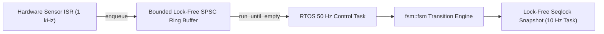

# Architectural Design Patterns & Cookbooks

This cookbook demonstrates production-grade architectural patterns using `fsmc`'s C++ runtime across embedded firmware, aerospace mission controllers, network protocols, and multi-FSM robotics systems.

---

## 1. High-Frequency Hardware Sensor Pipeline (ISR + RTOS)

### Problem
A high-frequency hardware sensor (IMU / ADC / UART) generates interrupts at 1 kHz. The interrupt service routine (ISR) must ingest data with **sub-microsecond deterministic latency** without heap allocation, mutex locking, or priority inversion, while a lower-priority RTOS task drains and processes state transitions.

### Solution Architecture
Use **`fsm::spsc_fsm`** with a static lock-free ring buffer:



```cpp
#include "sensor_pipeline_fsm.hpp"
#include <cstdint>

struct SensorContext {
    int32_t latest_raw_val{0};
    uint32_t error_count{0};
    bool stream_active{false};
};

// Define clean type alias for SPSC FSM
using SensorPipelineFSM = fsm::spsc_fsm<SensorPipelineTable, SensorContext, 64, IdleState>;

static SensorContext g_ctx;
// 64-element lock-free ring buffer statically allocated in BSS
static SensorPipelineFSM g_fsm(g_ctx);

// ----------------------------------------------------------------------------
// 1. Hardware Sensor ISR (Producer Context)
// ----------------------------------------------------------------------------
extern "C" void SPI1_IRQHandler(void) {
    uint16_t sample = SPI1->DR;

    // Wait-Free O(1) Push - never blocks, no mutex, no dynamic allocation
    if (sample > 0xFF00) {
        g_fsm.enqueue(OverThresholdEvent{sample});
    } else {
        g_fsm.enqueue(SampleReadyEvent{sample});
    }

    SPI1->SR &= ~SPI_SR_RXNE; // Clear interrupt flag
}

// ----------------------------------------------------------------------------
// 2. Control Task (Consumer Context)
// ----------------------------------------------------------------------------
void SensorProcessingTask(void* params) {
    while (true) {
        // Drain all pending events sequentially
        g_fsm.run_until_empty();
        vTaskDelay(pdMS_TO_TICKS(10));
    }
}
```

---

## 2. Hierarchical Aerospace Mission Controller (Fail-Safe & Deep History)

### Problem
An autonomous UAV mission consists of multi-stage sub-states (`Preflight`, `Ascending`, `WaypointNav`, `SearchPattern`). If an emergency event (`LowBattery`, `LinkLoss`) occurs during `SearchPattern`, the system must immediately transition to `FailSafe`. Once safe or link is restored, it must resume the exact nested sub-state where it left off using **Deep History `[H*]`**.

### SysML v2 State Definition
```sysml
state def MissionController {
    entry; then Preflight;

    state Preflight;

    state InFlight {
        entry; then Ascending;
        state Ascending;

        state Navigating {
            defer TelemetryPing; // Postpone telemetry events during waypoint calculations
            entry; then WaypointNav;
            state WaypointNav;
            state SearchPattern;

            transition search_started first WaypointNav accept AreaReached then SearchPattern;
        }

        state HoverPause;

        transition alt_reached first Ascending accept AltReached then Navigating;
        transition pause_cmd first Navigating accept PauseCmd then HoverPause;
        // Deep history resumption: restores exact sub-state (e.g. SearchPattern)
        transition resume_cmd first HoverPause accept ResumeCmd then Navigating[H*];
    }

    state FailSafe {
        entry; then ReturnToHome;
        state ReturnToHome;
        state SafeLanding;
    }

    transition emergency first InFlight accept LowBatteryEvent then FailSafe;
}
```

### C++ Execution
```cpp
#include "mission_controller_fsm.hpp"
#include <iostream>

// Clean type alias for Mission Controller FSM
using MissionControllerFSM = fsm::fsm<MissionControllerTable, MissionContext, Preflight>;

int main() {
    MissionContext ctx;
    MissionControllerFSM mission(ctx);

    mission.dispatch(TakeoffCmd{});
    mission.dispatch(AltReached{});
    mission.dispatch(AreaReached{}); // State is now: InFlight -> Navigating -> SearchPattern

    // Emergency pause
    mission.dispatch(PauseCmd{});    // State is now: InFlight -> HoverPause

    // Resume with Deep History [H*]
    mission.dispatch(ResumeCmd{});   // State automatically restored to SearchPattern!

    std::cout << "Restored State: " << mission.current_state_name() << "\n";
    return 0;
}
```

---

## 3. Network Protocol Parser (Timeouts & Deferred Frames)

### Problem
A network protocol parser must stream incoming bytes, decode headers, verify payload checksums, and trigger retransmission timeouts without OS background thread overhead.

### Implementation using `fsm::deterministic_timer_manager`
```cpp
#include "protocol_parser_fsm.hpp"
#include "fsm/runtime/cpp/deterministic_timer.hpp"

struct ProtocolContext {
    uint8_t rx_buffer[256];
    size_t rx_len{0};
    uint16_t expected_seq{0};
};

// Type aliases for parser and timers
using ProtocolParserFSM = fsm::fsm<ProtocolParserTable, ProtocolContext, WaitingHeader>;
using ProtocolTimerManager = fsm::deterministic_timer_manager<4>;

int main() {
    ProtocolContext ctx;
    ProtocolParserFSM fsm(ctx);
    ProtocolTimerManager timers;

    // Start 500ms timeout timer
    const uint32_t TIMEOUT_TIMER_ID = 1;
    timers.start_timer(TIMEOUT_TIMER_ID, 500 /* ms */);

    // Event simulation loop (10ms discrete time ticks)
    for (int tick_step = 0; tick_step < 100; ++tick_step) {
        // Feed byte stream
        if (has_incoming_bytes()) {
            uint8_t byte = read_byte();
            fsm.dispatch(ByteReceivedEvent{byte});
        }

        // Advance timer synchronously
        timers.tick(10 /* ms */, [&](uint32_t timer_id) {
            if (timer_id == TIMEOUT_TIMER_ID) {
                // Dispatch timeout event into FSM
                fsm.dispatch(AckTimeoutEvent{});
            }
        });
    }

    return 0;
}
```

---

## 4. Multi-FSM Coordination with Shared Context

In complex robotics systems, multiple specialized state machines (e.g. `ArmKinematicsFSM`, `GripperFSM`, `SafetySupervisorFSM`) run concurrently and coordinate through a shared data model:

```cpp
struct RobotContext {
    float arm_angles[6]{0.0f};
    bool gripper_closed{false};
    bool e_stop_triggered{false};
};

// Type aliases for coordinated FSMs
using ArmFSM    = fsm::fsm<ArmKinematicsTable, RobotContext, ArmIdle>;
using GripperFSM = fsm::fsm<GripperTable, RobotContext, GripperOpen>;
using SafetyFSM  = fsm::fsm<SafetySupervisorTable, RobotContext, NormalOperation>;

int main() {
    RobotContext robot_ctx;

    // Independent FSM instances sharing single context reference
    ArmFSM arm_fsm(robot_ctx);
    GripperFSM gripper_fsm(robot_ctx);
    SafetyFSM safety_fsm(robot_ctx);

    // Dispatching events across coordinated state machines
    arm_fsm.dispatch(MoveToCoordCmd{10.0f, 20.0f, 30.0f});
    gripper_fsm.dispatch(GraspObjectCmd{});

    return 0;
}
```
