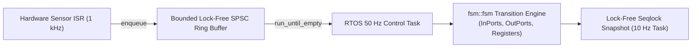
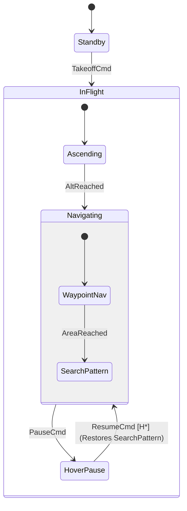
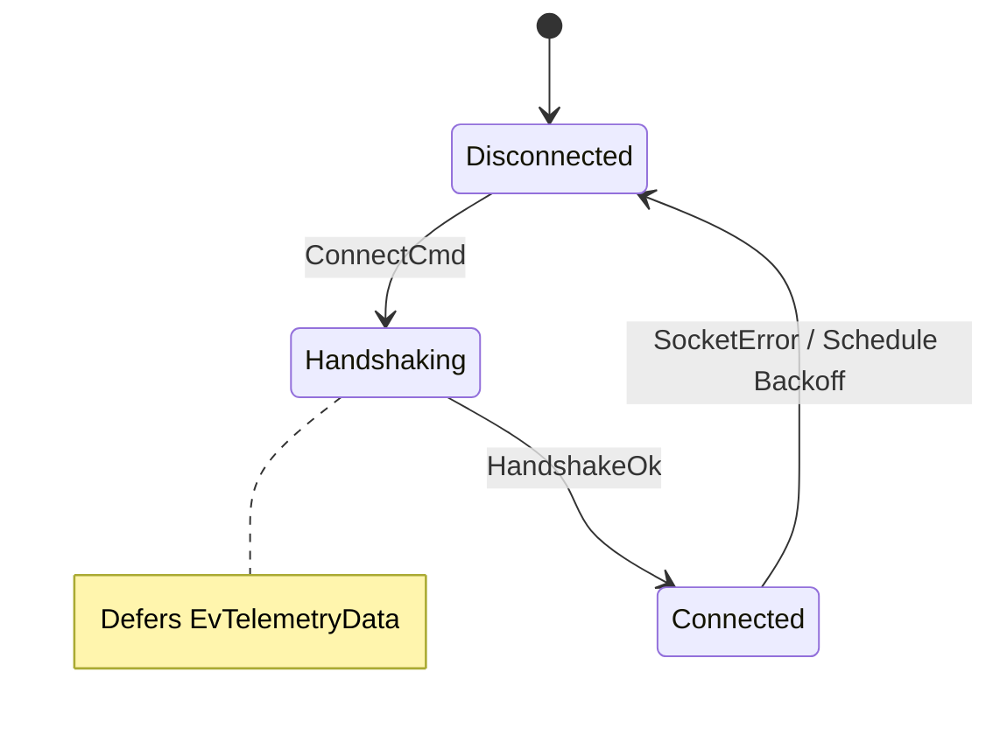

# Architectural Design Patterns & Cookbooks

This cookbook demonstrates production-grade architectural patterns using `fsmc` v0.4.0's C++ runtime across embedded firmware, aerospace mission controllers, network protocols, and multi-FSM robotics systems.

---

## 1. High-Frequency Hardware Sensor Pipeline (ISR + RTOS)

### Problem
A high-frequency hardware sensor (IMU / ADC / UART) generates interrupts at 1 kHz. The interrupt service routine (ISR) must ingest data with **sub-microsecond deterministic latency** without heap allocation, mutex locking, or priority inversion, while a lower-priority RTOS task drains and processes state transitions with local I/O snapshots.

### Solution Architecture
Use **`fsm::spsc_fsm`** with a static lock-free ring buffer:



```cpp
#include "sensor_pipeline_fsm.hpp"
#include <cstdint>

using namespace sensor_pipeline;

// 64-element lock-free ring buffer statically allocated in BSS
static fsm::spsc_fsm<SensorPipelineTable, SensorInPorts, SensorOutPorts,
                     SensorRegisters, SensorServices, 64, IdleState> g_fsm;

// ----------------------------------------------------------------------------
// 1. Hardware Sensor ISR (Producer Context)
// ----------------------------------------------------------------------------
extern "C" void SPI1_IRQHandler(void) {
    uint16_t sample = SPI1->DR;

    // Wait-Free O(1) Push - never blocks, no mutex, no dynamic allocation
    if (sample > 0xFF00) {
        g_fsm.enqueue(OverThresholdEvent{sample});
    } else {
        g_fsm.enqueue(SampleReadyEvent{sample});
    }

    SPI1->SR &= ~SPI_SR_RXNE; // Clear interrupt flag
}

// ----------------------------------------------------------------------------
// 2. Control Task (Consumer Context)
// ----------------------------------------------------------------------------
void SensorProcessingTask(void* params) {
    SensorServices srv;
    while (true) {
        // Read immutable input snapshot and local output buffer
        const SensorInPorts in = sample_hardware_pins();
        SensorOutPorts out{};

        // Drain all pending events sequentially
        g_fsm.run_until_empty(in, out, srv);

        commit_hardware_pins(out);
        vTaskDelay(pdMS_TO_TICKS(10));
    }
}
```

---

## 2. Hierarchical Aerospace Mission Controller (Fail-Safe & Deep History)

### Problem
An autonomous UAV mission consists of multi-stage sub-states (`Preflight`, `Ascending`, `WaypointNav`, `SearchPattern`). If an emergency event occurs during `SearchPattern`, the system transitions to `HoverPause`. Once resumed, it restores the exact nested sub-state where it left off using **Deep History `[H*]`**.

### SysML v2 State Definition
```sysml
state def MissionController {
    in port battery_pct : Real { assert constraint { self >= 0.0 and self <= 100.0; } }
    out port motor_throttle : Real;
    attribute waypoint_idx : Integer = 0;

    entry; then Preflight;

    state Preflight;

    state InFlight {
        entry; then Ascending;
        state Ascending;

        state Navigating {
            entry; then WaypointNav;
            state WaypointNav;
            state SearchPattern;

            transition search_started first WaypointNav accept AreaReached then SearchPattern;
        }

        state HoverPause;



```cpp
#include "mission_fsm.hpp"
#include <iostream>

int main() {
    using namespace mission;

    MissionRegisters reg{0};
    MissionServices srv;
    MissionFSM fsm(reg, srv);

    MissionInPorts in;
    in.battery_pct = 100.0f;
    MissionOutPorts out;

    fsm.dispatch(TakeoffCmd{}, in, out, srv);
    fsm.dispatch(AltReached{}, in, out, srv);
    fsm.dispatch(AreaReached{}, in, out, srv);
    std::cout << "State before pause: " << fsm.current_state_name() << "\n"; // SearchPattern

    // Pause mission
    fsm.dispatch(PauseCmd{}, in, out, srv);
    std::cout << "Paused state: " << fsm.current_state_name() << "\n"; // HoverPause

    // Resume: Deep history restores exact active substate SearchPattern
    fsm.dispatch(ResumeCmd{}, in, out, srv);
    std::cout << "State after resume: " << fsm.current_state_name() << "\n"; // SearchPattern
    return 0;
}
```

---

## 3. Resilient IoT Gateway (Event Deferral & Timed Backoff)

### Problem
An edge device communicates with a cloud broker. If telemetry packets arrive while the connection is still handshaking, they must not be dropped; instead, they must be **deferred** and automatically replayed once `Connected`. If the socket disconnects, the machine schedules an exponential backoff reconnect timer.

### Solution Architecture



```cpp
#include "fsm/backend/cpp/runtime/thread_safe_fsm.hpp"
#include <chrono>
#include <iostream>

using namespace std::chrono_literals;

struct Disconnected { static constexpr std::string_view name = "Disconnected"; };
struct Handshaking {
    static constexpr std::string_view name = "Handshaking";
    // Defer incoming data packets until handshake is established
    using deferred_events = fsm::type_list<EvTelemetryData>;
};
struct Connected { static constexpr std::string_view name = "Connected"; };

struct GatewayTable = fsm::transition_table<
    fsm::row<Disconnected, ConnectCmd,      Handshaking>,
    fsm::row<Handshaking,  HandshakeOk,     Connected>,
    fsm::row<Connected,    EvTelemetryData, Connected>::then<SendTelemetryAction>,
    fsm::row<Connected,    SocketError,     Disconnected>::then<ScheduleBackoffAction>
>;

void ScheduleBackoffAction::operator()(const SocketError&, GatewayRegisters& reg, fsm::thread_safe_fsm<GatewayTable>& fsm) const {
    reg.reconnect_delay_ms = std::min(reg.reconnect_delay_ms * 2, 30000u);
    std::cout << "[GATEWAY] Reconnecting in " << reg.reconnect_delay_ms << "ms...\n";
    // Timed delayed event posted safely from worker thread
    fsm.post_delayed(ConnectCmd{}, std::chrono::milliseconds(reg.reconnect_delay_ms));
}
```

---

## 4. Common Anti-Patterns & Troubleshooting Guide

To ensure maximum safety, determinism, and real-time predictability, avoid these five common architectural pitfalls:

---

### ❌ Anti-Pattern 1: Impure Guards (Mutating State Inside Predicates)

Guards in UML 2.5 and `fsmc` must be pure, side-effect-free mathematical predicates. If a guard mutates memory or calls external drivers, it causes nondeterministic execution and invalidates formal model checking passes:

```cpp
// ❌ WRONG: Mutating registers in a guard causes nondeterministic bugs
struct BadGuard {
    bool operator()(MotorRegisters& reg) const {
        return ++reg.attempt_count > 3; // VIOLATION! Guard must be strictly read-only
    }
};

//  CORRECT: Read-only guard; perform mutations exclusively inside transition actions
struct GoodGuard {
    bool operator()(const MotorRegisters& reg) const noexcept {
        return reg.attempt_count >= 3;
    }
};
struct IncrementAction {
    void operator()(MotorRegisters& reg) const noexcept {
        reg.attempt_count++;
    }
};
```

---

### ❌ Anti-Pattern 2: Reentrant / Recursive `dispatch()` Inside Actions

In `fsmc`, **the state machine instance is deliberately NOT injected into action functors**. Actions only receive domain-segregated references `(event, src, dst, in, out, registers, services)`. Attempting to capture an `fsm` instance (e.g. via lambda capture or global references) to invoke `fsm.dispatch()` from inside an action violates the fundamental Run-to-Completion (RTC) invariant and risks unbounded stack recursion:

```cpp
// ❌ WRONG: Attempting recursive reentrant dispatch from within an action
auto recursive_action = [&](const EvFault&) {
    g_fsm.dispatch(EvEmergencyStop{}); // VIOLATION! Corrupts active transition stack & breaks RTC
};

//  CORRECT: Model Transition Paths in the Table Topology
// Option A: Direct transition in the table:
using MyTable = fsm::transition_table<
    fsm::row<Running, EvFault, EmergencyStopState>::then<DisarmHardwareAction>
>;

// Option B: Multi-step continuous logic evaluated in step() loops:
using ContinuousTable = fsm::transition_table<
    fsm::row<Running, EvFault, FaultState>,
    fsm::row<FaultState, fsm::anonymous_event, EmergencyStopState>::when<IsCriticalFaultGuard>
>;

// Option C: For asynchronous engines (spsc_fsm / thread_safe_fsm):
// Post the follow-up event to the FIFO queue externally:
fsm.post(EvEmergencyStop{});
```

---

### ❌ Anti-Pattern 3: Blocking Calls & `sleep` Inside Real-Time Actions

Placing `std::this_thread::sleep_for()` or blocking mutex locks inside an action freezes the caller thread (such as a 1 kHz RTOS control task or a hardware ISR), destroying deterministic Worst-Case Execution Time (WCET):

```cpp
// ❌ WRONG: Blocking sleep inside synchronous transition action
struct WaitAndRetryAction {
    void operator()() const {
        std::this_thread::sleep_for(std::chrono::seconds(2)); // VIOLATION! Freezes control loop
    }
};

//  CORRECT: Model Delays as States with Timed Events or Periodic Step Counters
// Approach A (thread_safe_fsm): Use asynchronous delayed events:
fsm.post_delayed(EvRetry{}, 2000ms);

// Approach B (spsc_fsm / synchronous): Count periodic sample ticks in Registers:
struct TickAction {
    void operator()(MotorRegisters& reg) const noexcept { reg.timeout_ticks++; }
};
```

---

### ❌ Anti-Pattern 4: Stuffing I/O & Drivers into `Registers` (Catch-All Monolithic State)

`Registers` in `fsmc` is strictly designed for **persistent internal datapath memory** ($z^{-1}$ delay, counters, accumulators, calibrated offsets). Putting sensor inputs, actuator commands, or raw hardware driver pointers directly into `Registers` breaks the synchronous latching invariant and prevents hardware test mocking:

```cpp
// ❌ WRONG: Using Registers as a monolithic catch-all dump for I/O and hardware
struct BadRegisters {
    float sensor_temp;      // WRONG: Sensor input should be in InPorts (Read-Only)
    bool valve_open;        // WRONG: Actuator output should be in OutPorts (Write-Only)
    uint32_t cycle_counter; // OK: Persistent state
    UARTDriver* uart_hw;    // WRONG: Hardware driver should be in Services (Injected)
};

//  CORRECT: Segregate into the 4 Canonical Domains
struct ValveInPorts   { float sensor_temp{0.0f}; };
struct ValveOutPorts  { bool valve_open{false};  };
struct ValveRegisters { uint32_t cycle_counter{0}; };
struct ValveServices  { virtual void transmit_uart(std::span<const uint8_t>) = 0; };
```

#### Why Domain Segregation is Critical:
- **`InPorts` (Read-Only)**: Enforces the synchronous latching principle—inputs cannot be accidentally overwritten midway through cycle execution.
- **`OutPorts` (Write-Only Buffer)**: Ensures single-assignment execution semantics—outputs are committed to hardware actuators strictly upon cycle completion.
- **`Services` (Interface)**: Enables 100% deterministic unit testing by substituting physical hardware drivers with mock services.

---

### ❌ Anti-Pattern 5: State Machine by Boolean Flags (Flag Proliferation)

Keeping a single monolithic state (e.g. `Operational`) and using 10 boolean flags inside `Registers` with giant `if-else` chains inside actions defeats the purpose of a formal state machine:

```cpp
// ❌ WRONG: Reinventing a state machine using flags inside a single state
struct BadRegisters {
    bool is_calibrating{false};
    bool is_transmitting{false};
    bool is_paused{false};
    bool is_reconnecting{false};
};

//  CORRECT: Model Distinct States in the Transition Table or Use Hierarchical HFSM
struct Calibrating  { static constexpr std::string_view name = "Calibrating";  };
struct Transmitting { static constexpr std::string_view name = "Transmitting"; };
struct Paused       { static constexpr std::string_view name = "Paused";       };
```

---

### 💡 Gotcha: Single-Argument `dispatch(event)` vs `OutPorts` Buffers

Calling `fsm.dispatch(event)` is **100% idiomatic and recommended** for:

1. Stateless state machines (`fsm::no_ports`),
2. State machines where actions modify internal `Registers`, call bound `Services`, or trigger state transitions.

However, if your state machine model defines custom `OutPorts` (e.g. `MotorOutPorts`) and your transition actions write actuator commands into `out` to be sent to physical hardware, calling `fsm.dispatch(event)` creates a temporary `OutPorts{}` buffer on the stack that is discarded upon return.

```cpp
// 1. Idiomatic for Stateless / Register-Driven FSMs:
fsm.dispatch(EvStart{}); // Completely valid, updates internal state & registers

// 2. Required when collecting actuator commands for hardware:
MotorInPorts in = sample_sensors();
MotorOutPorts out{};
fsm.dispatch(EvStart{}, in, out); // Populates 'out' buffer
hardware_driver_commit(out);      // Commits commands to physical hardware
```

---

### 💡 Best Practice: Disambiguating Overlapping Numeric Guards (`W0301`)

If multiple transitions leave the same state on the same event with overlapping guard intervals, the compiler emits warning `W0301`. Resolve this either by making the intervals provably disjoint or adding explicit transition priorities:

```cpp
//  Option A: Provably Disjoint Intervals (Clean - 0 Warnings)
fsm::row<Idle, EvTick, StateA>::when<InTempAbove50>, // temp > 50.0
fsm::row<Idle, EvTick, StateB>::when<InTempBelow30>  // temp <= 30.0

//  Option B: Explicit Priority Disambiguation
// Highest priority (priority: 1) evaluates first:
fsm::row<Idle, EvTick, EmergencyMode, HighTempGuard, NoAction, 1>,
fsm::row<Idle, EvTick, NormalMode,    AlwaysTrue,    NoAction, 2>
```
