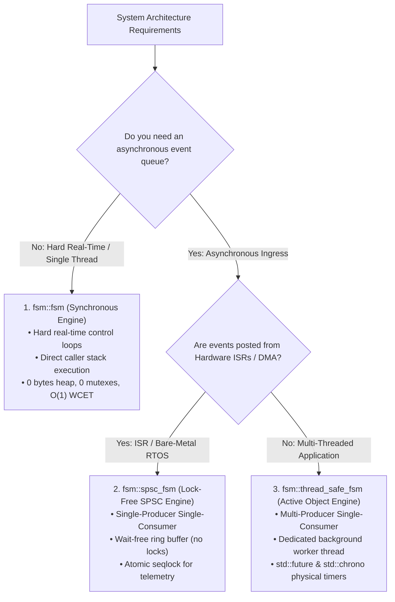

# Target Backends & Execution Runtimes

The `fsmc` compiler translates state machine models into deterministic, formally verified execution runtimes across multiple target programming languages.

The **C++ Reference Backend** (`v0.5.0+`) provides a header-only, **100% zero-heap, zero-vtable, and zero-exception** C++17/C++20 runtime library located in [`include/fsm/backend/cpp/runtime/`](file:///home/simone/dev/github/fsmc/include/fsm/backend/cpp/runtime/). For planned Rust (`no_std`) and ISO C99 code generators, see the **[Multi-Target Architecture & Roadmap](multi_target_roadmap.md)**.

---

## Language Support Matrix

| Target Language | Minimum Standard | Concurrency Models | Safety & Reliability | Status |
| :--- | :--- | :--- | :--- | :--- |
| **C++ Target** | C++17 / C++20 | Synchronous stack, Lock-Free SPSC, Active Object | Zero-Heap, Hard Real-Time | **Production (v0.5.0+)** |
| **Rust Target** | Rust 2021 (`no_std`) | Typestate transitions, lock-free static channels | Compile-time memory safety, zero panic | **Preview / In Development** |
| **C Target** | ISO C99 / C11 | Static transition table, switch-case dispatch | Embedded C, zero malloc | **Preview / Planned RFC** |

> [!NOTE]
> **Production vs. Preview**: The **C++ Backend** is the only production-ready target in `v0.5.0`. Rust and C code generation are preview targets currently being designed and implemented.

---

## 5-Minute C++ Quickstart

The `fsmc` runtime uses pure C++ types for states, events, guards, and transition tables:

```cpp
#include <iostream>
#include <cassert>
#include "fsm/backend/cpp/runtime/fsm.hpp"

// 1. Define States (must provide static constexpr std::string_view name)
struct Off { static constexpr std::string_view name = "Off"; };
struct On  { static constexpr std::string_view name = "On";  };

// 2. Define Events
struct ToggleCmd {};

// 3. Define Transition Table using fsm::row
using LampTable = fsm::transition_table<
    fsm::row<Off, ToggleCmd, On>,
    fsm::row<On,  ToggleCmd, Off>
>;

int main() {
    // 4. Instantiate the State Machine (starts in InitialState = Off)
    fsm::fsm<LampTable> lamp;

    assert(lamp.is_in<Off>());
    std::cout << "Initial state: " << lamp.current_state_name() << "\n"; // Off

    // 5. Dispatch Events synchronously
    lamp.dispatch(ToggleCmd{});
    assert(lamp.is_in<On>());
    std::cout << "After toggle: " << lamp.current_state_name() << "\n";  // On

    lamp.dispatch(ToggleCmd{});
    assert(lamp.is_in<Off>());

    return 0;
}
```

---

## Choose Your Execution Engine

`fsmc` provides three specialized execution engines sharing the exact same transition table logic:



### Comprehensive Engine Comparison Matrix

| Architectural Dimension | Synchronous Engine (`fsm::fsm`) | Lock-Free Engine (`fsm::spsc_fsm`) | Active Object Engine (`fsm::thread_safe_fsm`) |
| :--- | :--- | :--- | :--- |
| **Modern Factory Alias** | `fsm::make_fsm<Table, Policies...>` | `fsm::make_spsc_fsm<Table, Policies...>` | `fsm::make_thread_safe_fsm<Table, Policies...>` |
| **Concurrency Model** | Single-threaded (runs on caller's stack) | Single-Producer Single-Consumer (Lock-Free) | Multi-Producer Single-Consumer (Active Object) |
| **Heap Allocation** | **0 bytes** (100% stack / static) | **0 bytes** (pre-allocated static ring buffer) | **0 bytes** core (std::function queue tasks) |
| **Synchronization Overhead** | **Zero** (no atomics, no mutexes) | **Wait-free $O(1)$** ingest (atomic acquire-release) | **Mutex-guarded** queue & condition variable |
| **ISR Safety** | Safe if called within ISR context | **Guaranteed Wait-Free ISR Ingress** | Unsafe from ISRs (uses `std::mutex`) |
| **Timed Event Scheduling** | Discrete cycle step (`step(dt)`) | Discrete cycle step (`step(dt)`) | **Physical timers** (`post_delayed`, `post_state_timeout`) |
| **Datapath Access Pattern** | Direct `registers()` | Lock-Free `snapshot_registers()` via seqlock | Safe-by-Design `with_registers()` / `snapshot_registers()` |
| **Target Platforms** | Bare-metal, DSP, FPGA soft-cores, RTOS | Microcontroller ISRs, DMA handlers, RTOS tasks | Linux, Windows, macOS, ROS2 nodes, network daemons |
| **Dedicated Guide** | [Synchronous Core Guide →](synchronous_fsm.md) | [Lock-Free SPSC Guide →](spsc_fsm.md) | [Thread-Safe MPSC Guide →](thread_safe_fsm.md) |

---

## API Decision & Parameter Cheat Sheet

To keep your application code clean, deterministic, and free of boilerplate, follow this quick selection guide:

| Application Architecture | FSM Construction | Call-Site `dispatch()` / `step()` | Typical Use Case |
| :--- | :--- | :--- | :--- |
| **1. Standard with Hardware / I-O (Recommended)** | `MyFSM fsm(reg, srv);` | `fsm.dispatch(ev, in, out);`<br>`fsm.step(in, out);` | **Default choice for 90% of embedded systems**. Hardware services bound once at startup; I/O snapshots passed per cycle. |
| **2. Pure Logic / Stateless** | `MyFSM fsm;` | **Events only**: `fsm.dispatch(ev);`<br>*(purely event-driven; `step()` is only needed if using anonymous sequence transitions)* | Statecharts without I/O ports or hardware services (e.g. parser, UI navigation, turn-based game logic). |
| **3. Pure I/O (No External Services)** | `MyFSM fsm(reg);` | `fsm.dispatch(ev, in, out);`<br>`fsm.step(in, out);` | Systems reading sensor `InPorts` and updating actuator `OutPorts` without external driver calls. |
| **4. Dynamic / Multi-Channel Injection** | `MyFSM fsm(reg);` | `fsm.dispatch(ev, in, out, srv);`<br>`fsm.step(in, out, srv);` | **Production & Testing**: Multi-channel protocol dispatchers (e.g. UART1..UART8), hardware redundancy failover (Primary vs Backup driver), delayed bare-metal boot initialization, or unit tests with mocks. |

### Memory Domain Rules at a Glance

- **`InPorts` (Sensor Inputs)**: Passed at call-site (`dispatch(ev, in, out)` / `step(in, out)`). Immutable read-only snapshot for the current cycle.
- **`OutPorts` (Actuator Outputs)**: Passed at call-site (`dispatch(ev, in, out)` / `step(in, out)`). Populated by transition action effects.
- **`Registers` (Internal Memory)**: Passed at construction (`fsm(reg)`). Persistent $z^{-1}$ memory surviving across cycles.
- **`Services` (Hardware / RPC)**: Bound at construction (`fsm(reg, srv)`). Automatically reused across all transitions.

---

## Runtime Documentation Roadmap

Explore the comprehensive guides below to master every aspect of the `fsmc` runtime architecture:

### 1. Fundamentals & Core Building Blocks
- **[Core Building Blocks](core_concepts.md)**: The 4-Domain Datapath Model (`InPorts`, `OutPorts`, `Registers`, `Services`), flexible guard/action functors, and UML History recovery.

### 2. Execution Engines (Choose Your Concurrency Model)
- **[1. Synchronous Core Engine (`fsm::fsm`)](synchronous_fsm.md)**: Direct execution on caller stack, periodic sampled `step()` control loops, and `in_state_for<Threshold>` continuous dwell timers.
- **[2. Lock-Free SPSC Engine (`fsm::spsc_fsm`)](spsc_fsm.md)**: Wait-free ring buffer for hardware ISRs and lock-free Seqlock reader queries for telemetry threads.
- **[3. Active Object MPSC Engine (`fsm::thread_safe_fsm`)](thread_safe_fsm.md)**: Dedicated worker thread, asynchronous `post_async` futures, and auto-canceling `post_state_timeout`.

### 3. Advanced & Real-Time Guarantees
- **[Memory Layout & WCET Guarantees](memory_and_realtime.md)**: Zero-heap allocation proofs, `fsm::static_vector`, cache locality, and worst-case execution timing bounds.
- **[Transition Tracing & Telemetry](introspection_trace.md)**: Structured observer callbacks, transition logging, and execution timeline tracing.

### 4. Production Patterns, Testing & Reference
- **[Architectural Design Patterns](design_patterns.md)**: Production recipes for sensor pipelines, aerospace mission executives, and multi-FSM coordination.
- **[Unit Testing Guide](testing_guide.md)**: GoogleTest and Catch2 recipes, mock services, and deterministic test fixtures.
- **[FAQ & Troubleshooting](faq_and_troubleshooting.md)**: Resolution checklists for common compiler warnings and runtime edge cases.
- **[Full Runtime API Reference](reference.md)**: Complete signature catalog of all types, traits, concepts, and member functions.
