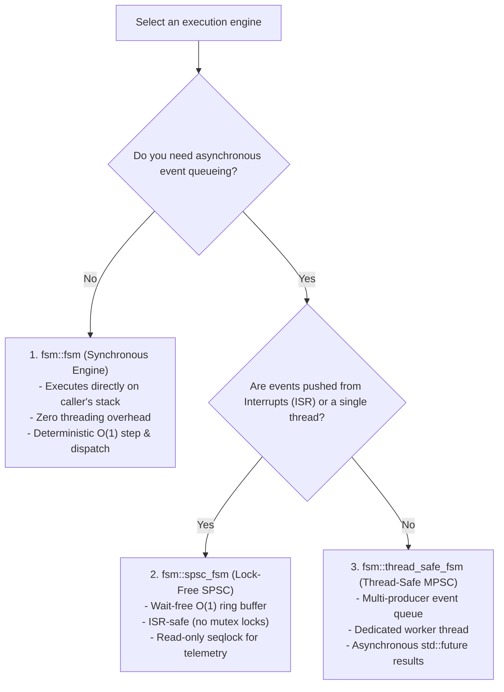
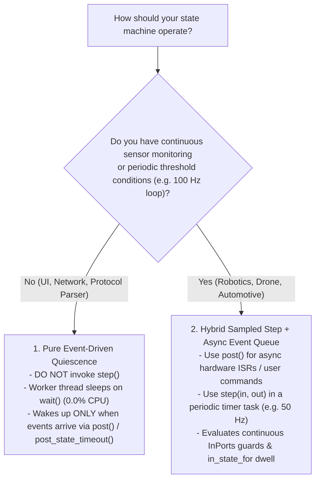
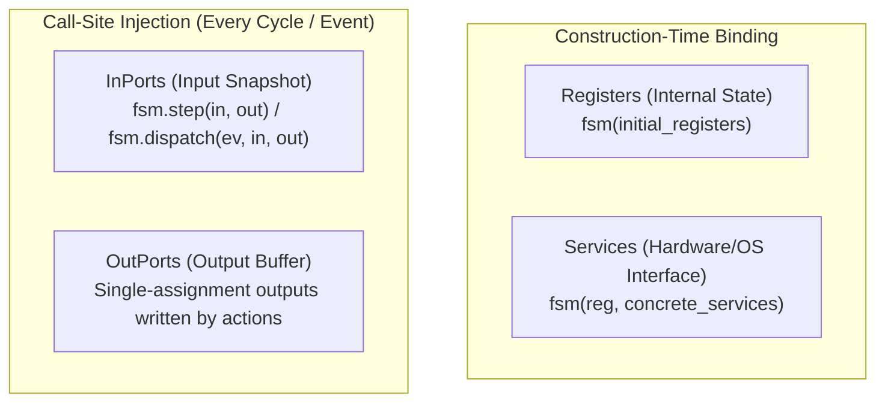

# Runtime C++ API Guide

`fsmc` provides a header-only, **100% zero-heap, zero-vtable, and zero-exception** C++17/C++20 runtime library (`include/fsm/backend/cpp/runtime/`).

The runtime can be generated as a single standalone header (`--standalone`) with **zero external dependencies** outside the C++ Standard Library, making it immediately embeddable into bare-metal microcontrollers, RTOS firmware, and high-performance desktop applications.

---

## 5-Minute C++ Quickstart

Here is a complete, self-contained state machine written directly using the `fsmc` C++ runtime:

```cpp
#include <iostream>
#include <cassert>
#include "fsm/backend/cpp/runtime/fsm.hpp"

// 1. Define States (must provide static constexpr std::string_view name)
struct Off { static constexpr std::string_view name = "Off"; };
struct On  { static constexpr std::string_view name = "On";  };

// 2. Define Events
struct ToggleCmd {};

// 3. Define the Transition Table using fsm::row
using LampTable = fsm::transition_table<
    fsm::row<Off, ToggleCmd, On>,
    fsm::row<On,  ToggleCmd, Off>
>;

int main() {
    // 4. Instantiate the State Machine (starts in InitialState = Off)
    fsm::fsm<LampTable> lamp;

    std::cout << "Initial state: " << lamp.current_state_name() << "\n"; // Off
    assert(lamp.is_in<Off>());

    // 5. Dispatch Events
    lamp.dispatch(ToggleCmd{});
    std::cout << "After toggle: " << lamp.current_state_name() << "\n";  // On
    assert(lamp.is_in<On>());

    lamp.dispatch(ToggleCmd{});
    assert(lamp.is_in<Off>());

    return 0;
}
```

---

## Runtime Engine Flavors

`fsmc` provides three specialized execution engines tailored for different concurrency and threading requirements:



| Engine | Concurrency Model | Target Environment | Key Documentation |
| :--- | :--- | :--- | :--- |
| **`fsm::fsm`** | Synchronous (Caller Thread) | Bare-metal, control loops, deterministic sequential logic | [Synchronous Core FSM](synchronous_fsm.md) |
| **`fsm::spsc_fsm`** | Single-Producer Single-Consumer | Hardware ISRs, DMA callbacks, RTOS sensor queues | [Lock-Free SPSC FSM](spsc_fsm.md) |
| **`fsm::thread_safe_fsm`** | Multi-Producer Single-Consumer | Multi-threaded services, network daemons, UI event loops | [Thread-Safe MPSC FSM](thread_safe_fsm.md) |

---

## Method Selection: `dispatch` vs `step` vs `post`

| Method | Target Engine | Execution Mode | When to Use It? | Return Type |
| :--- | :--- | :--- | :--- | :--- |
| **`dispatch(event, ...)`** | `fsm::fsm` | Synchronous (Immediate) | You want to process a discrete event right now on the current thread. | `fsm::dispatch_result` |
| **`step([dt], ...)`** | `fsm::fsm`, `spsc_fsm`, `thread_safe_fsm` | Synchronous (Cycle Tick) | Periodic control loop tick (e.g. 1 kHz timer) evaluating continuous anonymous transitions against `InPorts` & `Registers`. | `fsm::step_result` |
| **`post(event)`** | `spsc_fsm`, `thread_safe_fsm` | Asynchronous (Fire & Forget) | Pushing an event into a queue without waiting for completion (e.g. inside a hardware ISR or from a producer thread). | `bool` (SPSC) / `void` (MPSC) |
| **`post_async(event)`** | `thread_safe_fsm` | Asynchronous (Future Awaitable) | Pushing an event from a thread and waiting (`.get()`) for the worker thread to finish the transition. | `std::future<fsm::dispatch_result>` |
| **`post_delayed(event, delay)`** | `thread_safe_fsm` | Asynchronous (Timed Delay) | Scheduling an event to fire automatically after a specified time duration (e.g. 500ms timeout). | `void` |
| **`post_state_timeout(event, delay)`** | `thread_safe_fsm` | Asynchronous (State Timeout) | Scheduling a state timeout that is **automatically invalidated and discarded** if state changes before deadline. | `void` |
| **`process_one(...)`** | `spsc_fsm` | Synchronous (Drain Step) | Executing the single oldest queued event on the consumer control task. | `bool` |
| **`run_until_empty(...)`** | `spsc_fsm` | Synchronous (Drain All) | Processing all pending queued events in a batch loop. | `std::size_t` |

---

## Execution Paradigms: Pure Event-Driven vs Hybrid Sampled Step

A key architectural design question when using asynchronous engines ([`fsm::spsc_fsm`](spsc_fsm.md) and [`fsm::thread_safe_fsm`](thread_safe_fsm.md)) is: **Should I invoke `step()` or just let the machine wait for events?**



### Paradigm 1: Pure Event-Driven Quiescence (0.0% Idle CPU)

In network parsers, RPC daemons, and UI controllers, the machine remains completely quiescent:

- The worker thread sleeps on `std::condition_variable::wait()`.
- Transitions execute exclusively in response to `post(event)` or `post_state_timeout(...)`.
- **In this mode, you NEVER invoke `step()`.**

### Paradigm 2: Hybrid Continuous Step + Event Queue

In embedded robotics, automotive ECUs, and flight controllers, you need **both**:

- **Continuous Periodic `step(in, out)`**: Evaluates fresh sensor `InPorts` at a fixed rate (e.g. 50 Hz), checks continuous threshold guards (e.g. `temp > 85°C`, `battery < 20%`), and updates actuator `OutPorts`.
- **Asynchronous `post(event)`**: Hardware ISRs (limit switches, emergency stops, UART packets) push immediate events into the queue.

---

## Parameter Injection Guide: When to Pass Ports & Services

`fsmc` supports both construction-time binding and call-site parameter injection:



### Injection Rules

| Domain | Injection Point | Mutability & Lifetime | Call-Site Usage Example |
| :--- | :--- | :--- | :--- |
| **`Registers`** | FSM Construction | Persistent internal memory ($z^{-1}$) | `fsm::fsm sm(initial_registers);` |
| **`InPorts`** | Call-Site Snapshot | Read-only input snapshot | `sm.dispatch(ev, in, out);` or `sm.step(in, out);` |
| **`OutPorts`** | Call-Site Buffer | Single-assignment write buffer | `sm.dispatch(ev, in, out);` or `sm.step(in, out);` |
| **`Services`** | Construction or Call-Site | External drivers / environment RPC | Bound: `sm(reg, srv);`<br/>Injected: `sm.dispatch(ev, in, out, srv);` |
| **Stateless** | Omitted | Zero overhead | `sm.dispatch(ev);` or `sm.step();` |

#### Key Rules:
- **Internal `Registers`**: Passed once at construction (`fsm::fsm sm(initial_registers);`). Persists inside the state machine across cycles. Accessible via `sm.registers()`.
- **`InPorts` (Read-Only Sensor Snapshot)**: Passed at the call site (`sm.dispatch(event, in, out)` or `sm.step(in, out)`). Represents the immutable input state for this exact cycle (enforces the Latching pattern).
- **`OutPorts` (Actuator Command Buffer)**: Single-assignment buffer populated by action effects during the transition step and committed to hardware afterwards.
- **`Services` (External Hardware / Driver Interfaces)**:
    - *Option A (Bound at Construction)*: If you construct `sm(reg, srv)`, you can omit `srv` at call sites: `sm.dispatch(event, in, out);`.
    - *Option B (Injected at Call Site)*: Pass explicitly on each call: `sm.dispatch(event, in, out, srv);`.
- **Stateless / No-Ports FSM**: If your model has no ports or services (`fsm::no_ports`, `fsm::no_services`), omit them completely: `sm.dispatch(event);` or `sm.step();`.

---

## Chapter Roadmap

### 1. Foundation & Building Blocks
- **[Core Building Blocks](core_concepts.md)**: States, Lifecycle Hooks, Events, 4-Domain Datapath (`InPorts`, `OutPorts`, `Registers`, `Services`), Flexible Guards/Actions, History, and the 5 Common Idioms cookbook.

### 2. Execution Engines (Choose Your Concurrency Model)
- **[1. Synchronous & Control Loops (`fsm::fsm`)](synchronous_fsm.md)**: Direct execution on caller stack, deterministic $O(1)$ dispatch, and periodic sampled `step()` control loops with `in_state_for<Threshold>`.
- **[2. Lock-Free & ISR (`fsm::spsc_fsm`)](spsc_fsm.md)**: Wait-free ring buffer for hardware ISRs and single-producer RTOS tasks with seqlock reader synchronization.
- **[3. Multi-Threaded Active Object (`fsm::thread_safe_fsm`)](thread_safe_fsm.md)**: Multi-producer thread-safe queue with background worker thread, async futures (`post_async`), and auto-canceling state timeouts (`post_state_timeout`).

### 3. Advanced & Real-Time Guarantees
- **[Memory Layout & WCET Guarantees](memory_and_realtime.md)**: Formal zero-heap guarantees, `fsm::static_vector`, zero-vtable overhead, and WCET bounds.
- **[Transition Tracing & Telemetry](introspection_trace.md)**: State machine observers, structured telemetry metadata, and deterministic timing metrics.

### 4. Patterns & Reference
- **[Architectural Design Patterns](design_patterns.md)**: Production cookbooks for sensor pipelines, mission controllers, and multi-FSM coordination.
- **[Unit Testing Guide](testing_guide.md)**: GoogleTest and Catch2 recipes, test fixtures, and mock service injection.
- **[FAQ & Troubleshooting](faq_and_troubleshooting.md)**: Common compiler diagnostics, error checklists, and architectural answers.
- **[Full Runtime API Reference](reference.md)**: Complete reference of types, traits, helper concepts, and member functions.
