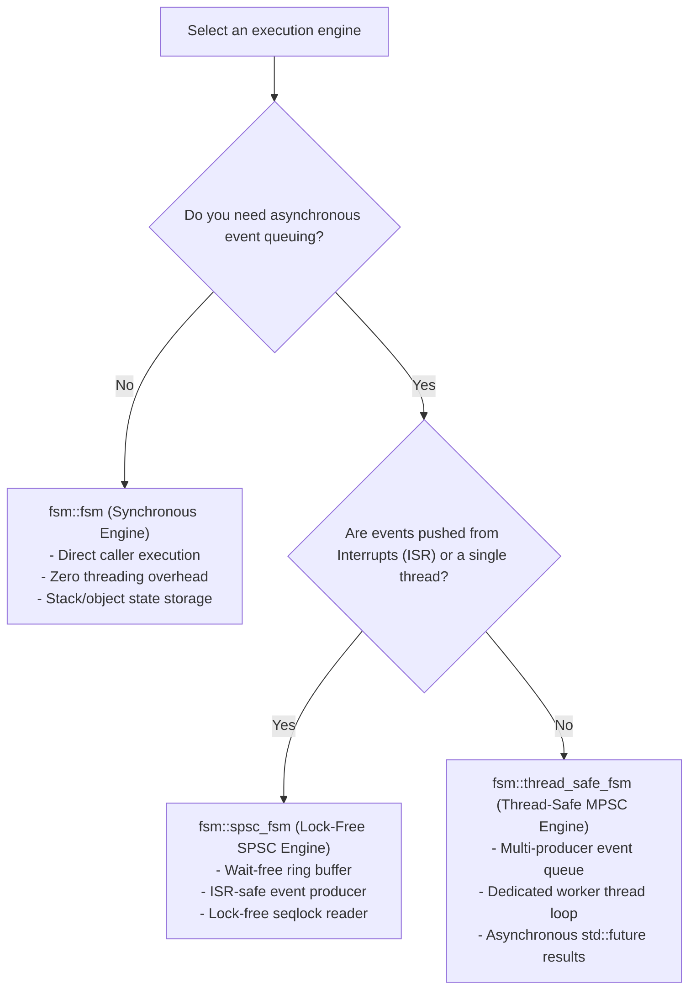

# Runtime C++ API Architecture & Engine Selection

`fsmc` is designed around a modular backend architecture. Currently, its primary reference code generator targets modern **C++ (C++17 and C++20)**, providing header-only infrastructure for embedded microcontrollers, RTOS tasks, and multi-threaded systems with zero dynamic memory allocation.

---


## Architectural Principles

1. **Zero Dynamic Memory Allocation**: State machines, event queues, and transition tables do not allocate heap memory (`malloc`/`new`). All state tracking is stored directly in the state machine object or statically allocated in user-provided storage.
2. **Compile-Time Static Dispatch**: Transition tables are resolved at compile time through template metaprogramming fold expressions. Transitions that do not match the current state are eliminated during optimization, compiling directly into branch tables without virtual function (`vtable`) table lookups.
3. **Deterministic Execution**: The dispatch path executes a predictable sequence of guard evaluations, exit hooks, transition actions, and entry hooks.
4. **Header-Only Standalone Deployment**: The runtime can be generated as a self-contained `.hpp` header file with **zero external dependencies**, requiring only a standard C++17 or C++20 compiler.

---

## Runtime Engine Selection Guide

`fsmc` provides three runtime engines designed for different threading and concurrency requirements:




| Engine | Concurrency Model | Memory Layout | Thread Safety | Target Environment | Documentation |
| :--- | :--- | :--- | :--- | :--- | :--- |
| **`fsm::fsm`** | Synchronous | Minimal (State ID + Context Reference) | Caller thread | Bare-metal, control loops, deterministic sequential logic | [Synchronous FSM](synchronous_fsm.md) |
| **`fsm::spsc_fsm`** | Single-Producer Single-Consumer | Bounded static circular buffer | Wait-Free (Producer), Sequential (Consumer) | Hardware ISRs, DMA callbacks, RTOS tasks | [Lock-Free SPSC FSM](spsc_fsm.md) |
| **`fsm::thread_safe_fsm`** | Multi-Producer Single-Consumer | Queue + background worker thread | Mutex / Shared Mutex / Spinlock | Multi-threaded services, UI events, worker pools | [Thread-Safe FSM](thread_safe_fsm.md) |
| **`fsm::deterministic_timer`** | Tick-based Discrete Time | Static array of active timer slots | Synchronous tick-based | Time-dependent logic, simulated time, unit testing | [Deterministic Timer](introspection_trace.md#4-deterministic-tick-based-timer-manager) |


---

## Generating Standalone Single-Headers

You can generate a standalone header containing your state machine definition and the full runtime in a single file:

```bash
# Generate standalone C++20 header (0 external dependencies)
fsmc -i flight_controller.sysml -o flight_fsm.hpp --standard 20 --standalone

# Generate standalone C++17 header
fsmc -i flight_controller.sysml -o flight_fsm.hpp --standard 17 --standalone
```

In your application code, include the generated file directly:

```cpp
#include "flight_fsm.hpp"

int main() {
    FlightContext ctx;
    fsm::fsm<FlightFSMTable, FlightContext, IdleState> fsm(ctx);

    fsm.dispatch(ArmEnginesCmd{});
    return 0;
}
```

---

## Section Directory

- **[1. Synchronous Core Engine (`fsm::fsm`)](synchronous_fsm.md)**: Details on transition tables, entry/exit hooks, history states, guards, and internal transitions.
- **[2. Lock-Free SPSC Engine (`fsm::spsc_fsm`)](spsc_fsm.md)**: Lock-free ring buffer mechanics, ISR event submission, and seqlock context snapshots.
- **[3. Thread-Safe MPSC Engine (`fsm::thread_safe_fsm`)](thread_safe_fsm.md)**: Thread-safe event queues, worker thread processing, and asynchronous futures.
- **[4. Introspection, Trace & Telemetry](introspection_trace.md)**: `dispatch_result`, transition tracing metadata, observers, and deterministic timers.
- **[5. Full Runtime API Reference](reference.md)**: Complete API reference, member methods, and C++20 concepts.
