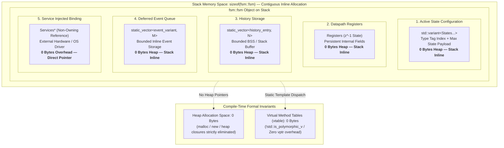

# C++ Runtime Memory Architecture & Real-Time Guarantees

In embedded systems, automotive firmware (ISO 26262 ASIL D), and aerospace controllers (DO-178C DAL A), dynamic memory allocations (`malloc`, `new`, `std::vector`, `std::function`) and dynamic virtual tables are strictly prohibited due to heap fragmentation and non-deterministic timing risks.

The `fsmc` C++17/C++20 reference backend is engineered to provide **100% zero-heap, zero-vtable, and zero-exception** guarantees.

---

## 1. Zero-Heap and Zero-VTable Guarantees

Every `fsm::fsm` instance is stored contiguously on the stack or in static/BSS storage with compile-time known bounds:

### Memory & Execution Metrics

| Metric | Architectural Guarantee | Implementation Mechanism |
| :--- | :--- | :--- |
| **Heap Allocations** | **0 Bytes** | Stack-allocated objects, no dynamic memory (`malloc`/`new`) |
| **Virtual Table Overhead** | **0 Bytes** | Compile-time template dispatch (`!std::is_polymorphic_v`) |
| **State Storage** | Contiguous inline memory | `std::variant<States...>` |
| **History & Deferred Events** | Fixed-capacity stack storage | Inline `fsm::static_vector` and `event_variant` |
| **Transition Dispatch** | Deterministic $O(1)$ execution time | Compile-time unrolled fold expressions |
| **Event Queues** | Wait-free $O(1)$ insertion | Static power-of-two circular ring buffer |

---

## 2. Inline Static Vector Storage (`fsm::static_vector`)

To support UML 2.5 History states and Deferred Event queues without dynamic heap allocations, `fsmc` provides `fsm::static_vector<T, Capacity>` in `include/fsm/backend/cpp/runtime/static_vector.hpp`:

- **Stack-Allocated Buffer**: Stores up to `Capacity` elements directly in inline storage within the `fsm` struct.
- **Deterministic $O(1)$ Operations**: `push_back`, `pop_back`, `erase`, `front`, and `back` execute in bounded constant time.
- **History Records**: Capacity is bounded at compile time to the number of composite states in the transition table (`Table::state_count`).
- **Deferred Queue**: Stores typed event variants (`Table::event_variant`) inline without type-erasure heap closures.

---

## 3. Lock-Free SPSC Ring Buffer (`fsm::spsc_ring_buffer`)

For embedded systems where discrete events are produced inside hardware Interrupt Service Routines (ISRs) and consumed by a worker control task, mutex locking is unsafe.

`fsmc` provides `fsm::spsc_ring_buffer<T, Capacity>`:

- **Power-of-Two Ring Buffer**: Array index wrapping is evaluated via bitwise masking (`index & (Capacity - 1)`), avoiding hardware division instructions.
- **Acquire-Release Memory Ordering**: Uses `std::atomic<std::size_t>` with `memory_order_acquire` and `memory_order_release` to synchronize producer and consumer without mutex locks.
- **Wait-Free O(1) Enqueue**: The producer thread (ISR) executes in a bounded number of CPU cycles without retries or spinning.

---

## 4. Seqlock Synchronization for Reader Threads

`spsc_fsm::snapshot_registers()` implements a sequence lock (seqlock) protocol allowing reader threads (e.g. telemetry or logging) to capture consistent snapshots of internal `Registers` without blocking the control task:

1. The consumer increments `seq_` to an odd number before mutating registers, and to an even number after.
2. The reader thread reads `seq_` before and after copying the registers.
3. If `seq_` was even and unchanged across the copy, the snapshot is guaranteed free of torn-reads.
