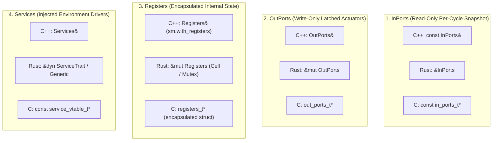

# Multi-Target Architecture & Backend Roadmap

`fsmc` is designed from first principles as a **format-agnostic compiler and code generator**, not a C++-only library. 

Its architecture strictly decouples model ingestion and formal verification from target code emission using a canonical Intermediate Representation (**`FsmIr`**). While C++ serves as the initial reference production backend, the metamodel natively maps to diverse programming languages and safety-critical execution runtimes.

> [!IMPORTANT]
> **Active Production Target vs. Roadmap Previews**: As of version `v0.5.0`, the **C++ Reference Backend** (`C++17/C++20`) is the sole production-ready code generation target. The **Rust** (`no_std`) and **C** (`MISRA-C:2012`) backends described in this roadmap represent **preview specifications and RFC designs** currently under active development.

---

## 1. Universal Target Support Matrix

| Target Language | Minimum Standard | Concurrency Models | Safety & Standards Compliance | Ecosystem Status |
| :--- | :--- | :--- | :--- | :--- |
| **C++ Target** | C++17 / C++20 | Synchronous stack, Lock-Free SPSC, Active Object | Zero heap, zero vtable, $O(1)$ WCET | **Production (v0.5.0+)** |
| **Rust Target** | Rust 2021 (`no_std`) | Typestate transitions, lock-free static channels | Compile-time memory safety, zero panic | **Preview / In Development** |
| **C Target** | ISO C99 / C11 | Static transition table, switch-case dispatch | MISRA-C:2012, DO-178C DAL-A, zero malloc | **Preview / Planned RFC** |

---

## 2. The Universal 4-Domain Datapath Across Languages

The `fsmc` 4-domain memory segregation model is language-agnostic. It guarantees mathematical determinism, absence of data races, and clear ownership semantics across all target architectures:



### Architectural Mapping Table

| Domain | Semantic Intent | C++ Reference Implementation | Planned Rust Implementation | Planned C99 Implementation |
| :--- | :--- | :--- | :--- | :--- |
| **`InPorts`** | External sampled sensor values | `const InPorts&` | `&InPorts` | `const in_ports_t* const in` |
| **`OutPorts`** | Commanded actuator outputs | `OutPorts&` | `&mut OutPorts` | `out_ports_t* const out` |
| **`Registers`** | $z^{-1}$ internal memory | Encapsulated value | Struct with ownership / borrow | `registers_t` memory block |
| **`Services`** | Non-deterministic hardware drivers | Reference / Dependency Injection | Trait object / Generic bound | Function pointer structure |

---

## 3. Rust Backend (`no_std`) — Design Specification

The Rust target emitter produces idiomatic, high-performance, and provably memory-safe state machine implementations targeting embedded firmware and systems programming.

### Core Tenets
1. **`#![no_std]` First**: 100% compatible with bare-metal microcontrollers (ARM Cortex-M, RISC-V, ESP32) without dynamic memory allocation (`alloc` not required).
2. **Compile-Time Typestate Validation**: Invalid state transitions are caught at compile-time using the Rust type system.
3. **Thread Safety Guarantees**: State machines implement `Send` and `Sync` conditionally based on the thread safety of internal registers.
4. **Lock-Free Concurrency**: Asynchronous queues map to static ring buffers (e.g. `heapless::spsc::Queue`).

### Syntax Preview
```rust
// Generated Rust State Machine (Preview)
use fsmc_runtime::prelude::*;

#[derive(Clone, Copy, PartialEq, Eq)]
pub enum State { Off, On }

pub struct LampFsm {
    state: State,
    registers: LampRegisters,
}

impl LampFsm {
    pub const fn new(registers: LampRegisters) -> Self {
        Self { state: State::Off, registers }
    }

    pub fn dispatch(&mut self, event: &Event, in_ports: &InPorts, out_ports: &mut OutPorts) -> DispatchResult {
        match (self.state, event) {
            (State::Off, Event::Toggle) => {
                self.state = State::On;
                out_ports.lamp_active = true;
                DispatchResult::Transitioned
            }
            (State::On, Event::Toggle) => {
                self.state = State::Off;
                out_ports.lamp_active = false;
                DispatchResult::Transitioned
            }
            _ => DispatchResult::Ignored,
        }
    }
}
```

---

## 4. ISO C99 / C11 Backend — MISRA-C & Aerospace

The C target generator is engineered specifically for mission-critical and safety-certified industries (automotive ISO 26262 ASIL-D, aerospace DO-178C DAL-A, medical IEC 62304).

### Core Tenets
1. **Strict MISRA-C:2012 Compliance**: Zero dynamic allocations (`malloc`/`free`), zero recursive calls, bounded loops, and strict type conversions.
2. **Compact Binary Footprint**: Encoded as flat switch-case or compact read-only ROM lookup tables.
3. **Deterministic WCET**: Bounded worst-case execution time with zero dynamic dispatch overhead.
4. **Clean Integration**: Simple C headers compatible with legacy codebases and automotive AUTOSAR Classic runtimes.

### Syntax Preview
```c
/* Generated C99 State Machine Header (Preview) */
#ifndef LAMP_FSM_H
#define LAMP_FSM_H

#include <stdbool.h>
#include <stdint.h>

typedef enum {
    LAMP_STATE_OFF = 0,
    LAMP_STATE_ON  = 1
} lamp_state_t;

typedef struct {
    lamp_state_t current_state;
    lamp_registers_t registers;
} lamp_fsm_t;

void lamp_fsm_init(lamp_fsm_t* const self, const lamp_registers_t* const initial_regs);
bool lamp_fsm_dispatch(lamp_fsm_t* const self, lamp_event_t event, const lamp_in_ports_t* const in, lamp_out_ports_t* const out);

#endif /* LAMP_FSM_H */
```

---

## 5. Summary & Contribution

The canonical IR compiler pipeline guarantees that a model specified in **OMG SysML v2**, **Cameo / MagicDraw XMI**, or **W3C SCXML** can be formally verified once with **nuXmv** and then emitted with identical behavioral semantics in C++, Rust, or C.

For discussions on backend RFCs or to contribute target emitters, refer to the [Compiler Architecture Specification](../internals/architecture.md).
