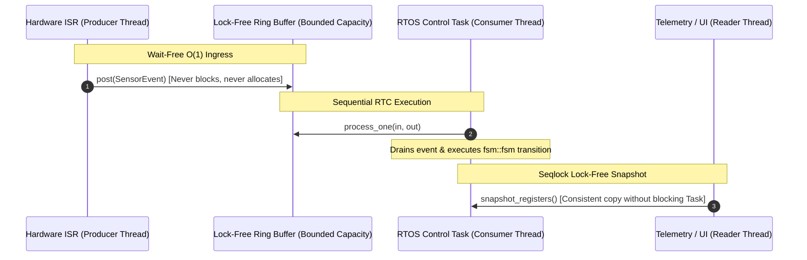

# Lock-Free SPSC Engine (`fsm::spsc_fsm`)

`fsm::spsc_fsm` is a zero-allocation, lock-free **Single-Producer Single-Consumer (SPSC)** state machine wrapper.

It is specifically engineered for **Hardware Interrupt Service Routines (ISRs)**, DMA callbacks, and bare-metal/RTOS control loops where mutex locking is unsafe or forbidden due to priority inversion risks.

---

## Architecture Overview



- **Producer Context (ISR / DMA)**: Calls `post()` in deterministic, wait-free $O(1)$ time.
- **Consumer Context (RTOS Worker)**: Calls `process_one()` or `run_until_empty()` to execute state transitions sequentially in Run-to-Completion order.
- **Reader Context (Telemetry / Loggers)**: Calls `snapshot_registers()` to capture consistent register snapshots via an atomic Sequence Lock (seqlock).

---

## Practical Example: ADC Sensor ISR to Motor Task

```cpp
#include <iostream>
#include <cassert>
#include "fsm/backend/cpp/runtime/spsc_fsm.hpp"

// 1. Define States and Events
struct Standby { static constexpr std::string_view name = "Standby"; };
struct Running { static constexpr std::string_view name = "Running"; };
struct EStop   { static constexpr std::string_view name = "EStop";   };

struct StartCmd {};
struct OverheatFault { float temp_c; };

// 2. Define Transition Table
using MotorTable = fsm::transition_table<
    fsm::row<Standby, StartCmd,      Running>,
    fsm::row<Running, OverheatFault, EStop>,
    fsm::row<EStop,   StartCmd,      Standby>
>;

// 3. Define Internal Registers
struct MotorRegisters {
    std::uint32_t fault_count = 0;
};

// 4. Instantiate spsc_fsm with QueueCapacity = 64 (must be power of two)
using SafeMotorFSM = fsm::spsc_fsm<MotorTable, fsm::no_ports, fsm::no_ports, MotorRegisters, fsm::no_services, 64>;

SafeMotorFSM g_motor_fsm;

// ----------------------------------------------------------------------------
// Producer Thread: Simulated Hardware Interrupt Service Routine (ISR)
// ----------------------------------------------------------------------------
void on_adc_sensor_interrupt(float measured_temperature) {
    if (measured_temperature > 90.0f) {
        // Enqueue event from ISR in Wait-Free O(1) time (no locks, no heap allocations)
        bool success = g_motor_fsm.post(OverheatFault{measured_temperature});
        if (!success) {
            // Queue was full: handle overflow according to safety policy
        }
    }
}

// ----------------------------------------------------------------------------
// Consumer Thread: Main Control Loop / RTOS Worker Task
// ----------------------------------------------------------------------------
void rtos_control_task() {
    // Start the motor
    g_motor_fsm.post(StartCmd{});

    // Drain and process all pending events from the lock-free queue
    std::size_t processed_count = g_motor_fsm.run_until_empty();
    std::cout << "Processed " << processed_count << " events. State: " 
              << g_motor_fsm.state_name() << "\n"; // Running

    // Simulate sensor interrupt firing
    on_adc_sensor_interrupt(98.5f);

    // Drain queue again
    g_motor_fsm.process_one();
    std::cout << "After ISR fault: State is " << g_motor_fsm.state_name() << "\n"; // EStop
    assert(g_motor_fsm.is_in_state<EStop>());
}

// ----------------------------------------------------------------------------
// Reader Thread: Asynchronous Telemetry / Monitoring (Seqlock)
// ----------------------------------------------------------------------------
void telemetry_thread() {
    // Non-blocking snapshot of internal registers without locking the consumer task
    MotorRegisters snapshot = g_motor_fsm.snapshot_registers();
    std::cout << "Telemetry: Total faults recorded = " << snapshot.fault_count << "\n";
}

int main() {
    rtos_control_task();
    telemetry_thread();
    return 0;
}
```

---

## Producer API Reference

| Method | Latency Guarantee | Description |
| :--- | :--- | :--- |
| `bool post(Event&& event)` | Wait-Free $O(1)$ | Enqueues an event into the ring buffer. Returns `false` if full. |
| `bool queue_full()` | $O(1)$ | Returns `true` if the circular queue has reached capacity. |

---

## Hybrid RTOS Loop Pattern: Combining ISR Events with Periodic Step

In mission-critical embedded control systems, a state machine often needs to handle **both** high-priority asynchronous interrupts from hardware (ISRs) and **periodic continuous control ticks** (evaluating sensors and continuous threshold guards).

Here is the standard, production-grade RTOS control task pattern:

```cpp
void rtos_periodic_control_task(void* param) {
    MotorInPorts in{};
    MotorOutPorts out{};

    for (;;) {
        // 1. Read fresh sensor snapshot (Latching Pattern):
        in = sample_sensors();

        // 2. Drain and execute all urgent events queued by hardware ISRs:
        g_motor_fsm.run_until_empty(in, out);

        // 3. Execute continuous sampled cycle step over current sensors & dwell timers:
        fsm::step_result step_res = g_motor_fsm.step(in, out);
        if (step_res.has_transitioned()) {
            // A continuous threshold guard fired (e.g. Overheat or in_state_for dwell)
        }

        // 4. Commit actuator commands to hardware:
        apply_motor_actuation(out);

        // 5. Sleep until the next deterministic 20ms period (50 Hz):
        vTaskDelayUntil(&last_wake_time, pdMS_TO_TICKS(20));
    }
}
```

---

## Consumer API Reference

| Method | Description |
| :--- | :--- |
| `bool process_one([in, out])` | Pops and executes the single oldest event. Returns `false` if the queue was empty. |
| `std::size_t run_until_empty([in, out])` | Processes all currently queued events in a loop until the queue is completely drained. |
| `step_result step([dt], [in, out])` | Evaluates continuous condition transitions and dwell timers (`in_state_for`) on the current state. |
| `std::size_t queue_size()` | Returns the current count of queued pending events. |

---

## Reader API Reference (Lock-Free Seqlock)

| Method | Description |
| :--- | :--- |
| `Registers snapshot_registers()` | Captures a consistent copy of `Registers` using a sequence lock without mutexes or blocking the worker task. |
| `std::string_view state_name()` | Returns the name string of the current active state via atomic load. |
| `bool is_in_state<State>()` | Checks if the machine is currently in the specified `State` type. |
