# `fsm::spsc_fsm` (Lock-Free SPSC / ISR-Safe)

`fsm::spsc_fsm<TransitionTable, Context, QueueCapacity, InitialState>` is a specialized, zero-allocation Single-Producer Single-Consumer FSM execution engine designed for Interrupt Service Routines (ISRs), hard real-time control loops, and multi-core embedded systems.

---

## Class Template Synopsis

```cpp
namespace fsm {

template <
    typename Table,
    typename Context = no_context,
    std::size_t QueueCapacity = 64,
    typename InitialState = typename Table::initial_state
>
class spsc_fsm {
public:
    using table_type   = Table;
    using context_type = Context;
    using state_type   = InitialState;

    static constexpr std::size_t capacity = QueueCapacity;

    // Constructors
    constexpr spsc_fsm() noexcept;
    constexpr explicit spsc_fsm(Context ctx) noexcept;

    // Producer Interface: Wait-Free O(1), ISR-Safe (Interrupt Context)
    template <typename Event>
    bool enqueue(const Event& ev) noexcept;

    template <typename Event>
    bool enqueue(Event&& ev) noexcept;

    // Consumer Interface: Sequential Drain (RTOS Task / Control Thread)
    bool process_one() noexcept;
    std::size_t run_until_empty() noexcept;

    // Reader Interface: Lock-Free Seqlock Snapshot (Telemetry / UI Thread)
    [[nodiscard]] std::size_t state_index() const noexcept;
    [[nodiscard]] std::string_view state_name() const noexcept;

    template <typename State>
    [[nodiscard]] bool is_in_state() const noexcept;

    [[nodiscard]] Context snapshot_context() const noexcept;

    template <typename Func>
    void with_context(Func&& fn) const noexcept;

    // Queue Capacity Queries
    [[nodiscard]] bool is_queue_empty() const noexcept;
    [[nodiscard]] bool is_queue_full() const noexcept;
    [[nodiscard]] std::size_t queue_size() const noexcept;
};

} // namespace fsm
```

---

## Concurrency Architecture & Memory Ordering

```mermaid
flowchart LR
    subgraph Producer["1. ISR Producer - Wait-Free O(1)"]
        HW["Hardware Interrupt (NVIC/PLIC)"]
        Push["Atomic Store Head<br/>memory_order_release"]
        HW --> Push
    end

    subgraph RingBuffer["2. Bounded Lock-Free Ring Buffer"]
        Queue["Static Array (QueueCapacity)<br/>Zero Heap Allocations"]
    end

    subgraph Consumer["3. RTOS Task / Consumer Loop"]
        Pop["Atomic Store Tail<br/>memory_order_release"]
        Step["fsm::fsm Dispatch Execution"]
        SeqLock["Update Context via Seqlock<br/>Atomic Sequence Number"]
        Pop -->|run_until_empty| Step
        Step --> SeqLock
    end

    subgraph Reader["4. Telemetry / Watchdog Task"]
        Read["snapshot_context()<br/>Non-blocking Read Loop"]
    end

    Push -->|enqueue| Queue
    Queue --> Pop
    SeqLock -.-> Read
```




### 1. Wait-Free O(1) Producer (`enqueue`)
- **No Mutexes, No Locks, No Dynamic Memory**: Executes strictly within a constant number of CPU cycles (O(1)).

- **Safe for Nested Hardware Interrupts**: Can be called directly inside high-frequency UART, SPI, DMA, or timer ISRs (e.g. ARM NVIC, RISC-V PLIC) without causing deadlock or priority inversion.
- Returns `true` if the event was pushed to the ring buffer, or `false` if the buffer is full.

### 2. Single Consumer Execution (`process_one`, `run_until_empty`)
- Pops events from the ring buffer and executes state transitions sequentially on the main control thread or RTOS task.
- Guarantees deterministic state ordering without race conditions.

### 3. Lock-Free Seqlock Snapshot (`snapshot_context`)
- Protects context reads from other threads (e.g. telemetry, GUI, or watchdog) using atomic sequence counting (`seqlock`).
- Readers never block or delay the consumer thread.

---

## Bare-Metal Real-World Example (STM32 / FreeRTOS)

```cpp
#include "uav_fsm.hpp"
#include <FreeRTOS.h>
#include <task.h>

// Global static SPSC FSM with 128-element lock-free ring buffer
struct UavContext {
    uint32_t battery_mv{14800};
    int32_t altitude_cm{0};
    bool failsafe_active{false};
};

static UavContext g_ctx;
static fsm::spsc_fsm<AutonomousUavMissionTable, UavContext, 128, Preflight> g_fsm(g_ctx);

// ----------------------------------------------------------------------------
// 1. Hardware Sensor Interrupt (Producer - Wait-Free O(1))
// ----------------------------------------------------------------------------
extern "C" void EXTI15_10_IRQHandler(void) {
    BaseType_t xHigherPriorityTaskWoken = pdFALSE;

    // Direct ISR event enqueue - never blocks, never allocates heap
    bool ok = g_fsm.enqueue(LowBatteryEvent{});
    if (!ok) {
        // Queue full error handler (e.g., increment dropped telemetry counter)
    }

    // Clear interrupt flag
    EXTI->PR = (1 << 13);
    portYIELD_FROM_ISR(xHigherPriorityTaskWoken);
}

// ----------------------------------------------------------------------------
// 2. Control Loop RTOS Task (Consumer)
// ----------------------------------------------------------------------------
void Task_ControlLoop(void* pvParameters) {
    while (true) {
        // Drain all pending events received from hardware ISRs
        std::size_t processed = g_fsm.run_until_empty();

        // Run cyclic step every 10ms
        vTaskDelay(pdMS_TO_TICKS(10));
    }
}

// ----------------------------------------------------------------------------
// 3. Telemetry Broadcast Task (Lock-Free Reader)
// ----------------------------------------------------------------------------
void Task_Telemetry(void* pvParameters) {
    while (true) {
        // Take lock-free snapshot without impacting the control loop
        UavContext snap = g_fsm.snapshot_context();
        std::string_view state = g_fsm.state_name();

        // Broadcast over radio modem
        radio_send_telemetry(state.data(), snap.altitude_cm, snap.battery_mv);

        vTaskDelay(pdMS_TO_TICKS(100));
    }
}
```
