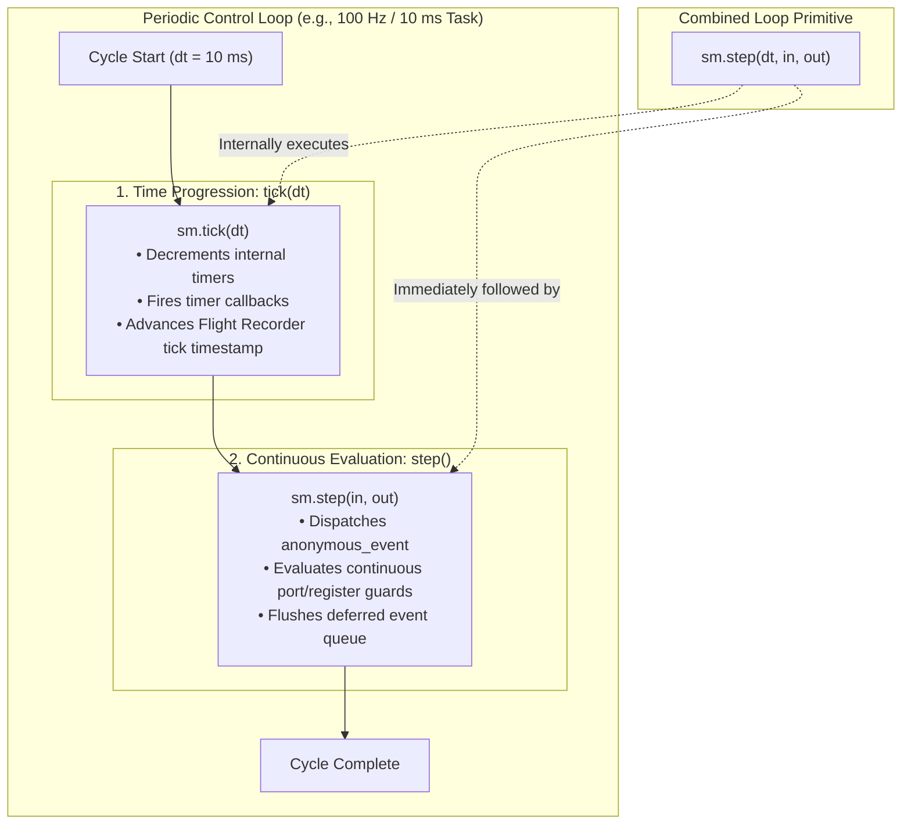
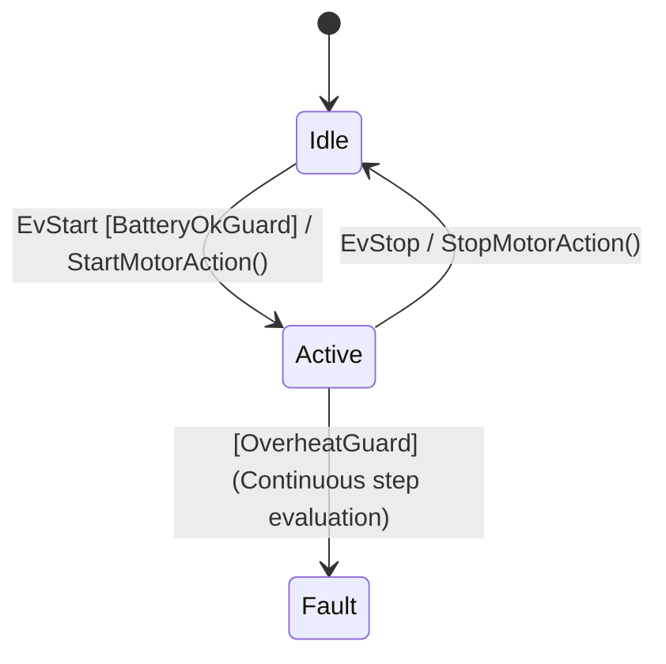

# Synchronous Core Engine (`fsm::fsm`)

`fsm::fsm` is the foundational execution engine of `fsmc`. It executes state transitions directly on the caller's stack with **zero dynamic memory allocation**, **zero virtual table overhead**, and deterministic $O(1)$ dispatch time.

> [!NOTE]
> For the universal building blocks shared across all execution engines (States, Events, 4-Domain Memory, Guard & Action signatures, and History), see the **[Universal Runtime Fundamentals](core_concepts.md)** chapter.

---

## 1. Synchronous Execution Model

When invoking `dispatch()` or `step()` on `fsm::fsm`:

1. **Stack Execution**: Transition logic, guard evaluation, and action execution run synchronously within the caller's execution thread.
2. **Deterministic Run-to-Completion (RTC)**: The state transition completes entirely before the function call returns.
3. **Zero Queue Overhead**: No dynamic heap allocations or asynchronous queue latencies.

```
Caller Thread ──► fsm.dispatch(Event, in, out)
                       │
                       ├─► 1. Evaluate Transition Guard(s)
                       ├─► 2. Execute on_exit(SourceState)
                       ├─► 3. Execute Transition Action(s)
                       ├─► 4. Mutate State Variant & Execute on_enter(TargetState)
                       ▼
Caller Thread ◄── Returns dispatch_result
```

---

---

## 2. Deterministic Execution Primitives: `dispatch()` vs `tick()` vs `step()` vs `step(dt)`

In real-time embedded systems, a state machine must handle two orthogonal dimensions of execution:
1. **Discrete Events**: Asynchronous interrupts, user commands, or network messages arriving at arbitrary points in time.
2. **Discrete Time Progression**: The passage of physical time ($\Delta t$), timer countdowns, and continuous sensor threshold evaluations.

To provide total deterministic control with **0 background OS threads** and **0 hidden delays**, `fsmc` structures execution across four distinct primitives:



### Comprehensive Primitive Semantics

| Primitive | Operation Under the Hood | Advances Time? | Evaluates Continuous Guards? | Flushes Deferred Queue? | Typical Use Case |
| :--- | :--- | :--- | :--- | :--- | :--- |
| **`tick(dt, [callback])`** | Decrements active timers in `deterministic_timer_manager`, calls expiration callbacks, advances Flight Recorder tick timestamp. | **Yes** ($+\Delta t$) | **No** | **No** | Advancing model time in multi-rate architectures or decoupled hardware timer ISRs. |
| **`step([in, out, srv])`** | Dispatches `fsm::anonymous_event`, evaluates continuous threshold guards against current `InPorts` and `Registers`, processes deferred events. | **No** | **Yes** | **Yes** (if transitioned) | Polling sensor threshold conditions without advancing the timer clock. |
| **`step(dt, [in, out])`** | **Unified Primitive**: Internally calls `this->tick(dt)` and immediately executes `this->step(in, out)`. | **Yes** ($+\Delta t$) | **Yes** | **Yes** (if transitioned) | **Standard choice** for fixed-rate control loops (e.g. 10 ms cyclic task). |
| **`dispatch(Event)`** | Evaluates discrete transitions matching strongly-typed struct `Event`. If unhandled and marked deferrable, saves into deferred queue. | **No** | **No** | **Yes** (if transitioned) | Asynchronous command interrupts, CAN bus packets, or telemetry events. |

---

### How Timed Transitions (`after(duration)`) Work

When a statechart defines a timed transition such as:
```sysml
state Armed {
    transition on after(500 ms) then LaunchTimeout;
}
```

The compiler and runtime coordinate time deterministically:
1. **Timer Allocation**: The state machine reserves an internal timer ID in its compile-time bounded `deterministic_timer_manager<TimerCapacity>`.
2. **State Entry**: Upon entering `Armed`, the timer is armed with duration `500`.
3. **Time Progression**: Each call to `sm.tick(dt)` or `sm.step(dt)` subtracts $\Delta t$ from the active timer countdown.
4. **Expiration**: When the countdown reaches zero:
   * If using `sm.tick(dt, on_expired)`, the callback is notified with the expired timer ID.
   * In generated models with timed triggers, the expiration triggers the transition directly to `LaunchTimeout`.
5. **State Exit**: If an external event (e.g. `EvCancel`) causes a transition out of `Armed` before the timeout elapses, the timer is automatically disarmed, preventing stale timeout triggers.

---

### Practical Control Loop Implementation

Here is how a real-time periodic control task integrates both discrete event dispatching and deterministic time stepping:

```cpp
// 100 Hz Control Task (Period = 10 ms)
void control_loop_task(MyFsm& sm, MotorInPorts& in, MotorOutPorts& out) {
    constexpr uint64_t dt_ms = 10;
    
    // 1. Read hardware sensors into InPorts snapshot
    in.temperature_celsius = Hardware_ReadThermistor();
    in.battery_percent = Hardware_ReadBatterySoc();
    
    // 2. Process any asynchronous discrete command received from CAN/UART
    if (Hardware_HasCommandPacket()) {
        auto cmd = Hardware_ReadCommandPacket();
        if (cmd.id == CMD_ARM) {
            sm.dispatch(EvArm{}, in, out);
        }
    }
    
    // 3. Advance time by dt and evaluate continuous guards
    // (This ticks timers, checks after(..) timeouts, and evaluates continuous guards)
    fsm::step_result res = sm.step(dt_ms, in, out);
    
    if (res.has_transitioned()) {
        // Trace transition if needed
    }
    
    // 4. Write OutPorts snapshot to physical actuator hardware
    Hardware_SetMotorPwm(out.motor_enable ? out.target_velocity : 0.0f);
}
```

---

## 3. Complete End-to-End Control Application

Here is a complete, self-contained C++ program showcasing the synchronous engine running an industrial motor controller with sensor snapshots, actuator buffers, internal persistent memory, and driver services:



```cpp
#include <iostream>
#include <string_view>
#include <string>
#include <cassert>
#include "fsm/backend/cpp/runtime/fsm.hpp"

// 1. States & Events
struct Idle   { static constexpr std::string_view name = "Idle";   };
struct Active { static constexpr std::string_view name = "Active"; };
struct Fault  { static constexpr std::string_view name = "Fault";  };

struct EvStart {};
struct EvStop  {};

// 2. Segregated Memory Domains (4-Tuple Model)
struct MotorInPorts {
    float battery_percent = 100.0f;
    float temperature_celsius = 25.0f;
};

struct MotorOutPorts {
    bool motor_enable = false;
    float target_velocity = 0.0f;
};

struct MotorRegisters {
    std::uint32_t cycle_counter = 0;
};

struct MotorServices {
    void log_info(std::string_view msg) {
        std::cout << "[LOG INFO] " << msg << "\n";
    }
};

// 3. Guards and Action Functors (C++20 Concept Compliant)
struct BatteryOkGuard {
    bool operator()(const MotorInPorts& in) const noexcept {
        return in.battery_percent >= 20.0f;
    }
};

struct OverheatGuard {
    bool operator()(const MotorInPorts& in) const noexcept {
        return in.temperature_celsius > 85.0f;
    }
};

struct StartMotorAction {
    void operator()(const EvStart&, const MotorInPorts& in, MotorOutPorts& out, MotorRegisters& reg, MotorServices& srv) const {
        out.motor_enable = true;
        out.target_velocity = 1500.0f;
        reg.cycle_counter += 1;
        srv.log_info("Motors started with battery at " + std::to_string(in.battery_percent) + "%");
    }
};

struct StopMotorAction {
    void operator()(MotorOutPorts& out, MotorServices& srv) const {
        out.motor_enable = false;
        out.target_velocity = 0.0f;
        srv.log_info("Motors stopped.");
    }
};

// 4. Transition Table Definition
using MotorTable = fsm::transition_table<
    // Event-driven transitions:
    fsm::row<Idle,   EvStart, Active>::when<BatteryOkGuard>::then<StartMotorAction>,
    fsm::row<Active, EvStop,  Idle>::then<StopMotorAction>,
    // Continuous sampled threshold transition (evaluated in step()):
    fsm::row<Active, fsm::anonymous_event, Fault>::when<OverheatGuard>
>;

// Modern Policy-Based Configuration (v0.5.0+):
using MotorFSM = fsm::make_fsm<
    MotorTable,
    fsm::with_ports<MotorInPorts, MotorOutPorts>,
    fsm::with_registers<MotorRegisters>,
    fsm::with_services<MotorServices>
>;
// (Legacy positional syntax is also supported: fsm::fsm<MotorTable, MotorInPorts, MotorOutPorts, MotorRegisters, MotorServices>)

// 5. Execution Application
int main() {
    MotorRegisters reg{};
    MotorServices srv;
    MotorFSM fsm(reg, srv);

    MotorInPorts in{.battery_percent = 85.0f, .temperature_celsius = 28.0f};
    MotorOutPorts out{};

    // 1. Reactive Event Dispatching
    fsm::dispatch_result res = fsm.dispatch(EvStart{}, in, out);
    if (res.is_success()) {
        std::cout << "Transitioned to: " << fsm.current_state_name() << "\n";
        assert(out.motor_enable == true);
    }

    // 2. Continuous Sampled Step (Evaluates continuous threshold transitions)
    in.temperature_celsius = 92.0f; // Overheating condition
    fsm::step_result step_res = fsm.step(in, out);
    if (step_res.has_transitioned()) {
        std::cout << "Thermal protection triggered! State: " << fsm.current_state_name() << "\n";
        assert(fsm.is_in<Fault>());
    }

    // 3. State & Register Introspection
    std::cout << "Total cycles executed: " << fsm.registers().cycle_counter << "\n";
    return 0;
}
```

---

## 4. Parameter Injection Styles

Depending on whether your state machine uses I/O ports or injected services, `fsmc` supports three call styles:

### Style A: Call-Site I/O Injection (Latching Pattern)
Pass inputs snapshot and output write buffer at every cycle:

```cpp
MotorInPorts in = read_sensors();
MotorOutPorts out{};

fsm.dispatch(EvStart{}, in, out); // Evaluates transition and populates out
commit_actuators(out);
```

### Style B: Constructor-Bound Services (Omit `srv` at Call Site)
If `Services&` was passed during construction (`fsm(reg, srv)`), you can omit `srv` at call sites:

```cpp
MotorFSM fsm(reg, srv);

// InPorts and OutPorts passed per cycle; srv is used from constructor binding
fsm.dispatch(EvStart{}, in, out);
fsm.step(in, out);
```

> [!TIP]
> **Non-Default Constructible Services**:  
> In `v0.5.0+`, `Services` is not required to have a default constructor. The runtime directly references `*services_` provided at construction time, avoiding spurious dummy stack instantiations. This allows `Services` to hold hardware references, open sockets, or non-copyable handles configured at initialization.

### Style C: Stateless / Minimal State Machine (No Ports, No Services)
For pure control flow with `fsm::no_ports` and `fsm::no_services`:

```cpp
using SimpleFSM = fsm::fsm<SimpleTable>;

SimpleFSM fsm;
fsm.dispatch(EvStart{});
fsm.step();
```

---

## 5. Timed State Dwell Recipe (`in_state_for<Threshold>`)

In periodic control loops (e.g. 1 kHz sensor cycle), you often want a state machine to remain in a state for a fixed duration before transitioning automatically.

With `fsmc`, continuous time dwell is counted deterministically in `Registers` ($z^{-1}$) without wall-clock drift:

```cpp
#include "fsm/backend/cpp/runtime/fsm.hpp"
#include <iostream>

struct PreCharge { static constexpr std::string_view name = "PreCharge"; };
struct Armed     { static constexpr std::string_view name = "Armed";     };

// Transition after 5 periodic ticks in PreCharge:
using PowerTable = fsm::transition_table<
    fsm::row<PreCharge, fsm::anonymous_event, Armed>::when<fsm::in_state_for<5>>
>;

int main() {
    fsm::fsm<PowerTable> sm;

    // Simulate 100 Hz control loop ticks:
    for (int tick = 1; tick <= 6; ++tick) {
        fsm::step_result res = sm.step();
        std::cout << "Tick " << tick << ": state = " << sm.current_state_name();
        if (res.has_transitioned()) {
            std::cout << " (Dwell reached -> transitioned!)";
        }
        std::cout << "\n";
    }
    return 0;
}
```

**Output:**
```
Tick 1: state = PreCharge
Tick 2: state = PreCharge
Tick 3: state = PreCharge
Tick 4: state = PreCharge
Tick 5: state = Armed (Dwell reached -> transitioned!)
Tick 6: state = Armed
```

---

## 6. Temporary Stack Buffer Semantics for Single-Argument `dispatch(event)`

If your state machine defines custom `InPorts` and `OutPorts`, but you invoke the shorthand single-argument `fsm.dispatch(event)`:

1. **`InPorts`**: Constructs a temporary default-initialized `InPorts{}` on the stack for the duration of the call.
2. **`OutPorts`**: Constructs a temporary `OutPorts{}` on the stack. Actions will write to it, but **the output values will be discarded when `dispatch()` returns**.
3. **`Services`**: Automatically reuses the service bound at construction (`fsm(reg, srv)`).

> [!IMPORTANT]
> **Capturing Actuator Outputs**: If transition actions write actuator commands to `OutPorts`, always pass your output buffer `fsm.dispatch(event, in, out)` so your application can read and commit the results to hardware.

---

## 7. Next Steps
- For asynchronous, lock-free ISR event ingestion, see **[Lock-Free SPSC Engine (`fsm::spsc_fsm`)](spsc_fsm.md)**.
- For multi-threaded active object queues and timers, see **[Thread-Safe MPSC Engine (`fsm::thread_safe_fsm`)](thread_safe_fsm.md)**.
- For complete method signatures and traits, see the **[Full Runtime API Reference](reference.md)**.
