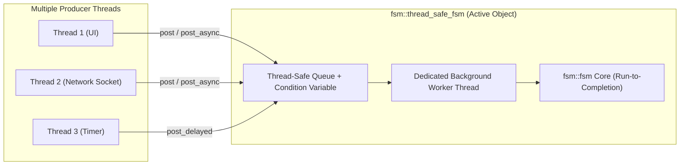

# Thread-Safe Active Object Engine (`fsm::thread_safe_fsm`)

`fsm::thread_safe_fsm` wraps the core synchronous engine in a thread-safe **Active Object** architecture with a dedicated background worker thread, thread-safe event queueing, asynchronous `std::future` results, and delayed timed event scheduling.

It is designed for desktop applications, multi-threaded backend services, and network protocol daemons where multiple producer threads concurrently post events.

---

## Architecture Overview



---

## Practical Example: Network Connection Manager

```cpp
#include <iostream>
#include <chrono>
#include <cassert>
#include "fsm/backend/cpp/runtime/thread_safe_fsm.hpp"

using namespace std::chrono_literals;

// 1. Define States and Events
struct Disconnected { static constexpr std::string_view name = "Disconnected"; };
struct Connecting   { static constexpr std::string_view name = "Connecting";   };
struct Connected    { static constexpr std::string_view name = "Connected";    };

struct ConnectCmd    { std::string host; };
struct HandshakeOk   {};
struct DisconnectCmd {};

// 2. Define Transition Table
using NetTable = fsm::transition_table<
    fsm::row<Disconnected, ConnectCmd,    Connecting>,
    fsm::row<Connecting,   HandshakeOk,   Connected>,
    fsm::row<Connected,    DisconnectCmd, Disconnected>
>;

int main() {
    // 3. Instantiate thread_safe_fsm (starts background worker thread)
    fsm::thread_safe_fsm<NetTable> client;

    std::cout << "Initial state: " << client.current_state_name() << "\n"; // Disconnected

    // 4. Asynchronous Dispatch with std::future
    std::future<fsm::dispatch_result> future_res = client.post_async(ConnectCmd{"api.server.com"});
    
    // Wait for the transition to complete on the worker thread
    fsm::dispatch_result result = future_res.get();
    if (result.is_success()) {
        std::cout << "State after ConnectCmd: " << client.current_state_name() << "\n"; // Connecting
    }

    // 5. Scheduled Delayed Event (e.g. timeout after 50ms)
    client.post_delayed(HandshakeOk{}, 20ms);

    // Wait briefly for the timed event to fire
    std::this_thread::sleep_for(50ms);
    std::cout << "State after delayed handshake: " << client.current_state_name() << "\n"; // Connected
    assert(client.is_in_state<Connected>());

    // 6. Non-blocking fire-and-forget post with callback
    client.post(DisconnectCmd{}, [](const fsm::dispatch_result& res) {
        std::cout << "Callback: Disconnect completed with status = " 
                  << static_cast<int>(res.status) << "\n";
    });

    std::this_thread::sleep_for(20ms);
    std::cout << "Final state: " << client.current_state_name() << "\n"; // Disconnected

    // Worker thread is automatically stopped and joined upon destruction
    return 0;
}
```

---

## API Summary

### Asynchronous Event Posting

| Method | Return Type | Description |
| :--- | :--- | :--- |
| `post(event)` | `void` | Thread-safe, non-blocking fire-and-forget event push. |
| `post(event, callback)` | `void` | Enqueues event and invokes `callback(dispatch_result)` upon completion. |
| `post_async(event)` | `std::future<dispatch_result>` | Enqueues event and returns a future to await the transition result. |
| `post_delayed(event, duration)` | `void` | Schedules an event to fire after the specified `std::chrono::duration` delay. |

### Thread-Safe Inspection

| Method | Return Type | Description |
| :--- | :--- | :--- |
| `current_state_name()` | `std::string_view` | Safely acquires lock and returns the active state name. |
| `is_in_state<State>()` | `bool` | Checks active state under mutex synchronization. |
| `snapshot_registers()` | `Registers` | Copies internal registers under mutex lock. |
