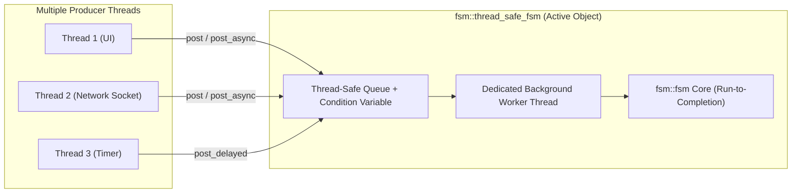

# Thread-Safe Active Object Engine (`fsm::thread_safe_fsm`)

`fsm::thread_safe_fsm` wraps the core synchronous engine in a thread-safe **Active Object** architecture with a dedicated background worker thread, thread-safe event queueing, asynchronous `std::future` results, and delayed timed event scheduling.

It is designed for desktop applications, multi-threaded backend services, and network protocol daemons where multiple producer threads concurrently post events.

---

## Architecture Overview



---

## Practical Example: Network Connection Manager

```cpp
#include <iostream>
#include <chrono>
#include <cassert>
#include "fsm/backend/cpp/runtime/thread_safe_fsm.hpp"

using namespace std::chrono_literals;

// 1. Define States and Events
struct Disconnected { static constexpr std::string_view name = "Disconnected"; };
struct Connecting   { static constexpr std::string_view name = "Connecting";   };
struct Connected    { static constexpr std::string_view name = "Connected";    };

struct ConnectCmd    { std::string host; };
struct HandshakeOk   {};
struct DisconnectCmd {};

// 2. Define Transition Table
using NetTable = fsm::transition_table<
    fsm::row<Disconnected, ConnectCmd,    Connecting>,
    fsm::row<Connecting,   HandshakeOk,   Connected>,
    fsm::row<Connected,    DisconnectCmd, Disconnected>
>;

int main() {
    // 3. Instantiate thread_safe_fsm (starts background worker thread)
    fsm::thread_safe_fsm<NetTable> client;

    std::cout << "Initial state: " << client.current_state_name() << "\n"; // Disconnected

    // 4. Asynchronous Dispatch with std::future
    std::future<fsm::dispatch_result> future_res = client.post_async(ConnectCmd{"api.server.com"});
    
    // Wait for the transition to complete on the worker thread
    fsm::dispatch_result result = future_res.get();
    if (result.is_success()) {
        std::cout << "State after ConnectCmd: " << client.current_state_name() << "\n"; // Connecting
    }

    // 5. Scheduled Delayed Event (e.g. timeout after 50ms)
    client.post_delayed(HandshakeOk{}, 20ms);

    // Wait briefly for the timed event to fire
    std::this_thread::sleep_for(50ms);
    std::cout << "State after delayed handshake: " << client.current_state_name() << "\n"; // Connected
    assert(client.is_in_state<Connected>());

    // 6. Non-blocking fire-and-forget post with callback
    client.post(DisconnectCmd{}, [](const fsm::dispatch_result& res) {
        std::cout << "Callback: Disconnect completed with status = " 
                  << static_cast<int>(res.status) << "\n";
    });

    std::this_thread::sleep_for(20ms);
    std::cout << "Final state: " << client.current_state_name() << "\n"; // Disconnected

    // Worker thread is automatically stopped and joined upon destruction
    return 0;
}
```

---

## Asynchronous Physical Timers (`std::chrono`)

`fsm::thread_safe_fsm` provides high-precision asynchronous timers backed by `std::chrono::steady_clock` and an internal deadline priority queue.

### Choosing Between `post_delayed` and `post_state_timeout`

| Feature | `post_delayed(event, duration)` | `post_state_timeout(event, duration)` |
| :--- | :--- | :--- |
| **Behavior** | **Unconditional Timer**: Always fires after `duration`. | **State-Bound Timeout**: Bound strictly to the current state. |
| **State Change Handling** | Fires regardless of intermediate state transitions. | **Auto-Cancelled**: Discarded automatically if state changes before deadline. |
| **Target Use Cases** | Periodic heartbeats, keepalives, background poll ticks. | Protocol timeouts, sensor ACK deadlines, safety watchdog timers. |

---

### State Timeout Auto-Cancellation Lifecycle

A classic race condition in multi-threaded asynchronous state machines occurs when a timeout is scheduled for State $A$, but an external signal transitions the machine to State $B$ before the timer expires. When the obsolete timer eventually fires in State $B$, it triggers an unintended transition!

`fsmc` solves this deterministically:
1. **Registration**: When calling `post_state_timeout(ev, delay)`, the runtime captures `registered_state = active_state`.
2. **Execution Check**: When the deadline expires, the background worker verifies `active_state == registered_state`.
3. **Safe Discard**: If the machine transitioned away in the meantime, the event is **silently discarded** without executing any guard or action.

```
Scenario A: Nominal Expiration (Timeout Executes)
State: Authenticating ──────────► [100ms Elapses] ──────────► State: TimeoutError
                                  (State unchanged: Transition fires!)

Scenario B: Early External Event (Timeout Auto-Cancelled)
State: Authenticating ──► [30ms: EvAuthSuccess] ──► State: Connected
                                                           │
                                                    [100ms Elapses]
                                                    (State != Authenticating)
                                                    ▼
                                                    Silently Discarded (0 side-effects)
```

---

### Complete Code Example

```cpp
#include "fsm/backend/cpp/runtime/thread_safe_fsm.hpp"
#include <iostream>
#include <chrono>
#include <cassert>

using namespace std::chrono_literals;

struct Authenticating { static constexpr std::string_view name = "Authenticating"; };
struct Connected      { static constexpr std::string_view name = "Connected";      };
struct TimeoutError   { static constexpr std::string_view name = "TimeoutError";   };

struct EvAuthSuccess {};
struct EvTimeout     {};

using AuthTable = fsm::transition_table<
    fsm::row<Authenticating, EvAuthSuccess, Connected>,
    fsm::row<Authenticating, EvTimeout,     TimeoutError>
>;

int main() {
    fsm::thread_safe_fsm<AuthTable> sm;

    // 1. Schedule a 100ms safety timeout for the Authenticating state:
    sm.post_state_timeout(EvTimeout{}, 100ms);

    // 2. An external authentication packet arrives quickly after 20ms:
    std::this_thread::sleep_for(20ms);
    sm.post(EvAuthSuccess{});

    // 3. Wait past the original 100ms deadline:
    std::this_thread::sleep_for(120ms);

    // State remains Connected! The EvTimeout was automatically discarded upon pop.
    std::cout << "Final active state: " << sm.current_state_name() << "\n"; // "Connected"
    assert(sm.is_in_state<Connected>());
    return 0;
}
```

---

### Under the Hood: Zero CPU Consumption

The timer subsystem is engineered for maximum energy efficiency:

- **Priority Queue**: Pending timers are ordered by absolute deadline timestamp (`std::chrono::steady_clock::time_point`).
- **Zero-CPU Sleeping**: The worker thread sleeps via `cv_.wait_until(lock, next_deadline)`. It consumes **0% CPU** while idle.
- **Instant Wakeup**: The worker wakes up immediately when the earliest deadline expires or when a new event is posted from another thread.

---

## When to Use `step()` vs Pure Event-Driven Mode

`fsm::thread_safe_fsm` can be operated in two distinct modes depending on your application architecture:

### Mode 1: Pure Event-Driven Quiescence (90% of Desktop / Network Daemons)

In standard GUI apps, REST microservices, or protocol clients:

- The worker thread stays **asleep at 0.0% CPU** until an event arrives via `post()`, `post_async()`, or an asynchronous timer `post_state_timeout(...)` expires.
- **You do NOT invoke `step()` in this mode.**

### Mode 2: Thread-Safe Periodic Polling Loop (Game Engines / Robotics / ROS2)
When an external high-frequency loop (e.g. 60 FPS rendering/physics loop, or 100 Hz ROS2 timer callback) periodically reads fresh sensor feeds and needs to evaluate continuous guards:

```cpp
// External 60 Hz timer callback / Physics loop:
void on_timer_tick(const SensorData& raw_sensors) {
    MotorInPorts in = transform_sensors(raw_sensors);
    MotorOutPorts out{};

    // Thread-safe: acquires internal mutex, evaluates continuous guards, updates OutPorts:
    fsm::step_result res = client_fsm.step(in, out);
    if (res.has_transitioned()) {
        std::cout << "Continuous threshold fired: " << client_fsm.current_state_name() << "\n";
    }

    apply_actuators(out);
}
```

---

## API Summary

### Asynchronous Event Posting & Timers

| Method | Return Type | Description |
| :--- | :--- | :--- |
| `post(event)` | `void` | Thread-safe, non-blocking fire-and-forget event push. |
| `post(event, callback)` | `void` | Enqueues event and invokes `callback(dispatch_result)` upon completion. |
| `post_async(event)` | `std::future<dispatch_result>` | Enqueues event and returns a future to await the transition result. |
| `post_delayed(event, duration, cancel_if_state_changes=false)` | `void` | Schedules an event to fire after the specified `std::chrono::duration` delay. |
| `post_state_timeout(event, duration)` | `void` | Schedules a state timeout that is **automatically invalidated and discarded** if the machine transitions before the deadline. |

### Synchronous Sampled Control Loop (`step`)

| Method | Return Type | Description |
| :--- | :--- | :--- |
| `step([dt], in, out, srv)` | `step_result` | Thread-safe evaluation of continuous anonymous transitions under mutex lock. |

### Thread-Safe Inspection

| Method | Return Type | Description |
| :--- | :--- | :--- |
| `current_state_name()` | `std::string_view` | Safely acquires lock and returns the active state name. |
| `is_in_state<State>()` | `bool` | Checks active state under mutex synchronization. |
| `snapshot_registers()` | `Registers` | Copies internal registers under mutex lock. |
