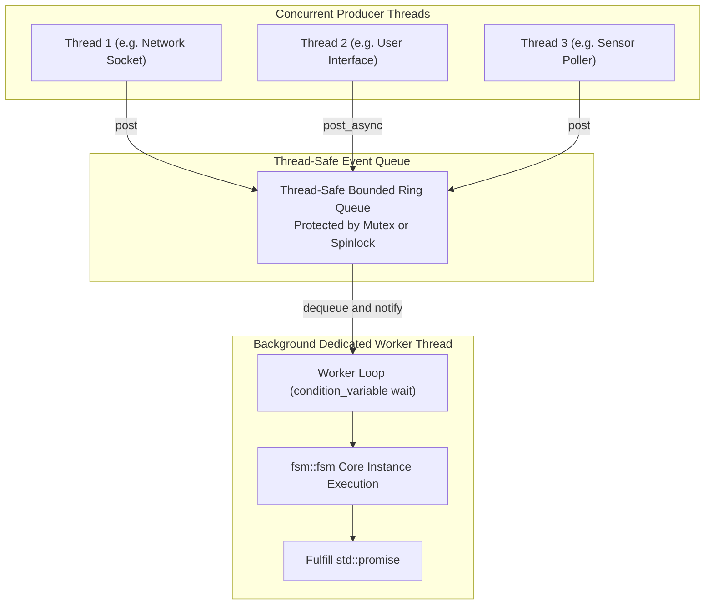

# `fsm::thread_safe_fsm` (Thread-Safe MPSC Engine)

`fsm::thread_safe_fsm<TransitionTable, Context, InitialState, Policy>` is an asynchronous Multi-Producer Single-Consumer (MPSC) state machine execution engine designed for multi-threaded services, robotics middleware (ROS 2), game engine architectures, and high-concurrency systems.

---

## Class Template Synopsis

```cpp
namespace fsm {

template <
    typename Table,
    typename Context = no_context,
    typename InitialState = typename Table::initial_state
>
class thread_safe_fsm {
public:
    using table_type   = Table;
    using context_type = Context;
    using state_type   = InitialState;

    // Constructors & Lifecycle
    explicit thread_safe_fsm(Context ctx = Context{});
    ~thread_safe_fsm();

    // 1. Asynchronous Fire-and-Forget Enqueue
    template <typename Event>
    void post(Event&& event);

    // 2. Asynchronous Enqueue with std::future Result
    template <typename Event>
    std::future<dispatch_result> post_async(Event&& event);

    // 3. Synchronous Dispatch (Blocks caller thread until execution completes)
    template <typename Event>
    dispatch_result dispatch_sync(const Event& event);

    // Thread-Safe State Inspection
    [[nodiscard]] std::string_view current_state_name() const;
    [[nodiscard]] std::size_t state_index() const;

    template <typename State>
    [[nodiscard]] bool is_in_state() const;

    // Synchronized Context Access
    template <typename Func>
    void with_context(Func&& fn);

    template <typename Func>
    auto with_context(Func&& fn) const;

    // Worker Control
    void stop();
    [[nodiscard]] bool is_running() const noexcept;
    [[nodiscard]] std::size_t pending_events_count() const;
};

} // namespace fsm
```

---

## Multi-Threaded Execution Flow




---

## Complete Multi-Threaded Example


```cpp
#include "uav_fsm.hpp"
#include <iostream>
#include <thread>
#include <vector>

struct FlightContext {
    int battery{100};
    bool emergency{false};
};

int main() {
    FlightContext ctx;
    fsm::thread_safe_fsm<AutonomousUavMissionTable, FlightContext, Preflight> fsm(ctx);

    std::cout << "Initial: " << fsm.current_state_name() << "\n";

    // 1. Thread 1: Post async calibration and wait for completion
    std::thread worker1([&fsm]() {
        std::future<fsm::dispatch_result> fut = fsm.post_async(CalibrationOk{});
        fsm::dispatch_result res = fut.get(); // Wait for worker thread execution
        std::cout << "[Thread 1] Calibration status: " << res.to_string() << "\n";
    });

    // 2. Thread 2: Fire-and-forget commands
    std::thread worker2([&fsm]() {
        std::this_thread::sleep_for(std::chrono::milliseconds(50));
        fsm.post(TakeoffCmd{});
    });

    worker1.join();
    worker2.join();

    // Give worker time to process takeoff
    std::this_thread::sleep_for(std::chrono::milliseconds(100));

    // Inspect safely from main thread
    std::cout << "Current State: " << fsm.current_state_name() << "\n";

    // Inspect context safely
    fsm.with_context([](const FlightContext& c) {
        std::cout << "Context Battery: " << c.battery << "%\n";
    });

    return 0;
}
```
