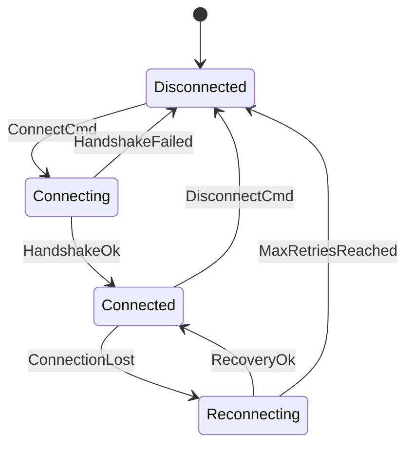

# Tutorial 1: Designing Your First State Machine

In this tutorial, you will create, visualize, and analyze your very first state machine using **`fsmc`**.

By the end of this guide, you will understand:

- The fundamental components of a state machine: **States**, **Initial Pseudostates**, **Events (Triggers)**, and **Transitions**.
- How to author statecharts in **Visual Notation** (Mermaid, PlantUML) or **Formal Notation** (SysML v2).
- How `fsmc` transforms diverse authoring formats into a single, unified **Canonical Intermediate Representation (`FsmIr`)**.

---

## 1. Defining the Problem: A Simple Connection Manager

Let's model a standard network connection manager with 4 operational states:

1. **`Disconnected`** (Initial State): The client is offline.
2. **`Connecting`**: The client is negotiating a handshake.
3. **`Connected`**: The session is active and exchanging data.
4. **`Reconnecting`**: The session was interrupted and is attempting recovery.



---

## 2. Authoring the State Machine

`fsmc` is a **universal compiler**: you can write this state machine in your preferred format.

=== "SysML v2 (Formal Specification)"

    ```sysml
    state def ConnectionManager {
        entry; then Disconnected;

        state Disconnected;
        state Connecting;
        state Connected;
        state Reconnecting;

        transition t_connect
            first Disconnected
            accept ConnectCmd
            then Connecting;

        transition t_handshake_ok
            first Connecting
            accept HandshakeOk
            then Connected;

        transition t_handshake_fail
            first Connecting
            accept HandshakeFailed
            then Disconnected;

        transition t_lost
            first Connected
            accept ConnectionLost
            then Reconnecting;

        transition t_disconnect
            first Connected
            accept DisconnectCmd
            then Disconnected;

        transition t_recovered
            first Reconnecting
            accept RecoveryOk
            then Connected;

        transition t_max_retries
            first Reconnecting
            accept MaxRetriesReached
            then Disconnected;
    }
    ```

=== "Mermaid (Visual Markdown)"

    ```mermaid
    stateDiagram-v2
        [*] --> Disconnected
        Disconnected --> Connecting: ConnectCmd
        Connecting --> Connected: HandshakeOk
        Connecting --> Disconnected: HandshakeFailed
        Connected --> Reconnecting: ConnectionLost
        Connected --> Disconnected: DisconnectCmd
        Reconnecting --> Connected: RecoveryOk
        Reconnecting --> Disconnected: MaxRetriesReached
    ```

=== "PlantUML (UML Diagram)"

    ```plantuml
    @startuml
    [*] --> Disconnected

    Disconnected --> Connecting : ConnectCmd
    Connecting --> Connected : HandshakeOk
    Connecting --> Disconnected : HandshakeFailed
    Connected --> Reconnecting : ConnectionLost
    Connected --> Disconnected : DisconnectCmd
    Reconnecting --> Connected : RecoveryOk
    Reconnecting --> Disconnected : MaxRetriesReached
    @enduml
    ```

Save your model as `connection.sysml` (or `connection.mmd` / `connection.puml`).

---

## 3. Inspecting the Canonical AST (`FsmIr`)

When `fsmc` ingests a model, it does not bind directly to any programming language. Instead, it constructs a target-agnostic **Intermediate Representation (`FsmIr`)** containing the canonical state graph, transition matrix, and symbols.

You can inspect the generated IR JSON using `fsm-opt`:

```bash
fsm-opt -i connection.sysml --emit-ir
```

```json
{
  "fsm_name": "ConnectionManager",
  "initial_state": "Disconnected",
  "states": [
    { "name": "Disconnected", "kind": "Normal" },
    { "name": "Connecting", "kind": "Normal" },
    { "name": "Connected", "kind": "Normal" },
    { "name": "Reconnecting", "kind": "Normal" }
  ],
  "events": [
    "ConnectCmd", "DisconnectCmd", "HandshakeFailed", 
    "HandshakeOk", "ConnectionLost", "RecoveryOk", "MaxRetriesReached"
  ],
  "transitions": [
    { "source": "Disconnected", "event": "ConnectCmd", "target": "Connecting" },
    { "source": "Connecting", "event": "HandshakeOk", "target": "Connected" },
    { "source": "Connecting", "event": "HandshakeFailed", "target": "Disconnected" },
    { "source": "Connected", "event": "ConnectionLost", "target": "Reconnecting" },
    { "source": "Connected", "event": "DisconnectCmd", "target": "Disconnected" },
    { "source": "Reconnecting", "event": "RecoveryOk", "target": "Connected" },
    { "source": "Reconnecting", "event": "MaxRetriesReached", "target": "Disconnected" }
  ]
}
```

---

## 4. Converting Across Formats (Lossless Transpilation)

Because `fsmc` maintains this neutral Intermediate Representation, you can convert models seamlessly between any supported format:

```bash
# Convert SysML v2 to Mermaid
fsmc -i connection.sysml -e mermaid -o connection.mmd

# Convert PlantUML to W3C SCXML
fsmc -i connection.puml -e scxml -o connection.scxml

# Convert to Graphviz DOT diagram
fsmc -i connection.sysml -e dot -o connection.dot
```

---

## Next Steps

Now that you have built a basic state machine, let's learn how to add **Partitioned I/O Ports, Internal Registers, Conditional Guards**, and **Lifecycle Actions** in **[Tutorial 2: Extended State Machines (EFSM), Guards & Datapath](02_guards_and_actions.md)**.
