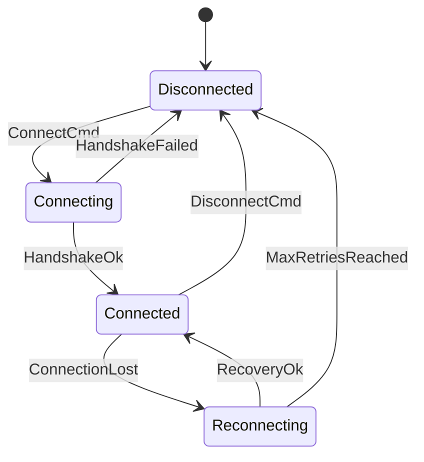

# Tutorial 1: Designing Your First State Machine

In this tutorial, you will create, visualize, and analyze your very first state machine using **`fsmc`**.

By the end of this guide, you will understand:

- The fundamental components of a state machine: **States**, **Initial Pseudostates**, **Events (Triggers)**, and **Transitions**.
- How to author statecharts in **Visual Notation** (Mermaid, PlantUML) or **Formal Notation** (SysML v2).
- How `fsmc` transforms diverse authoring formats into a single, unified **Canonical Intermediate Representation (`FsmIr`)**.

---

## 1. Defining the Problem: A Simple Connection Manager

Let's model a standard network connection manager with 4 operational states:

1. **`Disconnected`** (Initial State): The client is offline.
2. **`Connecting`**: The client is negotiating a handshake.
3. **`Connected`**: The session is active and exchanging data.
4. **`Reconnecting`**: The session was interrupted and is attempting recovery.


```mermaid
stateDiagram-v2
    [*] --> Disconnected
    Disconnected --> Connecting: ConnectCmd
    Connecting --> Connected: HandshakeOk
    Connecting --> Disconnected: HandshakeFailed
    Connected --> Reconnecting: ConnectionLost
    Connected --> Disconnected: DisconnectCmd
    Reconnecting --> Connected: RecoveryOk
    Reconnecting --> Disconnected: MaxRetriesReached
```

---

## 2. Authoring the State Machine

`fsmc` is a **universal compiler**: you can write this state machine in your preferred format.

=== "SysML v2 (Formal Specification)"

    ```sysml
    state def ConnectionManager {
        entry; then Disconnected;

        state Disconnected;
        state Connecting;
        state Connected;
        state Reconnecting;

        transition t_connect
            first Disconnected
            accept ConnectCmd
            then Connecting;

        transition t_handshake_ok
            first Connecting
            accept HandshakeOk
            then Connected;

        transition t_handshake_fail
            first Connecting
            accept HandshakeFailed
            then Disconnected;

        transition t_lost
            first Connected
            accept ConnectionLost
            then Reconnecting;

        transition t_disconnect
            first Connected
            accept DisconnectCmd
            then Disconnected;

        transition t_recovered
            first Reconnecting
            accept RecoveryOk
            then Connected;

        transition t_max_retries
            first Reconnecting
            accept MaxRetriesReached
            then Disconnected;
    }
    ```

=== "Mermaid (Visual Markdown)"

    ```mermaid
    stateDiagram-v2
        [*] --> Disconnected
        Disconnected --> Connecting: ConnectCmd
        Connecting --> Connected: HandshakeOk
        Connecting --> Disconnected: HandshakeFailed
        Connected --> Reconnecting: ConnectionLost
        Connected --> Disconnected: DisconnectCmd
        Reconnecting --> Connected: RecoveryOk
        Reconnecting --> Disconnected: MaxRetriesReached
    ```

=== "PlantUML (UML Diagram)"

    ```plantuml
    @startuml
    [*] --> Disconnected

    Disconnected --> Connecting : ConnectCmd
    Connecting --> Connected : HandshakeOk
    Connecting --> Disconnected : HandshakeFailed
    Connected --> Reconnecting : ConnectionLost
    Connected --> Disconnected : DisconnectCmd
    Reconnecting --> Connected : RecoveryOk
    Reconnecting --> Disconnected : MaxRetriesReached
    @enduml
    ```

Save your model as `connection.sysml` (or `connection.mmd` / `connection.puml`).

---

## 3. Compile and Run in C++ (Your 60-Second Win)

Now that you have authored the model, let's compile it into production C++ and run it.

### Step A: Generate the Standalone C++ Header

Run `fsmc` to generate a self-contained C++20 header with zero external runtime dependencies:

```bash
fsmc -i connection.sysml -o connection_fsm.hpp --target cpp --std 20 --standalone --namespace conn --name ConnectionManagerFSM
```

`fsmc` analyzes the transition topology and generates:
- **State Tags**: `conn::Disconnected`, `conn::Connecting`, `conn::Connected`, `conn::Reconnecting`.
- **Event Tags**: `conn::ConnectCmd`, `conn::HandshakeOk`, `conn::HandshakeFailed`, `conn::ConnectionLost`, etc.
- **State Machine Alias**: `conn::ConnectionManagerFSM` (a zero-heap `fsm::make_fsm` instantiation).

---

### Step B: Write the Application (`main.cpp`)

Create `main.cpp` to instantiate the state machine and dispatch events:

```cpp
#include <iostream>
#include <cassert>
#include "connection_fsm.hpp"

int main() {
    using namespace conn;

    // 1. Stack-allocated state machine (zero heap allocation, O(1) dispatch)
    ConnectionManagerFSM fsm;

    std::cout << "Initial state: " << fsm.current_state_name() << "\n";
    assert(fsm.is_in<Disconnected>());

    // 2. Dispatch ConnectCmd event
    fsm::dispatch_result res = fsm.dispatch(ConnectCmd{});
    assert(res.is_success());
    std::cout << "State after ConnectCmd: " << fsm.current_state_name() << "\n";
    assert(fsm.is_in<Connecting>());

    // 3. Complete the handshake
    fsm.dispatch(HandshakeOk{});
    std::cout << "State after HandshakeOk: " << fsm.current_state_name() << "\n";
    assert(fsm.is_in<Connected>());

    // 4. Simulate network interruption
    fsm.dispatch(ConnectionLost{});
    std::cout << "State after ConnectionLost: " << fsm.current_state_name() << "\n";
    assert(fsm.is_in<Reconnecting>());

    std::cout << "\n[SUCCESS] State machine dispatched events with 0 heap allocations!\n";
    return 0;
}
```

---

### Step C: Build and Run

Compile with any standard C++20 compiler (`g++`, `clang++`, or MSVC):

```bash
g++ -std=c++20 main.cpp -o connection_app
./connection_app
```

**Console Output:**
```text
Initial state: Disconnected
State after ConnectCmd: Connecting
State after HandshakeOk: Connected
State after ConnectionLost: Reconnecting

[SUCCESS] State machine dispatched events with 0 heap allocations!
```

---

### Alternative: The Pure C++ Header-Only Track (No CLI Needed!)

What if you prefer writing code directly in C++ without invoking any external CLI compiler?

The `fsmc` runtime library can be consumed directly as a **pure header-only C++20 DSL**. Here is the exact same Connection Manager written in standard C++:

```cpp
#include <fsm/fsm.hpp>
#include <iostream>

// 1. Declare state and event types
struct Disconnected {};
struct Connecting {};
struct Connected {};
struct Reconnecting {};

struct ConnectCmd {};
struct HandshakeOk {};
struct ConnectionLost {};

// 2. Declare transition table at compile time
using ConnectionTable = fsm::transition_table<
    fsm::row<Disconnected, ConnectCmd,     Connecting>,
    fsm::row<Connecting,   HandshakeOk,    Connected>,
    fsm::row<Connected,    ConnectionLost, Reconnecting>
>;

// 3. Instantiate zero-allocation engine
using ConnectionFSM = fsm::make_fsm<
    ConnectionTable, 
    fsm::with_initial_state<Disconnected>
>;

int main() {
    ConnectionFSM fsm;
    fsm.dispatch(ConnectCmd{});
    std::cout << "State: " << fsm.current_state_name() << "\n"; // Connecting
    return 0;
}
```

> [!TIP]
> Both workflows use the **exact same zero-overhead runtime engine** (`fsm::fsm`). The `fsmc` compiler simply automates authoring, validation, and multi-format conversion from visual and MBSE models.

---

## 4. Under the Hood: Inspecting the Canonical IR (`FsmIr`)

When `fsmc` ingests a model, it does not bind directly to any programming language. Instead, it constructs a target-agnostic **Intermediate Representation (`FsmIr`)** containing the canonical state graph, transition matrix, and symbol table.

You can inspect the generated IR JSON using `fsm-opt`:

```bash
fsm-opt -i connection.sysml --emit-ir
```

```json
{
  "fsm_name": "ConnectionManager",
  "initial_state": "Disconnected",
  "states": [
    { "name": "Disconnected", "kind": "Normal" },
    { "name": "Connecting", "kind": "Normal" },
    { "name": "Connected", "kind": "Normal" },
    { "name": "Reconnecting", "kind": "Normal" }
  ],
  "events": [
    "ConnectCmd", "DisconnectCmd", "HandshakeFailed", 
    "HandshakeOk", "ConnectionLost", "RecoveryOk", "MaxRetriesReached"
  ],
  "transitions": [
    { "source": "Disconnected", "event": "ConnectCmd", "target": "Connecting" },
    { "source": "Connecting", "event": "HandshakeOk", "target": "Connected" },
    { "source": "Connecting", "event": "HandshakeFailed", "target": "Disconnected" },
    { "source": "Connected", "event": "ConnectionLost", "target": "Reconnecting" },
    { "source": "Connected", "event": "DisconnectCmd", "target": "Disconnected" },
    { "source": "Reconnecting", "event": "RecoveryOk", "target": "Connected" },
    { "source": "Reconnecting", "event": "MaxRetriesReached", "target": "Disconnected" }
  ]
}
```

---

## 5. Converting Across Formats (Lossless Transpilation)

Because `fsmc` maintains this neutral Intermediate Representation, you can convert models seamlessly between any supported format:

```bash
# Convert SysML v2 to Mermaid
fsmc -i connection.sysml -e mermaid -o connection.mmd

# Convert PlantUML to W3C SCXML
fsmc -i connection.puml -e scxml -o connection.scxml

# Convert to Graphviz DOT diagram
fsmc -i connection.sysml -e dot -o connection.dot
```

---

## Next Steps

Now that you have built and executed your first state machine, let's learn how to add **Partitioned I/O Ports, Internal Registers, Conditional Guards**, and **Lifecycle Actions** in **[Tutorial 2: Extended State Machines (EFSM), Guards & Datapath](02_guards_and_actions.md)**.


