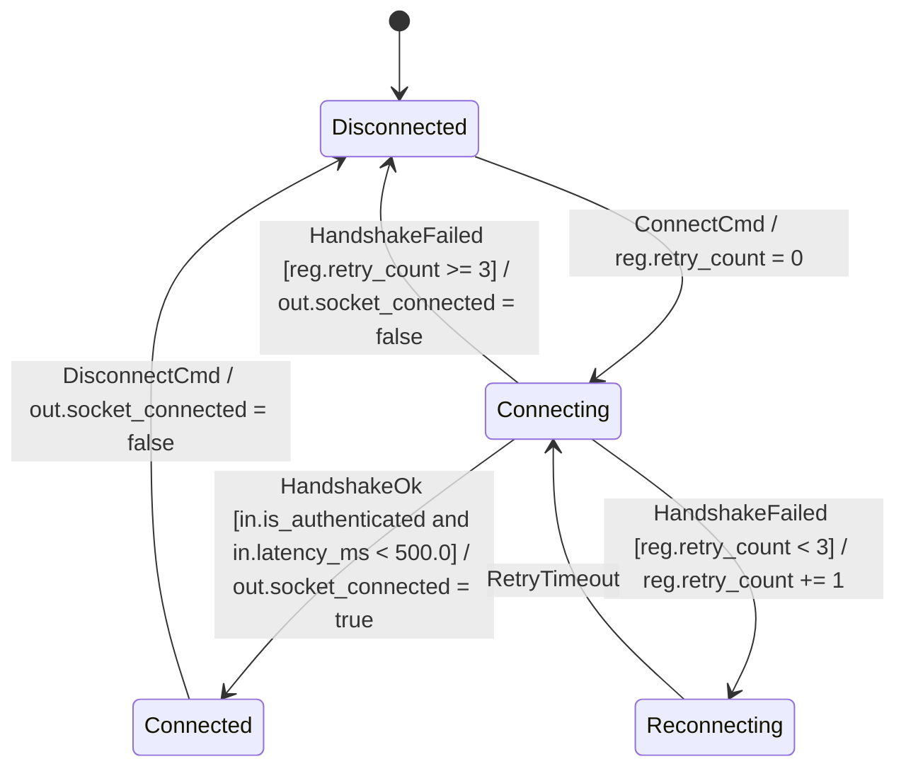

# Tutorial 2: Extended State Machines (EFSM), Guards & Datapath

In pure finite state automata, states represent purely discrete symbolic stages. Real-world systems, however, depend on continuous numerical parameters—battery levels, retry counters, timeouts, and sensor readings.

In this tutorial, you will learn how **`fsmc` v0.4.0** implements **Extended Finite State Machines (EFSM)** using partitioned data domains:

- Defining **InPorts** (read-only with range contracts), **OutPorts** (write-only), and **Registers** (internal memory).
- Formulating **Guard Conditions** (`if [expr]`) over ports and registers.
- Executing **Actions** that mutate `OutPorts`, update `Registers`, and trigger external `Services`.

---

## 1. Extending the Connection Manager with Partitioned Domains

Let's model our connection manager across 4 orthogonal domains:

- **`InPorts`**: `in.latency_ms` (measured ping time, $0..10000$), `in.is_authenticated` (token flag).
- **`OutPorts`**: `out.socket_connected` (actuator relay flag).
- **`Registers`**: `reg.retry_count` (internal attempt counter, $0..5$).
- **`Services`**: `srv.log_event(msg)`, `srv.flush_buffers()`.



---

## 2. Modeling EFSM in SysML v2

```sysml
state def ConnectionManager {
    in port latency_ms : Real { assert constraint { self >= 0.0 and self <= 10000.0; } }
    in port is_authenticated : Boolean;
    out port socket_connected : Boolean;
    attribute retry_count : Integer = 0;

    entry; then Disconnected;

    state Disconnected;
    state Connecting;
    state Connected;
    state Reconnecting;

    transition t_connect
        first Disconnected
        accept ConnectCmd
        do action { reg.retry_count = 0; }
        then Connecting;

    transition t_handshake_success
        first Connecting
        accept HandshakeOk
        if in.is_authenticated and in.latency_ms < 500.0
        do action {
            out.socket_connected = true;
            reg.retry_count = 0;
        }
        then Connected;

    transition t_retry
        first Connecting
        accept HandshakeFailed
        if reg.retry_count < 3
        do action { reg.retry_count = reg.retry_count + 1; }
        then Reconnecting;

    transition t_abort
        first Connecting
        accept HandshakeFailed
        if reg.retry_count >= 3
        do action { out.socket_connected = false; }
        then Disconnected;

    transition t_retry_tick
        first Reconnecting
        accept RetryTimeout
        then Connecting;

    transition t_disconnect
        first Connected
        accept DisconnectCmd
        do action { out.socket_connected = false; }
        then Disconnected;
}
```

---

## 3. How `fsmc` Resolves Guard Logic

During middle-end optimization, `fsmc` parses guard expressions into structured AST trees:

1. **Boolean Simplification (`GuardSimplificationPass`)**:
   Redundant expressions are reduced algebraically:
    - `not(not A) => A`
    - `A and true => A`
    - `A and false => false` (triggers static dead-branch pruning)
2. **EFSM Interval Analysis (`EFSMDataPathPass`)**:
   Checks whether `in.latency_ms < 500.0` is satisfiable given the `[0, 10000]` input domain.
3. **Deterministic Evaluation Order**:
   Guards evaluating to mutually exclusive domains (`reg.retry_count < 3` vs `reg.retry_count >= 3`) are verified to guarantee deterministic dispatch.

---

## 4. Lifecycle Execution Order (Run-to-Completion)

When a transition executes, `fsmc` enforces the strict **UML 2.5 Run-to-Completion (RTC)** sequence:

```
[1. Evaluate Guard(in, reg, cmd)]  --->  (Returns true)
                |
[2. Source State: on_exit(in, out, reg, srv)]
                |
[3. Transition: do Action(out, reg, srv, in, cmd)]
                |
[4. Target State: on_entry(in, out, reg, srv)]
```

If the guard returns `false`, no exit actions occur, and the machine remains in the source state.

---

## Next Steps

In **[Tutorial 3: Hierarchical Statecharts (HFSM) & History](03_hierarchical_hfsm.md)**, you will learn how to nest state machines into composite superstates and restore memory configurations using History pseudostates.
