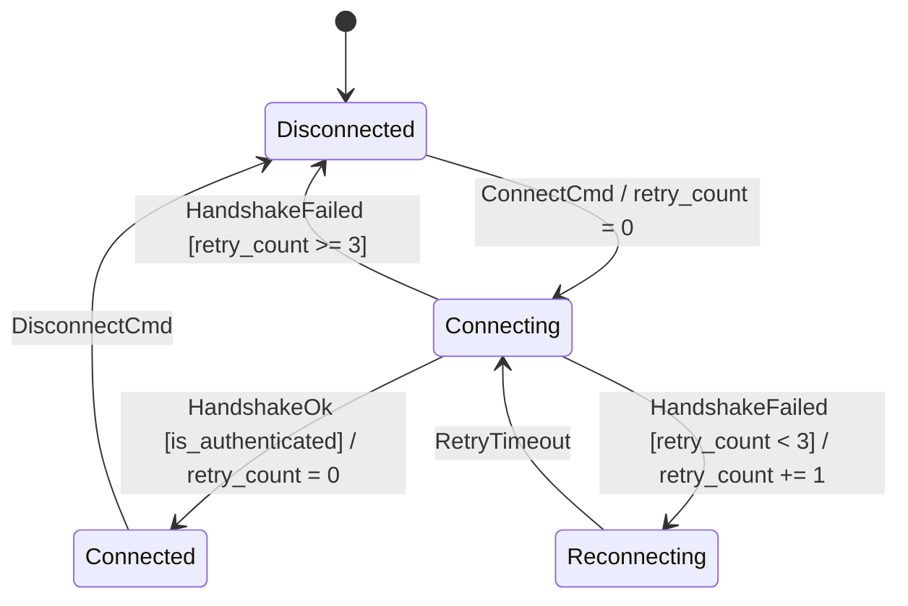

# Tutorial 2: Extended State Machines (EFSM), Guards & Datapath

In pure finite state automata, states represent purely discrete symbolic stages. Real-world systems, however, depend on continuous numerical parameters—battery levels, retry counters, timeouts, and sensor readings.

In this tutorial, you will learn how **`fsmc`** implements **Extended Finite State Machines (EFSM)**:

- Defining **Context Variables** and Datapath parameters.
- Formulating **Guard Conditions** (`if [expr]`) with boolean combinators (`and`, `or`, `not`).
- Executing **Actions** on transitions, `on_entry`, and `on_exit`.

---

## 1. Extending the Connection Manager with Context Data

Let's extend our connection manager with state variables:

- `retry_count`: Integer counter tracking connection attempts (0..5).
- `latency_ms`: Measured round-trip ping time.
- `is_authenticated`: Boolean flag indicating token validity.



---

## 2. Modeling EFSM in SysML v2 and Annotations

=== "SysML v2 (Native EFSM)"

    ```sysml
    state def ConnectionManager {
        attribute retry_count: Integer = 0;
        attribute latency_ms: Real = 0.0;
        attribute is_authenticated: Boolean = false;

        entry; then Disconnected;

        state Disconnected {
            entry action { log("Offline"); }
        }

        state Connecting;
        state Connected {
            entry action { log("Session active"); }
            exit action { flush_buffers(); }
        }
        state Reconnecting;

        transition t_connect
            first Disconnected
            accept ConnectCmd
            do action { retry_count = 0; }
            then Connecting;

        transition t_handshake_success
            first Connecting
            accept HandshakeOk
            if [is_authenticated and latency_ms < 500.0]
            do action { retry_count = 0; }
            then Connected;

        transition t_retry
            first Connecting
            accept HandshakeFailed
            if [retry_count < 3]
            do action { retry_count += 1; }
            then Reconnecting;

        transition t_abort
            first Connecting
            accept HandshakeFailed
            if [retry_count >= 3]
            do action { log("Max retries exceeded"); }
            then Disconnected;

        transition t_retry_tick
            first Reconnecting
            accept RetryTimeout
            then Connecting;

        transition t_disconnect
            first Connected
            accept DisconnectCmd
            then Disconnected;
    }
    ```

=== "Mermaid / PlantUML (Visual Directives)"

    ```mermaid
    stateDiagram-v2
        %% @fsm:var int retry_count = 0
        %% @fsm:var float latency_ms = 0.0
        %% @fsm:var bool is_authenticated = false

        [*] --> Disconnected
        Disconnected --> Connecting: ConnectCmd / retry_count = 0
        Connecting --> Connected: HandshakeOk [is_authenticated and latency_ms < 500] / retry_count = 0
        Connecting --> Reconnecting: HandshakeFailed [retry_count < 3] / retry_count += 1
        Connecting --> Disconnected: HandshakeFailed [retry_count >= 3]
        Reconnecting --> Connecting: RetryTimeout
        Connected --> Disconnected: DisconnectCmd
    ```

---

## 3. How `fsmc` Resolves Guard Logic

During middle-end optimization, `fsmc` parses guard expressions into structured AST trees:

1. **Boolean Simplification (`GuardSimplificationPass`)**:
   Redundant expressions are reduced algebraically:

   - `not(not A) => A`
   - `A and true => A`
   - `A and false => false` (triggers static dead-branch pruning)
2. **Deterministic Evaluation Order**:
   Guards evaluating to mutually exclusive domains are verified to guarantee deterministic dispatch.

---

## 4. Lifecycle Execution Order (Run-to-Completion)

When a transition executes, `fsmc` enforces the strict **UML 2.5 Run-to-Completion (RTC)** sequence:

```
[1. Evaluate Guard]  --->  (Returns true)
        |
[2. Source State: on_exit()]
        |
[3. Transition: do Action()]
        |
[4. Target State: on_entry()]
```

If the guard returns `false`, no exit actions occur, and the machine remains in the source state.

---

## Next Steps

In **[Tutorial 3: Hierarchical Statecharts (HFSM) & History](03_hierarchical_hfsm.md)**, you will learn how to nest state machines into composite superstates and restore memory configurations using History pseudostates.
