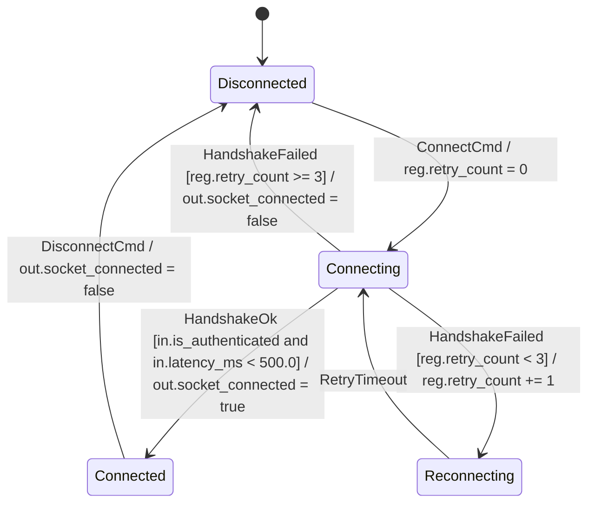

# Tutorial 2: Extended State Machines (EFSM), Guards & Datapath

In pure finite state automata, states represent purely discrete symbolic stages. Real-world systems, however, depend on continuous numerical parameters—battery levels, retry counters, timeouts, and sensor readings.

In this tutorial, you will learn how **`fsmc`** implements **Extended Finite State Machines (EFSM)** using partitioned data domains:

- Defining **InPorts** (read-only with range contracts), **OutPorts** (write-only), and **Registers** (internal memory).
- Formulating **Guard Conditions** (`if [expr]`) over ports and registers.
- Executing **Actions** that mutate `OutPorts`, update `Registers`, and trigger external `Services`.

---

## 1. Extending the Connection Manager with Partitioned Domains

Let's model our connection manager across 4 orthogonal domains:

- **`InPorts`**: `in.latency_ms` (measured ping time, $0..10000$), `in.is_authenticated` (token flag).
- **`OutPorts`**: `out.socket_connected` (actuator relay flag).
- **`Registers`**: `reg.retry_count` (internal attempt counter, $0..5$).
- **`Services`**: `srv.log_event(msg)`, `srv.flush_buffers()`.


```mermaid
stateDiagram-v2
    [*] --> Disconnected
    Disconnected --> Connecting: ConnectCmd / reg.retry_count = 0
    Connecting --> Connected: HandshakeOk [in.is_authenticated and in.latency_ms < 500.0] / out.socket_connected = true
    Connecting --> Reconnecting: HandshakeFailed [reg.retry_count < 3] / reg.retry_count += 1
    Connecting --> Disconnected: HandshakeFailed [reg.retry_count >= 3] / out.socket_connected = false
    Reconnecting --> Connecting: RetryTimeout
    Connected --> Disconnected: DisconnectCmd / out.socket_connected = false
```

---

## 2. Modeling EFSM in SysML v2

```sysml
state def ConnectionManager {
    in port latency_ms : Real { assert constraint { self >= 0.0 and self <= 10000.0; } }
    in port is_authenticated : Boolean;
    out port socket_connected : Boolean;
    attribute retry_count : Integer = 0;

    entry; then Disconnected;

    state Disconnected;
    state Connecting;
    state Connected;
    state Reconnecting;

    transition t_connect
        first Disconnected
        accept ConnectCmd
        do action { reg.retry_count = 0; }
        then Connecting;

    transition t_handshake_success
        first Connecting
        accept HandshakeOk
        if in.is_authenticated and in.latency_ms < 500.0
        do action {
            out.socket_connected = true;
            reg.retry_count = 0;
        }
        then Connected;

    transition t_retry
        first Connecting
        accept HandshakeFailed
        if reg.retry_count < 3
        do action { reg.retry_count = reg.retry_count + 1; }
        then Reconnecting;

    transition t_abort
        first Connecting
        accept HandshakeFailed
        if reg.retry_count >= 3
        do action { out.socket_connected = false; }
        then Disconnected;

    transition t_retry_tick
        first Reconnecting
        accept RetryTimeout
        then Connecting;

    transition t_disconnect
        first Connected
        accept DisconnectCmd
        do action { out.socket_connected = false; }
        then Disconnected;
}
```

---

---

## 3. The Binding Contract: Model to C++ (The Rosetta Stone)

When `fsmc` compiles an EFSM model, it maps domain definitions into strongly typed C++20 structures:

| Model Element (`.sysml`) | Generated C++ Construct | Developer Responsibility |
| :--- | :--- | :--- |
| `in port latency_ms : Real { ... }` | Field in `ConnectionManagerFSMInPorts` | Populate sensor snapshot prior to dispatching events. |
| `{ assert constraint { ... }; }` | Method `in.validate_contracts()` | Call `assert(in.validate_contracts())` in debug / CI loops. |
| `out port socket_connected : Boolean;` | Field in `ConnectionManagerFSMOutPorts` | Read updated actuator outputs after dispatch. |
| `attribute retry_count : Integer = 0;` | Field in `ConnectionManagerFSMRegisters` | Pass initial struct to state machine constructor. |
| `if in.is_authenticated and ...` | Inline boolean expression | Zero developer code: evaluated automatically by the engine. |
| `do action { out.socket = true; }` | Inline mutation sequence | Zero developer code: synthesized directly into transition. |
| `do action flushBuffers;` | Method in `ConnectionManagerFSMServices` | Inherit from `FSMServices` and implement custom driver logic. |

### Generated C++ Domain Structures

```cpp
// 1. Immutable Input Port Snapshot with Range Contracts
struct ConnectionManagerFSMInPorts {
    bool is_authenticated{false};
    float latency_ms{0.0}; // assert: self >= 0.0 and self <= 10000.0;

    [[nodiscard]] constexpr bool validate_contracts() const noexcept {
        return (latency_ms >= 0 && latency_ms <= 10000);
    }
};

// 2. Actuator Output Command Buffer
struct ConnectionManagerFSMOutPorts {
    bool socket_connected{false};
};

// 3. Persistent Internal Datapath Memory
struct ConnectionManagerFSMRegisters {
    uint32_t retry_count{0};
};
```

---

## 4. How `fsmc` Resolves Guard Logic

During middle-end optimization, `fsmc` parses guard expressions into structured AST trees:

1. **Boolean Simplification (`GuardSimplificationPass`)**:
   Redundant expressions are reduced algebraically:
    - `not(not A) => A`
    - `A and true => A`
    - `A and false => false` (triggers static dead-branch pruning)
2. **EFSM Interval Analysis (`EFSMDataPathPass`)**:
   Checks whether `in.latency_ms < 500.0` is satisfiable given the `[0, 10000]` input domain.
3. **Deterministic Evaluation Order**:
   Guards evaluating to mutually exclusive domains (`reg.retry_count < 3` vs `reg.retry_count >= 3`) are verified to guarantee deterministic dispatch.

---

## 5. Lifecycle Execution Order (Run-to-Completion)

When a transition executes, `fsmc` enforces the strict **UML 2.5 Run-to-Completion (RTC)** sequence:

```
[1. Evaluate Guard(in, reg, cmd)]  --->  (Returns true)
                |
[2. Source State: on_exit(in, out, reg, srv)]
                |
[3. Transition: do Action(out, reg, srv, in, cmd)]
                |
[4. Target State: on_enter(in, out, reg, srv)]
```

If the guard returns `false`, no exit actions occur, and the machine remains in the source state.

> [!NOTE]
> **C++ State Hook Naming**: While UML and SysML v2 formal specifications refer to state lifecycle actions as "entry action" and "exit action", the C++ runtime lifecycle traits look for member functions named `on_enter(...)` and `on_exit(...)` on state structs. Both methods can be parameterless `void on_enter()` or accept any subset of domain parameters `(event, in, out, reg, srv)`.

---

## 6. Compile and Run the EFSM in C++

Save the model above as `connection_efsm.sysml` and compile it with `fsmc`:

```bash
fsmc -i connection_efsm.sysml -o connection_efsm.hpp --target cpp --std 20 --standalone --namespace conn --name ConnectionManagerFSM
```

### Complete Application (`main.cpp`)

```cpp
#include <iostream>
#include <cassert>
#include "connection_efsm.hpp"

int main() {
    using namespace conn;

    // 1. Initialize persistent datapath registers
    ConnectionManagerFSMRegisters reg{0};
    ConnectionManagerFSM fsm(reg);

    // 2. Prepare sensor inputs and actuator output buffers
    ConnectionManagerFSMInPorts in;
    in.is_authenticated = true;
    in.latency_ms = 120.0f;
    assert(in.validate_contracts()); // Verifies: 0.0 <= latency_ms <= 10000.0

    ConnectionManagerFSMOutPorts out;

    std::cout << "Initial state: " << fsm.current_state_name() << "\n";
    assert(fsm.is_in<Disconnected>());

    // 3. Connect: Disconnected -> Connecting
    auto r1 = fsm.dispatch(ConnectCmd{}, in, out);
    assert(r1.is_success());
    std::cout << "State after ConnectCmd: " << fsm.current_state_name() << "\n";
    assert(fsm.is_in<Connecting>());

    // 4. Test Guard Block: Degraded network latency (850ms >= 500ms threshold)
    in.latency_ms = 850.0f;
    auto r_blocked = fsm.dispatch(HandshakeOk{}, in, out);
    assert(!r_blocked.is_success()); // Guard blocked transition!
    std::cout << "High latency (850ms) blocked transition. Remaining in: " 
              << fsm.current_state_name() << "\n";
    assert(fsm.is_in<Connecting>());

    // 5. Test Guard Pass: Latency recovers (85ms < 500ms)
    in.latency_ms = 85.0f;
    auto r2 = fsm.dispatch(HandshakeOk{}, in, out);
    assert(r2.is_success());
    std::cout << "State after HandshakeOk (nominal): " << fsm.current_state_name() << "\n";
    assert(fsm.is_in<Connected>());
    assert(out.socket_connected == true); // Transition action executed!

    // 6. Disconnect
    auto r3 = fsm.dispatch(DisconnectCmd{}, in, out);
    assert(r3.is_success());
    std::cout << "State after DisconnectCmd: " << fsm.current_state_name() << "\n";
    assert(fsm.is_in<Disconnected>());
    assert(out.socket_connected == false);

    std::cout << "\n[SUCCESS] EFSM ports, contracts, guards, and actions verified!\n";
    return 0;
}
```

### Build & Run

```bash
g++ -std=c++20 main.cpp -o efsm_app
./efsm_app
```

**Output:**
```text
Initial state: Disconnected
State after ConnectCmd: Connecting
High latency (850ms) blocked transition. Remaining in: Connecting
State after HandshakeOk (nominal): Connected
State after DisconnectCmd: Disconnected

[SUCCESS] EFSM ports, contracts, guards, and actions verified!
```

---

## 7. Inspecting Transitions with `dispatch_result`

Every `dispatch()` call returns a `fsm::dispatch_result` carrying zero-overhead trace metadata:

```cpp
fsm::dispatch_result res = fsm.dispatch(HandshakeFailed{}, in, out);

if (res.is_success()) {
    // res.trace is std::optional<fsm::transition_trace>
    const fsm::transition_trace& tr = *res.trace;
    std::cout << tr.source          // "Connecting"
              << " --[" << tr.event // "HandshakeFailed"
              << "]--> " << tr.target << "\n"; // "Reconnecting" or "Disconnected"
} else if (res.is_guard_rejected()) {
    // Guard returned false: no state change, no side-effects
    std::cout << "Guard blocked transition.\n";
}
```

`dispatch_result` is non-allocating: all `transition_trace` fields are `std::string_view` pointing into static storage. It adds zero runtime overhead when not used.

---

## Next Steps

In **[Tutorial 3: Hierarchical Statecharts (HFSM) & History](03_hierarchical_hfsm.md)**, you will learn how to nest state machines into composite superstates and restore memory configurations using History pseudostates.


