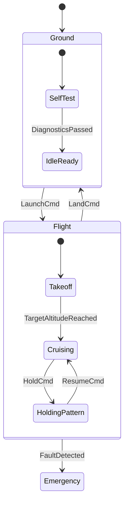
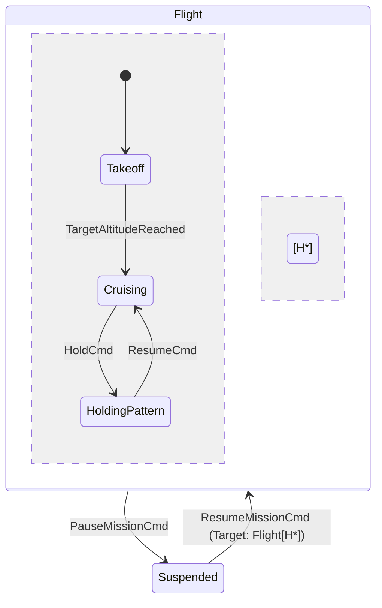

# Tutorial 3: Hierarchical Statecharts (HFSM) & History

As software grows, flat state machines suffer from **combinatorial state explosion**: every new state requires duplicate transition paths for common events like `EmergencyStop`, `Reset`, or `Pause`.

In this tutorial, you will learn how **`fsmc`** implements **Hierarchical State Machines (HFSM)**:

- Organizing behaviors into **Composite States** (Superstates and Sub-states).
- **Transition Inheritance**: Handling global events uniformly across an entire state hierarchy.
- **Shallow History (`[H]`)** and **Deep History (`[H*]`)** memory restoration.

---

## 1. The Architecture of a Hierarchical State Machine

Consider an autonomous drone flight controller:

- **`Ground`** (Initial Superstate):
  - Sub-states: `SelfTest`, `IdleReady`.
- **`Flight`** (Operational Superstate):
  - Sub-states: `Takeoff`, `Cruising`, `HoldingPattern`.
- **`Emergency`**: A safe state triggered by `FaultDetected` from *any* flight state.



Notice how `FaultDetected` is attached to the **`Flight` superstate**. If a fault occurs while in `Takeoff`, `Cruising`, or `HoldingPattern`, the transition triggers immediately without writing three separate transitions!

---

## 2. Modeling Composite States in SysML v2

```sysml
state def FlightController {
    entry; then Ground;

    state Ground {
        entry; then SelfTest;
        state SelfTest;
        state IdleReady;

        transition diag_ok
            first SelfTest
            accept DiagnosticsPassed
            then IdleReady;
    }

    state Flight {
        entry; then Takeoff;
        state Takeoff;
        state Cruising;
        state HoldingPattern;

        transition t_alt_reached
            first Takeoff
            accept TargetAltitudeReached
            then Cruising;

        transition t_hold
            first Cruising
            accept HoldCmd
            then HoldingPattern;

        transition t_resume
            first HoldingPattern
            accept ResumeCmd
            then Cruising;
    }

    state Emergency;

    transition t_launch
        first Ground
        accept LaunchCmd
        then Flight;

    transition t_land
        first Flight
        accept LandCmd
        then Ground;

    transition t_abort
        first Flight
        accept FaultDetected
        then Emergency;
}
```

---

## 3. History Pseudostates: `[H]` vs `[H*]`

What happens if the drone is temporarily suspended by a `PauseMissionCmd` and later receives `ResumeMissionCmd`?

Without history, entering `Flight` would always re-execute the default initial substate (`Takeoff`). With **History**, the machine remembers where it left off:



- **Shallow History (`[H]`)**: Restores the direct child state of `Flight`.
- **Deep History (`[H*]`)**: Restores the nested active state recursively across all levels of hierarchy.

---

## Next Steps

Now that you can design expressive, hierarchical statecharts, let's explore how to **mathematically prove their safety** before generating code in **[Tutorial 4: Formal Verification & Model Checking](04_formal_verification.md)**.
